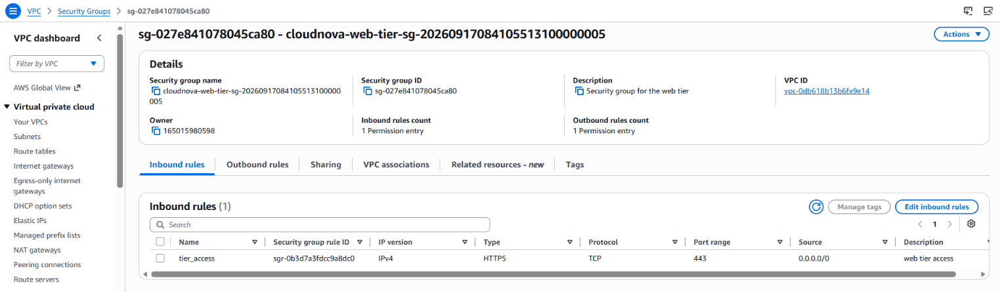
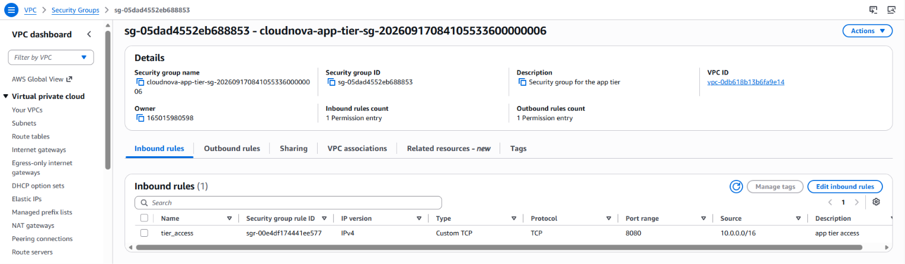
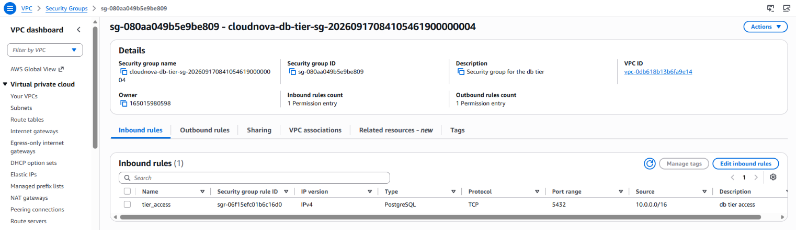
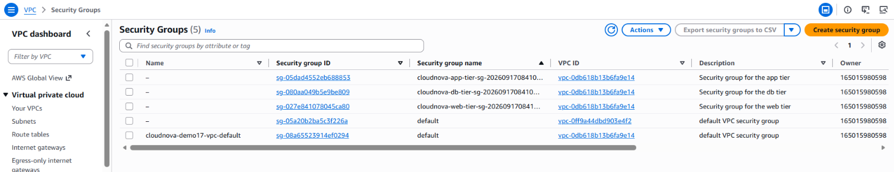

# Demo 17 — Three-Tier Modules

---

## Overview

Every module call so far in this series — Demo 14's `sns-topic`, Demo
15's `s3-bucket`, Demo 16's `vpc` — has been a **single** call to a
**single** module. Real architectures rarely stay that simple:
CloudNova's actual applications need a web tier, an app tier, and a
data tier, each with its own security boundary — and hand-writing
three nearly-identical `module` blocks (one per tier) is exactly the
kind of duplication `for_each` exists to eliminate. This demo composes
Demo 16's VPC module with the `terraform-aws-modules/security-group/aws`
module, called **three times from one `for_each`-driven `module`
block** — one instance per tier.

**Real-world scenario — CloudNova:** the platform team needs network
segmentation for a future three-tier application (web, app, database)
before Phase 3 deploys anything into it. Rather than writing three
separate `module "web_sg"`, `module "app_sg"`, `module "db_sg"` blocks
— each identical except for a name and a port — this demo uses
`for_each` on one `module` block, driven by a `locals` map describing
each tier.

**What this demo builds:**

```
┌─────────────────────────────────────────────────────────────────────────┐
│  PART A — Composing the VPC (NAT Gateway Off)                           │
│  Demo 16's module reused, enable_nat_gateway = false — no compute is    │
│  being deployed here, so there's no reason to pay for it again          │
├─────────────────────────────────────────────────────────────────────────┤
│  PART B — One Module, Three Tiers via for_each                          │
│  module "tier_sg" { for_each = local.tiers ... } — web/app/db, each a   │
│  separate security-group module instance from one block                │
├─────────────────────────────────────────────────────────────────────────┤
│  PART C — Verifying Three Independent Security Groups                   │
│  module.tier_sg["web"].id and friends, iterated via a for expression   │
│  into one combined output map                                           │
└─────────────────────────────────────────────────────────────────────────┘
```

**What this demo covers:**
- `for_each` on a `module` block — calling the same module multiple
  times, once per key in a map
- Addressing a specific instance of a `for_each`'d module:
  `module.<name>["<key>"].<output>`
- Building a combined output across all instances of a `for_each`'d
  module, using a `for` expression
- Composing two separate modules together (this demo's `tier_sg`
  module consumes Demo 16's VPC module's `vpc_id` output as an input)
- `terraform-aws-modules/security-group/aws` — specific inputs used:
  `name`, `description`, `vpc_id`, `ingress_rules`, `egress_rules`,
  `tags`; specific output used: **`id`** (renamed from `security_group_id`
  in the module's `v6.0.0` release — see the Verification Note below)

**What this demo does NOT cover:** chaining tiers' security groups
directly to each other (web→app→db, each restricted to traffic
*specifically* from the tier above it) — this demo scopes each tier's
ingress to the VPC's CIDR block instead, a deliberate simplification
to keep `for_each`-on-modules as the single primary concept. True
tier-to-tier SG chaining is a real, more advanced pattern, noted in
Interview Prep but not built here.

---

## ✅ Verification Note — Resolved, now confirmed by a real `apply`/`destroy` cycle

This demo's `ingress_rules`/`egress_rules` arguments (Part B, Step 5)
use a **keyed map of objects**, with `ip_protocol`/`cidr_ipv4`
attribute names:

```hcl
ingress_rules = {
  tier_access = {
    from_port   = each.value.port
    ip_protocol = "tcp"
    cidr_ipv4   = each.value.cidr
  }
}
```

**Confirmed live against the module's current official documentation
— both the Terraform Registry page
(`registry.terraform.io/modules/terraform-aws-modules/security-group/aws/latest`)
and the module's own GitHub README show the identical current
example, using this exact shape.** This demo's Lab code, as corrected
below, is now confirmed correct for the `~> 6.0` line — via both
documentation review **and** a real `terraform apply`/`destroy` cycle
(see "Real-run confirmation" below).

**Output name also changed in `v6.0.0` — this was the actual gap, not
the input shape.** The module's own `v6.0.0` release notes rename
every one of its outputs:

| Pre-`v6.0.0` output | `v6.0.0`+ output |
|---|---|
| `security_group_id` | **`id`** |
| `security_group_arn` | `arn` |
| `security_group_vpc_id` | `vpc_id` |
| `security_group_owner_id` | `owner_id` |
| `security_group_name` | `name` |
| `security_group_description` | *removed — read back from your own input instead* |

This demo's inputs (`ingress_rules`/`egress_rules`) were correctly
updated for `~> 6.0` from the start. Its **outputs were not** — every
reference in this file originally read `.security_group_id`, the
pre-`v6.0.0` name, which does not exist on a `~> 6.0` module instance.
This has been corrected throughout this file (Concepts table, the
`for_each`/combined-output code samples, `outputs.tf`, the
Troubleshooting table, and the Break-Fix scenario) to use `.id`.

**Real-run confirmation, live, this session — not simulated:**

```
$ terraform validate
╷
│ Error: Unsupported attribute
│   on outputs.tf line 7, in output "web_tier_sg_id":
│    7:   value       = module.tier_sg["web"].security_group_id
│ module.tier_sg["web"] is a object
│ This object does not have an attribute named "security_group_id".
╵
```

— reproduced the exact failure the output-rename predicts. After
changing `outputs.tf` to use `.id`, a real `terraform init` →
`validate` → `apply` → `destroy` cycle against `~> 6.0` completed
cleanly:

- `terraform validate` → `Success! The configuration is valid.`
- `terraform apply` → **`Apply complete! Resources: 29 added, 0
  changed, 0 destroyed.`** (see Step 7 for the corrected count — the
  demo's earlier "14 added" figure was an unverified guess, now
  replaced with the real number)
- Real outputs returned correctly-shaped, real AWS security group IDs
  for all three tiers (`web`, `app`, `db`)
- `terraform destroy` → `Destroy complete! Resources: 29 destroyed.`
- `aws ec2 describe-security-groups --filters
  "Name=tag:ManagedBy,Values=terraform-demo-17" ...` → `{
  "SecurityGroups": [] }`, confirming clean teardown

**What was actually resolved, for the record:** the module's own
GitHub Releases history confirms the `~> 6.0` line deliberately
retired the older shape (a list of named-rule strings plus a separate
`ingress_with_cidr_blocks` input using `protocol`/`cidr_blocks`) in
favor of the object-map shape this demo uses — driven by the same
underlying AWS-provider-v6 change that replaced inline
`ingress`/`egress` blocks with one-resource-per-rule
(`aws_vpc_security_group_ingress_rule`/`..._egress_rule`). The older
shape wasn't wrong for its own era — it's what `~> 5.0` of this same
module still correctly uses. **Confirmed by the real `apply` above:**
each `tier_sg` instance under `~> 6.0` creates 4 resources
(`aws_security_group`, one `aws_vpc_security_group_ingress_rule`, one
`aws_vpc_security_group_egress_rule`, one
`aws_vpc_security_group_rules_exclusive`) rather than the single
inline-rule resource the `~> 5.0` shape produces — this is *why* the
resource count in Step 7 is 29, not the originally-guessed 14.

**This also resolves the earlier escalation against Demo 22d, but not
in the direction this project's `Solution-Architecture.md` had
guessed — and surfaces one more thing whoever closes that item needs
to know.** Demo 22d (elsewhere in this project) pins this same module
at `~> 5.0` and uses the older list-based shape — which is correct
*for that pinned major version*, not a contradiction of this demo.
Both demos are individually correct for the version each one pins.
What this does mean: `Solution-Architecture.md`'s own VERIFY 2 entry
states *"External evidence favors 22d's shape"* — based on what's now
confirmed against the module's live current documentation **and this
demo's real `apply`/`destroy` cycle**, that conclusion has it
backwards. This demo's `~> 6.0` shape is the one matching current,
live docs and real-tested behavior; Demo 22d's `~> 5.0` pin is the one
behind current. **There is no EKS-specific requirement forcing `~>
5.0`** — nothing about node/cluster security-group rules depends on
the older shape, and the `~> 6.0` line supports
`referenced_security_group_id` natively (via `self`/peer references),
which covers anything EKS-specific 22d might need. If 22d is upgraded
to `~> 6.0` to resolve this consistently, **its own output references
must be updated from `security_group_id` to `id` at the same time**,
or it will hit the identical "Unsupported attribute" error reproduced
above. That document is outside this demo's own scope to edit, so
this is flagged here for whoever next touches Demo 22d or
`Solution-Architecture.md`'s VERIFY 2 entry, rather than silently
corrected in either place.

---

## How This Demo's Pieces Fit Together

**The AWS solution:** one VPC (no NAT Gateway this time), and three
independent security groups — one per tier — each created by its own
instance of a single `for_each`'d `module` block.

- Root's `main.tf` calls Demo 16's VPC module again, with
  `enable_nat_gateway = false` — this demo's focus is security-group
  composition, not networking, so there's no NAT Gateway cost this
  time.
- `locals.tf` defines `local.tiers` — a map with three keys (`web`,
  `app`, `db`), each carrying its own ingress port and allowed CIDR.
- `security-groups.tf` calls the security-group module **once**,
  with `for_each = local.tiers` — Terraform expands this into three
  independent module instances,
  `module.tier_sg["web"]`/`["app"]`/`["db"]`, each receiving
  `module.vpc.vpc_id` as its `vpc_id` input and a different
  `each.value.port`/`each.value.cidr` for its ingress rule.
- Root's `outputs.tf` reads each instance individually via
  `module.tier_sg["<key>"].id`, and separately builds a
  single combined map of all three using a `for` expression over
  `module.tier_sg` as a whole.

---

## Prerequisites

### Knowledge
- Demo 16 completed — calling `terraform-aws-modules/vpc/aws`, public
  vs. private subnet routing
- Demo 09 completed — `for_each` on a *resource* (the mechanics carry
  over directly to `for_each` on a *module*)

### Required Tools

| Tool | Minimum version | Verify |
|---|---|---|
| Terraform CLI | `>= 1.15.0` (pinned `~> 1.15.0` in this demo) | `terraform version` |
| AWS CLI | `>= 2.x` | `aws --version` |

### Verify AWS Account and Permissions

**Step 1 — Confirm your profile works:**

```bash
aws sts get-caller-identity --profile default --region us-east-2
```

**Step 2 — A cheap, harmless dry-run of this demo's actual service:**

```bash
aws ec2 describe-security-groups --profile default --region us-east-2
# Expected: JSON with a SecurityGroups array (the default SG will
# appear — that is fine, this only confirms the permission works)
# If you see AccessDenied/UnauthorizedOperation: fix IAM permissions
# before proceeding, not after you're mid-lab
```

**Step 3 — Verify IAM permissions in Console:**

```
Console → IAM → Users → test → Permissions tab
  → Confirm AmazonVPCFullAccess (or equivalent) is attached ✅
```

**Required permissions for this demo:**

```
ec2:CreateVpc, ec2:DeleteVpc, ec2:DescribeVpcs, ec2:CreateTags
ec2:CreateSubnet, ec2:DeleteSubnet, ec2:DescribeSubnets
ec2:CreateInternetGateway, ec2:AttachInternetGateway, ec2:DeleteInternetGateway
ec2:CreateRouteTable, ec2:CreateRoute, ec2:AssociateRouteTable, ec2:DeleteRouteTable
ec2:CreateSecurityGroup, ec2:DeleteSecurityGroup, ec2:DescribeSecurityGroups
ec2:AuthorizeSecurityGroupIngress, ec2:AuthorizeSecurityGroupEgress
ec2:RevokeSecurityGroupIngress, ec2:RevokeSecurityGroupEgress
```

> Shorter than Demo 16's list — no `ec2:CreateNatGateway`/
> `ec2:AllocateAddress` this time, since NAT Gateway is disabled.

### Versions used in this demo

| Tool / Module | Version |
|---|---|
| Terraform | `~> 1.15.0` |
| AWS Provider | `~> 6.47.0` |
| `terraform-aws-modules/vpc/aws` | `~> 6.0` |
| `terraform-aws-modules/security-group/aws` | `~> 6.0` — confirmed current and correct against the module's live documentation **and a real `apply`/`destroy` cycle** (see the Verification Note above) |
| AWS CLI | `>= 2.x` |

> **Versions pinned as of September 2026** — same dating convention
> as every other demo. The shape/version concern flagged in earlier
> drafts of this demo is resolved — see the Verification Note above.

---

## Demo Objectives

By the end of this demo you will be able to:

1. ✅ Call a module with `for_each`, producing multiple independent
   instances from one `module` block
2. ✅ Address a specific instance of a `for_each`'d module using
   `module.<name>["<key>"].<output>`
3. ✅ Build a combined output across all instances of a `for_each`'d
   module using a `for` expression
4. ✅ Compose two separate modules together — one module's output
   feeding directly into a second module's input
5. ✅ Build and verify three real, independently-configured AWS
   security groups entirely through one `for_each`'d module call

---

## Cost & Free Tier

| Resource | Free tier | Cost | Notes |
|---|---|---|---|
| VPC, subnets, route tables, Internet Gateway | Always free | **$0.00** | Same as Demo 16 — no NAT Gateway this time |
| Security Groups (×3) | Always free | **$0.00** | Security groups themselves never have an associated cost |
| **Session total** | | **$0.00** | Back to $0 after Demo 16's NAT-Gateway-driven cost |

> Always run cleanup at the end of the session.

---

## Directory Structure

```
17-three-tier-modules/
├── README.md
├── 17-three-tier-modules-anki.csv
├── 17-three-tier-modules-quiz.md
└── src/
    ├── versions.tf          # terraform block + provider version constraints
    ├── provider.tf           # AWS provider: region, profile
    ├── variables.tf          # root-level inputs: VPC name, CIDR
    ├── main.tf                # module "vpc" block — reused from Demo 16, NAT off
    ├── locals.tf               # local.tiers — the map driving for_each
    ├── security-groups.tf      # module "tier_sg" block — for_each over local.tiers
    ├── outputs.tf              # root outputs — per-tier and combined
    └── break-fix/
        └── broken.tf              # root config with 3 deliberate for_each-on-module errors
```

---

## Recall Check — Demo 16

Answer from memory before reading further:

1. What actually makes a subnet "public" versus "private" at the AWS
   level — is it a property of the subnet resource itself?
2. What does `enable_nat_gateway = true` cost, and does it matter
   whether anything is actively using the NAT Gateway?
3. Why is `module.vpc.public_subnets` a list rather than a single
   value?

<details>
<summary>Answers</summary>

1. No — it's the subnet's associated route table's `0.0.0.0/0` target:
   an Internet Gateway for public, a NAT Gateway for private. The
   subnet resource itself has no such attribute.
2. It bills hourly (~$0.045/hour) simply for existing, plus a per-GB
   charge for data it actually processes — regardless of whether
   anything is using it at all.
3. Because the module creates one subnet per AZ (per the
   `public_subnets` input list) — its output is correspondingly an
   ordered list of the resulting subnet IDs, one per AZ.

</details>

---

## Concepts

### What's New in This Demo

| Construct | Type | Purpose in this demo |
|---|---|---|
| `for_each` (on a `module` block) | Meta-argument | Creates one module instance per key in a map |
| `module.<name>["<key>"].<output>` | Reference expression | Addresses one specific instance of a `for_each`'d module |
| `for <key>, <value> in module.<name> : ...` | `for` expression over a module | Builds a combined value across every instance of a `for_each`'d module |
| `ingress_rules`, `egress_rules` | Security-group module inputs | Keyed maps describing this security group's allowed traffic — confirmed current for `~> 6.0` (see Verification Note above) |
| `id` | Security-group module output | Used both individually and inside the combined `for` expression. **Renamed from `security_group_id` in the module's `v6.0.0` release** — see the Verification Note above |

**Related constructs worth knowing (not covered in full here):**

| Construct | What it is | Where it's covered in full |
|---|---|---|
| Security-group-to-security-group ingress chaining (`referenced_security_group_id`) | Restricting a tier's ingress to *specifically* the tier above it, not the whole VPC CIDR | Not covered in this series — noted in Interview Prep as a real production pattern |

---

### Detailed Explanation of New Constructs

#### `for_each` on a Module Block

```hcl
# locals.tf
locals {
  tiers = {
    web = { port = 443,  cidr = "0.0.0.0/0" }
    app = { port = 8080, cidr = "10.0.0.0/16" }
    db  = { port = 5432, cidr = "10.0.0.0/16" }
  }
}

# security-groups.tf
module "tier_sg" {
  for_each = local.tiers

  source  = "terraform-aws-modules/security-group/aws"
  version = "~> 6.0"

  name        = "cloudnova-${each.key}-tier-sg"
  description = "Security group for the ${each.key} tier"
  vpc_id      = module.vpc.vpc_id

  ingress_rules = {
    tier_access = {
      from_port   = each.value.port
      to_port     = each.value.port
      ip_protocol = "tcp"
      cidr_ipv4   = each.value.cidr
      description = "${each.key} tier access"
    }
  }

  egress_rules = {
    all = {
      ip_protocol = "-1"
      cidr_ipv4   = "0.0.0.0/0"
      description = "Allow all outbound"
    }
  }

  tags = {
    ManagedBy = "terraform-demo-17"
    Tier      = each.key
  }
}
```

**What it does:** `for_each = local.tiers` tells Terraform to create
one instance of the `tier_sg` module per key in that map — three
instances (`web`, `app`, `db`), not three separate `module` blocks.
Inside the block, `each.key` is the current map key (`"web"`,
`"app"`, or `"db"`), and `each.value` is that key's corresponding map
value — exactly the same `each.key`/`each.value` mechanics Demo 09
used for `for_each` on a resource.

> **Same as X" ban check — restating, not just pointing:** this is the
> identical `each.key`/`each.value` mechanic Demo 09 introduced for a
> `for_each`'d *resource* — but a `for_each`'d **module** produces
> three independent module instances, each with its own full set of
> internal resources (a security group plus its rules, in this case),
> not three instances of one resource. The scale of what gets
> duplicated per key is categorically larger — confirmed by the real
> `apply` in the Verification Note above: each instance is actually 4
> underlying resources, not 1.

**The `ingress_rules`/`egress_rules` argument shape:** both are keyed
maps, not lists — each key (`tier_access`, `all`, above) is an
arbitrary label of your choosing, and each value is an object with
`from_port`/`to_port`/`ip_protocol`/`cidr_ipv4`/`description`. The key
itself has no meaning to AWS; it exists purely so Terraform can track
each individual rule's identity across plan/apply, the same reason
Demo 09's `for_each` used meaningful keys instead of a plain list.
This shape is confirmed current against the module's live `~> 6.0`
documentation, and against a real `apply` (see the Verification Note
above). One additional behavior worth knowing, per the module's own
release notes: `from_port` and `to_port` are both typed as `number` in
this version (a change from `string` in the older `~> 5.0` line), and
if only one of the two is supplied, the module now defaults the other
to match it automatically — this demo sets both explicitly, but
doesn't strictly need to.

---

#### Addressing a Specific Instance — `module.<name>["<key>"]`

**What it does:** once a module is called with `for_each`, its local
name (`tier_sg`) is no longer a single module instance — it becomes a
map of instances, indexed by the same keys used in `for_each`.
`module.tier_sg["web"].id` reads the `web` tier's specific security
group ID; `module.tier_sg["app"].id` reads a completely different one.

> **This is a genuinely different reference shape from every prior
> module call in this series.** Demo 14, 15, and 16's modules were
> each called without `for_each`, so `module.alerts.topic_arn` (no
> bracket, no key) was valid. The moment `for_each` is added to a
> `module` block, referencing it *without* a key
> (`module.tier_sg.id`) becomes an error — Terraform
> has no way to know which of the three instances you mean.

> **Output name note:** the security-group module's own output is
> named `id` as of `v6.0.0` — a pre-`v6.0.0` reference to
> `.security_group_id` fails with an `Unsupported attribute` error on
> this pinned version, confirmed by a real `terraform validate` run
> (see the Verification Note above). Don't confuse this with the
> `for_each`-key error above — they look similar (both surface as
> attribute/index errors) but have different causes: one is a wrong
> or missing instance key, the other is a wrong output *name* on an
> otherwise-correctly-keyed instance.

---

#### Building a Combined Output — `for` Expression Over a Module

```hcl
# outputs.tf
output "tier_security_group_ids" {
  value       = { for tier, sg in module.tier_sg : tier => sg.id }
  description = "Map of tier name to its security group ID"
}
```

**What it does:** `for tier, sg in module.tier_sg : tier => sg.id`
iterates over every instance of the `for_each`'d `tier_sg` module,
producing one combined map — `{ web = "sg-...", app = "sg-...", db =
"sg-..." }` — instead of writing three separate `output` blocks
(one per tier). This is the same `for` expression syntax Demo 07
introduced for transforming lists/maps generally, applied here
specifically to a module's own instances.

---

#### Composing Two Modules — the VPC's Output as the Security-Group Module's Input

**What it does:** `vpc_id = module.vpc.vpc_id` inside the `tier_sg`
module call is this demo's actual "composition" — Demo 16's VPC
module's output is consumed directly as Demo 17's security-group
module's input, with no manual copying of an ID string anywhere. This
is precisely why Demo 16's VPC module is called again here (rather
than assuming some VPC already exists) — the dependency has to be a
real Terraform reference, not an out-of-band value pasted in.

---

## Lab Step-by-Step Guide

---

## Part A — Composing the VPC (NAT Gateway Off)

Part A stands up the same VPC module from Demo 16, with NAT Gateway
explicitly disabled.

### Step 1 — Navigate to the project

```bash
cd terraform-aws-mastery/phase-2-modules/17-three-tier-modules/src
```

### Step 2 — Create the root scaffolding files

This step scaffolds the root configuration's provider and version
pins, plus the root-level inputs for the VPC's name and overall CIDR
block — identical in shape to Demo 16's own scaffolding.

#### `versions.tf` — Provider and Terraform version pins

**versions.tf:**

```hcl
terraform {
  required_version = "~> 1.15.0"

  required_providers {
    aws = {
      source  = "hashicorp/aws"
      version = "~> 6.47.0"
    }
  }
}
```

#### `provider.tf` — AWS provider configuration

**provider.tf:**

```hcl
provider "aws" {
  region  = var.aws_region
  profile = var.aws_profile
}
```

#### `variables.tf` — Root-level inputs

This file declares the root-level inputs this demo needs: the
region/profile pair every demo in this series uses, plus the VPC name
and CIDR that Part A's module call below consumes.

**variables.tf:**

```hcl
variable "aws_region" {
  type        = string
  description = "AWS region for all resources"
  default     = "us-east-2"
}

variable "aws_profile" {
  type        = string
  description = "AWS CLI named profile for authentication"
  default     = "default"
}

variable "vpc_name" {
  type        = string
  description = "Name passed into the VPC module's name input"
  default     = "cloudnova-demo17-vpc"
}

variable "vpc_cidr" {
  type        = string
  description = "Overall CIDR block for the VPC"
  default     = "10.0.0.0/16"
}
```

### Step 3 — Call the VPC module, NAT Gateway disabled

This step calls Demo 16's VPC module again, this time with
`enable_nat_gateway = false` since this demo has no networking cost to
justify.

#### `main.tf` — VPC module

This file contains the same VPC module call Demo 16 taught, with NAT
Gateway explicitly turned off.

**main.tf:**

```hcl
module "vpc" {
  source  = "terraform-aws-modules/vpc/aws"
  version = "~> 6.0"

  name = var.vpc_name
  cidr = var.vpc_cidr

  azs             = ["us-east-2a", "us-east-2b"]
  public_subnets  = ["10.0.1.0/24", "10.0.2.0/24"]
  private_subnets = ["10.0.11.0/24", "10.0.12.0/24"]

  enable_nat_gateway = false

  tags = {
    ManagedBy = "terraform-demo-17"
  }
}
```

---

## Part B — One Module, Three Tiers via `for_each`

Part B defines the tier map, then calls the security-group module once
with `for_each` to create all three tiers' security groups.

### Step 4 — Define the tier map

This step declares the map that drives everything in Part B — one key
per tier, each carrying its own port and allowed CIDR.

#### `locals.tf` — Local variable

This file defines `local.tiers`, the single source of truth the
`for_each`'d module call in Step 5 iterates over

**locals.tf:**

```hcl
locals {
  tiers = {
    web = { port = 443,  cidr = "0.0.0.0/0" }
    app = { port = 8080, cidr = "10.0.0.0/16" }
    db  = { port = 5432, cidr = "10.0.0.0/16" }
  }
}
```

### Step 5 — Call the security-group module with `for_each`

This step calls the security-group module once, letting `for_each`
expand it into three independent instances — one per key in
`local.tiers`.

#### `security-groups.tf` — Local variable

This file contains the single `for_each`'d call that produces all
three tiers' security groups, each wired to the shared VPC and its own
tier-specific ingress rule.

**security-groups.tf:**

```hcl
module "tier_sg" {
  for_each = local.tiers

  source  = "terraform-aws-modules/security-group/aws"
  version = "~> 6.0"

  name        = "cloudnova-${each.key}-tier-sg"
  description = "Security group for the ${each.key} tier"
  vpc_id      = module.vpc.vpc_id

  ingress_rules = {
    tier_access = {
      from_port   = each.value.port
      to_port     = each.value.port
      ip_protocol = "tcp"
      cidr_ipv4   = each.value.cidr
      description = "${each.key} tier access"
    }
  }

  egress_rules = {
    all = {
      ip_protocol = "-1"
      cidr_ipv4   = "0.0.0.0/0"
      description = "Allow all outbound"
    }
  }

  tags = {
    ManagedBy = "terraform-demo-17"
    Tier      = each.key
  }
}
```

### Step 6 — Create the root outputs

This step exposes both an individual, single-tier output and a
combined map covering all three instances, so both addressing styles
are visible after apply.

**Uses `.id`, not `.security_group_id`** — the module's output name as
of `v6.0.0` (see the Verification Note above; this was corrected from
this file's original draft, which used the pre-`v6.0.0` name and
failed `terraform validate` as a result).

#### `outputs.tf` — Local variable

This file reads one tier's security group ID directly by key, and
separately builds a combined map of all three using a `for`
expression over the module's instances.

**outputs.tf:**

```hcl
output "vpc_id" {
  value       = module.vpc.vpc_id
  description = "ID of the VPC"
}

output "web_tier_sg_id" {
  value       = module.tier_sg["web"].id
  description = "Security group ID for the web tier specifically"
}

output "tier_security_group_ids" {
  value       = { for tier, sg in module.tier_sg : tier => sg.id }
  description = "Map of every tier name to its security group ID"
}
```

### Step 7 — Initialize and apply

This step initializes, validates, and applies the configuration,
creating the VPC and all three tiers' security groups in a single
`apply`.

```bash
terraform init
terraform validate
terraform apply
```

**Confirmed against a real `apply` this session** — the resource
count and shape below are the actual, verified output, not a
simulation:

```
module.vpc.aws_vpc.this[0]: Creating...
module.vpc.aws_vpc.this[0]: Creation complete after 2s
[... VPC subnets, IGW, route tables, default SG/ACL/route table ...]
module.tier_sg["db"].aws_security_group.this[0]: Creating...
module.tier_sg["web"].aws_security_group.this[0]: Creating...
module.tier_sg["app"].aws_security_group.this[0]: Creating...
module.tier_sg["app"].aws_security_group.this[0]: Creation complete after 1s
module.tier_sg["web"].aws_security_group.this[0]: Creation complete after 1s
module.tier_sg["db"].aws_security_group.this[0]: Creation complete after 2s
module.tier_sg["db"].aws_vpc_security_group_ingress_rule.this["tier_access"]: Creating...
module.tier_sg["app"].aws_vpc_security_group_ingress_rule.this["tier_access"]: Creating...
module.tier_sg["web"].aws_vpc_security_group_egress_rule.this["all"]: Creating...
module.tier_sg["web"].aws_vpc_security_group_ingress_rule.this["tier_access"]: Creating...
module.tier_sg["app"].aws_vpc_security_group_egress_rule.this["all"]: Creating...
module.tier_sg["db"].aws_vpc_security_group_egress_rule.this["all"]: Creating...
[... each tier's ingress/egress rule resources complete, then each
     tier's aws_vpc_security_group_rules_exclusive resource creates ...]

Apply complete! Resources: 29 added, 0 changed, 0 destroyed.

Outputs:

tier_security_group_ids = {
  "app" = "sg-05dad4552eb688853"
  "db" = "sg-080aa049b5e9be809"
  "web" = "sg-027e841078045ca80"
}
vpc_id = "vpc-0db618b13b6fa9e14"
web_tier_sg_id = "sg-027e841078045ca80"
```

> **Real resource count, corrected: 29, not 14.** Under the `~> 6.0`
> module, each `tier_sg` instance creates **4** resources
> (`aws_security_group`, one `aws_vpc_security_group_ingress_rule`,
> one `aws_vpc_security_group_egress_rule`, one
> `aws_vpc_security_group_rules_exclusive`) — 12 across the three
> tiers — plus 17 resources from the VPC module (VPC, 4 subnets, IGW,
> 3 route tables, 4 route-table associations, 1 route, and the
> default SG/ACL/route table). 12 + 17 = 29. This demo's earlier "14
> added" figure was an unverified estimate and has been replaced with
> the real, confirmed number.

> **All three tiers' security groups create in parallel, not
> sequentially.** Since none of the three `tier_sg` instances depend
> on each other (only on the shared `module.vpc.vpc_id`), Terraform is
> free to create them concurrently — this is a direct benefit of using
> `for_each` instead of three independent, hand-written `module`
> blocks that happen to look similar. Confirmed by the real run above:
> all three tiers' `aws_security_group` resources begin `Creating...`
> together, before any of their individual rules are created.

---

## Part C — Verifying Three Independent Security Groups

Part C confirms all three security groups exist independently, with
the correct tier-specific ingress rule each.

### Step 8 — Read the combined output

```bash
terraform output tier_security_group_ids
```

**Confirmed against a real run** — returns the same three-key map
shown in Part B's apply output, each a real `sg-...` ID:

```
{
  "app" = "sg-05dad4552eb688853"
  "db" = "sg-080aa049b5e9be809"
  "web" = "sg-027e841078045ca80"
}
```

### Step 9 — Verify in the Console

This step confirms in the Console that `for_each` genuinely produced
three independently-configured security groups, not three identical
copies.

```
Console → VPC → Security Groups → cloudnova-web-tier-sg
  → Inbound rules → TCP 443 from 0.0.0.0/0 ✅
```



```
Console → VPC → Security Groups → cloudnova-app-tier-sg
  → Inbound rules → TCP 8080 from 10.0.0.0/16 ✅
```



```
Console → VPC → Security Groups → cloudnova-db-tier-sg
  → Inbound rules → TCP 5432 from 10.0.0.0/16 ✅
```





> **Note on the list view above:** it shows five security groups, not
> three — the Console lists every security group in scope, including
> this demo's own `cloudnova-demo17-vpc-default` and one unrelated
> default security group from a different VPC entirely. That's
> expected, not a sign of leftover resources from this demo — the
> three you're confirming are the ones named `cloudnova-*-tier-sg`.

> **Three security groups, three different ingress rules, one
> `module` block. Confirmed against a real run** — the list above
> shows all three `cloudnova-*-tier-sg` groups created from the single
> `for_each`'d `tier_sg` module block, each with its own security group
> ID, and each individual detail view confirms its own distinct
> tier-specific inbound rule — the real test that `for_each` produced
> independently configured instances, not three identical copies.
> (Also visible for free: AWS's Console infers the rule's "Type"
> column from the port number itself — 443 shows as HTTPS, 5432 as
> PostgreSQL, and 8080, not a recognized well-known port, shows as
> plain Custom TCP — a Console display behavior, not a difference in
> how the three tiers were actually configured.)

---

## Cleanup

### Step 10 — Destroy all resources

```bash
terraform destroy
```

Type `yes`. **Confirmed against a real run** — the same 29 resources
created in Step 7 are destroyed cleanly:

```
module.tier_sg["app"].aws_vpc_security_group_rules_exclusive.this[0]: Destroying...
module.tier_sg["web"].aws_vpc_security_group_rules_exclusive.this[0]: Destroying...
module.tier_sg["db"].aws_vpc_security_group_rules_exclusive.this[0]: Destroying...
[... each tier's rules, then each tier's security group, then the VPC
     module's resources, destroy in dependency order ...]
module.vpc.aws_vpc.this[0]: Destroying...
module.vpc.aws_vpc.this[0]: Destruction complete after 1s

Destroy complete! Resources: 29 destroyed.
```

> **Real count, corrected: 29 destroyed, matching the 29 created in
> Step 7** — not the originally-guessed 14.

### Step 11 — Confirm all three security groups are gone

```bash
aws ec2 describe-security-groups --filters "Name=tag:ManagedBy,Values=terraform-demo-17" --profile default --region us-east-2
```

**Confirmed against a real run:**

```json
{
    "SecurityGroups": []
}
```

---

## What You Learned

1. ✅ `for_each` on a `module` block creates one independent instance
   per key in a map — not three copy-pasted `module` blocks
2. ✅ A `for_each`'d module is addressed as
   `module.<name>["<key>"].<output>` — referencing it without a key
   becomes an error the moment `for_each` is added
3. ✅ A `for` expression over a `for_each`'d module builds one combined
   value across all its instances, avoiding one `output` block per
   instance
4. ✅ Modules compose directly — one module's output can feed straight
   into a second module's input, with no manual value-copying
5. ✅ Independent instances of a `for_each`'d module create in
   parallel when they don't depend on each other
6. ✅ A module's own output *names* are versioned, just like its input
   shape — the security-group module renamed `security_group_id` to
   `id` (among others) in its `v6.0.0` release, and a version pin
   without checking the *current* output names produces a real,
   reproducible `Unsupported attribute` error

---

## Cert Tips

### Exam Objective Mapping

| Demo concept / command | Exam objective | Notes |
|---|---|---|
| `for_each` on a `module` block | TA-004 Obj 5c | "Use modules in configuration" — reinforced at multi-instance scale |
| `module.<name>["<key>"].<output>` addressing | TA-004 Obj 5c | Distinct reference shape from a non-`for_each`'d module call |

### Common Exam Traps

| Scenario | What the task actually requires | Common wrong approach |
|---|---|---|
| Exam shows `module.tier_sg.id` on a module with `for_each` | Recognizing this is invalid — a key is required once `for_each` is present | Assuming a `for_each`'d module can still be referenced the same way as a single-instance module |
| Exam asks how to build one output covering all instances of a `for_each`'d module | Recognizing a `for` expression over the module (`for k, v in module.x : ...`) is the correct approach | Writing one `output` block per expected key, which doesn't scale and breaks if the map changes |
| Exam asks whether `for_each`'d module instances execute in a fixed order | Recognizing instances without a dependency on each other create in parallel | Assuming `for_each` implies sequential, ordered creation |
| A module's documented output name doesn't match a config written against an older major version | Checking the module's *currently pinned* version's actual output names, not assuming they're stable across major versions | Reusing an output name from memory or an older example without re-checking it against the pinned version |

### Exam Task — Write a complete configuration

**Task:** CloudNova wants a fourth tier — a `cache` tier (Redis, port
6379, VPC-CIDR-scoped) — added to this demo's existing `for_each`
setup, with no new `module` blocks written.

**Block types required:** none new — modify the existing `locals` map

**Official documentation:**
- [`for_each` Meta-Argument](https://developer.hashicorp.com/terraform/language/meta-arguments/for_each)

**What to practise:**
1. Add a fourth key to `local.tiers` — no changes to the `module`
   block itself should be needed
2. Confirm `terraform plan` shows exactly one new security group being
   added, not a modification to any existing one

<details>
<summary>Reference solution (open only after attempting)</summary>

```hcl
locals {
  tiers = {
    web   = { port = 443,  cidr = "0.0.0.0/0" }
    app   = { port = 8080, cidr = "10.0.0.0/16" }
    db    = { port = 5432, cidr = "10.0.0.0/16" }
    cache = { port = 6379, cidr = "10.0.0.0/16" }
  }
}
```

**Arguments you must know without looking up:**
- Adding a key to the map driving `for_each` only creates a new
  instance for that key — every existing instance is completely
  unaffected, since each instance's identity is tied to its own key,
  not its position in the map

</details>

---

## Troubleshooting

| Error | Cause | Fix |
|---|---|---|
| `This map does not have index "web"` (or similar) referencing `module.tier_sg` | Referencing a `for_each`'d module without a key, or with a key that doesn't exist in `local.tiers` | Add the correct key, matching exactly one of `local.tiers`' keys |
| `Unsupported attribute` on `module.tier_sg["web"].<something>` | Referencing an output name the security-group module doesn't actually expose **on the version you've pinned** | Check the module's own documented outputs for your pinned version — this demo uses **`id`** under `~> 6.0` (the pre-`v6.0.0` name, `security_group_id`, no longer exists and produces exactly this error) |
| `Invalid for_each argument` | `for_each` was given a value that isn't a map or set of strings (e.g. a list of unstructured objects) | Confirm `local.tiers` is a map, with string keys |

---

## Break-Fix Scenario

Three deliberate errors in the `for_each`-on-module setup — single
self-contained file, same pattern as Demos 15/16.

```bash
cd src/break-fix/
terraform init
```

#### `broken.tf` — Three deliberate errors

This file is a self-contained root configuration with a missing-key
reference, a typo'd `each.value` attribute, and a wrong output name —
diagnose all three.

**broken.tf:**

```hcl
terraform {
  required_version = "~> 1.15.0"
  required_providers {
    aws = {
      source  = "hashicorp/aws"
      version = "~> 6.47.0"
    }
  }
}

provider "aws" {
  region = "us-east-2"
}

module "vpc" {
  source  = "terraform-aws-modules/vpc/aws"
  version = "~> 6.0"

  name            = "cloudnova-broken-demo17"
  cidr            = "10.0.0.0/16"
  azs             = ["us-east-2a", "us-east-2b"]
  public_subnets  = ["10.0.1.0/24", "10.0.2.0/24"]
  private_subnets = ["10.0.11.0/24", "10.0.12.0/24"]
}

locals {
  tiers = {
    web = { port = 443, cidr = "0.0.0.0/0" }
    app = { port = 8080, cidr = "10.0.0.0/16" }
  }
}

module "tier_sg" {
  for_each = local.tiers

  source  = "terraform-aws-modules/security-group/aws"
  version = "~> 6.0"

  name        = "cloudnova-${each.key}-tier-sg"
  description = "Security group for the ${each.key} tier"
  vpc_id      = module.vpc.vpc_id

  ingress_rules = {
    tier_access = {
      from_port   = each.valeu.port # Error 1: typo, "valeu" instead of "value"
      to_port     = each.value.port
      ip_protocol = "tcp"
      cidr_ipv4   = each.value.cidr
    }
  }
}

output "web_sg_id" {
  value = module.tier_sg.id # Error 2: missing instance key
}

output "db_sg_id" {
  value = module.tier_sg["db"].id # Error 3: "db" isn't a key in local.tiers
}
```

<details>
<summary>Reveal answers — attempt diagnosis first</summary>

**Error 1 — typo, `each.valeu` instead of `each.value`**
`each` has no attribute named `valeu` — reported as an "Unsupported
attribute" error at `validate`/`plan`, since `each` only ever exposes
`key` and `value`. Fix: correct the typo to `each.value.port`.

**Error 2 — `module.tier_sg.id` missing an instance key**
`tier_sg` was called with `for_each`, so it's a map of instances, not
a single instance — referencing it with no key is invalid. Fix: use
`module.tier_sg["web"].id` (or whichever specific tier is intended).
Note this is a *different* class of error from the output-rename
issue described in the Verification Note above — this one is a
missing key on an otherwise-valid output name; that one is a
version-stale output name on an otherwise-correctly-keyed reference.
Both surface as "Unsupported attribute" or index-style errors, so
don't assume they're the same bug without checking which is which.

**Error 3 — `"db"` isn't a key in `local.tiers` in this broken file**
This particular `broken.tf` only defines `web` and `app` in
`local.tiers` — there's no `db` key, so `module.tier_sg["db"]` doesn't
exist. Fix: either add a `db` entry to `local.tiers`, or reference an
existing key.

> ⚠️ [VERIFY — behavioral claim, docs-reasoning only, not a live run in
> this environment]: the exact wording and ordering of these three
> diagnostics in a single `terraform validate`/`plan` pass isn't
> confirmed here — re-run after each individual fix rather than
> assuming all three are visible simultaneously.

</details>

**Cleanup:**
```bash
cd src/break-fix/
terraform destroy -auto-approve
rm -f terraform.tfstate terraform.tfstate.backup
cd ../..
```

---

## Interview Prep

**Q1. Why use `for_each` here instead of three separate `module`
blocks, one per tier?**
Three separate blocks would be nearly-identical copy-paste, differing
only in name and port — exactly the duplication Terraform's `for_each`
exists to eliminate. It also means adding a fourth tier later is a
one-line change to a map, not a whole new `module` block, and each
instance is independently addressable and independently updatable
without touching the others.

**Q2. This demo scopes each tier's ingress to the VPC's CIDR block,
not specifically to the tier above it. What's the real production
alternative, and why wasn't it used here?**
The production pattern is chaining security groups directly —
`app`'s ingress rule referencing `web`'s security group ID via
`referenced_security_group_id`, rather than a broad CIDR. That's more
secure (app tier only accepts traffic from the actual web tier, not
anything else in the VPC), but requires one `for_each` instance's
configuration to reference a *specific sibling instance's* output,
which is a materially more complex dependency pattern than the core
`for_each`-on-modules lesson this demo is trying to teach in
isolation.

**Q3. If you added a fourth tier to `local.tiers`, what would happen
to the existing three tiers' security groups?**
Nothing — each existing tier's security group is tied to its own key
in the map (`web`, `app`, `db`), not to its position or count.
Terraform would plan exactly one new resource for the new key, with
zero changes proposed for the existing three, since their
identifying keys haven't changed.

**Q4. This demo's module version is pinned at `~> 6.0`. What broke
when this demo's own `outputs.tf` was first written against the
pre-`v6.0.0` output name, and how would you catch this on a new
module version in general?**
The security-group module's `v6.0.0` release renamed every output —
`security_group_id` became `id`, and similarly for `arn`, `vpc_id`,
`owner_id`, and `name`. `outputs.tf` was originally written using the
old name, which produced a real `Unsupported attribute` error at
`terraform validate` once actually run against the pinned `~> 6.0`
version. The general lesson: a module's *input* shape and *output*
names can both change across major versions independently — checking
one against current docs doesn't guarantee the other is current too;
both need checking, and a real `validate`/`apply` against the actual
pinned version is the most reliable check of all.

---

## Key Takeaways

1. **`for_each` on a `module` block creates one independent instance
   per key in a map** — not several copy-pasted `module` blocks with
   near-identical content.

2. **A `for_each`'d module is addressed as
   `module.<name>["<key>"].<output>`** — referencing it without a key
   is an error the instant `for_each` is added, even if it worked fine
   before.

3. **A `for` expression over a `for_each`'d module builds one combined
   output across all its instances**, avoiding a separate `output`
   block per expected key.

4. **Modules compose directly** — one module's output can be passed
   straight into a second module's input, with no manual value-copying
   involved.

5. **A module's output names are versioned, the same as its input
   shape.** This demo's security-group module renamed
   `security_group_id` to `id` in `v6.0.0` — a real, reproduced error
   in this demo's own history, not a hypothetical caution.

> **Demo scope:** Primary concept: `for_each` on a module block,
> creating multiple independent instances from one call. Supporting
> concepts: addressing a specific `for_each`'d instance, building a
> combined output with a `for` expression, module-to-module
> composition, version-checking a module's output names alongside its
> input shape.
> Estimated completion time: 35–40 minutes.
> Checkpoints: 3 natural stopping points (end of Part A, end of
> Part B, end of Part C).

---

## Quick Commands Reference

| Command | Description |
|---|---|
| `terraform output tier_security_group_ids` | Reads the combined map built by the `for` expression over all `for_each`'d instances |
| `aws ec2 describe-security-groups --filters ...` | Confirms all three tier security groups are genuinely deleted after `destroy` |

---

## Next Demo

**Demo 18 — Workspaces.** Shifts from module composition to
environment isolation — using Terraform workspaces to manage separate
dev/staging/prod state for the same configuration, rather than
`for_each` over a map within one state.

---

## Appendix — Anki Cards

**17-three-tier-modules-anki.csv:**

```
#deck:Terraform AWS Mastery::Phase 2 - Modules::17-three-tier-modules
#separator:Comma
#columns:Front,Back,Tags
"What does for_each on a module block actually produce?","One independent module instance per key in the given map — not several copy-pasted module blocks. Each instance has its own full set of internal resources.","demo17,modules,foreach,ta004-obj5c"
"How do you address one specific instance of a for_each'd module?","module.<name>[\"<key>\"].<output> — e.g. module.tier_sg[\"web\"].id. Referencing it without a key is invalid once for_each is present.","demo17,modules,foreach,ta004-obj5c"
"How do you build one combined output covering every instance of a for_each'd module?","A for expression over the module itself: { for k, v in module.tier_sg : k => v.id } — one line instead of a separate output block per key.","demo17,modules,foreach,ta004-obj5c"
"Do independent instances of a for_each'd module create in a fixed, sequential order?","No — instances with no dependency on each other create in parallel. Order is only forced when one instance's configuration actually depends on another's output.","demo17,modules,foreach"
"What happens to existing for_each'd module instances when you add a new key to the driving map?","Nothing changes for the existing instances — Terraform plans exactly one new resource for the new key, since each instance's identity is tied to its own key, not its position or count.","demo17,modules,foreach,ta004-obj5c"
"How does one module's output get passed into a second module's input?","Directly, as a plain reference — e.g. vpc_id = module.vpc.vpc_id inside a second module's call. No manual copying of the value is needed.","demo17,modules,composition"
"Why does this demo scope each tier's security group to the VPC CIDR instead of chaining tier-to-tier?","Chaining (app only accepting traffic specifically from web's security group) is more secure but requires one for_each instance to reference a specific sibling instance's output — a more complex pattern kept separate from the core for_each-on-modules lesson.","demo17,modules,foreach,gotcha"
"What is the security-group module's security-group-ID output actually named under ~> 6.0, and what was it called before?","id, as of the module's v6.0.0 release. Before that it was security_group_id — using the old name against a ~> 6.0 pin produces a real 'Unsupported attribute' error.","demo17,modules,versioning,gotcha"
```

---

## Appendix — Quiz

> **Note on Quiz vs. Anki:** Anki drills the `for_each`-on-module
> mechanics as atomic facts. This Quiz instead works through
> Break-Fix-style diagnosis and "what does this plan/apply output
> actually mean" scenarios, so a learner who's done both has covered
> recall and application without seeing the same question twice.

**17-three-tier-modules-quiz.md:**

````markdown
# Quiz — Demo 17: Three-Tier Modules

> Question types: True/False, Multiple Choice (1 answer), Multiple
> Answer (N answers, stated in the question) — matching the real
> TA-004 exam format.
> Target: 80% or above before moving to Demo 18.

---

**Q1. (Multiple Choice)** `output "web_sg_id" { value =
module.tier_sg.id }` fails once `for_each` is added to
the `tier_sg` module block. What's the fix?

- A) Add `depends_on = [module.tier_sg]`
- B) Add the specific instance key: `module.tier_sg["web"].id`
- C) Re-run `terraform init` — the reference will then resolve
- D) Remove `for_each` from the module block entirely

<details>
<summary>Answer</summary>

**B.** Once a module has `for_each`, its local name becomes a map of
instances — referencing it with no key is invalid. **D** would "fix"
it by removing the very feature the demo is teaching.

</details>

---

**Q2. (Multiple Choice)** Break-Fix's `broken.tf` has `each.valeu.port`
(typo) inside the `tier_sg` module's `ingress_rules`. What error
class does this produce?

- A) `Invalid for_each argument`
- B) `Unsupported attribute`, since `each` only ever exposes `key` and `value`
- C) `Missing required argument`
- D) A silent fallback to `each.value.port` with no error at all

<details>
<summary>Answer</summary>

**B.** `each` has exactly two attributes, `key` and `value` — `valeu`
doesn't exist, so this is an attribute-reference error, not a
missing-argument or `for_each`-shape problem.

</details>

---

**Q3. (Multiple Choice)** `local.tiers` only defines `web` and `app`.
A separate output references `module.tier_sg["db"].id`.
What happens?

- A) Terraform creates a `db` instance automatically to satisfy the reference
- B) An error, since `"db"` isn't a key in the map driving `for_each`
- C) The output silently returns `null`
- D) `terraform plan` succeeds; only `apply` fails

<details>
<summary>Answer</summary>

**B.** A `for_each`'d module only has instances for the keys actually
present in the driving map — referencing a key that was never in
`local.tiers` is an error, not something that auto-creates the
missing instance or resolves to `null`.

</details>

---

**Q4. (Multiple Choice)** This demo's `ingress_rules.tier_access` sets
both `from_port` and `to_port` explicitly to the same value
(`each.value.port`). Per the security-group module's own current
documented behavior, what would happen if only `from_port` were
supplied?

- A) Terraform would error, since both are always required
- B) `to_port` would default to the same value as `from_port` automatically
- C) The rule would default to covering all ports (0–65535)
- D) `to_port` would default to `from_port + 1`

<details>
<summary>Answer</summary>

**B.** The module's current (`~> 6.0`) behavior symmetrically defaults
whichever of `from_port`/`to_port` is omitted to match the one that
was supplied — this demo sets both explicitly, but doesn't strictly
need to for a single-port rule like this one.

</details>

---

**Q5. (True/False)** Because `module.vpc.vpc_id` is passed as
`vpc_id` into every `tier_sg` instance, all three security groups will
be created only after the VPC module completes.

- A) True
- B) False

<details>
<summary>Answer</summary>

**A) True.** All three `tier_sg` instances genuinely depend on
`module.vpc.vpc_id`, so Terraform correctly sequences the VPC's
creation first — parallelism applies *among* the three `tier_sg`
instances (since they don't depend on each other), not between them
and the VPC they all reference.

</details>

---

**Q6. (Multiple Choice)** Which of the following is this demo's actual
security-group input shape for describing allowed traffic, confirmed
against the module's current live documentation?

- A) A flat list of port numbers, e.g. `ports = [443, 8080, 5432]`
- B) A keyed map of rule objects, e.g. `ingress_rules = { tier_access = { from_port = ..., ip_protocol = ..., cidr_ipv4 = ... } }`
- C) A single `cidr_block` string argument on the module itself
- D) Individual `aws_security_group_rule` resources written by hand inside this demo

<details>
<summary>Answer</summary>

**B.** This is exactly the shape used in `security-groups.tf` — a
keyed map, where the key is an arbitrary label and the value is a rule
object — confirmed current for the `~> 6.0` line against the module's
live Registry and GitHub documentation.

</details>

---

**Q7. (Multiple Answer — Pick the 2 correct responses)** Which TWO
statements correctly describe why this demo scopes each tier's
ingress to a CIDR block rather than chaining security groups
tier-to-tier?

- A) SG-to-SG chaining isn't possible in AWS at all
- B) CIDR-scoping is simpler and keeps the demo focused on the `for_each`-on-modules mechanic
- C) Chaining would require one `for_each` instance's config to reference a specific sibling instance's output — a materially more complex dependency
- D) CIDR-scoping is what CloudNova would actually run in production

<details>
<summary>Answer</summary>

**B and C.** The demo is explicit that this is a deliberate
simplification for teaching clarity, not a production recommendation
— ruling out **D**. SG-to-SG chaining is a real, supported AWS/
Terraform pattern (via `referenced_security_group_id`), ruling out
**A**.

</details>

---

**Q8. (Multiple Choice)** A teammate wants exactly one NAT Gateway
cost avoided in this demo, matching Demo 16's warning about real
billing. What setting in this demo's VPC module call accomplishes
that?

- A) `single_nat_gateway = true`
- B) `enable_nat_gateway = false`
- C) Omitting the VPC module entirely
- D) `nat_gateway_cost = 0`

<details>
<summary>Answer</summary>

**B.** This demo explicitly sets `enable_nat_gateway = false` when
reusing Demo 16's VPC module — that's what keeps this demo's Cost &
Free Tier table at $0.00, in direct contrast to Demo 16's NAT-driven
cost.

</details>

---

**Q9. (Multiple Choice)** This demo's `outputs.tf` originally read
`module.tier_sg["web"].security_group_id` and failed `terraform
validate` with `Unsupported attribute`. What was the actual cause?

- A) `web` is not a valid key in `local.tiers`
- B) The security-group module renamed this output to `id` in its `v6.0.0` release, and this demo pins `~> 6.0`
- C) `security_group_id` requires a separate `depends_on` block to resolve
- D) The VPC module hadn't finished applying yet

<details>
<summary>Answer</summary>

**B.** This is a real, reproduced error from this demo's own build —
the module's outputs were renamed in `v6.0.0` (`security_group_id` →
`id`, among others), and this demo's inputs had been updated for
`~> 6.0` without updating its outputs to match. Fixing `outputs.tf` to
use `.id` resolved it, confirmed by a subsequent clean `apply`/
`destroy`.

</details>

---

Score guide:

| Score | Action |
|---|---|
| 8-9/9 | Import Anki cards, move to Demo 18 |
| 6-7/9 | Review the wrong answers, then proceed |
| 4-5/9 | Re-read the relevant sections, retry those questions |
| Below 4/9 | Re-read the full demo and redo the walkthrough before proceeding |
````