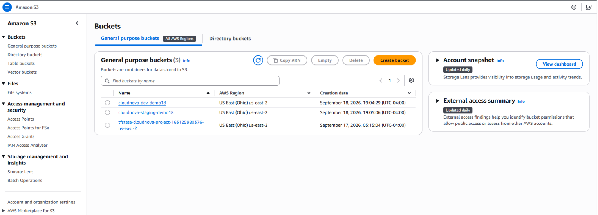
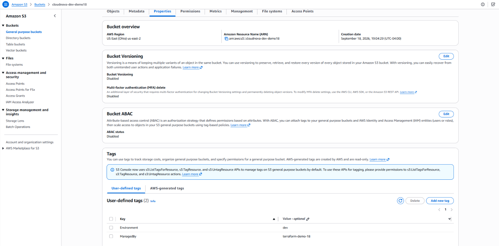
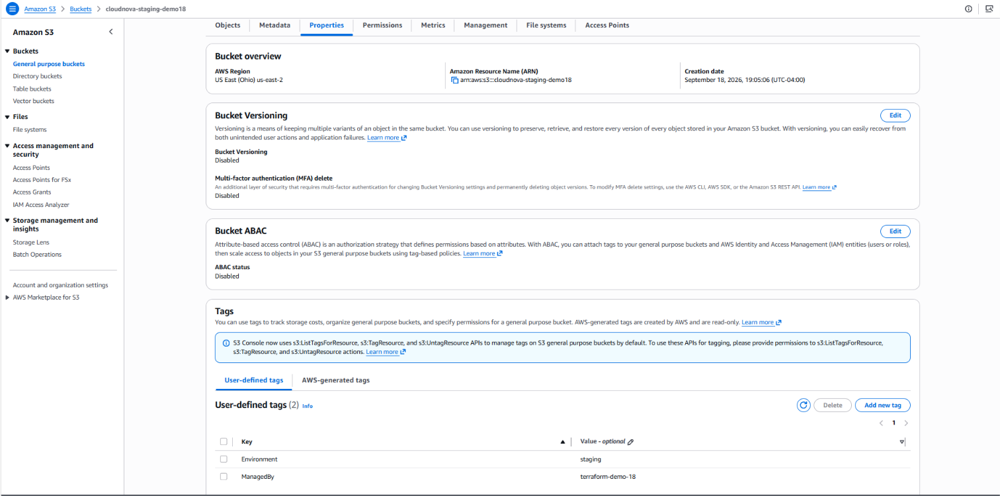

# Demo 18 — Workspaces

---

## Overview

Every demo so far has run in exactly one state, for exactly one
environment. CloudNova's platform team, though, genuinely needs a
`dev` and a `staging` version of the same S3 bucket configuration —
not different configurations, the *same* configuration, applied twice
with different state. This demo introduces Terraform's **CLI
workspace** feature — `terraform workspace new`/`select`/`list`/`show`
and the `terraform.workspace` built-in — to do exactly that, and
closes Phase 2's original scope by directly contrasting it against
Demo 17's `for_each`-over-a-map approach to the same underlying
problem.

**Real-world scenario — CloudNova:** the platform team wants to stand
up `dev` and `staging` versions of a simple S3 bucket without
duplicating any `.tf` files — the same configuration, run twice, each
time against its own separate state.

**What this demo builds:**

```
┌─────────────────────────────────────────────────────────────────────────┐
│  PART A — Creating and Switching Workspaces                             │
│  terraform workspace new dev / new staging — two workspaces, one        │
│  configuration, from the very first terraform init                      │
├─────────────────────────────────────────────────────────────────────────┤
│  PART B — Using terraform.workspace in Configuration                    │
│  bucket = "cloudnova-${terraform.workspace}-demo18" — the same .tf      │
│  file producing a different real bucket per workspace                   │
├─────────────────────────────────────────────────────────────────────────┤
│  PART C — Verifying Independent State Per Workspace                     │
│  terraform workspace list / show, confirming dev and staging each       │
│  have their own bucket, their own state, with zero shared awareness     │
└─────────────────────────────────────────────────────────────────────────┘
```

**What this demo covers:**
- `terraform workspace new`/`select`/`list`/`show`/`delete` — the CLI
  workspace command family
- `terraform.workspace` — the built-in reference giving the current
  workspace's name inside configuration
- How CLI workspaces isolate **state**, not configuration — the same
  `.tf` files, applied independently per workspace
- The real, documented distinction between a CLI workspace (this
  demo) and an **HCP Terraform workspace** (an entirely different,
  cloud-hosted concept sharing the same word)
- Direct contrast against Demo 17's `for_each`-over-a-map approach to
  multi-environment/multi-instance resources

**What this demo does NOT cover:** HCP Terraform workspaces (a
genuinely different product feature, tested separately under TA-004
domain 8), or a full production recommendation on workspace strategy
— see the honest trade-off discussion in Interview Prep instead.

---

## How This Demo's Pieces Fit Together

**The AWS solution:** one S3 bucket, created twice — once per
workspace — from one unchanged set of `.tf` files.

- `main.tf` contains exactly one `aws_s3_bucket` resource, with
  `bucket = "cloudnova-${terraform.workspace}-demo18"` — the bucket's
  actual name depends entirely on which workspace is selected when
  `apply` runs, with no `if`/`for_each`/variable file needed to make
  that happen.
- Selecting `dev` via `terraform workspace select dev` and running
  `apply` creates `cloudnova-dev-demo18`, tracked in a state file
  specific to the `dev` workspace. Switching to `staging` and applying
  again creates a **second, entirely separate** bucket,
  `cloudnova-staging-demo18`, tracked in `staging`'s own state file —
  the `dev` bucket's state is completely untouched by this.
- Both workspaces share the exact same `.tf` files on disk the entire
  time — nothing about the configuration itself ever changes between
  them. Only the selected workspace, and therefore which state file is
  active, changes.

---

## Prerequisites

### Knowledge
- Demo 17 completed — `for_each` over a map, this demo's direct point
  of contrast for solving a similar-looking multi-environment problem
- Demo 04 completed — state management fundamentals, since workspaces
  are entirely a state-isolation mechanism

### Required Tools

| Tool | Minimum version | Verify |
|---|---|---|
| Terraform CLI | `>= 1.15.0` (pinned `~> 1.15.0` in this demo) | `terraform version` |
| AWS CLI | `>= 2.x` | `aws --version` |

### Verify AWS Account and Permissions

**Step 1 — Confirm your profile works:**

```bash
aws sts get-caller-identity --profile default --region us-east-2
```

**Step 2 — A cheap, harmless dry-run of this demo's actual service:**

```bash
aws s3api list-buckets --profile default --region us-east-2
# Expected: JSON with a Buckets array (may be empty — that is fine)
# If you see AccessDenied: fix IAM permissions before proceeding,
# not after you're mid-lab
```

**Step 3 — Verify IAM permissions in Console:**

```
Console → IAM → Users → test → Permissions tab
  → Confirm AmazonS3FullAccess (or equivalent) is attached ✅
```

**Required permissions for this demo:**

```
s3:CreateBucket, s3:DeleteBucket, s3:PutBucketTagging, s3:ListBucket
```

### Versions used in this demo

| Tool | Version |
|---|---|
| Terraform | `~> 1.15.0` |
| AWS Provider | `~> 6.47.0` |
| AWS CLI | `>= 2.x` |

> **Versions pinned as of September 2026** — same dating convention
> as every other demo in this series; check each project's own
> changelog before assuming these exact levels are still current if
> you're reading this well after that date.

---

## Demo Objectives

By the end of this demo you will be able to:

1. ✅ Create and switch between CLI workspaces using
   `terraform workspace new`/`select`
2. ✅ Reference `terraform.workspace` inside configuration to vary a
   resource's behavior per workspace
3. ✅ Explain precisely what a CLI workspace isolates (state) versus
   what it does not isolate (configuration)
4. ✅ Distinguish a CLI workspace from an HCP Terraform workspace —
   the same word, two genuinely different features
5. ✅ Contrast CLI workspaces against Demo 17's `for_each`-over-a-map
   approach, and explain when each is the better fit

---

## Cost & Free Tier

| Resource | Free tier | Cost | Notes |
|---|---|---|---|
| S3 Bucket × 2 (one per workspace) | 5 GB Standard storage free (12-month free tier) | **$0.00** | Same free tier as every prior S3 usage in this series |
| **Session total** | | **$0.00** | |

> Always run cleanup at the end of the session — for **both**
> workspaces, not just one.

---

## Directory Structure

```
18-workspaces/
├── README.md
├── 18-workspaces-anki.csv
├── 18-workspaces-quiz.md
└── src/
    ├── versions.tf      # terraform block + provider version constraints
    ├── provider.tf       # AWS provider: region, profile
    ├── variables.tf      # root-level inputs
    ├── main.tf            # the single aws_s3_bucket resource, using terraform.workspace
    ├── outputs.tf         # root outputs, including the current workspace name itself
    └── break-fix/
        └── broken.tf         # root config with 3 deliberate workspace-related errors
```

> **No per-workspace subdirectories or files.** This is the entire
> point being demonstrated — one set of `.tf` files, no duplication,
> serving both `dev` and `staging`.

---

## Recall Check — Demo 17

Answer from memory before reading further:

1. What does `for_each` on a `module` block actually produce, and how
   is a specific instance addressed afterward?
2. Do independent instances of a `for_each`'d module (with no
   dependency on each other) create sequentially or in parallel?
3. What happens to existing `for_each`'d instances when a new key is
   added to the map driving them?

<details>
<summary>Answers</summary>

1. One independent module instance per key in the given map —
   addressed afterward as `module.<name>["<key>"].<output>`.
   Referencing it without a key is an error once `for_each` is
   present.
2. In parallel — Terraform only forces sequential creation when one
   instance's configuration genuinely depends on another's output.
3. Nothing changes for the existing instances — Terraform plans
   exactly one new resource for the new key, since each instance's
   identity is tied to its own key, not its position or count.

</details>

---

## Concepts

### What's New in This Demo

| Construct | Type | Purpose in this demo |
|---|---|---|
| `terraform workspace new <name>` | CLI command | Creates a new named workspace, with its own state |
| `terraform workspace select <name>` | CLI command | Switches which workspace is currently active |
| `terraform workspace list` / `show` | CLI commands | Lists all workspaces / shows the currently active one |
| `terraform.workspace` | Built-in reference | Returns the currently active workspace's name, usable anywhere in configuration |

**Related constructs worth knowing (not covered in full here):**

| Construct | What it is | Where it's covered in full |
|---|---|---|
| HCP Terraform workspaces | A different, cloud-hosted concept sharing the same word | Not covered in this series — genuinely a different product surface (TA-004 domain 8, not this demo's territory) |

---

### Detailed Explanation of New Constructs

#### Creating and Switching Workspaces

```bash
terraform workspace list
# * default

terraform workspace new dev
# Created and switched to workspace "dev"!

terraform workspace new staging
# Created and switched to workspace "staging"!

terraform workspace select dev
# Switched to workspace "dev".

terraform workspace show
# dev
```

**What it does:** every Terraform working directory starts with
exactly one workspace, `default` — this series has been implicitly
using it in every prior demo without ever naming it. `workspace new`
creates an additional named workspace and switches to it immediately;
`workspace select` switches between existing workspaces without
creating one; `workspace show` prints whichever one is currently
active.

> **A new workspace starts with completely empty state**, exactly as
> if `init` had just been run in a brand-new directory. Creating
> `staging` does not copy or inherit anything from `dev`'s state — it
> genuinely starts from zero, tracking nothing until its own `apply`
> runs.

---

#### `terraform.workspace` — Referencing the Active Workspace in Configuration

```hcl
resource "aws_s3_bucket" "this" {
  bucket = "cloudnova-${terraform.workspace}-demo18"

  tags = {
    Environment = terraform.workspace
    ManagedBy   = "terraform-demo-18"
  }
}
```

**What it does:** `terraform.workspace` is a built-in reference —
not a variable, not a resource attribute — available anywhere in
configuration, that resolves to whatever workspace is currently
selected. The same `.tf` file, applied once with `dev` selected and
once with `staging` selected, produces two differently-named buckets,
with no `count`, `for_each`, or `.tfvars` file involved at all.

> **Same as X" ban check — restating, not just pointing:** this looks
> superficially similar to `each.key` from Demo 09/17's `for_each` —
> both vary a resource's name per "instance." But `terraform.workspace`
> doesn't create multiple instances from one `apply` the way
> `for_each` does — it requires **running `apply` once per workspace,
> separately**, each time against a different, independently-tracked
> state file. `for_each` produces multiple resources from a single
> `apply`; workspaces produce one resource per `apply`, repeated
> across separate invocations.

---

#### What a Workspace Actually Isolates — State, Not Configuration

**What it does:** switching workspaces changes which state file
Terraform reads and writes — it does **not** change which `.tf` files
exist on disk. Every workspace in a given working directory sees the
exact same configuration; only the recorded state (and therefore, only
values like `terraform.workspace` that are evaluated fresh in that
context) differs.

> **This is genuinely the single most exam-relevant fact about CLI
> workspaces, and also the most confused with a completely unrelated
> feature.** HashiCorp's own materials describe this exact point as an
> explicit exam tip: CLI workspaces separate *state*, not
> *configuration*. Separately — and this is the part worth being
> extra careful about — **HCP Terraform** (the cloud-hosted product)
> also has something it calls a "workspace," and that concept is far
> broader: remote runs, variables, VCS integration, policy enforcement,
> team access. The two features share a name and almost nothing else.
> This demo's `terraform workspace` commands are the CLI-only feature;
> anything about HCP Terraform's workspaces is out of scope here
> entirely.

---

## Lab Step-by-Step Guide

---

## Part A — Creating and Switching Workspaces

Part A stands up the configuration once, then creates both workspaces
before touching AWS at all.

### Step 1 — Navigate to the project

```bash
cd terraform-aws-mastery/phase-2-modules/18-workspaces/src
```

### Step 2 — Create the root scaffolding files

This step scaffolds the root configuration's provider and version
pins, plus the two root-level variables every demo in this series
uses.

#### `versions.tf` — Provider and Terraform version pins

**versions.tf:**

```hcl
terraform {
  required_version = "~> 1.15.0"

  required_providers {
    aws = {
      source  = "hashicorp/aws"
      version = "~> 6.47.0"
    }
  }
}
```

#### `provider.tf` — AWS provider configuration

**provider.tf:**

```hcl
provider "aws" {
  region  = var.aws_region
  profile = var.aws_profile
}
```

#### `variables.tf` — Root-level inputs

**variables.tf:**

```hcl
variable "aws_region" {
  type        = string
  description = "AWS region for all resources"
  default     = "us-east-2"
}

variable "aws_profile" {
  type        = string
  description = "AWS CLI named profile for authentication"
  default     = "default"
}
```

### Step 3 — Initialize, then create both workspaces

This step initializes the configuration once, then creates both
workspaces this demo needs before any AWS resource exists.

```bash
terraform init
terraform workspace list
```

Expected:

```
* default
```

> ⚠️ Simulated expected output — not from a live terminal run in this
> environment.

```bash
terraform workspace new dev
terraform workspace new staging
terraform workspace list
```

Expected:

```
  default
  dev
* staging
```

> ⚠️ Simulated expected output — not from a live terminal run in this
> environment.

> **`staging` is marked active (`*`) because it was the most recently
> created workspace.** `workspace new` both creates and switches to
> the new workspace in one step — this is why `dev` isn't currently
> selected, even though it was created first.

---

## Part B — Using `terraform.workspace` in Configuration

Part B writes the one resource this demo needs, referencing
`terraform.workspace`, then applies it against both workspaces
separately.

### Step 4 — Create the bucket resource

This step writes the single resource this entire demo revolves
around — its name depends entirely on which workspace is active when
it's applied.

Create a file **main.tf** and add the below content:

This file contains the one `aws_s3_bucket` resource this demo builds,
with its name and `Environment` tag both driven by
`terraform.workspace`.

```hcl
resource "aws_s3_bucket" "this" {
  bucket = "cloudnova-${terraform.workspace}-demo18"

  tags = {
    Environment = terraform.workspace
    ManagedBy   = "terraform-demo-18"
  }
}
```

### Step 5 — Create the outputs

This step exposes the current workspace's name and the resulting
bucket name, so both are visible after every apply.

Create a file **outputs.tf** and add the below content:

This file reads `terraform.workspace` directly and the bucket's own
`bucket` attribute, confirming both match after each workspace's
apply.

```hcl
output "current_workspace" {
  value       = terraform.workspace
  description = "Which workspace this apply ran against"
}

output "bucket_name" {
  value       = aws_s3_bucket.this.bucket
  description = "Name of the bucket created in the current workspace"
}
```

### Step 6 — Apply against `dev`

This step selects `dev` and runs the first real apply, creating the
first of this demo's two independent buckets.

```bash
terraform workspace select dev
terraform apply
```

Expected:

```
aws_s3_bucket.this: Creating...
aws_s3_bucket.this: Creation complete after 1s [id=cloudnova-dev-demo18]

Apply complete! Resources: 1 added, 0 changed, 0 destroyed.

Outputs:

bucket_name       = "cloudnova-dev-demo18"
current_workspace = "dev"
```

> ⚠️ Simulated expected output — not from a live terminal run in this
> environment.

### Step 7 — Apply against `staging`

This step selects `staging` and applies the identical, unchanged
configuration again, creating a second, entirely separate bucket.

```bash
terraform workspace select staging
terraform apply
```

Expected — note this is a **second, independent bucket**, not a
modification of `dev`'s:

```
aws_s3_bucket.this: Creating...
aws_s3_bucket.this: Creation complete after 1s [id=cloudnova-staging-demo18]

Apply complete! Resources: 1 added, 0 changed, 0 destroyed.

Outputs:

bucket_name       = "cloudnova-staging-demo18"
current_workspace = "staging"
```

> ⚠️ Simulated expected output — not from a live terminal run in this
> environment. This is an addition (a new, independent resource in a
> separate state), not an update to anything created in Step 6 — the
> `dev` bucket and its state are entirely untouched by this apply.

---

## Part C — Verifying Independent State Per Workspace

Part C confirms both buckets genuinely exist independently, each
tracked in its own workspace's state.

### Step 8 — Confirm state independence directly

This step confirms directly, per workspace, that each one's state
contains only its own bucket — not the other workspace's.

```bash
terraform workspace select dev
terraform show | grep bucket
```

Expected: only `cloudnova-dev-demo18` appears — `staging`'s bucket is
completely absent from `dev`'s state.

> ⚠️ Simulated expected output — not from a live terminal run in this
> environment.

```bash
terraform workspace select staging
terraform show | grep bucket
```

Expected: only `cloudnova-staging-demo18` appears.

> ⚠️ Simulated expected output — not from a live terminal run in this
> environment.

### Step 9 — Verify in the Console

This step confirms in the Console that both buckets are real and
exist simultaneously, each with the tag matching its own workspace.

```
Console → S3 → Buckets
  → cloudnova-dev-demo18 exists, tags show Environment = dev ✅
  → cloudnova-staging-demo18 exists, tags show Environment = staging ✅
  → Both exist simultaneously — this is genuinely two real, independent buckets
```







---

## Cleanup

**Both workspaces must be destroyed separately** — `destroy` only ever
affects the currently selected workspace's state.

### Step 10 — Destroy the `dev` workspace's resources

```bash
terraform workspace select dev
terraform destroy
```

Type `yes`. Expected:

```
aws_s3_bucket.this: Destroying...
aws_s3_bucket.this: Destruction complete after 1s

Destroy complete! Resources: 1 destroyed.
```

> ⚠️ Simulated expected output — not from a live terminal run in this
> environment.

### Step 11 — Destroy the `staging` workspace's resources

```bash
terraform workspace select staging
terraform destroy
```

Type `yes`. Expected:

```
aws_s3_bucket.this: Destroying...
aws_s3_bucket.this: Destruction complete after 1s

Destroy complete! Resources: 1 destroyed.
```

> ⚠️ Simulated expected output — not from a live terminal run in this
> environment.

### Step 12 — Confirm both buckets are gone

```bash
aws s3api head-bucket --bucket cloudnova-dev-demo18 --profile default --region us-east-2
aws s3api head-bucket --bucket cloudnova-staging-demo18 --profile default --region us-east-2
```

Expected: an error confirming neither bucket exists (e.g. `Not
Found`), not a successful response — confirming **both** workspaces'
resources are genuinely gone, not just one.

> ⚠️ Simulated expected output — not from a live terminal run in this
> environment.

### Step 13 — Delete both workspaces

This step deletes both workspaces now that their resources are
destroyed — `default` has to be selected first, since a workspace
can't delete itself while active.

```bash
terraform workspace select default
terraform workspace delete dev
terraform workspace delete staging
```

> **A workspace must be empty (fully destroyed) and not currently
> selected before it can be deleted.** This is why `default` is
> selected first — you cannot delete the workspace you're currently
> standing in.

---

## What You Learned

1. ✅ `terraform workspace new`/`select` create and switch between
   independent, named workspaces — every directory starts with one,
   `default`
2. ✅ `terraform.workspace` resolves to the currently active
   workspace's name, usable anywhere in configuration
3. ✅ A workspace isolates **state**, not configuration — every
   workspace shares the exact same `.tf` files
4. ✅ A CLI workspace and an HCP Terraform workspace share a name but
   are genuinely different features — this series' CLI commands are
   entirely separate from HCP Terraform's cloud-hosted concept
5. ✅ `for_each` (Demo 17) produces multiple resources from one
   `apply`; workspaces produce one resource per `apply`, repeated
   separately per workspace — different tools for superficially
   similar-looking problems

---

## Cert Tips

> **Honest scope note, not a fabricated mapping:** the official
> TA-004 Exam Content List has no dedicated numbered objective for the
> CLI `terraform workspace` command specifically — domain 7
> ("Maintain infrastructure with Terraform") covers import, state CLI
> inspection, and logging; domain 8 ("HCP Terraform") covers the
> *different*, cloud-hosted workspace concept. This demo's content is
> included for practical completeness, not because it maps to a
> specific `ta004-obj` code — except where noted below, where the
> naming collision with domain 8 genuinely is testable.

### Exam Objective Mapping

| Demo concept / command | Exam objective | Notes |
|---|---|---|
| CLI `terraform workspace` commands themselves | *Not directly mapped* | No dedicated TA-004 objective exists for this specific CLI feature |
| Distinguishing a CLI workspace from an HCP Terraform workspace | TA-004 Obj 8a (touches) | The naming collision itself is the testable part — domain 8 covers HCP Terraform's actual workspace feature |

### Common Exam Traps

| Scenario | What the task actually requires | Common wrong approach |
|---|---|---|
| Exam mentions "workspace" without further qualification | Determining from context whether it means the CLI feature or HCP Terraform's cloud-hosted concept — they are not interchangeable | Assuming every mention of "workspace" refers to the same thing |
| Exam asks what a CLI workspace isolates | Recognizing it's state only — configuration is identical across every workspace | Assuming different workspaces can run different configurations |
| Exam asks about remote runs, VCS integration, or policy enforcement "in a workspace" | Recognizing these are HCP Terraform workspace features, not CLI workspace features | Assuming the CLI `terraform workspace` command has these capabilities |

### Exam Task — Write a complete configuration

**Task:** CloudNova wants a third workspace, `prod`, added to this
demo's existing setup, with a distinct tag (`CostCenter = "prod-ops"`)
that only applies when the `prod` workspace is active — every other
workspace should be unaffected.

**Block types required:** none new — a conditional expression using
`terraform.workspace`

**Official documentation:**
- [State: Workspaces](https://developer.hashicorp.com/terraform/language/state/workspaces)

**What to practise:**
1. Create the `prod` workspace
2. Add a conditional tag value keyed off `terraform.workspace`
3. Confirm `dev` and `staging`'s `apply` output is completely
   unaffected by this change

<details>
<summary>Reference solution (open only after attempting)</summary>

```hcl
resource "aws_s3_bucket" "this" {
  bucket = "cloudnova-${terraform.workspace}-demo18"

  tags = {
    Environment = terraform.workspace
    ManagedBy   = "terraform-demo-18"
    CostCenter  = terraform.workspace == "prod" ? "prod-ops" : "shared"
  }
}
```

**Arguments you must know without looking up:**
- `terraform.workspace` is usable directly inside a conditional
  expression (`condition ? true_val : false_val`), exactly like any
  other string value

</details>

---

## Troubleshooting

| Error | Cause | Fix |
|---|---|---|
| `Workspace "dev" does not exist` | `workspace select` was run before `workspace new` for that name | Run `terraform workspace new dev` first |
| `BucketAlreadyExists` | The bucket name (`cloudnova-<workspace>-demo18`) collides with a bucket that already exists globally (S3 bucket names are globally unique across all AWS accounts) | Choose a more unique bucket-name prefix |
| `Workspace "dev" is currently selected, cannot delete` | Attempting to delete the currently active workspace | `terraform workspace select default` (or any other workspace) first |

---

## Break-Fix Scenario

Three deliberate errors — single self-contained file, same pattern as
Demos 15/16/17.

```bash
cd src/break-fix/
terraform init
```

#### `broken.tf` — Three deliberate errors

This file is a self-contained root configuration with a typo'd
built-in reference and a bucket name missing the workspace
interpolation entirely — diagnose both, plus a workspace-selection
sequencing mistake run manually outside the file itself.

**broken.tf:**

```hcl
terraform {
  required_version = "~> 1.15.0"
  required_providers {
    aws = {
      source  = "hashicorp/aws"
      version = "~> 6.47.0"
    }
  }
}

provider "aws" {
  region = "us-east-2"
}

resource "aws_s3_bucket" "this" {
  bucket = "cloudnova-demo18-broken" # Error 1: no ${terraform.workspace} interpolation at all

  tags = {
    Environment = terraform.workspce # Error 2: typo, "workspce" instead of "workspace"
  }
}
```

**Broken sequencing (run this manually, not part of the file itself):**

```bash
terraform workspace select qa   # Error 3: "qa" was never created with `workspace new`
```

<details>
<summary>Reveal answers — attempt diagnosis first</summary>

**Error 1 — bucket name has no `terraform.workspace` interpolation**
`bucket = "cloudnova-demo18-broken"` is a plain, static string —
applying this in `dev` and then in `staging` would attempt to create
**the same bucket name twice**, and since S3 bucket names are globally
unique, the second `apply` fails outright. This isn't a syntax error —
it's a silent design mistake that only surfaces on the second
workspace's `apply`. Fix: add `${terraform.workspace}` into the name.

**Error 2 — typo, `terraform.workspce` instead of `terraform.workspace`**
Reported as an "Unsupported attribute" or reference error at
`validate`, since `workspce` isn't a real attribute of the `terraform`
built-in object. Fix: correct the typo.

**Error 3 — selecting a workspace that was never created**
`terraform workspace select qa` on a workspace that doesn't exist
fails with `Workspace "qa" does not exist`. Fix: run
`terraform workspace new qa` first, or select an existing workspace.

</details>

**Cleanup:**
```bash
cd src/break-fix/
terraform destroy -auto-approve
rm -f terraform.tfstate terraform.tfstate.backup
cd ../..
```

---

## Interview Prep

**Q1. A teammate wants to use CLI workspaces to manage CloudNova's
real dev/staging/prod environments long-term. What would you want them
to know before committing to that?**
That CLI workspaces only isolate state — every workspace still shares
the exact same configuration, provider credentials, and backend. For
genuinely different environments (different AWS accounts, different
approval processes, different blast-radius tolerance), many teams
deliberately use separate root configurations, separate backend paths,
or HCP Terraform workspaces instead — specifically because CLI
workspaces offer no way to have `prod` require different credentials
or a different backend than `dev`. It's a reasonable fit for
lightweight, low-stakes variants of the same thing; it's a genuinely
debated choice for anything with real production stakes.

**Q2. When would you reach for Demo 17's `for_each`-over-a-map instead
of this demo's workspaces, for what looks like a similar
multi-environment problem?**
`for_each` is the right tool when you want all instances to exist
**simultaneously**, managed by a single `apply`, in one state file —
Demo 17's three security groups all exist at once. Workspaces are the
right tool when you want genuinely separate applies, at separate
times, each producing its own independently-managed state — this
demo's `dev` and `staging` buckets don't need to exist at the same
moment, and each `apply` only ever touches one of them.

**Q3. Someone mentions "workspace" in a design discussion — what's the
first thing you'd want to clarify?**
Whether they mean the CLI `terraform workspace` feature (local
state-switching, no other capabilities) or an HCP Terraform workspace
(a cloud-hosted concept covering remote runs, variables, VCS
integration, policy enforcement, and team access). The two share
exactly one thing — the word — and confusing them in a real
architecture discussion could lead to assuming capabilities that
simply don't exist in the CLI-only feature.

---

## Key Takeaways

1. **`terraform workspace new`/`select` create and switch between
   independent, named workspaces** — every directory starts with one
   workspace, `default`, used implicitly by every prior demo in this
   series.

2. **`terraform.workspace` resolves to the currently active
   workspace's name, usable anywhere in configuration** — no special
   block or import required.

3. **A workspace isolates state, not configuration** — every workspace
   in a directory shares the exact same `.tf` files; only the tracked
   state (and therefore workspace-dependent values) differs.

4. **A CLI workspace and an HCP Terraform workspace are genuinely
   different features sharing one name** — the CLI feature has no
   remote-run, VCS, policy, or team-access capabilities at all.

> **Demo scope:** Primary concept: `terraform workspace` CLI commands
> and the `terraform.workspace` built-in. Supporting concepts: what a
> workspace does and doesn't isolate, the CLI-vs-HCP-Terraform naming
> collision, direct contrast against Demo 17's `for_each` approach.
> Estimated completion time: ~30 minutes.
> Checkpoints: 3 natural stopping points (end of Part A, end of
> Part B, end of Part C).

---

## Quick Commands Reference

| Command | Description |
|---|---|
| `terraform workspace new <name>` | Creates and switches to a new workspace |
| `terraform workspace select <name>` | Switches to an existing workspace |
| `terraform workspace list` | Lists all workspaces; marks the active one with `*` |
| `terraform workspace show` | Prints the name of the currently active workspace |
| `terraform workspace delete <name>` | Deletes an empty, non-active workspace |

---

## Next Demo

**Demo 19 — ECR Module.** The first of three demos added to close out
Phase 2's real scope — building CloudNova's container registry ahead
of Phase 3's compute demos. Phase 3 itself begins at Demo 22.

---

## Appendix — Anki Cards

**18-workspaces-anki.csv:**

```
#deck:Terraform AWS Mastery::Phase 2 - Modules::18-workspaces
#separator:Comma
#columns:Front,Back,Tags
"What does a CLI workspace actually isolate?","State, not configuration — every workspace in a working directory shares the exact same .tf files. Only the tracked state, and any workspace-dependent value, differs between workspaces.","demo18,workspaces"
"What does terraform.workspace return?","The name of the currently active workspace, as a plain string usable anywhere in configuration — not a variable, not a resource attribute, a built-in reference.","demo18,workspaces"
"Does creating a new workspace copy or inherit anything from an existing workspace's state?","No — a new workspace starts with completely empty state, exactly as if init had just run in a brand-new directory.","demo18,workspaces,gotcha"
"Is a CLI workspace the same thing as an HCP Terraform workspace?","No — they share a name but are genuinely different features. HCP Terraform workspaces add remote runs, variables, VCS integration, policy enforcement, and team access; the CLI feature has none of that.","demo18,workspaces,gotcha"
"When would you use for_each over a map instead of CLI workspaces, for a similar-looking multi-environment problem?","When you want all instances to exist simultaneously, managed by one apply, in one state file. Workspaces instead produce one resource per apply, repeated separately per workspace, at potentially different times.","demo18,workspaces,foreach"
"What happens if you try to delete the currently-selected workspace?","Terraform refuses — you must select a different workspace (commonly default) before deleting the one you were standing in.","demo18,workspaces,gotcha"
"Does the official TA-004 exam have a dedicated numbered objective for the CLI terraform workspace command?","No — domain 7 covers import/state CLI/logging, and domain 8 covers the separate HCP Terraform workspace concept. The CLI workspace command itself has no dedicated objective, though the naming collision with domain 8 is genuinely testable.","demo18,workspaces,examscope"
```

---

## Appendix — Quiz

> **Note on Quiz vs. Anki:** Anki drills the isolation/gotcha facts
> directly. This Quiz instead works through applied scenarios — a
> teammate's flawed plan, a Break-Fix-style bucket-naming mistake, and
> a "which tool fits this problem" judgment call — so the two together
> cover recall and application without restating the same question.

**18-workspaces-quiz.md:**

````markdown
# Quiz — Demo 18: Workspaces

> Question types: True/False, Multiple Choice (1 answer), Multiple
> Answer (N answers, stated in the question) — matching the real
> TA-004 exam format.
> Target: 80% or above before moving to Phase 3.

---

**Q1. (Multiple Choice)** A teammate writes
`bucket = "cloudnova-demo18-shared"` (a plain, static string) instead
of interpolating `terraform.workspace`, then applies it in `dev` and
later in `staging`. What actually happens?

- A) Both applies succeed; Terraform automatically appends the workspace name
- B) The second `apply` fails, since S3 bucket names are globally unique and both workspaces would target the identical name
- C) The `staging` apply silently overwrites the `dev` bucket's state
- D) Terraform refuses at `plan` time with a workspace-naming validation error

<details>
<summary>Answer</summary>

**B.** With no `terraform.workspace` interpolation, both workspaces
try to create the same literal bucket name — the second `apply` fails
against AWS's global-uniqueness constraint. This is exactly Break-Fix
Error 1's failure mode, and it's a silent design mistake, not a syntax
error `plan` would catch.

</details>

---

**Q2. (Multiple Choice)** You need to confirm which workspace is
currently selected before running a destructive command. Which
command tells you, without side effects?

- A) `terraform workspace new`
- B) `terraform workspace show`
- C) `terraform state list`
- D) `terraform.workspace` (used directly in the shell)

<details>
<summary>Answer</summary>

**B.** `terraform workspace show` prints the active workspace with no
side effects. **A** would create a new (unnamed) workspace, which is
the opposite of a safe read. `terraform.workspace` (**D**) is a
configuration-language reference, not a shell command.

</details>

---

**Q3. (Multiple Choice)** `terraform workspace select qa` fails with
`Workspace "qa" does not exist`. What's the correct fix?

- A) Run `terraform init -upgrade`
- B) Run `terraform workspace new qa` first, then select it (or select an existing workspace instead)
- C) Manually create a `qa.tfstate` file
- D) Add `qa` to `terraform.workspace` in the `.tf` files

<details>
<summary>Answer</summary>

**B.** `select` only switches between workspaces that already exist —
`new` is what creates one. There's no manual state-file trick or
configuration-file edit that substitutes for actually creating the
workspace.

</details>

---

**Q4. (Multiple Choice)** You run `terraform workspace delete dev`
while `dev` still has real, un-destroyed AWS resources tracked in its
state, and a different workspace is currently selected. What happens?

- A) Terraform deletes the workspace successfully; the AWS resources become unmanaged, invisible orphans
- B) Terraform refuses — a workspace must have empty state before it can be deleted, not just be non-active
- C) Terraform automatically runs `destroy` first, then deletes the workspace
- D) The workspace is deleted but silently retains its state file on disk for manual recovery

<details>
<summary>Answer</summary>

**B.** Being non-active isn't sufficient on its own — a workspace also
must have empty state (i.e., already be fully destroyed) before
`delete` will succeed. Terraform doesn't auto-destroy on your behalf,
and it doesn't allow deleting a workspace that still has resources
tracked in it.

</details>

---

**Q5. (True/False)** After running `terraform workspace new dev`
followed immediately by `terraform workspace new staging`, `dev`
remains the currently active workspace.

- A) True
- B) False

<details>
<summary>Answer</summary>

**B) False.** `workspace new` both creates and switches to the new
workspace in the same step — so after creating `staging` second,
`staging` is the active workspace, not `dev`, exactly as this demo's
own Part A walkthrough shows.

</details>

---

**Q6. (Multiple Choice)** `terraform workspace delete dev` is run while
`dev` is the currently selected workspace. What happens?

- A) It deletes successfully and falls back to `default` automatically
- B) Terraform refuses — a different workspace must be selected first
- C) It deletes the workspace's state file but keeps the name reserved
- D) It silently no-ops

<details>
<summary>Answer</summary>

**B.** Terraform refuses to delete the currently active workspace —
`default` (or any other workspace) must be selected first, exactly as
this demo's own Cleanup section does.

</details>

---

**Q7. (Multiple Answer — Pick the 2 correct responses)** Which TWO
statements correctly distinguish a CLI workspace from an HCP Terraform
workspace?

- A) Both features are identical in every respect, aside from the name
- B) The CLI feature isolates state only; it has no remote-run, VCS, or policy capability
- C) HCP Terraform workspaces add remote runs, variables, VCS integration, policy enforcement, and team access
- D) CLI workspaces are strictly a superset of HCP Terraform workspace features

<details>
<summary>Answer</summary>

**B and C.** The two features share exactly the word "workspace" —
the CLI feature is local, state-only, with none of HCP Terraform's
broader capabilities. **A** and **D** both misstate the relationship.

</details>

---

**Q8. (Multiple Choice)** During Break-Fix diagnosis, `terraform
validate` reports an error on `Environment = terraform.workspce`.
What's the correct read of this error?

- A) `workspce` is a reserved word that must be quoted
- B) It's a plain typo — `terraform` only exposes a `workspace` attribute, not `workspce`
- C) `terraform.workspace` can only be used inside `resource` blocks, not `tags`
- D) The `terraform` object doesn't support attribute access at all

<details>
<summary>Answer</summary>

**B.** This is simply a misspelling of `workspace` — the fix is
correcting the typo, not restructuring where the reference is used or
adding quoting.

</details>

---

Score guide:

| Score | Action |
|---|---|
| 7-8/8 | Import Anki cards — Phase 2 complete, move to Phase 3 |
| 6/8 | Review the wrong answers, then proceed |
| 4-5/8 | Re-read the relevant sections, retry those questions |
| Below 4/8 | Re-read the full demo and redo the walkthrough before proceeding |
````