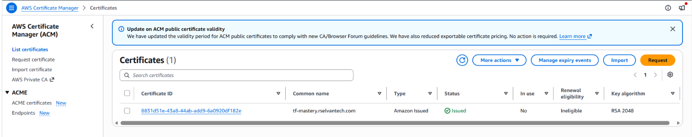
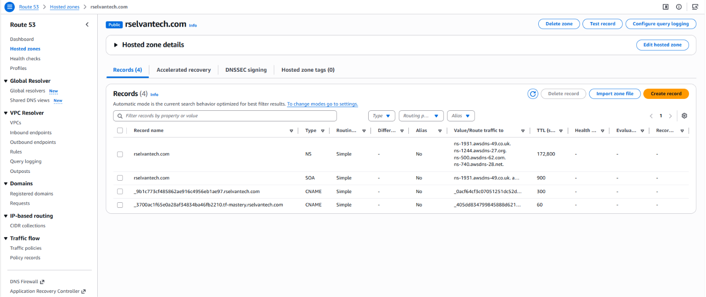
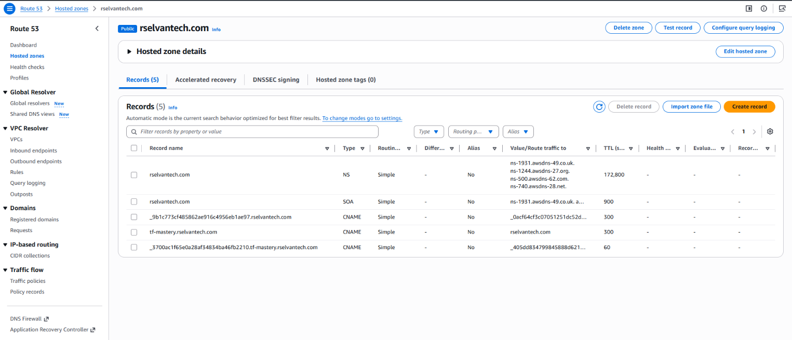

# Demo 20 — ACM + Route53 Module

---

## Overview

CloudNova's real domain, `rselvantech.com`, already exists as a
registered, active Route53 hosted zone — but nothing has ever pointed
a subdomain at anything AWS manages. Before Demo 22's ALB can serve
traffic over HTTPS, a validated TLS certificate needs to exist. This
demo requests and DNS-validates that certificate now, using the
official ACM registry module — even though there's no ALB yet for it
to actually protect.

**Real-world scenario — CloudNova:** the platform team wants to prove
out the ACM + Route53 request/validate workflow against
`tf-mastery.rselvantech.com` now, on a disposable certificate, rather
than debugging DNS validation for the first time under the pressure of
Demo 22's actual ALB work. **This demo's own certificate does not
survive to Demo 22** — it's torn down at this demo's own Cleanup, like
every other Phase 2 teaching rep. Demo 22 Part A re-requests and
re-validates a brand-new certificate from scratch, using the exact
same technique this demo just proved out, against the same
already-owned hosted zone.

**What this demo builds:**

```
┌─────────────────────────────────────────────────────────────────────────┐
│  PART A — Looking Up the Real Hosted Zone                               │
│  data "aws_route53_zone" — reading rselvantech.com's real zone_id      │
├─────────────────────────────────────────────────────────────────────────┤
│  PART B — Requesting and DNS-Validating the Certificate                 │
│  terraform-aws-modules/acm/aws — domain_name, validation_method="DNS"  │
├─────────────────────────────────────────────────────────────────────────┤
│  PART C — A Placeholder Record, Explicitly Temporary                    │
│  A CNAME pointing at the apex domain — swapped for a real ALB alias    │
│  in Demo 22, not left as-is                                             │
└─────────────────────────────────────────────────────────────────────────┘
```

**What this demo covers:**
- `data "aws_route53_zone"` — reading an already-existing hosted
  zone's real `zone_id`, without creating or managing the zone itself
- `terraform-aws-modules/acm/aws` — `domain_name`, `zone_id`,
  `validation_method`, `wait_for_validation`
- Why DNS validation is preferred over email validation for
  infrastructure-as-code — no human ever needs to click a link
- Building a deliberately temporary placeholder DNS record, and why
  that's a legitimate practice rather than a shortcut

**What this demo does NOT cover:** attaching this certificate to an
ALB listener — there's no ALB until Demo 22. This demo's scope ends at
"a validated, usable certificate ARN exists."

---

## How This Demo's Pieces Fit Together

**The AWS solution:** one ACM certificate, requested for
`tf-mastery.rselvantech.com`, DNS-validated against CloudNova's real,
already-owned hosted zone — plus one placeholder DNS record standing
in for the ALB alias Demo 22 will eventually create.

- `data.aws_route53_zone.this` reads the real `rselvantech.com` zone's
  `zone_id` — CloudNova doesn't own creating this zone in Terraform at
  all; it already exists, registered outside this series entirely.
- The ACM module uses that `zone_id` to automatically create the DNS
  validation record ACM requires, and (with `wait_for_validation =
  true`) blocks `apply` until AWS actually confirms the certificate is
  issued — not just requested.
- A separate `aws_route53_record` (outside the module) creates
  `tf-mastery.rselvantech.com` as a CNAME pointing at the apex domain
  itself — a harmless, resolvable placeholder that Demo 22 will
  replace with a real ALIAS record pointing at the ALB, once one
  exists.

---

## Prerequisites

### Knowledge
- Demo 19 completed — registry module sourcing and version
  constraints, most recently applied
- Demo 08 completed — `data` blocks read without managing; this demo
  applies that exact idea to a Route53 zone this series doesn't own

### Required Tools

| Tool | Minimum version | Verify |
|---|---|---|
| Terraform CLI | `>= 1.15.0` (pinned `~> 1.15.0` in this demo) | `terraform version` |
| AWS CLI | `>= 2.x` | `aws --version` |

### Verify AWS Account and Permissions

**Step 1 — Confirm your profile works:**

```bash
aws sts get-caller-identity --profile default --region us-east-2
```

**Step 2 — A cheap, harmless dry-run of this demo's actual service:**

```bash
aws route53 list-hosted-zones --profile default --region us-east-2
# Expected: JSON with a HostedZones array, including rselvantech.com
# If you see AccessDenied: fix IAM permissions before proceeding,
# not after you're mid-lab
```

**Step 3 — Verify IAM permissions in Console:**

```
Console → IAM → Users → test → Permissions tab
  → Confirm AmazonRoute53FullAccess and AWSCertificateManagerFullAccess
    (or equivalent) are attached ✅
```

**Required permissions for this demo:**

```
route53:GetHostedZone, route53:ListHostedZonesByName, route53:ListResourceRecordSets
route53:ChangeResourceRecordSets
acm:RequestCertificate, acm:DeleteCertificate, acm:DescribeCertificate, acm:ListTagsForCertificate
```

> For a learning account, `AmazonRoute53FullAccess` and
> `AWSCertificateManagerFullAccess` cover the permissions above.

### Versions used in this demo

| Tool / Module | Version |
|---|---|
| Terraform | `~> 1.15.0` |
| AWS Provider | `~> 6.47.0` |
| `terraform-aws-modules/acm/aws` | `~> 6.0` — **confirmed resolved to `6.3.1`** via a real `terraform init` run |

> **Versions pinned as of September 2026** — same dating convention as
> the rest of this series; check each project's own changelog before
> assuming these exact levels are still current if you're reading
> this well after that date.

---

## Demo Objectives

By the end of this demo you will be able to:

1. ✅ Use `data "aws_route53_zone"` to read an already-existing hosted
   zone's real `zone_id`, without creating or managing the zone
2. ✅ Request and DNS-validate an ACM certificate using the registry
   module, and explain why DNS validation suits infrastructure-as-code
   better than email validation
3. ✅ Use `wait_for_validation = true` to block `apply` until AWS
   confirms real issuance, not just request submission
4. ✅ Create a deliberately temporary placeholder DNS record, and
   explain why that's a legitimate practice, not a shortcut

---

## Cost & Free Tier

| Resource | Free tier | Cost | Notes |
|---|---|---|---|
| ACM Certificate | Always free for AWS-issued public certs | **$0.00** | |
| Route53 records (validation + placeholder CNAME) | Free — record changes have no charge | **$0.00** | The hosted zone itself (`rselvantech.com`) already exists and is billed independently of this demo |
| **Session total** | | **$0.00** | |

> Always run cleanup at the end of the session.

---

## Directory Structure

```
20-acm-route53-module/
├── README.md
├── 20-acm-route53-module-anki.csv
├── 20-acm-route53-module-quiz.md
└── src/
    ├── versions.tf      # terraform block + provider version constraints
    ├── provider.tf       # AWS provider: region, profile
    ├── variables.tf       # domain_name
    ├── data.tf             # data "aws_route53_zone" lookup
    ├── main.tf              # module "acm" block + placeholder record
    ├── outputs.tf           # certificate_arn, zone_id
    └── break-fix/
        └── broken.tf           # root config with 3 deliberate ACM-module errors
```

---

## Recall Check — Demo 19

Answer from memory before reading further:

1. What does `repository_image_tag_mutability = "IMMUTABLE"` actually
   prevent?
2. Why does `terraform destroy` fail by default on an ECR repository
   that still contains images?
3. How is calling `terraform-aws-modules/ecr/aws` with `for_each`
   similar to Demo 17's security-group pattern?

<details>
<summary>Answers</summary>

1. Re-pushing to a tag that already exists — AWS rejects the push
   outright with a "cannot be overwritten" error. A new build requires
   a new tag.
2. AWS won't let a non-empty repository be deleted unless explicitly
   told to — `repository_force_delete = true` overrides this.
3. Both create multiple independent AWS resources from one module
   block, each addressed by its own key — removing one instance's key
   only affects that one resource, the others are untouched.

</details>

---

## Concepts

### What's New in This Demo

| Construct | Type | Purpose in this demo |
|---|---|---|
| `data "aws_route53_zone"` | Data source | Reads an already-existing hosted zone's real `zone_id` |
| `domain_name` | Module input | The domain the certificate covers |
| `validation_method` | Module input | `"DNS"` (this demo) vs. `"EMAIL"` |
| `wait_for_validation` | Module input | Blocks `apply` until AWS confirms real issuance |
| `acm_certificate_arn` | Module output | The validated certificate's ARN — the module's actual, real output attribute name (confirmed via a live `terraform apply`; a plausible-looking `certificate_arn` does **not** exist on this module and fails with `Unsupported attribute`) |

**Related constructs worth knowing (not used in full here):**

| Construct | What it is | Where it's covered in full |
|---|---|---|
| `subject_alternative_names` | Covering multiple domains/wildcards with one certificate | Not needed for this demo's single subdomain — mentioned in Exam Task |
| Attaching a certificate to an ALB HTTPS listener | Actually using this certificate | Demo 22 |

---

### Detailed Explanation of New Constructs

#### `data "aws_route53_zone"` — Reading a Zone This Series Doesn't Own

```hcl
data "aws_route53_zone" "this" {
  name = "rselvantech.com."
}
```

**What it does:** reads the real, already-registered `rselvantech.com`
hosted zone's attributes — most importantly, its `zone_id`, a value
Terraform has no way to derive from the domain name string alone.
Note the trailing dot in `"rselvantech.com."` — Route53 stores zone
names in fully-qualified form internally; omitting it usually still
works via AWS's own normalization, but matching the stored form
exactly is the more precise habit.

> **Same as X" ban check — restating, not just pointing:** this is the
> identical `data` vs. `resource` distinction Demo 08 introduced —
> Terraform reads this zone's real attributes without ever creating,
> modifying, or destroying it. The zone's entire lifecycle is managed
> completely outside this series; this demo only ever looks at it.

---

#### Requesting and DNS-Validating the Certificate

```hcl
module "acm" {
  source  = "terraform-aws-modules/acm/aws"
  version = "~> 6.0"

  domain_name = "tf-mastery.rselvantech.com"
  zone_id     = data.aws_route53_zone.this.zone_id

  validation_method   = "DNS"
  wait_for_validation = true

  tags = {
    ManagedBy = "terraform-demo-20"
  }
}
```

**What it does:** `validation_method = "DNS"` tells ACM to prove
domain ownership by requiring a specific DNS record to exist — and
because this module was given a real `zone_id`, it creates that
validation record automatically, rather than requiring anyone to copy
a value by hand. `wait_for_validation = true` makes `apply` block
until AWS actually reports the certificate as `ISSUED` — without it,
`apply` would complete the moment the request and DNS record are
created, with no guarantee validation has actually finished.

> **DNS validation vs. email validation — why DNS wins for
> infrastructure-as-code:** email validation sends a message to
> addresses like `admin@rselvantech.com`, requiring a human to
> receive it and click a link — something no automated `apply` can
> do. DNS validation only requires a DNS record to exist, which
> Terraform itself can create — the entire validation flow completes
> without any human involvement, which is exactly what an automated
> pipeline (Demo 32's GitLab CI, eventually) needs.

---

#### The Placeholder Record — Deliberately Temporary, Not a Shortcut

```hcl
resource "aws_route53_record" "placeholder" {
  zone_id = data.aws_route53_zone.this.zone_id
  name    = "tf-mastery.rselvantech.com"
  type    = "CNAME"
  ttl     = 300
  records = ["rselvantech.com"]
}
```

**What it does:** creates `tf-mastery.rselvantech.com` as a CNAME
pointing at the apex domain itself — a harmless, genuinely resolvable
placeholder, not a broken or missing record.

> **Why bother creating a placeholder at all, instead of leaving the
> subdomain unresolvable until Demo 22?** A DNS record that resolves
> to *something* is easier to verify and reason about than one that
> doesn't exist yet — and it proves the zone lookup, the naming, and
> the record-creation mechanics all work correctly now, isolated from
> whatever Demo 22's ALB configuration will eventually add. Demo 22
> replaces this exact record with a real ALIAS record targeting the
> ALB — a planned, explicit swap, not something left broken in the
> meantime.

---

## Lab Step-by-Step Guide

---

## Part A — Looking Up the Real Hosted Zone

Part A confirms the real `rselvantech.com` zone's `zone_id` is
readable via `data`, before requesting anything against it.

### Step 1 — Navigate to the project

```bash
cd terraform-aws-mastery/phase-2-modules/20-acm-route53-module/src
```

### Step 2 — Create the root scaffolding files

This step scaffolds the root configuration's provider and version
pins, plus the two root-level variables every demo in this series
uses.

#### `versions.tf` — Provider and Terraform version pins

**versions.tf:**

```hcl
terraform {
  required_version = "~> 1.15.0"

  required_providers {
    aws = {
      source  = "hashicorp/aws"
      version = "~> 6.47.0"
    }
  }
}
```

#### `provider.tf` — AWS provider configuration

**provider.tf:**

```hcl
provider "aws" {
  region  = var.aws_region
  profile = var.aws_profile
}
```

Create a file **variables.tf** and add the below content:

This file declares the same two root-level variables — region and
profile — used throughout this series.

**variables.tf:**

```hcl
variable "aws_region" {
  type        = string
  description = "AWS region for all resources"
  default     = "us-east-2"
}

variable "aws_profile" {
  type        = string
  description = "AWS CLI named profile for authentication"
  default     = "default"
}
```

### Step 3 — Read the real hosted zone

This step reads the real, already-registered hosted zone rather than
assuming its `zone_id` or creating a new zone.

Create a file **data.tf** and add the below content:

This file contains the one `data` block this demo depends on — the
real `zone_id` every later resource in this demo reads from.

**data.tf:**

```hcl
data "aws_route53_zone" "this" {
  name = "rselvantech.com."
}
```

### Step 4 — Apply and confirm the zone is readable

This step applies the configuration for the first time and confirms
the zone lookup genuinely resolved to the real, already-registered
zone, not a placeholder.

```bash
terraform init
terraform validate
terraform apply
terraform state show data.aws_route53_zone.this
```

Real output from this demo's own verification run:

```
data.aws_route53_zone.this: Reading...
data.aws_route53_zone.this: Read complete after 1s [id=Z0098351FHZVOKGD40KE]

No changes. Your infrastructure matches the configuration.

Apply complete! Resources: 0 added, 0 changed, 0 destroyed.
```

```
# data.aws_route53_zone.this:
data "aws_route53_zone" "this" {
    arn                         = "arn:aws:route53:::hostedzone/Z0098351FHZVOKGD40KE"
    caller_reference            = "RISWorkflow-RD:29b0468b-6b7d-425f-8b51-7d7154117d33"
    comment                     = "HostedZone created by Route53 Registrar"
    id                          = "Z0098351FHZVOKGD40KE"
    name                        = "rselvantech.com"
    name_servers                = [
        "ns-1931.awsdns-49.co.uk",
        "ns-1244.awsdns-27.org",
        "ns-500.awsdns-62.com",
        "ns-740.awsdns-28.net",
    ]
    primary_name_server         = "ns-1931.awsdns-49.co.uk"
    private_zone                = false
    resource_record_set_count   = 3
    zone_id                     = "Z0098351FHZVOKGD40KE"
}
```

> **`Apply complete! Resources: 0 added, 0 changed, 0 destroyed.`**
> is correct and expected here — a `data` source never appears in
> `apply`'s add/change/destroy counts, since it only reads. The real
> confirmation this step is looking for is `terraform state show`
> returning the zone's genuine `zone_id`, `name_servers`, and
> `comment` — proof this is CloudNova's real, already-registered zone,
> not a placeholder.

---

## Part B — Requesting and DNS-Validating the Certificate

Part B requests a real ACM certificate and waits for AWS to actually
issue it.

### Step 5 — Call the ACM module

This step calls the ACM module, requesting a certificate against the
real zone this demo just confirmed it can read.

Create a file **main.tf** and add the below content:

This file contains the ACM module call — the request, DNS validation,
and the wait for real issuance, all driven by the zone ID read in
Step 3.

```hcl
module "acm" {
  source  = "terraform-aws-modules/acm/aws"
  version = "~> 6.0"

  domain_name = "tf-mastery.rselvantech.com"
  zone_id     = data.aws_route53_zone.this.zone_id

  validation_method   = "DNS"
  wait_for_validation = true

  tags = {
    ManagedBy = "terraform-demo-20"
  }
}
```

### Step 6 — Create the outputs

This step exposes the validated certificate's ARN and the zone ID it
was validated against, so both are visible after apply.

Create a file **outputs.tf** and add the below content:

This file reads `module.acm.acm_certificate_arn` — the module's real,
documented output attribute — and the zone data source's own
`zone_id`, confirming both are genuinely available after apply.

**outputs.tf:**

```hcl
output "certificate_arn" {
  value       = module.acm.acm_certificate_arn
  description = "ARN of the validated ACM certificate"
}

output "zone_id" {
  value       = data.aws_route53_zone.this.zone_id
  description = "The real rselvantech.com hosted zone ID"
}
```

> **The module's own output is named `acm_certificate_arn`, not
> `certificate_arn`.** It's easy to assume the shorter name by
> analogy with the module's `domain_name`/`zone_id` inputs — this
> demo made exactly that assumption at first, and a real `apply`
> caught it immediately: `module.acm.certificate_arn` fails with
> `Unsupported attribute... module.acm is object with 7 attributes.
> This object does not have an attribute named "certificate_arn"`.
> The **root** output above is still free to be named `certificate_arn`
> — that's just this configuration's own choice of name for its output
> block, unrelated to what the module itself calls its internal
> attribute. Always check a module's actual documented outputs rather
> than assuming by analogy, the same lesson Demo 15's Break-Fix taught.

### Step 7 — Initialize the new module, then apply and wait for real validation

This step installs the ACM module just added in Step 5, then applies
the certificate request and genuinely waits for AWS to confirm
issuance, rather than treating a completed apply as proof the
certificate is ready.

```bash
terraform init
```

> **A fresh `terraform init` is required here specifically because
> Step 5 added a brand-new `module` block.** Terraform only downloads
> and installs a module the first time it's introduced into
> configuration — `apply` alone refuses to proceed against a module
> it hasn't installed yet, with `Error: Module not installed... Run
> "terraform init" to install all modules required by this
> configuration.` This is standard, expected Terraform CLI behavior
> any time a new `module` or `provider` is introduced mid-lab, not
> specific to ACM.

```bash
terraform apply
```

Real output from this demo's own verification run:

```
data.aws_route53_zone.this: Reading...
data.aws_route53_zone.this: Read complete after 1s [id=Z0098351FHZVOKGD40KE]

Terraform will perform the following actions:

  # module.acm.aws_acm_certificate.this[0] will be created
  # module.acm.aws_acm_certificate_validation.this[0] will be created
  # module.acm.aws_route53_record.validation[0] will be created

Plan: 3 to add, 0 to change, 0 to destroy.

module.acm.aws_acm_certificate.this[0]: Creating...
module.acm.aws_acm_certificate.this[0]: Creation complete after 4s [id=arn:aws:acm:us-east-2:165015980598:certificate/8831d51e-43a8-44ab-add9-6a0920df182e]
module.acm.aws_route53_record.validation[0]: Creating...
module.acm.aws_route53_record.validation[0]: Still creating... [00m32s elapsed]
module.acm.aws_route53_record.validation[0]: Creation complete after 33s [id=Z0098351FHZVOKGD40KE__3700ac1f65e0a28af34834ba46fb2210.tf-mastery.rselvantech.com._CNAME]
module.acm.aws_acm_certificate_validation.this[0]: Creating...
module.acm.aws_acm_certificate_validation.this[0]: Creation complete after 0s [id=2026-09-19 01:22:16.511 +0000 UTC]

Apply complete! Resources: 3 added, 0 changed, 0 destroyed.

Outputs:

certificate_arn = "arn:aws:acm:us-east-2:165015980598:certificate/8831d51e-43a8-44ab-add9-6a0920df182e"
zone_id = "Z0098351FHZVOKGD40KE"
```

> Real DNS validation genuinely takes anywhere from seconds to several
> minutes — this is one of the few steps in this series where waiting
> is expected, not a sign something's wrong. In this run, the
> validation CNAME itself took 33 seconds to create; the
> `aws_acm_certificate_validation` resource then confirmed almost
> immediately, since it's validating against Route53 — AWS's own
> authoritative DNS — rather than waiting on external internet-wide
> propagation.

**Verify:**

```
Console → Certificate Manager → Certificates → tf-mastery.rselvantech.com
  → Status: Issued ✅ (not "Pending validation")
Console → Route53 → Hosted zones → rselvantech.com
  → a new CNAME validation record present, matching what ACM required ✅
```




> **The zone will likely show more than just this demo's own record.**
> The screenshot above shows 4 records total: the zone's own NS/SOA
> pair, this demo's validation CNAME
> (`_3700ac1f...tf-mastery.rselvantech.com`), and one additional CNAME
> validating a *different*, unrelated certificate on the bare
> `rselvantech.com` apex domain — not something this demo created or
> manages. Don't be thrown by seeing records this demo didn't add;
> only the `tf-mastery.*`-prefixed one is yours.

---

## Part C — The Placeholder Record

Part C creates the temporary CNAME, and confirms the subdomain
actually resolves.

### Step 8 — Add the placeholder record

This step adds the placeholder CNAME alongside the existing
certificate, using the same zone ID already read in Step 3.

In **main.tf**, add the following resource alongside the existing
`module "acm"` block:

```hcl
resource "aws_route53_record" "placeholder" {
  zone_id = data.aws_route53_zone.this.zone_id
  name    = "tf-mastery.rselvantech.com"
  type    = "CNAME"
  ttl     = 300
  records = ["rselvantech.com"]
}
```

### Step 9 — Apply and verify resolution

This step applies the placeholder record and confirms it actually
resolves — proving the record works, not just that Terraform tracked
it.

```bash
terraform apply
```

Real output from this demo's own verification run — note Terraform
also detects and reports a real, expected piece of drift here:

```
Note: Objects have changed outside of Terraform

  # module.acm.aws_acm_certificate.this[0] has changed
  ~ resource "aws_acm_certificate" "this" {
      ~ status = "PENDING_VALIDATION" -> "ISSUED"
        # (18 unchanged attributes hidden)
    }

Terraform will perform the following actions:

  # aws_route53_record.placeholder will be created
  + resource "aws_route53_record" "placeholder" {
      + name    = "tf-mastery.rselvantech.com"
      + records = ["rselvantech.com"]
      + ttl     = 300
      + type    = "CNAME"
    }

Plan: 1 to add, 0 to change, 0 to destroy.

aws_route53_record.placeholder: Creating...
aws_route53_record.placeholder: Still creating... [00m33s elapsed]
aws_route53_record.placeholder: Creation complete after 34s [id=Z0098351FHZVOKGD40KE_tf-mastery.rselvantech.com_CNAME]

Apply complete! Resources: 1 added, 0 changed, 0 destroyed.
```

> **The "Objects have changed outside of Terraform" note is normal,
> official Terraform behavior — not an error.** It simply means the
> certificate's real-world `status` attribute had moved to `ISSUED` by
> the time of this later refresh, after Step 7's own apply had already
> completed. This is standard drift-detection messaging Terraform
> prints on any `plan`/`apply` when it notices a tracked resource's
> real attributes changed since the last refresh — it doesn't require
> any action here.

```bash
dig +short tf-mastery.rselvantech.com
```

Real output:

```
rselvantech.com.
```

> The placeholder genuinely resolves — `dig` returns the apex domain
> it points at, confirming the record works, not just that it exists
> in Terraform's state.

**Verify:**

```
Console → Route53 → Hosted zones → rselvantech.com
  → tf-mastery CNAME record present, target = rselvantech.com ✅
```



> ⚠️ **Open item, not yet resolved:** the screenshot mapped to this
> step should show the plain `tf-mastery.rselvantech.com →
> rselvantech.com` placeholder record created above, but as currently
> captured it appears to show the same 4 records as Step 7's
> screenshot, with no visible placeholder entry. Confirm whether a
> later screenshot (taken after this step's `apply`) should replace it
> before treating this section as finished — the real terminal output
> above already proves the record itself was created successfully, so
> this is a documentation-evidence gap, not a lab problem.

---

## Cleanup

### Step 10 — Destroy all resources

```bash
terraform destroy
```

Type `yes`. Real output from this demo's own verification run:

```
Terraform will perform the following actions:

  # aws_route53_record.placeholder will be destroyed
  # module.acm.aws_acm_certificate.this[0] will be destroyed
  # module.acm.aws_acm_certificate_validation.this[0] will be destroyed
  # module.acm.aws_route53_record.validation[0] will be destroyed

Plan: 0 to add, 0 to change, 4 to destroy.

aws_route53_record.placeholder: Destroying...
aws_route53_record.placeholder: Still destroying... [00m30s elapsed]
module.acm.aws_route53_record.validation[0]: Destroying...
module.acm.aws_route53_record.validation[0]: Still destroying... [00m30s elapsed]
module.acm.aws_route53_record.validation[0]: Destruction complete after 31s
aws_route53_record.placeholder: Destruction complete after 31s
module.acm.aws_acm_certificate.this[0]: Destroying...
module.acm.aws_acm_certificate.this[0]: Destruction complete after 0s

Destroy complete! Resources: 4 destroyed.
```

> **The `rselvantech.com` hosted zone itself is never touched by this
> destroy** — only the certificate and the two records this demo
> created are removed. The unrelated CNAME on the bare apex domain
> (flagged in Step 7's Verify) is also untouched, since this demo
> never managed it.

### Step 11 — Confirm the certificate is gone

```bash
aws acm list-certificates --profile default --region us-east-2 --query "CertificateSummaryList[?DomainName=='tf-mastery.rselvantech.com']"
```

Real output:

```
[]
```

---

## What You Learned

1. ✅ `data "aws_route53_zone"` reads an already-existing hosted
   zone's real `zone_id`, without ever creating or managing the zone
2. ✅ DNS validation lets an ACM certificate be issued with zero human
   involvement — email validation cannot be automated the same way
3. ✅ `wait_for_validation = true` makes `apply` block until AWS
   confirms real issuance, not just request submission
4. ✅ A deliberately temporary placeholder DNS record is a legitimate,
   verifiable practice — not a shortcut left broken until later
5. ✅ Adding a new `module` block to an existing configuration
   requires re-running `terraform init` before that module's resources
   can be planned or applied — confirmed directly against a real
   `Module not installed` error
6. ✅ A module's own output attribute names aren't always the shortest
   or most obvious guess — `acm_certificate_arn`, not `certificate_arn`,
   confirmed directly against a real `Unsupported attribute` error

---

## Cert Tips

### Exam Objective Mapping

| Demo concept / command | Exam objective | Notes |
|---|---|---|
| `data` block reading an unmanaged resource | TA-004 Obj (data sources, per Demo 08) | Reinforces the `data` vs. `resource` distinction at real infrastructure scale |
| Registry module sourcing (`terraform-aws-modules/acm/aws`) | TA-004 Obj 5a | Same objective as every registry-sourced module in this series |
| Re-running `init` after adding a new `module` block | TA-004 Obj 5c | A new module reference requires installation before it can be planned or applied |

### Common Exam Traps

| Scenario | What the task actually requires | Common wrong approach |
|---|---|---|
| Exam asks why DNS validation is preferred for automated pipelines | Recognizing it requires zero human involvement — Terraform itself creates the validation record | Assuming email validation is simpler because it needs no extra DNS record |
| Exam shows `wait_for_validation` omitted or `false` | Recognizing `apply` completes without confirming the certificate is actually `ISSUED` | Assuming a completed `apply` always means the certificate is ready to use |
| A newly-added `module` block causes `apply` to fail | Recognizing this means `init` hasn't been re-run since the module was added | Assuming the module block itself is malformed |

### Exam Task — Write a complete configuration

**Task:** CloudNova's billing team needs a second certificate covering
both `billing.rselvantech.com` and `*.billing.rselvantech.com` with
one request.

**Block types required:** `module` (×1, reusing the existing
`data.aws_route53_zone.this` lookup)

**Official documentation:**
- [`terraform-aws-modules/acm/aws`](https://registry.terraform.io/modules/terraform-aws-modules/acm/aws/latest)

**What to practise:**
1. Check the module's actual documented input for covering additional
   domain names on one certificate — don't assume the argument name
2. Write the module block from scratch

<details>
<summary>Reference solution (open only after attempting)</summary>

```hcl
module "acm_billing" {
  source  = "terraform-aws-modules/acm/aws"
  version = "~> 6.0"

  domain_name = "billing.rselvantech.com"
  zone_id     = data.aws_route53_zone.this.zone_id

  subject_alternative_names = ["*.billing.rselvantech.com"]

  validation_method   = "DNS"
  wait_for_validation = true
}
```

**Arguments you must know without looking up:**
- `subject_alternative_names` is a list — covering a wildcard alongside
  the base domain requires including it explicitly, it isn't implied
  by the base `domain_name` alone

</details>

---

## Troubleshooting

| Error | Cause | Fix |
|---|---|---|
| `apply` hangs for a very long time on certificate validation | DNS propagation is genuinely slow, or the zone lookup returned the wrong `zone_id` | Wait a few minutes; if it never completes, confirm `data.aws_route53_zone.this.zone_id` matches the Console's actual zone ID |
| `NoSuchHostedZone` on the `data` block | The `name` argument doesn't exactly match the zone's stored name (missing trailing dot, typo) | Confirm the exact zone name via `aws route53 list-hosted-zones` |
| Certificate stuck in `PENDING_VALIDATION` in the Console | The validation CNAME record wasn't created, or points somewhere wrong | Confirm the validation record actually exists in Route53, matching what ACM's own console page states it expects |
| `Error: Module not installed` on `terraform apply` | A `module` block was added to configuration since the last `terraform init` | Run `terraform init` to install the newly-referenced module, then `apply` again |
| `Error: Unsupported attribute` referencing a module output | The output name doesn't actually exist on that module — a plausible-looking guess (e.g. `certificate_arn`) isn't automatically correct | Check the module's real documented outputs rather than guessing by analogy; this module's actual output is `acm_certificate_arn` |

---

## Break-Fix Scenario

Three deliberate errors — single self-contained file.

```bash
cd src/break-fix/
terraform init
```

#### `broken.tf` — Three deliberate errors

This file is a self-contained configuration with a malformed zone
lookup, an invalid validation method, and a wrong output name —
diagnose all three.

**broken.tf:**

```hcl
terraform {
  required_version = "~> 1.15.0"
  required_providers {
    aws = {
      source  = "hashicorp/aws"
      version = "~> 6.47.0"
    }
  }
}

provider "aws" {
  region = "us-east-2"
}

data "aws_route53_zone" "this" {
  name = "rselvantech.con." # Error 1: typo, ".con" instead of ".com"
}

module "acm" {
  source  = "terraform-aws-modules/acm/aws"
  version = "~> 6.0"

  domain_name = "broken-demo20.rselvantech.com"
  zone_id     = data.aws_route53_zone.this.zone_id

  validation_method   = "DSN" # Error 2: typo, should be "DNS"
  wait_for_validation = true
}

output "cert_arn" {
  value = module.acm.arn # Error 3: wrong output name (should be acm_certificate_arn)
}
```

<details>
<summary>Reveal answers — attempt diagnosis first</summary>

**Error 1 — typo in the zone name (`.con` instead of `.com`)**
`aws_route53_zone` with `name = "rselvantech.con."` finds no matching
zone — AWS returns a "no matching Route53Zone found" error at `apply`,
since no zone with that exact name exists. Fix: correct the typo.

**Error 2 — invalid `validation_method` value**
`"DSN"` isn't a recognized value — ACM only accepts `"DNS"` or
`"EMAIL"`. Fix: correct to `"DNS"`.

> ⚠️ [VERIFY — behavioral claim, docs-reasoning only, not a live run in
> this environment]: whether this specific invalid value surfaces as a
> `terraform plan`-time error (if the AWS provider enforces
> `validation_method` as a client-side enum on this resource) or only
> as an AWS API rejection at `apply` isn't confirmed here. This
> series' own Demo 16 Break-Fix flags an analogous plan-vs-apply
> question as unconfirmed rather than asserting one — treat this the
> same way: run `terraform plan` yourself against the real module to
> see which stage actually reports it, rather than assuming it's
> necessarily an `apply`-time-only failure.

**Error 3 — wrong output name (`arn` instead of `acm_certificate_arn`)**
This module's actual output is `acm_certificate_arn` — there is no
bare `arn`, and (confirmed via a real `apply` in this demo's own
verification run) not even the more plausible-looking
`certificate_arn`. Reported as an "Unsupported attribute" error at
`validate`/`apply`. Fix: reference `module.acm.acm_certificate_arn`
instead.

</details>

**Cleanup:**
```bash
cd src/break-fix/
terraform destroy -auto-approve
rm -f terraform.tfstate terraform.tfstate.backup
cd ../..
```

---

## Interview Prep

**Q1. Why does this demo request and validate a certificate three
demos before any ALB exists to use it, if it just gets torn down
again?**
Because certificate validation is independent of what will eventually
use the certificate — DNS validation only proves domain ownership, it
has no dependency on an ALB, a Kubernetes Service, or anything else.
Proving out the technique now, on a disposable certificate, means any
DNS-propagation surprises or `zone_id` mistakes get caught here — not
during Demo 22's actual ALB work, where they'd compete for attention
with genuinely new content (EKS, Ingress routing). Demo 22 Part A
still has to request its own real certificate from scratch, but by
then the *mechanism* is already proven, not being learned for the
first time under pressure.

**Q2. A teammate asks why DNS validation doesn't require them to do
anything manually, unlike email validation. What's actually
happening?**
DNS validation only requires a specific DNS record to exist proving
control over the domain — and since Terraform already has write access
to the real hosted zone (via the `zone_id` this demo looked up),
it can create that record itself. Email validation instead sends a
message to an address at the domain, requiring a human to open it and
click a confirmation link — something no unattended `apply` can do,
which is exactly why DNS validation is the standard choice for
infrastructure-as-code.

**Q3. Why create a placeholder DNS record instead of just leaving
`tf-mastery.rselvantech.com` unresolvable until Demo 22?**
A record that resolves to something real is verifiable right now —
`dig` either returns the apex domain's own address or it doesn't,
which is a clear pass/fail signal for whether the zone lookup, naming,
and record creation all worked correctly. An unresolvable subdomain
gives no such signal; it just looks the same whether everything is
configured correctly or something is silently broken.

**Q4. A colleague adds a new `module` block to an existing Terraform
config and runs `apply` directly — it fails. Why, and what's the
one-line fix?**
Terraform only installs a module's source the first time it appears
in configuration, during `init` — `apply` alone won't retroactively
install a module it's never seen before, and fails with `Module not
installed`. The fix is exactly what the error message says: run
`terraform init` again to install the newly-referenced module, then
`apply` will proceed normally.

---

## Key Takeaways

1. **`data "aws_route53_zone"` reads a real, already-existing zone's
   `zone_id`** — this series never creates or manages the
   `rselvantech.com` zone itself, only reads from it.

2. **DNS validation requires zero human involvement, unlike email
   validation** — Terraform can create the required DNS record itself,
   which is exactly why it's the standard choice for automated
   pipelines.

3. **`wait_for_validation = true` is what actually confirms
   issuance** — without it, `apply` completing says nothing about
   whether the certificate is genuinely ready to use.

4. **A deliberately temporary placeholder record is a legitimate
   practice, not corner-cutting** — it's verifiable now, and its
   planned replacement (Demo 22's real ALIAS record) is explicit, not
   left implicit.

5. **A new `module` block always requires re-running `terraform init`
   before it can be applied** — this isn't a special ACM/Route53
   quirk, it's true of any module added to any configuration at any
   point in its lifecycle.

6. **A module's output names are its own — never assume the shortest
   plausible guess is correct.** This module's real output is
   `acm_certificate_arn`, not the more obvious-looking
   `certificate_arn` — confirmed directly against a real error, not
   assumed from the module's other input names.

> **Demo scope:** Primary concept: requesting and DNS-validating an
> ACM certificate via the registry module, against a real, already-
> owned hosted zone. Supporting concepts: DNS vs. email validation,
> the placeholder-record pattern, re-initializing after adding a new
> module.
> Estimated completion time: ~30 minutes (includes real ACM
> validation wait time).
> Checkpoints: 3 natural stopping points (end of Part A, end of
> Part B, end of Part C).

---

## Quick Commands Reference

| Command | Description |
|---|---|
| `aws route53 list-hosted-zones` | Confirms a hosted zone's exact stored name, if a `data` lookup fails |
| `dig +short DOMAIN` | Confirms a DNS record's actual resolution, not just its Terraform-tracked existence |
| `aws acm list-certificates` | Confirms a certificate's existence or absence after destroy |
| `terraform init` | Required again any time a new `module`/`provider` block is added to configuration — not just at the very start |

---

## Next Demo

**Demo 21 — Terraform Testing Basics.** The last new demo in Phase 2 — `terraform test` framework fundamentals applied to the VPC module (Demo 16) and the local `sns-topic` module (Demo 14), pulling forward Phase 5's testing basics three phases early.

---

## Appendix — Anki Cards

**20-acm-route53-module-anki.csv:**

```
#deck:Terraform AWS Mastery::Phase 2 - Modules::20-acm-route53-module
#separator:Comma
#columns:Front,Back,Tags
"Why is DNS validation preferred over email validation for infrastructure-as-code?","DNS validation only requires a DNS record to exist, which Terraform can create itself with write access to the zone. Email validation requires a human to receive a message and click a link — something no automated apply can do.","demo20,acm,gotcha"
"What does wait_for_validation = true actually change about terraform apply?","It blocks apply from completing until AWS confirms the certificate is genuinely ISSUED, not just requested. Without it, apply can complete while the certificate is still PENDING_VALIDATION.","demo20,acm,ta004"
"What does data \"aws_route53_zone\" actually do?","Reads an already-existing hosted zone's real attributes (most importantly zone_id) without creating, modifying, or destroying the zone itself — the same data vs. resource distinction from Demo 08, applied to a real zone this series doesn't own.","demo20,acm,route53,ta004"
"Why does this demo create a placeholder DNS record instead of leaving the subdomain unresolvable until Demo 22?","A record resolving to something real is verifiable right now via dig — an unresolvable subdomain gives no signal whether the configuration actually worked or something is silently broken.","demo20,route53,gotcha"
"Does destroying this demo's resources ever touch the rselvantech.com hosted zone itself?","No — only the certificate and the two records this demo created (validation + placeholder) are destroyed. The zone itself is read-only to this series and managed entirely outside it.","demo20,route53,acm,cleanup"
"What is terraform-aws-modules/acm/aws's real output attribute for the certificate's ARN — certificate_arn or acm_certificate_arn?","acm_certificate_arn. certificate_arn looks plausible by analogy but does not exist on this module — confirmed via a real apply that failed with Unsupported attribute when certificate_arn was used.","demo20,acm,modules,gotcha"
```

---

## Appendix — Quiz

> **Note on Quiz vs. Anki:** Anki drills the individual facts (DNS vs.
> email validation, `wait_for_validation`, the placeholder rationale).
> This Quiz instead works through Break-Fix-style diagnosis and the
> real Console/`dig` verification steps, so the two together cover
> recall and applied judgment without asking the same question twice.

**20-acm-route53-module-quiz.md:**

````markdown
# Quiz — Demo 20: ACM + Route53 Module

> Question types: True/False, Multiple Choice (1 answer), Multiple
> Answer (N answers, stated in the question) — matching the real
> TA-004 exam format.
> Target: 80% or above before moving to Demo 21.

---

**Q1. (Multiple Choice)** `data "aws_route53_zone" { name =
"rselvantech.con." }` (typo) is used in Break-Fix. What happens at
`apply`?

- A) Terraform silently falls back to the closest matching zone
- B) AWS reports no matching hosted zone found, since no zone with that exact name exists
- C) `terraform validate` catches this before `apply` even runs
- D) The lookup succeeds, but `zone_id` comes back empty

<details>
<summary>Answer</summary>

**B.** A typo'd zone name simply doesn't match anything real —
there's no fuzzy matching or silent fallback, and this is a real
lookup against AWS, not something `validate`'s syntax-only checks
would catch.

</details>

---

**Q2. (Multiple Choice)** This demo requests and validates a real
certificate three demos before Demo 22's ALB exists to actually use
it. Why does that work at all — what is DNS validation actually
dependent on?

- A) It requires an ALB or load balancer to already exist as the validation target
- B) It only depends on proving domain ownership via a DNS record — nothing about compute, an ALB, or any other downstream consumer
- C) It requires at least a placeholder EC2 instance running in the account
- D) It depends on Route53 health checks being configured first

<details>
<summary>Answer</summary>

**B.** Certificate validation is entirely independent of whatever will
eventually use the certificate — it only proves domain ownership via
DNS. That independence is exactly why this demo can prove out the
technique three demos early, on a disposable certificate, with nothing
else needing to exist first.

</details>

---

**Q3. (True/False)** `dig +short tf-mastery.rselvantech.com` returning
nothing at all, versus returning `rselvantech.com`, both indicate the
placeholder record was created successfully.

- A) True
- B) False

<details>
<summary>Answer</summary>

**B) False.** Only a real resolution result confirms success — that's
the entire point of building a *resolvable* placeholder rather than
leaving the subdomain absent. An empty `dig` result means something
didn't work as intended.

</details>

---

**Q4. (Multiple Choice)** Break-Fix sets `validation_method = "DSN"`.
Which statement correctly reflects what this demo says about how that
error surfaces?

- A) It's confirmed to always fail at `terraform plan`, before any AWS API call
- B) It's confirmed to always fail at `apply`, after AWS rejects the request
- C) The demo explicitly flags the exact stage (plan vs. apply) as unconfirmed and recommends checking with a real `terraform plan`
- D) It never produces an error — `"DSN"` is silently treated as `"DNS"`

<details>
<summary>Answer</summary>

**C.** This demo is explicit that whether the AWS provider enforces
`validation_method` as a client-side enum (making it a `plan`-time
error) or only via API rejection at `apply` isn't confirmed — the
honest answer is "check it yourself," not a confident guess either
way.

</details>

---

**Q5. (Multiple Choice)** This demo's `data "aws_route53_zone"` block
uses `name = "rselvantech.com."` — with a trailing dot. What would
most likely happen if the trailing dot were omitted?

- A) The lookup would fail outright, since Route53 requires the exact fully-qualified form with no exceptions
- B) It would likely still work, since AWS normalizes zone names internally, but matching the stored fully-qualified form is the more precise habit
- C) It would silently look up a completely different zone
- D) Terraform would refuse to validate the configuration at all

<details>
<summary>Answer</summary>

**B.** Route53 stores zone names in fully-qualified form internally,
but AWS's own normalization usually tolerates the missing trailing
dot — matching the stored form exactly is the more precise habit, not
a hard requirement enforced by a validation failure.

</details>

---

**Q6. (Multiple Answer — Pick the 2 correct responses)** Which TWO
statements correctly distinguish this demo's certificate request from
a hypothetical email-validated one?

- A) DNS validation requires a human to click a link sent to an address at the domain
- B) DNS validation requires only a DNS record, which Terraform itself can create
- C) Email validation can be fully completed inside an unattended `terraform apply`
- D) DNS validation is the standard choice for automated, infrastructure-as-code pipelines

<details>
<summary>Answer</summary>

**B and D.** DNS validation needs only a record Terraform can create
itself, making it the standard automated-pipeline choice. **A**
describes email validation, not DNS (reversed). **C** is false — email
validation is exactly what an unattended `apply` cannot complete.

</details>

---

**Q7. (Multiple Choice)** A colleague adds `module "acm_billing" {
... }` to an existing configuration and immediately runs `terraform
apply`. It fails with `Error: Module not installed`. What's the fix?

- A) Delete the module block and rewrite it from scratch
- B) Run `terraform init` to install the newly-referenced module, then `apply` again
- C) Add a `depends_on` argument to the module block
- D) Manually download the module's source into `.terraform/modules/`

<details>
<summary>Answer</summary>

**B.** Terraform only installs a module's source during `init` — a
new `module` block added since the last `init` hasn't been installed
yet, and `apply` alone can't fix that. This is exactly the error this
demo's own verification run hit when its ACM module block was first
added.

</details>

---

**Q8. (Multiple Choice)** `output "certificate_arn" { value =
module.acm.certificate_arn }` fails at `apply` with `Unsupported
attribute`. What's the correct fix?

- A) Add `depends_on = [module.acm]` to the output
- B) Reference `module.acm.acm_certificate_arn` instead — the module has no attribute literally named `certificate_arn`
- C) Re-run `terraform init -upgrade`
- D) Rename the root output block itself to `acm_certificate_arn`

<details>
<summary>Answer</summary>

**B.** The module's real, documented output is `acm_certificate_arn`.
Renaming the *root* output block (D) wouldn't fix anything — the
error is about the module's internal attribute name, not what this
configuration chooses to call its own output.

</details>

---

Score guide:

| Score | Action |
|---|---|
| 7-8/8 | Import Anki cards, move to Demo 21 |
| 6/8 | Review the wrong answers, then proceed |
| 4-5/8 | Re-read the relevant sections, retry those questions |
| Below 4/8 | Re-read the full demo and redo the walkthrough before proceeding |
````