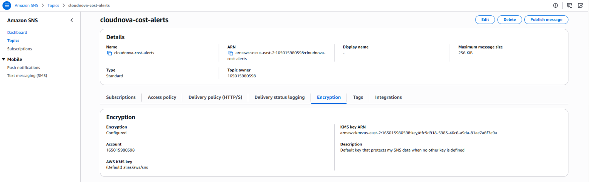

# Demo 22b — Cost Governance: Notify-Only Automation + Static Analysis

---

## Overview

22a gave the persistent build a durable state backend, split into two
independent state files — `platform/terraform.tfstate` (created once,
never torn down) and `workloads/terraform.tfstate` (torn down and
re-applied every session). This demo is the first one to actually
write real resources into that backend, and everything it builds
belongs in `platform/`: cost governance is meant to protect every
future session, not get destroyed and recreated alongside the VPC and
EKS cluster that `workloads/` will hold from 22d onward.

Everything this demo builds is about catching a cost problem *after*
it happens (detection), not preventing it from happening at all
(prevention). That distinction matters and gets stated explicitly, not
left implied.

**Real-world scenario — CloudNova:**
Once 22d stands up the EKS cluster, the environment starts accruing a
flat, continuous fee whether or not you remember to tear it down at
the end of a session. Leadership's only real ask before compute goes
live: know quickly if a session runs long or spend crosses a
threshold — don't find out from the bill. That's a detection
requirement, not an auto-remediation one — nobody asked for
infrastructure that can delete itself, and this project doesn't build
that even though it was considered.

**What this demo builds:**

```
┌─────────────────────────────────────────────────────────────────────────┐
│  PART A — EventBridge + SNS: session-length notify                     │
│  Scheduled rule checks tagged resources → SNS notification only        │
├─────────────────────────────────────────────────────────────────────────┤
│  PART B — AWS Budgets: two-threshold spend alarm                       │
│  50% early warning, 80% escalated notification                         │
├─────────────────────────────────────────────────────────────────────────┤
│  PART C — Static analysis: tflint + checkov, local and interim         │
│  Runs before every real apply from this demo onward                    │
├─────────────────────────────────────────────────────────────────────────┤
│  PART D — Hardening: customer-managed key + rate-limited notify        │
│  A Lambda gate with an SSM cooldown replaces the direct SNS target     │
└─────────────────────────────────────────────────────────────────────────┘
```

**What this demo covers:**
- Detection versus prevention as a real, distinct design choice — not
  just a caveat, an explicit trade-off with a stated reason
- `aws_cloudwatch_event_rule` on a schedule expression, paired with an
  SNS target — publish/subscribe mechanics applied to infrastructure
  monitoring instead of application events
- `aws_sns_topic_policy` as a standalone resource-based policy, which
  is a different shape from the inline `policy` argument Demo 06 used
- Encrypting an SNS topic at rest — first with the free AWS managed KMS
  key, then why EventBridge delivery needs a customer-managed key
  instead (ADR-025)
- `aws_budgets_budget` with multiple notification thresholds
- Why this project deliberately does **not** pair either mechanism
  with an auto-remediation Lambda
- `tflint` and `checkov` as CLI tools that run *outside* Terraform
  entirely — not Terraform resources, not provisioners — what each one
  checks, how to read its output, and the real configuration each one
  requires to actually run
- A notify-only Lambda gate: an SSM Parameter Store cooldown that caps
  a sustained breach to one email per 3 hours instead of one per hour
  (ADR-025), and proving it with real invocations
- `aws_kms_key`, `aws_lambda_function` + `archive_file`,
  `aws_lambda_permission`, and `ignore_changes` on a parameter that a
  running program rewrites
- Writing into 22a's `platform/` state as the second config to use it,
  and what that state boundary does and doesn't protect

**What this demo does NOT cover:**
- Exercising the idle-check against real, tagged workload resources —
  those don't exist until 22d. Part D builds the check and its
  cooldown and proves the notification path with a simulated breach;
  the real-resource path is first exercised at 22d.
- Pipeline-integrated scanning (Demo 32) or Policy as Code (Demo 33) —
  this demo's `tflint`/`checkov` run is local and interim.

---

## How This Demo's Pieces Fit Together

**The AWS solution being built:** a scheduled EventBridge rule that
checks tagged Phase 3+ resources against a session-length threshold and
publishes to an SNS topic if exceeded; a two-threshold AWS Budgets
alarm watching total account spend; and a local `tflint`/`checkov`
workflow that isn't AWS infrastructure at all, but governs every real
apply from here forward.

**Why three unrelated-looking mechanisms sit in one demo:** all three
answer the same underlying question — how to know if something's gone
wrong with cost or configuration before it becomes expensive or
dangerous — from three different angles (idle-time detection,
spend-threshold detection, and pre-apply configuration review). None
of the three requires compute to exist first, which is why this demo
runs before 22d's cluster, not after. None of them touches
`retail-store-sample-app` at all.

**The two AWS-side mechanisms are independent of each other.** The
Budgets alarm in Part B emails your address directly; it does not route
through the SNS topic Part A builds (the plan output in Part B shows
`subscriber_sns_topic_arns = []`). Two separate detection paths, one
shared email address.

**Parts A–C build the direct path; Part D replaces it.** Part A wires
the hourly rule straight to the SNS topic, exactly as first designed.
That build applies cleanly and passes static analysis, yet has two
problems ADR-025 records: EventBridge can't publish to a topic
encrypted with the AWS managed key, and an over-threshold session
would email hourly for as long as it ran. Part D fixes both — a
customer-managed key, and a small Lambda between the rule and the topic
that rate-limits notifications using an SSM Parameter Store cooldown.

**Where the state lives, and what that boundary actually protects.**
This demo writes into `src/platform/` — the same directory and the
same `platform/terraform.tfstate` key 22a's `backend.tf` already
points at. It adds no backend of its own; it reuses the file 22a
created, unchanged. 22c (ECR/ACM re-creation) and Demo 24 (IAM
identity) will later add their own files into this same directory and
state. **This is deliberately not the same state `workloads/` uses.**
22d's VPC and EKS cluster live in `workloads/terraform.tfstate`, a
separate key in the same bucket — a `terraform destroy` run inside
`src/workloads/` structurally cannot reach anything this demo builds,
and a destroy run inside `src/platform/` structurally cannot reach the
VPC or cluster. What a `platform/` destroy *can* reach is every other
resource sharing that same state — this demo's own resources, plus
whatever 22c and Demo 24 add later. That's exactly why this demo's
Cleanup is a verification step, not a teardown.

**Why this demo has no Cleanup that tears anything down:** these are
free or near-free governance resources meant to protect every session
from here forward, not artifacts of a single teaching rep. Destroying
and recreating them every session would defeat their purpose for no
cost benefit — the same reasoning 22a used for the state bucket
itself.

---

## Prerequisites

### Knowledge
- 22a completed — the persistent, platform/workloads-split S3 backend
  this demo's state is written into
- Demo 03 completed — SNS topic → subscription mechanics
- Demo 06 completed — `aws_sns_topic` and the `jsonencode()` policy
  pattern this demo's topic policy reuses
- Demo 07 completed — `aws_ssm_parameter`, reused for the Part D
  cooldown
- Demo 08 completed — `data.aws_caller_identity`, reused in Part D
- Demo 12 completed — `lifecycle { ignore_changes }`, used in Part D
- No prior Lambda experience is assumed — the function is about sixty
  lines and is read in full

### Required Tools

| Tool | Minimum version | Verify |
|---|---|---|
| Terraform CLI | `~> 1.15.0` | `terraform version` |
| AWS CLI | `>= 2.x` | `aws --version --region us-east-2` |
| `tflint` | `>= 0.46.0` — ⚠️ [VERIFY: the exact minimum required by the pinned `0.48.0` ruleset release hasn't been independently re-confirmed against that release's own changelog; check before treating this floor as final. The verified run below used `0.64.0`] | `tflint --version` |
| `checkov` | Latest stable | `checkov --version` |

### Verify AWS Account and Permissions

**Step 1 — Confirm your profile works:**

```bash
aws sts get-caller-identity --profile default --region us-east-2
```

**Step 2 — A cheap, harmless dry-run of this demo's actual service:**

```bash
aws budgets describe-budgets --account-id <YOUR_ACCOUNT_ID> --profile default --region us-east-2
# Expected: JSON with Budgets array (may be empty)
```

**Step 3 — Verify IAM permissions in Console:**

```
Console → IAM → Users → <your user> → Permissions tab
  → Confirm access to EventBridge, Budgets, and SNS (or an equivalent
    broad policy) is attached ✅
```

> 📷 [Screenshot placeholder: AWS Console → IAM → Users → your user →
> Permissions tab, showing the attached EventBridge/Budgets/SNS policies]

**Required permissions beyond what prior demos established:**

```
events:PutRule, events:PutTargets, events:DescribeRule, events:DeleteRule
events:ListTargetsByRule                       # Cleanup CLI verification
budgets:CreateBudget, budgets:DescribeBudget, budgets:ModifyBudget, budgets:DeleteBudget
budgets:ViewBudget                             # Cleanup CLI verification
sns:CreateTopic, sns:Subscribe, sns:Publish, sns:SetTopicAttributes
sns:GetTopicAttributes, sns:ListSubscriptionsByTopic   # Cleanup CLI verification
kms:DescribeKey, kms:GetKeyPolicy              # for the AWS managed KMS key used in Part A
cloudwatch:GetMetricStatistics                 # Cleanup delivery check
logs:CreateLogGroup, logs:PutRetentionPolicy, logs:DescribeLogGroups, logs:FilterLogEvents   # Part D log group, Cleanup log check
kms:CreateKey, kms:CreateAlias, kms:EnableKeyRotation, kms:PutKeyPolicy, kms:ScheduleKeyDeletion   # Part D key
lambda:CreateFunction, lambda:InvokeFunction, lambda:AddPermission, lambda:GetFunction   # Part D function
iam:CreateRole, iam:PutRolePolicy, iam:PassRole, iam:DeleteRolePolicy, iam:DeleteRole   # Part D function role
ssm:PutParameter, ssm:GetParameter, ssm:DeleteParameter   # Part D cooldown
```

### Versions used in this demo

| Tool | Version |
|---|---|
| Terraform | `~> 1.15.0` |
| AWS Provider | `~> 6.47.0` (resolved to `6.47.0` at `terraform init`) |
| Archive Provider | `~> 2.7` — added in Part D to zip the Lambda source ⚠️ [VERIFY — confirm the current release line on the registry before pinning] |
| Lambda runtime | `python3.12` — Part D ⚠️ [VERIFY — confirm it is still a supported runtime when you build] |
| AWS CLI | `>= 2.x` |
| `tflint` | `0.64.0`, with the bundled `terraform` ruleset `0.15.0` — the version the verified run used |
| `tflint-ruleset-aws` | `0.48.0` — pinned in `.tflint.hcl`; current release as of this writing; check the plugin's own GitHub releases page for anything newer before setup |
| `checkov` | `3.3.19` — the version the verified run used (a newer patch was available at the time; not pinned by this demo) |

> **Versions pinned as of September 2026.** The Terraform and AWS
> Provider pins come from `Solution-Architecture.md`, not from this
> demo — they are the project-wide versions every demo in the series
> uses. The `tflint-ruleset-aws` plugin **is** pinned in this demo
> (Part C), and `version` is not optional once `source` is set:
> omitting it makes `tflint --init` fail outright. `tflint` and
> `checkov` themselves are CLI installs, not Terraform dependencies —
> the versions listed are what the verified run used, not a pin;
> install whatever is current stable when you set this up.

---

## Demo Objectives

By the end of this demo you will be able to:

1. ✅ Explain the difference between detection and prevention as cost
   controls, and why this project deliberately chose detection-only
2. ✅ Write an `aws_cloudwatch_event_rule` on a schedule, targeting an
   SNS topic
3. ✅ Write a standalone `aws_sns_topic_policy` that grants an AWS
   service permission to publish, scoped to one specific source ARN
4. ✅ Encrypt an SNS topic at rest, explain why the AWS managed key is
   free but can't receive EventBridge deliveries, and replace it with
   a customer-managed key
5. ✅ Write an `aws_budgets_budget` with two independent notification
   thresholds
6. ✅ Explain why `tflint` and `checkov` aren't Terraform resources or
   provisioners, configure both correctly, read their output, and know
   where they actually run in the workflow
7. ✅ Explain why an auto-remediation Lambda was considered and
   rejected for this specific project
8. ✅ Explain what a shared `platform/` state does and doesn't
   protect, and why that's different from being shared with
   `workloads/`
9. ✅ Rate-limit a notification with a Lambda gate and an SSM
   Parameter Store cooldown, and prove it with real invocations

---

## Cost & Free Tier

| Resource | Free tier | Cost | Notes |
|---|---|---|---|
| EventBridge scheduled rule (`aws_cloudwatch_event_rule`) | Rule evaluation and same-account delivery to an SNS target carry no publishing charge — confirmed against AWS's own EventBridge pricing page. The commonly-cited "14M/month free" figure belongs to EventBridge **Scheduler**, a separate, newer service from the classic scheduled rule this demo actually uses | **$0.00** | One rule, checked hourly — the classic rule/target pattern used here has no per-invocation fee to begin with |
| SNS topic + email subscription | 1,000 email notifications/month free | **$0.00** | Notify-only traffic is tiny at lab scale |
| AWS managed KMS key (`alias/aws/sns`) — Parts A–C | Storage of an AWS managed key is always free; only API requests against it are billed, with 20,000 free requests/month | **$0.00 in practice** | A lab-scale topic with a handful of publishes/month stays far inside the free API-request allowance. This is different from a *customer managed* KMS key, which costs $1/month flat regardless of use — this demo deliberately uses the AWS managed key, not a customer managed one |
| AWS Budgets | Budgets with no `action` block attached are unlimited and free, permanently — confirmed against AWS's own Budgets pricing. (Action-enabled budgets get a separate, smaller free allowance; this project uses neither an `action` block nor needs that allowance) | **$0.00** | Notification-only — no `action` block anywhere in this demo |
| `tflint` / `checkov` | Open-source, local CLI | **$0.00** | No AWS resource at all — runs on your machine |
| Customer-managed KMS key — Part D | Key requests: 20,000 free/month | **~$1.00/month flat** | Charged whether or not it's used, and not session-gated — same treatment as the Route53 hosted zone. Replaces the AWS managed key from Part D onward (ADR-025) |
| Lambda gate, SSM parameters, CloudWatch Logs — Part D | Lambda: 1M requests/month free; SSM standard parameters free; the hourly run is about 720 invocations/month | **$0.00** | Log volume is one short line per run |
| **Session total** | | **$0.00 per session; ~$1.00/month standing after Part D** | Created once, left standing — see Cleanup |

---

## Directory Structure

```
22b-cost-governance/
├── README.md
├── 22b-cost-governance-anki.csv
├── 22b-cost-governance-quiz.md
└── src/
    ├── platform/                        # 22a's own directory — created once, never torn down
    │   ├── 01-backend.tf                # 22a's file, unchanged — key platform/terraform.tfstate
    │   ├── 02-versions.tf               # terraform block + provider version constraints
    │   ├── 03-provider.tf               # AWS provider: region, profile, default_tags
    │   ├── 04-variables.tf              # identity, notification email, budget limit
    │   ├── 05-locals.tf                 # common_tags (incl. Tier = platform) consumed by default_tags
    │   ├── 06-cost-governance.tf        # EventBridge rule + SNS topic/target/policy
    │   ├── 07-budgets.tf                # aws_budgets_budget, two thresholds
        │   ├── 08-outputs.tf                # topic ARN and budget name (+ Part D outputs)
    │   ├── 09-notify-gate.tf            # Part D — customer-managed key, Lambda gate, cooldown parameter
    │   ├── lambda/
    │   │   ├── session_check.py         # Part D — the notification gate
    │   │   └── session_check.zip        # generated by archive_file — gitignore it
    │   ├── terraform.tfvars.example     # committed template — real tfvars stays local
    │   ├── .terraform.lock.hcl          # generated by terraform init — commit it
    │   ├── .tflint.hcl                  # tflint ruleset config — not a .tf file
    │   └── .checkov.yaml                # checkov config — not a .tf file
    └── break-fix/
        └── broken.tf
```

> **Reuse note — `01-backend.tf`:** identical in content to the file
> 22a already created in `src/platform/`. If you're working in the
> same checkout you already have it — this demo lists it again so it
> can be run and verified independently. Its number doesn't change:
> 22a introduced it first, so it stays `01-`, and this demo's own new
> files continue the platform directory's numbering from `02-` onward
> rather than restarting at `01-`. `02-versions.tf` and
> `03-provider.tf` are new here (22a's bootstrap config has its own
> separate, differently-numbered versions/provider files; the
> `platform/` and `workloads/` configs get theirs from whichever demo
> first writes real resources into them — for `platform/`, that's this
> demo).

> **Why `.tflint.hcl` and `.checkov.yaml` live in the same directory
> but aren't numbered `.tf` files:** neither tool is a Terraform
> provider or resource — they're external CLI programs that read your
> `.tf` files directly from disk and report on them. Their config files
> configure the *tool*, not any AWS infrastructure.

> **Why `terraform.tfvars` itself isn't listed:** both variables this
> demo introduces (`notification_email`, `monthly_budget_limit`) are
> genuinely personal. The committed file is the `.example` template;
> your real `terraform.tfvars` stays local and gitignored, matching
> the repository convention `Solution-Architecture.md` sets.

---

## Recall Check — 22a (State Backend Bootstrap)

Answer from memory before reading further:

1. Why can't a Terraform backend's own storage be created by the
   configuration that uses it as a backend?
2. Can a `backend` block ever reference a variable, local, or output
   value, in any Terraform version?
3. Why isn't this backend torn down between sessions like most Phase
   3+ resources?

<details>
<summary>Answers</summary>

1. Chicken-and-egg problem — `terraform init` needs a working backend
   before Terraform can manage any resource, including one meant to
   create that same backend. Requires a separate bootstrap config.
2. No, never — a `backend` block is resolved before Terraform has an
   evaluation context for variables, locals, or outputs. Every
   argument must be a literal value.
3. Destroying and recreating it every session would destroy the state
   history it exists to preserve, defeating its purpose. Only
   cost-accruing compute/networking resources follow the
   every-session teardown default.

</details>

---

## Concepts

### What's New in This Demo

| Construct | Type | Purpose in this demo |
|---|---|---|
| `aws_cloudwatch_event_rule` | Resource | Scheduled rule — fires on a cron-like interval |
| `schedule_expression` | Resource argument | Rate or cron expression controlling how often the rule fires |
| `aws_cloudwatch_event_target` | Resource | Connects the rule to what it notifies — the SNS topic here |
| `aws_sns_topic_subscription` (email protocol) | Resource | Subscribes a real email address to receive the notification |
| `aws_sns_topic_policy` | Resource | Standalone resource-based policy — a different shape from Demo 06's inline `policy` argument |
| `kms_master_key_id` on `aws_sns_topic` | Resource argument | Enables encryption at rest; `"alias/aws/sns"` selects the free, AWS managed key |
| `aws_budgets_budget` | Resource | Account-level spend tracking with configurable notification thresholds |
| `notification` block (nested, repeatable) | Resource sub-block | One per threshold — this demo uses two, at 50% and 80% |
| `backend "s3"` block (consuming, not creating) | `terraform` block setting | Points this config at 22a's already-bootstrapped `platform/` key |
| `tflint` | External CLI tool, not a Terraform construct | Linter — flags likely errors and best-practice violations in `.tf` files, including provider-specific ones `validate` can't see |
| `checkov` | External CLI tool, not a Terraform construct | Security/compliance scanner — evaluates `.tf` files against a library of built-in policy checks (`CKV_*`) |
| `.tflint.hcl` / `.checkov.yaml` | Tool config files | Configure the two tools — not Terraform, not AWS infrastructure |
| `aws_kms_key` / `aws_kms_alias` | Resource | Customer-managed key for the topic (Part D) |
| `aws_lambda_function` + `data.archive_file` | Resource + data source | The notification gate, zipped from local source (Part D) |
| `aws_lambda_permission` | Resource | Lets EventBridge invoke the function, scoped to one rule ARN |
| `lifecycle { ignore_changes }` on `aws_ssm_parameter` | Meta-argument | Stops Terraform resetting a value the Lambda rewrites |

**Related constructs worth knowing (not used in full here):**

| Construct | What it is | Where it's covered |
|---|---|---|
| `event_pattern` | Event-driven rule matching, the alternative to `schedule_expression` | Not used in this series yet |
| `aws_scheduler_schedule` | EventBridge **Scheduler** — a separate, newer service from the classic rule used here | Not used in this series |
| Customer managed KMS key (`aws_kms_key`) | A key you create and pay $1/month for, versus the free AWS managed key used here | Not used in this series yet |
| Budgets Actions (`action` block) | Auto-remediation attached to a budget | Deliberately not used — see the detection/prevention section below |
| Inline suppression comments (`# tflint-ignore:`, `#checkov:skip=`) | Per-resource opt-outs for a single finding, kept next to the code they excuse | Introduced in the tool sections below; not exercised in the lab |
| Policy as Code (Sentinel/OPA) | Enforced, automated policy gates | Demo 33 |
| Pipeline-integrated scanning | `tflint`/`checkov` as a real CI stage, plus image scanning | Demo 32 (formalized), Demo 34 (extended) |

---

### Detailed Explanation of New Constructs

#### Detection vs. Prevention — A Real Design Choice, Not a Caveat

Every mechanism in this demo is a detection control. None of them stop
spend from happening — they tell you about it, at various speeds and
via various signals, after the fact:

```
┌────────────────────────────────────────────────────────────────────┐
│  DETECTION (what this demo builds)                                 │
│  - EventBridge notify: fast, proactive, checks a specific idle-time │
│    condition this project defined                                   │
│  - Budgets alarm: slower (spend-based, lags actual usage), but      │
│    checks the thing that actually matters — total dollars           │
│  Both: tell you something happened. Neither stops it from happening.│
├────────────────────────────────────────────────────────────────────┤
│  PREVENTION (deliberately NOT built here)                           │
│  - A Lambda paired with the EventBridge rule that force-destroys    │
│    tagged resources once the idle threshold is crossed              │
│  - Considered, explicitly rejected                                   │
└────────────────────────────────────────────────────────────────────┘
```

> Part D adds a Lambda too, but it only decides *whether to notify*. It
> has no permission to destroy or modify anything except its own two
> SSM parameters — this is not the auto-remediation Lambda that was
> rejected.

**Why prevention was rejected here, specifically:** this is a
single-learner lab, not shared production infrastructure. An
auto-remediation Lambda that misfires — a false-positive idle
detection destroying real work-in-progress mid-session — is a worse
failure mode than the cost risk it would solve. A notification gets
most of the practical benefit (you find out quickly, before the
Budgets alarm's slower spend-based signal would catch it) without that
downside. This isn't a universal rule for all AWS environments — a
shared team environment with strict cost SLAs might reasonably make
the opposite trade-off. It's the right call for *this* project's
actual shape (one learner, real work sessions, thin cost margin).

---

#### `aws_cloudwatch_event_rule` and `aws_cloudwatch_event_target`

| Argument | Required | Description |
|---|---|---|
| `schedule_expression` | Yes (or `event_pattern`, not used here) | `rate(1 hour)` or a `cron(...)` expression — this demo checks hourly |
| `state` | No (default: `"ENABLED"`) | `ENABLED`/`DISABLED` — whether the rule is actively firing |

`aws_cloudwatch_event_target` connects a rule to what happens when it
fires — in this demo, publishing to the SNS topic that then emails
you. The rule and target are two separate resources because a single
rule can fan out to multiple targets; this demo only needs one.

> **On `state` versus `is_enabled`:** older examples you'll find online
> set `is_enabled = true` on this resource. That argument is deprecated
> in favour of `state`, which takes a string rather than a boolean and
> can express more than two conditions. Use `state`; don't copy
> `is_enabled` forward from an older sample.
>
> **✅ Verified against a live run:** `terraform plan` against this
> demo's own configuration reports `state = "ENABLED"` as the argument
> the provider actually returns.

---

#### `aws_sns_topic_policy` — A Different Shape from Demo 06's Inline Policy

Demo 06 set an SNS access policy using the `policy` argument *inside*
the `aws_sns_topic` resource itself. This demo uses
`aws_sns_topic_policy`, a separate resource that attaches a policy to
a topic by ARN. Both produce a resource-based policy on the topic; the
standalone resource is the shape to reach for when the policy needs to
reference something (here, the EventBridge rule's ARN) that doesn't
exist yet at the point the topic is declared.

> **✅ Visible in the plan:** the recorded `terraform plan` reports
> `policy = (known after apply)` for `aws_sns_topic_policy.allow_eventbridge`
> — the policy document embeds the rule's ARN, which AWS doesn't assign
> until the rule exists. That dependency is also why the apply creates
> the rule and topic first, and the policy, subscription and target
> afterwards.

The `jsonencode()` + `Principal` + `Condition` composition inside it is
the same pattern Demo 06 taught — what's new is the resource wrapper
around it, and the `Service` principal form rather than an account ARN.

> **What the `Condition` block is actually doing:** `Principal =
> { Service = "events.amazonaws.com" }` on its own would trust *any*
> EventBridge rule in the account. The `ArnEquals` condition on
> `aws:SourceArn` narrows that to this one specific rule. Dropping the
> condition wouldn't produce an error — it would silently widen the
> policy. ⚠️ [VERIFY — whether `checkov` flags a missing `aws:SourceArn`
> condition wasn't tested; the recorded run passed `CKV_AWS_169` and
> `CKV_AWS_385` with the condition present, and a `Service` principal
> may satisfy both checks with or without it.]

---

#### Encrypting the SNS Topic — Two Keys, One Real Constraint

Running `checkov` against this demo's `aws_sns_topic` (Part C)
surfaces a genuine, applicable check: `CKV_AWS_26`, "Ensure all data
stored in the SNS topic is encrypted." This is real and cheap to fix,
so it's fixed directly rather than skipped. ⚠️ [VERIFY — the recorded
`checkov` run was taken after the fix and shows `CKV_AWS_26` as
`PASSED`; the failing result on an unencrypted topic wasn't captured.
Remove `kms_master_key_id`, re-run `checkov -d .`, and confirm the
failure before relying on this description.]

```hcl
resource "aws_sns_topic" "cost_alerts" {
  name              = "cloudnova-cost-alerts"
  kms_master_key_id = "alias/aws/sns" # AWS managed key — no monthly fee
}
```

`"alias/aws/sns"` is the AWS managed KMS key AWS creates automatically
the first time an SNS topic in the account requests it. Storage of an
AWS managed key is always free; only the API calls made against it are
billed, and those come with 20,000 free requests/month — far more than
a low-volume cost-alerts topic will ever use. A *customer managed* KMS
key (`aws_kms_key`), by contrast, costs a flat $1/month whether or not
it's ever used. Parts A–C use the AWS managed key because it is free and satisfies `CKV_AWS_26`; Part D replaces it (see the note below and ADR-025).

> **Resolved in Part D (ADR-025).** AWS's own troubleshooting guidance
> for EventBridge → SNS states that when a topic uses server-side
> encryption it must use a **customer managed** KMS key whose key policy
> lets EventBridge use it; the default AWS managed key can't be
> configured that way. Source:
> [Troubleshoot Amazon SNS EventBridge notification failures](https://repost.aws/knowledge-center/sns-not-getting-eventbridge-notification).
> `terraform apply`, the Console's *Encryption: Configured* view and
> `checkov` all pass with `alias/aws/sns`, because none of them
> exercises delivery — and `CKV_AWS_26` only verifies that *a* key is
> set, not *which* key, so it cannot see this failure at all. A fix
> aimed only at turning `checkov` green would leave delivery broken.
> Part D replaces the key with a customer-managed one (about $1/month).
> Rejected alternative: no encryption plus a `checkov` skip — a real
> control downgrade to save roughly $1/month.
> **Not yet observed in this build:** the failure itself. Parts A–C were
> never run against the delivery check; Cleanup step 3 is the test that
> would show it.


---

#### `aws_budgets_budget` — Two Independent Thresholds

| Argument | Required | Description |
|---|---|---|
| `budget_type` | Yes | `"COST"` — tracks spend, not usage quantity |
| `limit_amount` / `limit_unit` | Yes | Your available AWS credit/budget figure, in `USD`. `limit_amount` is a **string** in the provider schema, not a number |
| `time_unit` | Yes | `"MONTHLY"` — resets each month |
| `notification` (block, repeatable) | Yes, one per threshold | Each defines its own `threshold` percentage and `subscriber_email_addresses` |

This demo's `notification` blocks: one at `threshold = 50` (early
warning), one at `threshold = 80` (escalated notification) — matching
the two-threshold design decided at the project level. Both notify the
same email; a real team setup might route the 80% threshold to a
different, more urgent channel.

---

#### The Notification Gate — Why a Lambda Sits Between the Rule and the Topic

EventBridge can fire a target on a schedule, but it can't decide
*whether* to fire, and it remembers nothing between runs. Rate-limiting
needs something that reads state. ADR-025's design:

```
EventBridge (hourly) ──▶ Lambda "session_check" ──▶ SNS topic ──▶ email
                              │  reads / writes
                              ▼
                     SSM Parameter Store
                     ├─ session-first-seen   when workloads-tier resources were first seen
                     └─ last-notified        when the last email was sent
```

Each hourly run makes one of four decisions:

| Situation | Action |
|---|---|
| No `Tier = workloads` resources exist | Do nothing; reset the session clock |
| They exist, but for less than the threshold (default 4 h) | Do nothing; start the session clock if it isn't running |
| Over the threshold, and no email in the last 3 h (or never) | **Publish**, then record the time |
| Over the threshold, but an email went out under 3 h ago | **Suppress** — do nothing |

Four details that make it correct rather than merely plausible:

- **Publish, then record.** The timestamp is written only after
  `sns.publish` succeeds — a failed publish leaves no cooldown behind, so
  the next run tries again.
- **A missing parameter means "no cooldown."** On the very first run the
  timestamp doesn't exist yet; treating that as an error would mean the
  first alert never fires. The function handles `ParameterNotFound`
  explicitly, and Part D Step 9 tests it live rather than trusting the
  reading.
- **`ignore_changes = [value]` on the cooldown parameter.** Terraform
  creates the parameter with `0`; the Lambda then overwrites it. Without
  `ignore_changes`, every `terraform apply` would reset it to `0` and
  re-arm an immediate email.
- **`aws_lambda_permission` scoped by `source_arn`.** It plays the role
  the SNS topic policy played in Part A: a resource-based policy letting
  one AWS service act on the resource, limited to one specific rule.

`data "archive_file"` zips the local `.py` file at plan time, and
`source_code_hash` makes Terraform redeploy the function whenever the
source changes.

> ⚠️ [VERIFY — the breach *condition* (workloads-tier resources present
> longer than a threshold, measured from when the function first saw
> them) is this demo's design, not something ADR-025 specifies. It uses
> the Resource Groups Tagging API, which reports only taggable,
> supported resource types. It is first exercised against real
> resources at 22d; until then Part D tests the notification path with
> a simulated breach.]

---

#### Static Analysis Tooling — `validate`, `tflint` and `checkov` Ask Different Questions

Terraform's own commands answer two questions: *is this configuration
well-formed* (`terraform validate`) and *what will change* (`terraform
plan`). Neither answers two others that matter before any real apply:
*does this configuration contain a likely mistake or a violation of
good practice*, and *does it create something insecure or
non-compliant*. `tflint` and `checkov` exist to answer those, and both
work on your `.tf` files as text on disk — no state, no apply, no
change to AWS.

| Tool | The question it answers | What it reads | Where it can't help |
|---|---|---|---|
| `terraform validate` | Is this configuration syntactically and structurally valid? | `.tf` files and provider schemas | Provider-side value constraints — e.g. this demo's Break-Fix `"Actual"` passes |
| `terraform plan` | What will Terraform change? | `.tf` files, state, and a refresh against AWS | Says nothing about whether the result is sensible or secure |
| `tflint` | Is there a likely error or best-practice violation? | `.tf` files, through installed rulesets | Only the rules its rulesets contain; no view of live AWS state |
| `checkov` | Does this create something insecure or non-compliant? | `.tf` files, against built-in `CKV_*` policy checks | Only the checks that exist for the resource types present |

Run order from this demo forward: `terraform validate` → `tflint` →
`checkov` → `terraform plan` → `terraform apply`. The first three cost
nothing and touch nothing.

##### `tflint` — a pluggable Terraform linter

**What it is.** An open-source linter (project: `terraform-linters/tflint`)
focused on possible errors and best practices in Terraform code. Its
reason for existing is the gap `validate` and `plan` leave: a value can
be perfectly valid *as Terraform* while being invalid *to the provider*
— the project's own README uses a nonexistent AWS instance type as the
example, which `validate` and `plan` accept and only `apply` rejects.
A linter with provider knowledge catches that class of mistake first.

**How it's organised — rulesets.** `tflint` itself is only the engine;
the rules come from rulesets:

- The **`terraform` ruleset is bundled** with the binary — language-level
  rules (unused declarations, deprecated syntax, and similar). The
  recorded `tflint --version` output shows it as
  `ruleset.terraform (0.15.0-bundled)`. ⚠️ [VERIFY — exact rule names
  and which are on by default aren't listed here; check the ruleset's
  own rules page.]
- The **`aws` ruleset is a plugin** you opt into in `.tflint.hcl`.
  It adds AWS-specific checks. `tflint --init` downloads it — the
  recorded run installed `tflint-ruleset-aws` `0.48.0` from
  `github.com/terraform-linters/tflint-ruleset-aws`.

**How to run it.**

| Command | What it does |
|---|---|
| `tflint --version` | Prints the engine version and the bundled ruleset |
| `tflint --init` | Downloads the plugins named in `.tflint.hcl` — run once per machine/pin change |
| `tflint` | Lints the current directory |

**How to read the result.** A clean run prints **nothing at all** — no
"0 issues" banner. Silence is the pass. When there are findings, each
one is printed with a severity, the rule name, and the file and line.
`tflint` returns a non-zero exit status when it finds issues (a change
made in the project's v0.9 era, so CI can fail on findings) — check
`echo $?` after a run, and ⚠️ [VERIFY — the exact exit-code values
against the README of the version you installed].

**Suppressing one finding.** An inline comment directly above the
offending line: `# tflint-ignore: <rule_name>`. Prefer a comment beside
the code over disabling a rule globally, so the excuse stays visible.

**What it won't do.** It doesn't touch AWS or state, so it can't know
what already exists; and it can only flag what its rules cover. A
silent `tflint` means "no rule objected", not "this is correct".

##### `checkov` — a static security and compliance scanner

**What it is.** An open-source infrastructure-as-code scanner (from
Prisma Cloud; the banner in the recorded run reads *By Prisma Cloud |
version: 3.3.19*). It scans Terraform — and other IaC frameworks such
as CloudFormation and Kubernetes manifests — against a library of
built-in policy checks, each with an ID like `CKV_AWS_26`. Where
`tflint` asks "is this a mistake?", `checkov` asks "is this
misconfigured from a security or compliance standpoint?" — encryption
at rest, public exposure, hard-coded credentials.

**How to run it.**

| Command | What it does |
|---|---|
| `checkov --version` | Prints the installed version |
| `checkov -d .` | Scans every Terraform file in the current directory |

**Its config file is loaded automatically.** `checkov` reads
`.checkov.yaml` from the current directory *before doing anything
else* — including `--version`. The recorded run shows the consequence:
with an empty `.checkov.yaml`, even `checkov --version` failed with a
"config file doesn't appear to contain 'key: value' pairs" error. The
file must be a real YAML mapping (this demo's is `framework:` with
`terraform` under it).

**How to read the result.** A summary line — `Passed checks`, `Failed
checks`, `Skipped checks` — followed by one block per check per
resource: the check ID and description, `PASSED` or `FAILED` for a named
resource, the file and line range, and (for most checks) a guide URL.
Line ranges are worth using: `File: /06-cost-governance.tf:1-4` points
straight at the resource block.

**Reading a clean result honestly.** In this demo, `checkov` evaluated
six resources but produced only four passing checks — all against the
provider block, the SNS topic and the SNS topic policy. It has no
built-in check that applied to the EventBridge rule, target,
subscription or budget. `Failed checks: 0` therefore means "none of the
checks that exist for these resource types failed" — not "nothing here
can be insecure".

**Failing the build and suppressing.** `checkov` returns a non-zero exit
status when checks fail (there is a soft-fail option to override that,
listed in its `--help`). To excuse one finding, either put a comment
inside the resource — `#checkov:skip=CKV_AWS_XX:<reason>` — or list the
ID under `skip-check` in `.checkov.yaml`. Both leave a written reason
beside the code, which is the point.

**How the two tools complement each other.** Different rules, different
questions, no overlap worth optimising: `tflint` protects correctness
and hygiene, `checkov` protects security posture. This demo runs both
locally by hand; Demo 32 moves them into a pipeline stage and Demo 34
adds container-image scanning to the same progression.

---

#### Writing Into a Shared `platform/` State — What the Boundary Does and Doesn't Protect

22a's platform/workloads split means a `terraform destroy` run inside
`src/workloads/` can never reach anything this demo builds, and one
run inside `src/platform/` can never reach the VPC or EKS cluster.
That's a real, structural guarantee — not a convention someone has to
remember.

What it does **not** give you is isolation *within* `platform/`
itself. 22c and Demo 24 will add their own files into this same
directory and state. From that point forward, a `terraform destroy`
run in `src/platform/` reaches this demo's resources *and* theirs — a
different kind of shared blast radius than the one the platform/
workloads split solves. This is exactly why this demo, and every other
`platform/`-tier demo, ends with a verification step instead of a
teardown: the state is shared within the tier by design, since
everything in it is meant to be created once and left standing
together.

---

## Lab Step-by-Step Guide

---

## Part A — EventBridge + SNS Notify

Part A builds the EventBridge rule and the SNS topic that notifies you
if a Phase 3+ session runs long, along with the foundation files the
rest of this demo's configuration sits on.

### Step 1 — Navigate to the project config

```bash
cd "terraform-aws-mastery/Phase 3 - Real AWS Infrastructure/22b-cost-governance/src/platform"
```

The quotes matter — the phase folder name contains spaces.

### Step 2 — Create the foundation files

This step establishes the version pins, provider configuration,
backend wiring and baseline inputs this demo's resources depend on.
None of these files create AWS infrastructure on their own.

---

#### `01-backend.tf` — Already present, from 22a

This file already exists in `src/platform/`, created by 22a — nothing
to do here except confirm it's there before moving on. It's what makes
this demo the first config to actually write real resources into the
persistent backend 22a created. Every argument in it is a literal —
backend blocks are resolved before Terraform has variables or locals
available, which is the point Recall Check question 2 covers. Shown
here for reference (see the reuse note in Directory Structure above):

**01-backend.tf:**

```hcl
terraform {
  backend "s3" {
    bucket = "<YOUR_22A_STATE_BUCKET_NAME>"
    # ↑ output from 22a, pasted in as a literal string — a backend
    # block cannot reference var.*/local.*/module outputs, at any
    # Terraform version.

    key    = "platform/terraform.tfstate"
    # ↑ everything created once and left standing — this demo's
    # governance resources, plus ECR/ACM (22c) and IAM identity
    # (Demo 24) once built. The workloads config uses a different key
    # in the same bucket, and is never reachable from here.

    region  = "us-east-2"
    profile = "default"
    encrypt = true

    use_lockfile = true
  }
}
```

> ⚠️ **Warning**
>
> Replace `<YOUR_22A_STATE_BUCKET_NAME>` with the bucket 22a actually
> created — don't guess at it. `terraform init` fails immediately and
> harmlessly if the name is wrong, which is the cheapest possible way
> to find out.

---

#### `02-versions.tf` — Terraform and provider version pins

**02-versions.tf:**

```hcl
terraform {
  required_version = "~> 1.15.0"

  required_providers {
    aws = {
      source  = "hashicorp/aws"
      version = "~> 6.47.0"
    }
  }
}
```

---

#### `03-provider.tf` — AWS provider configuration

**03-provider.tf:**

```hcl
provider "aws" {
  region  = var.aws_region
  profile = var.aws_profile

  default_tags {
    tags = local.common_tags
  }
}
```

---

#### `04-variables.tf` — Identity and notification inputs

This file declares the project identity values that feed tagging, plus
the one input every notification in this demo depends on: the real
email address that receives both the session-length and budget alerts.
`notification_email` deliberately has no default, since a real email
address shouldn't be hardcoded into a file that might get committed.

**Only declare `notification_email` here for now** — `monthly_budget_limit`
belongs to Part B, and is added to this same file in Step 1 of Part B,
once the budget resource that actually needs it exists. Declaring a
variable before anything uses it is harmless, but setting a *value*
for a variable that isn't declared yet produces a real, visible
warning — Step 3's tfvars file is deliberately scoped to avoid that.

**04-variables.tf:**

```hcl
# ── Provider configuration ─────────────────────────────────────────────────

variable "aws_region" {
  type        = string
  description = "AWS region for all resources"
  default     = "us-east-2"
}

variable "aws_profile" {
  type        = string
  description = "AWS CLI named profile for authentication"
  default     = "default"
}

# ── Project identity ───────────────────────────────────────────────────────

variable "project" {
  type        = string
  description = "Project name — used in resource names and tags"
  default     = "cloudnova"
}

variable "environment" {
  type        = string
  description = "Deployment environment"
  default     = "dev"
  nullable    = false
}

variable "demo" {
  type        = string
  description = "Demo identifier — used in tags for traceability"
  default     = "22b-cost-governance"
}

# ── Notification ───────────────────────────────────────────────────────────

variable "notification_email" {
  type        = string
  description = "Email address to receive cost and budget notifications"
  # No default — set this in terraform.tfvars, don't hardcode a real
  # email into a file that might get committed
}
```

---

#### `05-locals.tf` — The tag set every resource inherits

These tags are what the session-length check is eventually meant to
filter on, so they aren't decoration — they're the mechanism by which
a Phase 3+ resource becomes visible to this demo's detection logic.
`Tier = "platform"` is the tag that later distinguishes this demo's
resources (and 22c's, and Demo 24's) from anything in `workloads/`.

**05-locals.tf:**

```hcl
locals {
  common_tags = {
    Project     = var.project
    Environment = var.environment
    Demo        = var.demo
    ManagedBy   = "Terraform"
    Tier        = "platform"
  }
}
```

### Step 3 — Create the tfvars template

This step creates the committed template with only the one variable
declared so far. Copy it to `terraform.tfvars` and fill in your real
email; leave that copy gitignored.

**terraform.tfvars.example:**

```hcl
notification_email = "you@example.com"
```

```bash
cp terraform.tfvars.example terraform.tfvars
# then edit terraform.tfvars and set your real email address
```

### Step 4 — Create the SNS topic, subscription, schedule and policy

This step creates the SNS topic, its email subscription, the scheduled
EventBridge rule, its target, and the resource policy that lets
EventBridge actually publish to the topic — five new resources, none
of which exist yet. The topic is also encrypted at rest using the
free, AWS managed KMS key — see Concepts above for why, and for the constraint Part D resolves.

**06-cost-governance.tf:**

```hcl
resource "aws_sns_topic" "cost_alerts" {
  name              = "cloudnova-cost-alerts"
  kms_master_key_id = "alias/aws/sns" # AWS managed key — no monthly fee
}

resource "aws_sns_topic_subscription" "cost_alerts_email" {
  topic_arn = aws_sns_topic.cost_alerts.arn
  protocol  = "email"
  endpoint  = var.notification_email
}

resource "aws_cloudwatch_event_rule" "session_length_check" {
  name                = "cloudnova-session-length-check"
  description         = "Checks tagged Phase 3+ resources against a session-length threshold"
  schedule_expression = "rate(1 hour)" # hourly — deliberately low-frequency, see Interview Prep Q2
  state               = "ENABLED"      # not is_enabled — that argument is deprecated
}

resource "aws_cloudwatch_event_target" "notify_sns" {
  rule      = aws_cloudwatch_event_rule.session_length_check.name
  target_id = "cost-alerts-sns"
  arn       = aws_sns_topic.cost_alerts.arn
}

# EventBridge needs explicit permission to publish to this SNS topic —
# this is a resource-based policy on the SNS topic, not an IAM role
resource "aws_sns_topic_policy" "allow_eventbridge" {
  arn = aws_sns_topic.cost_alerts.arn

  policy = jsonencode({
    Version = "2012-10-17"
    Statement = [{
      Sid       = "AllowEventBridgePublish"
      Effect    = "Allow"
      Principal = { Service = "events.amazonaws.com" }
      Action    = "SNS:Publish"
      Resource  = aws_sns_topic.cost_alerts.arn
      Condition = {
        ArnEquals = {
          "aws:SourceArn" = aws_cloudwatch_event_rule.session_length_check.arn
        }
      }
    }]
  })
}
```

> ⚠️ [VERIFY — open item, not a defect in this file] This rule's
> target publishes on a schedule; the actual idle-resource-check
> *logic* it's meant to gate on (which resources, what threshold
> counts as "too long") depends on real, `Tier = "workloads"`-tagged
> resources that don't exist until 22d onward. This demo builds the
> notification *plumbing* and the tag set those resources will carry;
> the specific check condition should be revisited once 22d's actual
> resource tags are applied.
>
> **Both gaps are closed in Part D.** As written, the target has no
> filter and no input transformer, so once delivery works, every hourly
> run publishes the raw scheduled-event message — an email every hour
> (about 720 a month, inside the 1,000 free email notifications). And
> the topic's `alias/aws/sns` key can't receive EventBridge deliveries
> at all (see Concepts). Part D fixes both. ⚠️ [VERIFY — the hourly-email
> consequence is inferred from the resource definition; it was never
> observed, because delivery was never confirmed on this path.]

### Step 5 — Apply and confirm the email subscription

This step creates all five resources above for the first time and
confirms the email subscription is genuinely active, not merely
created. Nothing existing is being modified — this is a first apply
into an empty `platform/` state.

```bash
terraform init
terraform validate
terraform plan
terraform apply
```

> ✅ Verified against a live run (2026-09-29). Output below is
> trimmed, with the account ID and email replaced by placeholders.

`terraform init` — configures the S3 backend and installs the pinned
provider:

```
Initializing provider plugins found in the configuration...
- Finding hashicorp/aws versions matching "~> 6.47.0"...
- Installing hashicorp/aws v6.47.0...
- Installed hashicorp/aws v6.47.0 (signed by HashiCorp)
Initializing the backend...

Successfully configured the backend "s3"! Terraform will automatically
use this backend unless the backend configuration changes.

Terraform has created a lock file .terraform.lock.hcl to record the provider
selections it made above. Include this file in your version control repository
so that Terraform can guarantee to make the same selections by default when
you run "terraform init" in the future.

Terraform has been successfully initialized!
```

`terraform validate`:

```
Success! The configuration is valid.
```

`terraform plan` — excerpt (three of the five resources):

```
  # aws_sns_topic.cost_alerts will be created
  + resource "aws_sns_topic" "cost_alerts" {
      + kms_master_key_id           = "alias/aws/sns"
      + name                        = "cloudnova-cost-alerts"
      + region                      = "us-east-2"
      + tags_all                    = {
          + "Demo"        = "22b-cost-governance"
          + "Environment" = "dev"
          + "ManagedBy"   = "Terraform"
          + "Project"     = "cloudnova"
          + "Tier"        = "platform"
        }
      ...
    }

  # aws_sns_topic_policy.allow_eventbridge will be created
  + resource "aws_sns_topic_policy" "allow_eventbridge" {
      + arn    = (known after apply)
      + policy = (known after apply)
      + region = "us-east-2"
      ...
    }

  # aws_sns_topic_subscription.cost_alerts_email will be created
  + resource "aws_sns_topic_subscription" "cost_alerts_email" {
      + endpoint                        = "you@example.com"
      + endpoint_auto_confirms          = false
      + protocol                        = "email"
      + confirmation_timeout_in_minutes = 1
      ...
    }

Plan: 5 to add, 0 to change, 0 to destroy.
```

`terraform apply`:

```
aws_cloudwatch_event_rule.session_length_check: Creating...
aws_sns_topic.cost_alerts: Creating...
aws_cloudwatch_event_rule.session_length_check: Creation complete after 1s [id=cloudnova-session-length-check]
aws_sns_topic.cost_alerts: Creation complete after 1s [id=arn:aws:sns:us-east-2:<ACCOUNT_ID>:cloudnova-cost-alerts]
aws_sns_topic_policy.allow_eventbridge: Creating...
aws_sns_topic_subscription.cost_alerts_email: Creating...
aws_cloudwatch_event_target.notify_sns: Creating...
aws_cloudwatch_event_target.notify_sns: Creation complete after 0s [id=cloudnova-session-length-check-cost-alerts-sns]
aws_sns_topic_policy.allow_eventbridge: Creation complete after 0s [id=arn:aws:sns:us-east-2:<ACCOUNT_ID>:cloudnova-cost-alerts]
aws_sns_topic_subscription.cost_alerts_email: Creation complete after 0s [id=arn:aws:sns:us-east-2:<ACCOUNT_ID>:cloudnova-cost-alerts:<SUBSCRIPTION_ID>]

Apply complete! Resources: 5 added, 0 changed, 0 destroyed.
```

> **Bolded takeaway:** expect exactly 5 resources here — the topic, its
> subscription, the EventBridge rule, its target, and the topic
> policy.

**What the recorded output shows, beyond the count:**

| Observation | Where it shows | Why it matters |
|---|---|---|
| `tags_all` appears on the topic and the rule only | Plan | `default_tags` from `03-provider.tf` propagates only to resource types that accept tags; the subscription, topic policy and event target don't, so they carry no tags |
| `policy = (known after apply)` on the topic policy | Plan | The policy embeds the rule's ARN, which doesn't exist yet — the reason for the standalone `aws_sns_topic_policy` resource |
| Rule and topic are created first; policy, subscription and target follow | Apply | Terraform's dependency graph, driven by the ARN references — not by file order |
| `endpoint_auto_confirms = false` | Plan | An email subscription can never confirm itself; a person must click the link |
| A `region` argument on every resource | Plan | A per-resource region override added in a recent AWS provider major version — defaults to the provider's own region, not something this demo configures |
| `.terraform.lock.hcl` created | Init | Records the exact provider selection — commit it |

SNS email subscriptions require manual confirmation. Check your inbox
for an "AWS Notification - Subscription Confirmation" email and click
the confirmation link. Until you do, the subscription shows
`PendingConfirmation` in Console and won't receive anything — and
because the pending state lives in AWS rather than in your
configuration, `terraform plan` will keep reporting no changes while
the subscription sits unusable.

**Verify:**

```
Console → SNS → Topics → cloudnova-cost-alerts → Subscriptions
  → Status: Confirmed, Protocol: EMAIL, Endpoint: your address ✅
Console → SNS → Topics → cloudnova-cost-alerts → Encryption
  → Encryption: Configured; AWS KMS key: (Default) alias/aws/sns ✅
```




**What the screenshots show:**
- **Subscriptions tab:** exactly one subscription, protocol `EMAIL`,
  status `Confirmed`. `Confirmed` only appears after the link in the
  email has been clicked — this is the state Terraform can't see.
- **Encryption tab:** the key is labelled `(Default) alias/aws/sns` and
  carries a key ARN inside your own account and region. That's the AWS
  managed key SNS creates on first use, and its Console description
  says as much. It confirms encryption at rest is on — it does **not**
  confirm that EventBridge can deliver to the topic (see Concepts; Part D resolves this).
- **Details header (both):** `Type: Standard`, and the topic ARN ends
  `:cloudnova-cost-alerts` — matching `terraform output` in Part B.

---

## Part B — AWS Budgets Alarm

Part B adds a second, independent detection layer — an AWS Budgets
alarm watching total account spend rather than any single resource's
runtime.

### Step 1 — Add the budget limit variable and its tfvars value

This step adds the one remaining input this demo needs — your own real
budget figure, again with no default since it's genuinely personal to
your account. It's typed `string` because the provider's
`limit_amount` argument is a string, not a number.

Add to **04-variables.tf**:

```hcl
variable "monthly_budget_limit" {
  type        = string
  description = "Your available AWS credit/budget for this project, in USD"
  # No default — this is genuinely personal to your account; set it
  # in terraform.tfvars
}
```

Now that the variable exists, add its value to `terraform.tfvars.example`
(the committed template):

```hcl
notification_email   = "you@example.com"
monthly_budget_limit = "50"
```

**And add the same line to your local `terraform.tfvars`** — that's the
file Terraform actually reads. If you update only the `.example`
template, the next `terraform plan` stops and prompts for
`var.monthly_budget_limit`, because a variable with no default and no
value has nothing to resolve to.

> **Why this is added now, not back in Part A:** a value in
> `terraform.tfvars` for a variable that hasn't been declared yet
> produces a real Terraform warning — "Value for undeclared variable"
> — at every `init`, `validate`, and `plan`. It's harmless to the
> apply itself, but it's a distracting, avoidable warning. Declaring
> the variable and setting its value in the same step keeps the two in
> sync.

### Step 2 — Create the budget resource

This step adds the one budget resource this demo builds, with two
`notification` blocks and no `action` block, since this is deliberately
a notify-only design. This creates one new resource; nothing existing
is modified.

Create a file **07-budgets.tf** and add the below content:

```hcl
resource "aws_budgets_budget" "monthly_cost" {
  name         = "cloudnova-monthly-budget"
  budget_type  = "COST"
  limit_amount = var.monthly_budget_limit
  limit_unit   = "USD"
  time_unit    = "MONTHLY"

  notification {
    comparison_operator        = "GREATER_THAN"
    threshold                  = 50
    threshold_type             = "PERCENTAGE"
    notification_type          = "ACTUAL"
    subscriber_email_addresses = [var.notification_email]
  }

  notification {
    comparison_operator        = "GREATER_THAN"
    threshold                  = 80
    threshold_type             = "PERCENTAGE"
    notification_type          = "ACTUAL"
    subscriber_email_addresses = [var.notification_email]
  }
}
```

### Step 3 — Create outputs

This step exposes the two values worth having on hand after an apply:
the topic ARN, which later demos and any manual publish test need, and
the budget's name for Console lookups.

Create a file **08-outputs.tf** and add the below content:

```hcl
output "cost_alerts_topic_arn" {
  description = "ARN of the cost-alerts SNS topic"
  value       = aws_sns_topic.cost_alerts.arn
}

output "monthly_budget_name" {
  description = "Name of the monthly cost budget"
  value       = aws_budgets_budget.monthly_cost.name
}
```

### Step 4 — Apply

This step applies the budget and outputs on top of Part A's already-
applied resources, and is a good moment to practise checking the
reported resource count against what actually changed — this apply
creates one new resource and modifies nothing else.

```bash
terraform plan
terraform apply
```

> ✅ Verified against a live run (2026-09-29). Output trimmed; account
> ID and email replaced by placeholders.

`terraform plan` — the refresh reads Part A's five resources back from
state, and only the budget is new:

```
aws_cloudwatch_event_rule.session_length_check: Refreshing state... [id=cloudnova-session-length-check]
aws_sns_topic.cost_alerts: Refreshing state... [id=arn:aws:sns:us-east-2:<ACCOUNT_ID>:cloudnova-cost-alerts]
aws_sns_topic_subscription.cost_alerts_email: Refreshing state... [id=arn:aws:sns:us-east-2:<ACCOUNT_ID>:cloudnova-cost-alerts:<SUBSCRIPTION_ID>]
aws_sns_topic_policy.allow_eventbridge: Refreshing state... [id=arn:aws:sns:us-east-2:<ACCOUNT_ID>:cloudnova-cost-alerts]
aws_cloudwatch_event_target.notify_sns: Refreshing state... [id=cloudnova-session-length-check-cost-alerts-sns]

  # aws_budgets_budget.monthly_cost will be created
  + resource "aws_budgets_budget" "monthly_cost" {
      + budget_type       = "COST"
      + limit_amount      = "50"
      + limit_unit        = "USD"
      + name              = "cloudnova-monthly-budget"
      + time_period_end   = "2087-06-15_00:00"
      + time_period_start = (known after apply)
      + time_unit         = "MONTHLY"
      + cost_filter (known after apply)
      + cost_types (known after apply)
      + notification {
          + comparison_operator        = "GREATER_THAN"
          + notification_type          = "ACTUAL"
          + subscriber_email_addresses = ["you@example.com"]
          + subscriber_sns_topic_arns  = []
          + threshold                  = 50
          + threshold_type             = "PERCENTAGE"
        }
      + notification {
          ...
          + threshold                  = 80
          + threshold_type             = "PERCENTAGE"
        }
      ...
    }

Plan: 1 to add, 0 to change, 0 to destroy.

Changes to Outputs:
  + cost_alerts_topic_arn = "arn:aws:sns:us-east-2:<ACCOUNT_ID>:cloudnova-cost-alerts"
  + monthly_budget_name   = "cloudnova-monthly-budget"
```

`terraform apply`:

```
aws_budgets_budget.monthly_cost: Creating...
aws_budgets_budget.monthly_cost: Creation complete after 6s [id=<ACCOUNT_ID>:cloudnova-monthly-budget]

Apply complete! Resources: 1 added, 0 changed, 0 destroyed.

Outputs:

cost_alerts_topic_arn = "arn:aws:sns:us-east-2:<ACCOUNT_ID>:cloudnova-cost-alerts"
monthly_budget_name = "cloudnova-monthly-budget"
```

> **Bolded takeaway:** this apply adds exactly **one** new resource
> (`aws_budgets_budget.monthly_cost`) — outputs aren't counted, and the
> five resources Part A already applied are untouched, so the correct
> count here is 1, not a restatement of the project's running total. If
> an apply against already-existing state ever reports a much larger
> "added" count than the number of genuinely new resource blocks you
> just wrote, stop and read the plan before confirming — that mismatch
> is exactly the kind of signal worth catching before typing `yes`.

**What the recorded output shows, beyond the count:**

| Observation | Where it shows | Why it matters |
|---|---|---|
| Five `Refreshing state...` lines before the plan | Plan | Part A's resources are read from state, not recreated — this is why the count is 1, not 6 |
| `time_period_end = "2087-06-15_00:00"` although the config never sets it | Plan | The provider's default end date. The Console (below) displays the end date as `-`, i.e. no practical end |
| `time_period_start = (known after apply)` | Plan | AWS assigns the start — the Console shows the first day of the current month |
| `subscriber_sns_topic_arns = []` | Plan | The budget emails your address directly; it does **not** publish to Part A's SNS topic. The two detection paths are independent |
| `limit_amount = "50"` is a quoted string | Plan | The provider schema types it as a string — why the variable is `type = string` |
| `cost_filter` / `cost_types` `(known after apply)` | Plan | Provider-computed defaults, not configured here |
| Budget `id` is `<ACCOUNT_ID>:<budget name>` | Apply | Budgets are identified per account, so the account ID is part of the ID |

**Verify:**

```
Console → Billing and Cost Management → Budgets → cloudnova-monthly-budget
  → Budget amount: $50.00, Period: Monthly ✅
  → Alerts (2): Actual cost > 50% ($25.00) and Actual cost > 80% ($40.00) ✅
  → Threshold status for each: Not exceeded ✅
  → Actions: none (notify-only) ✅
```


**What the screenshot shows:**
- **Alert definitions:** the Console translates each percentage into
  dollars — 50% is `$25.00`, 80% is `$40.00` of the `$50.00` budget.
  Worth reading before you trust a threshold: the percentage in
  Terraform is of *your* `limit_amount`, not of anything AWS-defined.
- **`Actions: -` on both alerts:** confirms there is no `action` block —
  the budget can only notify, never act.
- **Budget health:** `Healthy`, current spend `$0.00` of `$50.00`
  (0.00%), with a small forecast for the month-to-date figure. Both
  thresholds `Not exceeded`.
- **Start date `2026-09-01`, End date `-`:** the start date is the first
  of the current month; the missing end date is the provider's far-future
  default seen in the plan.

`notification_type = "ACTUAL"` alerts on money already spent. AWS
Budgets also supports `"FORECASTED"`, which alerts on a projected
trend before you actually cross the threshold — worth knowing it
exists, even though this demo uses `ACTUAL` for a simpler, more
literal first pass.

---

## Part C — Static Analysis: `tflint` and `checkov`

Part C installs and configures two static-analysis tools that run
outside Terraform entirely, checking configuration quality before any
real apply from here forward. See *Static Analysis Tooling* in
Concepts for what each one checks and how to read its output.

### Step 1 — Install both tools

This step installs both tools for the first time in this series.
Neither is a Terraform construct, so neither requires `terraform init`
or any provider.

```bash
# tflint — download the current release for your platform from
# https://github.com/terraform-linters/tflint/releases, then:
tflint --version

# checkov
pip install checkov --break-system-packages
checkov --version
```

> ✅ Verified against a live run (2026-09-29):

```
$ tflint --version
TFLint version 0.64.0
+ ruleset.terraform (0.15.0-bundled)
```

`checkov --version` prints its version once `.checkov.yaml` is valid
(Step 2). If it errors instead, see the note after that file.

<details>
<summary>Additional flags (reference, not required)</summary>

If your platform doesn't have a package-manager install available,
`tflint`'s releases page publishes a checksums file alongside each
platform archive — `sha256sum --ignore-missing -c checksums.txt` after
downloading both files is a quick way to confirm the archive wasn't
corrupted in transit, before unzipping and installing it to somewhere
on your `PATH` (e.g. `/usr/local/bin`).

</details>

### Step 2 — Add each tool's config file

This step adds each tool's own configuration file. Both configure the
*tool*, not any AWS infrastructure.

Create a file **.tflint.hcl** and add the below content — it enables
the AWS-specific ruleset with a real, pinned version:

```hcl
plugin "aws" {
  enabled = true
  version = "0.48.0"
  source  = "github.com/terraform-linters/tflint-ruleset-aws"
}
```

> **`version` is not optional here.** With `source` set and `version`
> omitted, `tflint --init` fails outright with `"version" attribute
> cannot be omitted when specifying "source"`. `0.48.0` is the current
> release as of this writing — check the plugin's own GitHub releases
> page for anything newer before you set this up, and update the pin
> here rather than leaving it stale.

Create a file **.checkov.yaml** and add the below content — it scopes
checkov to Terraform:

```yaml
framework:
  - terraform
```

> **No `skip-check` list in this configuration.** Running `checkov`
> against this demo's resources surfaces one applicable finding —
> `CKV_AWS_26` ("Ensure all data stored in the SNS topic is
> encrypted"), against `aws_sns_topic.cost_alerts`. Rather than adding
> a skip for it, Step 4 of Part A already fixes it directly with
> `kms_master_key_id = "alias/aws/sns"` — a free, one-line change — so
> there's nothing left here that needs skipping. If a `checkov` run
> against your own extended configuration ever reports a finding
> that's a genuine, cheap fix like this one, fix it before reaching
> for `skip-check`; save the skip list for findings that are actually
> out of scope. (This fix is superseded in Part D — see there.) Part D's Lambda is where skipping starts to apply: several of its findings are genuinely out of scope for a lab function, each skipped with a written reason.

> **✅ If `checkov` errors with `The config file doesn't appear to
> contain 'key: value' pairs`:** this means `.checkov.yaml` was read
> as empty or as something other than a YAML mapping — usually because
> the file only contains a comment, is genuinely empty, or has
> whitespace that isn't valid YAML indentation (tabs instead of
> spaces, for example). Open the file and confirm it actually contains
> the `framework:` mapping above, saved with spaces, not tabs.
>
> `checkov` loads this file from the current directory before it does
> anything else, so the error appears on **every** invocation — the
> recorded run hit it on plain `checkov --version` with an empty file:
>
> ```
> checkov: error: The config file doesn't appear to contain 'key: value' pairs
> (aka. a YAML mapping). yaml.load('<path>/src/platform/.checkov.yaml')
> returned type 'NoneType' instead of 'dict'.
> ```
>
> The `NoneType` in that message is what an empty file parses to.

### Step 3 — Run both against this demo's own config

This step runs both tools against the configuration you just wrote,
confirming neither touches AWS or Terraform state at all.

```bash
tflint --init
tflint
checkov -d .
```

> ✅ Verified against a live run (2026-09-29), with the plugin version
> pinned and the encryption fix from Part A Step 4 in place.

`tflint --init` downloads the pinned AWS ruleset:

```
Installing "aws" plugin...
Installed "aws" (source: github.com/terraform-linters/tflint-ruleset-aws, version: 0.48.0)
```

`tflint` — **no output is the passing result.** It printed nothing and
returned to the prompt:

```
$ tflint
$
```

`checkov -d .` — banner and progress bar omitted:

```
terraform scan results:

Passed checks: 4, Failed checks: 0, Skipped checks: 0

Check: CKV_AWS_41: "Ensure no hard coded AWS access key and secret key exists in provider"
	PASSED for resource: aws.default
	File: /03-provider.tf:1-8
	Guide: https://docs.prismacloud.io/en/enterprise-edition/policy-reference/aws-policies/secrets-policies/bc-aws-secrets-5

Check: CKV_AWS_26: "Ensure all data stored in the SNS topic is encrypted"
	PASSED for resource: aws_sns_topic.cost_alerts
	File: /06-cost-governance.tf:1-4
	Guide: https://docs.prismacloud.io/en/enterprise-edition/policy-reference/aws-policies/aws-general-policies/general-15

Check: CKV_AWS_385: "Ensure AWS SNS topic policies do not allow cross-account access"
	PASSED for resource: aws_sns_topic_policy.allow_eventbridge
	File: /06-cost-governance.tf:27-45

Check: CKV_AWS_169: "Ensure SNS topic policy is not public by only allowing specific services or principals to access it"
	PASSED for resource: aws_sns_topic_policy.allow_eventbridge
	File: /06-cost-governance.tf:27-45
	Guide: https://docs.prismacloud.io/en/enterprise-edition/policy-reference/aws-policies/aws-general-policies/ensure-sns-topic-policy-is-not-public-by-only-allowing-specific-services-or-principals-to-access-it
```

The run also printed an "Update available 3.3.19 -> 3.3.20" line — a
version notice, not a finding.

**Reading the four passes:**

| Check | Resource | What it confirms | Where |
|---|---|---|---|
| `CKV_AWS_41` | Provider `aws.default` | No hard-coded access key or secret in the provider block | `03-provider.tf:1-8` |
| `CKV_AWS_26` | `aws_sns_topic.cost_alerts` | The topic is encrypted at rest — the Part A fix | `06-cost-governance.tf:1-4` |
| `CKV_AWS_385` | `aws_sns_topic_policy.allow_eventbridge` | The policy doesn't grant cross-account access | `06-cost-governance.tf:27-45` |
| `CKV_AWS_169` | `aws_sns_topic_policy.allow_eventbridge` | The policy isn't public — it names a specific service principal | `06-cost-governance.tf:27-45` |

> **What this run does and doesn't tell you.** The scan covered all
> eight `.tf` files, yet only the provider, the topic and the topic
> policy attracted a check. The EventBridge rule, its target, the
> subscription and the budget had no applicable built-in check, so a
> clean result says nothing about them. Likewise, a passing
> `CKV_AWS_26` confirms the topic *has* a KMS key configured — not that
> the key suits every publisher (see Concepts — Part D replaces
> this key).

<details>
<summary>Additional flags (reference, not required)</summary>

| Flag | What it does |
|---|---|
| `tflint --format=json` | Machine-readable output — useful once this moves into a pipeline at Demo 32 |
| `tflint --recursive` | Walks subdirectories instead of only the current one |
| `checkov -d . --compact` | Suppresses the per-check code snippets, printing results only |
| `checkov -d . --quiet` | Prints failed checks only, hiding passes |
| `checkov --skip-check <ID>` | Skips a check inline instead of via `.checkov.yaml` |

</details>

Neither command touched AWS or Terraform state — both read your `.tf`
files directly off disk and report findings. That's why they aren't
Terraform resources or provisioners: they run *around* the Terraform
workflow, not inside it. From this demo forward, the convention is to
run both before every real `terraform apply`, in addition to — not
instead of — `terraform validate` and `terraform plan`.

---

## Part D — Hardening: Customer-Managed Key and a Rate-Limited Notification Gate

Parts A–C are built and verified. Part D closes the two gaps ADR-025
records against Part A's design: the topic's encryption key can't
receive EventBridge deliveries, and the hourly check would email you
every hour for the whole of a long session. It replaces the direct
rule → SNS path with rule → Lambda gate → SNS.

> ⚠️ **[VERIFY] — Part D has not been run end to end yet.** Every
> output block below is the *expected* result and is marked ⚠️ until
> the whole Part has been executed once and the real output pasted in.
> Nothing in Parts A–C changes because of this.

**What changes:**

| Before (Parts A–C) | After (Part D) |
|---|---|
| Topic encrypted with the AWS managed key `alias/aws/sns` | Topic encrypted with a customer-managed key (~$1/month) |
| Hourly rule publishes straight to the SNS topic | Hourly rule invokes a small Lambda; the Lambda decides whether to publish |
| `aws_sns_topic_policy.allow_eventbridge` lets EventBridge publish | Removed — EventBridge no longer publishes; `aws_lambda_permission` lets it invoke the Lambda instead |
| An over-threshold session would email hourly | First breach emails immediately; repeats capped to one per 3 hours |

The Lambda **only notifies**. It never destroys or modifies anything —
ADR-010's "notify, don't auto-destroy" decision is unchanged.

### Step 1 — Add the two tuning variables

This step adds the cooldown and session threshold as variables with
defaults, so the timings can change without touching the function.

Add to **04-variables.tf**:

```hcl
# ── Notification gate (Part D) ─────────────────────────────────────────────

variable "cooldown_hours" {
  type        = number
  description = "Minimum hours between two cost-alert emails during a sustained breach"
  default     = 3
}

variable "session_threshold_hours" {
  type        = number
  description = "Hours workloads-tier resources may exist before a session counts as running long"
  default     = 4
}
```

`terraform.tfvars` needs no change — both have defaults.

### Step 2 — Add the archive provider

The Lambda source is zipped by Terraform's `archive_file` data source,
which comes from a separate provider.

Replace the contents of **02-versions.tf** with:

```hcl
terraform {
  required_version = "~> 1.15.0"

  required_providers {
    aws = {
      source  = "hashicorp/aws"
      version = "~> 6.47.0"
    }
    archive = {
      source  = "hashicorp/archive"
      version = "~> 2.7"
    }
  }
}
```

> ⚠️ [VERIFY — confirm the current `hashicorp/archive` release line on
> the registry before treating `~> 2.7` as final.]

### Step 3 — Write the Lambda source

Create the folder and file:

```bash
mkdir -p lambda
```

Create a file **lambda/session_check.py** and add the below content.
Read it top to bottom — `decide()` is the whole design:

```python
"""Hourly session-length check with a notification cooldown (ADR-025)."""
import json
import os
import time

import boto3
from botocore.exceptions import ClientError

ssm = boto3.client("ssm")
sns = boto3.client("sns")
tagging = boto3.client("resourcegroupstaggingapi")

TOPIC_ARN = os.environ["TOPIC_ARN"]
COOLDOWN_PARAM = os.environ["COOLDOWN_PARAM"]
FIRST_SEEN_PARAM = os.environ["FIRST_SEEN_PARAM"]
COOLDOWN_SECONDS = int(os.environ["COOLDOWN_HOURS"]) * 3600
THRESHOLD_SECONDS = int(os.environ["SESSION_THRESHOLD_HOURS"]) * 3600


def read_epoch(name):
    """Stored epoch seconds, or None when the parameter is missing or still 0."""
    try:
        value = ssm.get_parameter(Name=name)["Parameter"]["Value"]
    except ClientError as err:
        if err.response["Error"]["Code"] == "ParameterNotFound":
            return None  # first ever run: no cooldown active
        raise
    return int(value) or None


def write_epoch(name, value):
    ssm.put_parameter(Name=name, Value=str(value), Type="String", Overwrite=True)


def forget(name):
    try:
        ssm.delete_parameter(Name=name)
    except ClientError as err:
        if err.response["Error"]["Code"] != "ParameterNotFound":
            raise


def workloads_present():
    """True if any resource tagged Tier=workloads exists in this region."""
    pages = tagging.get_paginator("get_resources").paginate(
        TagFilters=[{"Key": "Tier", "Values": ["workloads"]}],
        ResourcesPerPage=100,
    )
    return any(page["ResourceTagMappingList"] for page in pages)


def decide(event, now):
    if isinstance(event, dict) and event.get("simulate_breach"):
        breach = "simulated breach (test invocation)"
    elif not workloads_present():
        forget(FIRST_SEEN_PARAM)  # session over: reset the session clock
        return {"action": "none", "reason": "no workloads-tier resources"}
    else:
        first_seen = read_epoch(FIRST_SEEN_PARAM)
        if first_seen is None:
            write_epoch(FIRST_SEEN_PARAM, now)
            return {"action": "none", "reason": "session clock started"}
        age = now - first_seen
        if age < THRESHOLD_SECONDS:
            return {"action": "none", "reason": f"session age {age // 60} min, under threshold"}
        breach = f"workloads-tier resources present for {age // 3600} h"

    last = read_epoch(COOLDOWN_PARAM)
    if last is not None and now - last < COOLDOWN_SECONDS:
        return {"action": "suppressed", "reason": f"last notified {(now - last) // 60} min ago"}

    sns.publish(
        TopicArn=TOPIC_ARN,
        Subject="CloudNova: session running long",
        Message=f"{breach}. If you are finished, run terraform destroy in src/workloads.",
    )
    write_epoch(COOLDOWN_PARAM, now)  # record only after a successful publish
    return {"action": "published", "reason": breach}


def handler(event, context):
    result = decide(event, int(time.time()))
    print(json.dumps(result))  # lands in CloudWatch Logs
    return result
```

### Step 4 — Create the key, function, permissions and cooldown parameter

This step adds the customer-managed key, the function and everything
it needs. Note what the key policy does **not** contain: no
`events.amazonaws.com` statement. EventBridge no longer talks to the
topic — the Lambda's role does, and IAM grants that role its key
access. Granting a service principal that never uses the key would be
needless privilege.

Create a file **09-notify-gate.tf** and add the below content:

```hcl
data "aws_caller_identity" "current" {}

locals {
  ssm_prefix       = "/cloudnova/cost-governance"
  cooldown_param   = "${local.ssm_prefix}/last-notified"
  first_seen_param = "${local.ssm_prefix}/session-first-seen"
}

# ── Customer-managed key for the cost-alerts topic ─────────────────────────

resource "aws_kms_key" "cost_alerts" {
  description             = "CloudNova cost-alerts SNS topic encryption"
  enable_key_rotation     = true
  deletion_window_in_days = 7

  policy = jsonencode({
    Version = "2012-10-17"
    Statement = [{
      Sid       = "EnableIAMPolicies"
      Effect    = "Allow"
      Principal = { AWS = "arn:aws:iam::${data.aws_caller_identity.current.account_id}:root" }
      Action    = "kms:*"
      Resource  = "*"
    }]
  })
}

resource "aws_kms_alias" "cost_alerts" {
  name          = "alias/cloudnova-cost-alerts"
  target_key_id = aws_kms_key.cost_alerts.key_id
}

# ── Cooldown timestamp — written by the Lambda, not by Terraform ───────────

resource "aws_ssm_parameter" "notify_cooldown" {
  name  = local.cooldown_param
  type  = "String"
  value = "0" # 0 = "never notified"

  lifecycle {
    ignore_changes = [value] # the Lambda rewrites this; don't reset it on apply
  }
}

# ── The gate ───────────────────────────────────────────────────────────────

resource "aws_cloudwatch_log_group" "session_check" {
  name              = "/aws/lambda/cloudnova-session-check"
  retention_in_days = 365
}

resource "aws_iam_role" "session_check" {
  name = "cloudnova-session-check"

  assume_role_policy = jsonencode({
    Version = "2012-10-17"
    Statement = [{
      Effect    = "Allow"
      Principal = { Service = "lambda.amazonaws.com" }
      Action    = "sts:AssumeRole"
    }]
  })
}

resource "aws_iam_role_policy" "session_check" {
  name = "session-check"
  role = aws_iam_role.session_check.id

  policy = jsonencode({
    Version = "2012-10-17"
    Statement = [
      {
        Sid      = "WriteLogs"
        Effect   = "Allow"
        Action   = ["logs:CreateLogStream", "logs:PutLogEvents"]
        Resource = "${aws_cloudwatch_log_group.session_check.arn}:*"
      },
      {
        Sid      = "PublishAlerts"
        Effect   = "Allow"
        Action   = "sns:Publish"
        Resource = aws_sns_topic.cost_alerts.arn
      },
      {
        Sid      = "UseAlertsKey"
        Effect   = "Allow"
        Action   = ["kms:GenerateDataKey", "kms:Decrypt"]
        Resource = aws_kms_key.cost_alerts.arn
      },
      {
        Sid      = "ReadWriteGateState"
        Effect   = "Allow"
        Action   = ["ssm:GetParameter", "ssm:PutParameter", "ssm:DeleteParameter"]
        Resource = "arn:aws:ssm:${var.aws_region}:${data.aws_caller_identity.current.account_id}:parameter${local.ssm_prefix}/*"
      },
      {
        Sid      = "FindWorkloadsResources"
        Effect   = "Allow"
        Action   = "tag:GetResources"
        Resource = "*" # this API has no resource-level scoping
      }
    ]
  })
}

data "archive_file" "session_check" {
  type        = "zip"
  source_file = "${path.module}/lambda/session_check.py"
  output_path = "${path.module}/lambda/session_check.zip"
}

resource "aws_lambda_function" "session_check" {
  function_name    = "cloudnova-session-check"
  role             = aws_iam_role.session_check.arn
  runtime          = "python3.12"
  handler          = "session_check.handler"
  filename         = data.archive_file.session_check.output_path
  source_code_hash = data.archive_file.session_check.output_base64sha256
  timeout          = 30

  environment {
    variables = {
      TOPIC_ARN               = aws_sns_topic.cost_alerts.arn
      COOLDOWN_PARAM          = local.cooldown_param
      FIRST_SEEN_PARAM        = local.first_seen_param
      COOLDOWN_HOURS          = tostring(var.cooldown_hours)
      SESSION_THRESHOLD_HOURS = tostring(var.session_threshold_hours)
    }
  }

  depends_on = [aws_cloudwatch_log_group.session_check]
}

# EventBridge needs permission to invoke the function — a resource-based
# policy on the Lambda, scoped to this one rule, like the SNS topic policy
# it replaces
resource "aws_lambda_permission" "allow_eventbridge" {
  statement_id  = "AllowEventBridgeInvoke"
  action        = "lambda:InvokeFunction"
  function_name = aws_lambda_function.session_check.function_name
  principal     = "events.amazonaws.com"
  source_arn    = aws_cloudwatch_event_rule.session_length_check.arn
}
```

Add `lambda/session_check.zip` to your `.gitignore` — it's a build
artifact regenerated on every plan.

### Step 5 — Re-point the topic and the rule

This step encrypts the topic with the new key, aims the rule at the
Lambda, and removes the SNS topic policy that no longer has a job.

Replace the contents of **06-cost-governance.tf** with:

```hcl
resource "aws_sns_topic" "cost_alerts" {
  name              = "cloudnova-cost-alerts"
  kms_master_key_id = aws_kms_key.cost_alerts.arn # customer-managed — see 09-notify-gate.tf
}

resource "aws_sns_topic_subscription" "cost_alerts_email" {
  topic_arn = aws_sns_topic.cost_alerts.arn
  protocol  = "email"
  endpoint  = var.notification_email
}

resource "aws_cloudwatch_event_rule" "session_length_check" {
  name                = "cloudnova-session-length-check"
  description         = "Hourly trigger for the session-length notification gate"
  schedule_expression = "rate(1 hour)" # the gate decides whether to notify — see 09-notify-gate.tf
  state               = "ENABLED"
}

resource "aws_cloudwatch_event_target" "invoke_session_check" {
  rule      = aws_cloudwatch_event_rule.session_length_check.name
  target_id = "session-check-lambda"
  arn       = aws_lambda_function.session_check.arn
}
```

### Step 6 — Add outputs

Add to **08-outputs.tf**:

```hcl
output "session_check_function_name" {
  description = "Name of the notification-gate Lambda"
  value       = aws_lambda_function.session_check.function_name
}

output "cost_alerts_kms_key_arn" {
  description = "ARN of the customer-managed key encrypting the cost-alerts topic"
  value       = aws_kms_key.cost_alerts.arn
}
```

### Step 7 — Run static analysis before applying

This is the convention from Part C working as intended: the new code
gets scanned before it's applied.

```bash
terraform validate
tflint
checkov -d .
```

> ⚠️ [VERIFY — not yet run against Part D's code.] Expect `tflint` to
> stay silent. Expect `checkov` to report failures for the new
> resources — a Lambda function and a log group attract several
> built-in checks that Parts A–C never triggered. Read each finding and
> make one decision per finding: fix it if it's cheap, skip it with a
> written reason if it isn't. Findings you should anticipate:

| Finding to expect | Likely check ID ⚠️ | Decision |
|---|---|---|
| Log group retention under a year | `CKV_AWS_338` | Already handled — `retention_in_days = 365` |
| Log group not KMS-encrypted | `CKV_AWS_158` | Skip — the log lines carry no secrets, and encrypting the group means adding the CloudWatch Logs service to the key policy |
| Lambda not in a VPC | `CKV_AWS_117` | Skip — the function only calls public AWS APIs; a VPC would add NAT cost |
| No dead-letter queue | `CKV_AWS_116` | Skip — a missed hourly run is harmless; the next run is an hour away |
| No reserved concurrency | `CKV_AWS_115` | Skip — reserving concurrency can fail on accounts with the default low concurrency limit |
| No X-Ray tracing | `CKV_AWS_50` | Skip — nothing to trace in a two-call function |
| No code signing | `CKV_AWS_272` | Skip — single-author lab code deployed from a local zip |
| Environment variables not encrypted with a customer key | `CKV_AWS_173` | Skip — the variables are ARNs and hour counts, not secrets |

> ⚠️ [VERIFY — the IDs above come from checkov's published policy
> names, not from a run. Add a check ID to the config only after your
> own output names it.]

Add each finding you decide to skip to **.checkov.yaml**, with its
reason beside it:

```yaml
framework:
  - terraform
skip-check:
  - CKV_AWS_117   # Lambda not in a VPC — only calls public AWS APIs
  # ...one line per finding your run reports, each with a reason
```

Part C's rule still holds: fix what's cheap to fix, and reserve
`skip-check` for findings that genuinely don't apply.

### Step 8 — Apply

```bash
terraform init
terraform validate
terraform plan
terraform apply
```

`terraform init` is required again — Step 2 added a provider.

> ⚠️ [VERIFY — expected result, not yet recorded.]

```
Plan: 9 to add, 1 to change, 2 to destroy.
```

**Read the plan before typing `yes`.** The expected shape:

- **Add (9):** the KMS key and alias, the IAM role and its inline
  policy, the log group, the Lambda function, the Lambda permission,
  the cooldown parameter, and the replacement event target.
- **Change (1):** the SNS topic, in place — only `kms_master_key_id`
  changes.
- **Destroy (2):** `aws_sns_topic_policy.allow_eventbridge` (no longer
  needed) and the old event target (its `target_id` changed, which
  forces a replacement).

If the counts differ, stop and work out why before applying.

### Step 9 — Prove the gate works, live

Passing `checkov` and a clean `apply` proved nothing about delivery in
Parts A–C — that's the point of this Part. Prove it with real
invocations. Nothing tagged `Tier = workloads` exists yet, so use the
function's simulated-breach input.

**Invocation 1 — should publish:**

```bash
aws lambda invoke --function-name cloudnova-session-check \
  --cli-binary-format raw-in-base64-out \
  --payload '{"simulate_breach": true}' out.json \
  --profile default --region us-east-2
cat out.json
```

> ⚠️ [VERIFY — expected, not yet recorded.]

```
{"action": "published", "reason": "simulated breach (test invocation)"}
```

Then confirm an email with the subject **CloudNova: session running
long** actually arrives. That email is the real pass criterion — not
the function's return value.

**Invocation 2, immediately after — should be suppressed:**

```bash
aws lambda invoke --function-name cloudnova-session-check \
  --cli-binary-format raw-in-base64-out \
  --payload '{"simulate_breach": true}' out.json \
  --profile default --region us-east-2
cat out.json
```

> ⚠️ [VERIFY — expected, not yet recorded.]

```
{"action": "suppressed", "reason": "last notified 0 min ago"}
```

No second email should arrive.

**The cooldown timestamp:**

```bash
aws ssm get-parameter --name /cloudnova/cost-governance/last-notified \
  --query Parameter.Value --output text \
  --profile default --region us-east-2
```

> ⚠️ [VERIFY — expected, not yet recorded.] A ten-digit epoch time
> matching invocation 1 — not `0`.

**The first-run path.** The design says a missing timestamp means "no
cooldown", and that reads correctly on paper. Prove it: delete the
parameter and invoke again.

```bash
aws ssm delete-parameter --name /cloudnova/cost-governance/last-notified \
  --profile default --region us-east-2
aws lambda invoke --function-name cloudnova-session-check \
  --cli-binary-format raw-in-base64-out \
  --payload '{"simulate_breach": true}' out.json \
  --profile default --region us-east-2
cat out.json
```

> ⚠️ [VERIFY — expected, not yet recorded.] `"action": "published"` —
> the function must treat "parameter not found" as "no cooldown", not
> fail. A second email arrives. The function has now recreated the
> parameter itself, without Terraform's tags, so run `terraform apply`
> once afterwards — expect one small in-place change restoring them.

### Step 10 — Verify in the Console

```
Console → SNS → Topics → cloudnova-cost-alerts → Encryption
  → AWS KMS key: alias/cloudnova-cost-alerts (not the (Default) alias/aws/sns) ✅
Console → KMS → Customer managed keys → alias/cloudnova-cost-alerts
  → Key rotation: enabled ✅
Console → EventBridge → Rules → cloudnova-session-length-check → Targets
  → One target: the cloudnova-session-check Lambda function ✅
Console → Lambda → cloudnova-session-check → Configuration → Permissions
  → Resource-based policy: events.amazonaws.com may invoke, source is the rule's ARN ✅
```

> 📷 [Screenshot placeholder: SNS topic → Encryption tab showing
> `alias/cloudnova-cost-alerts` instead of `(Default) alias/aws/sns`]

> **Does the customer-managed key remain necessary?** Once a Lambda —
> not EventBridge — publishes to the topic, an IAM-authorised publisher
> can also use the AWS managed key, so the key is now a control choice
> (your own key policy, rotation and audit trail) rather than the
> delivery requirement it was in Part A's direct path. ADR-025 keeps
> it: about $1/month for a control worth having. ⚠️ [VERIFY — the
> AWS-managed-key-with-IAM-publisher case wasn't tested here.]

---

## Cleanup


> Run this after completing the demo to avoid ongoing AWS charges.

**This demo's Cleanup step is verification, not destruction** — same
reasoning as 22a. These are free governance resources meant to protect
every future session, not artifacts of a single teaching rep, and
their state is shared within the `platform/` tier with 22c and Demo 24
once those exist.

### Confirm everything is in its intended, permanent state

**1. What Terraform tracks:**

```bash
terraform state list
```

> ✅ Verified against a live run (2026-09-29) — the state after Parts
> A–C:

```
aws_budgets_budget.monthly_cost
aws_cloudwatch_event_rule.session_length_check
aws_cloudwatch_event_target.notify_sns
aws_sns_topic.cost_alerts
aws_sns_topic_policy.allow_eventbridge
aws_sns_topic_subscription.cost_alerts_email
```

> ⚠️ [VERIFY — expected after Part D, not yet recorded; ordering may
> differ. The topic policy and old target are gone, and the data
> sources now appear in the list.]

```
aws_budgets_budget.monthly_cost
aws_cloudwatch_event_rule.session_length_check
aws_cloudwatch_event_target.invoke_session_check
aws_cloudwatch_log_group.session_check
aws_iam_role.session_check
aws_iam_role_policy.session_check
aws_kms_alias.cost_alerts
aws_kms_key.cost_alerts
aws_lambda_function.session_check
aws_lambda_permission.allow_eventbridge
aws_sns_topic.cost_alerts
aws_sns_topic_subscription.cost_alerts_email
aws_ssm_parameter.notify_cooldown
data.archive_file.session_check
data.aws_caller_identity.current
```

**2. What actually exists in AWS — CLI:** the same facts as the Console
checks below, from the command line. Set two shell variables first:

```bash
ACCOUNT_ID=$(aws sts get-caller-identity --query Account --output text --profile default --region us-east-2)
TOPIC_ARN=$(terraform output -raw cost_alerts_topic_arn)
```

SNS — subscription confirmed, and encryption key:

```bash
aws sns list-subscriptions-by-topic --topic-arn "$TOPIC_ARN" \
  --query 'Subscriptions[].[Endpoint,Protocol,SubscriptionArn]' \
  --output table --profile default --region us-east-2

aws sns get-topic-attributes --topic-arn "$TOPIC_ARN" \
  --query 'Attributes.KmsMasterKeyId' --output text \
  --profile default --region us-east-2
```

> ⚠️ [VERIFY — expected output, not captured in the recorded run.]
> `SubscriptionArn` shows a full ARN once the email link has been
> clicked, and the literal text `PendingConfirmation` until then.
> `KmsMasterKeyId` prints `alias/aws/sns` after Parts A–C, and the ARN
> of your customer-managed key after Part D.

EventBridge — rule enabled, target attached:

```bash
aws events describe-rule --name cloudnova-session-length-check \
  --query '{State:State,Schedule:ScheduleExpression}' \
  --profile default --region us-east-2

aws events list-targets-by-rule --rule cloudnova-session-length-check \
  --query 'Targets[].[Id,Arn]' --output table \
  --profile default --region us-east-2
```

> ⚠️ [VERIFY — expected output, not captured in the recorded run.]
> `State` should be `ENABLED` and `Schedule` `rate(1 hour)`. The target
> is `cost-alerts-sns` pointing at the topic after Parts A–C, and
> `session-check-lambda` pointing at the function after Part D.

Budgets — limit, and both thresholds:

```bash
aws budgets describe-budget --account-id "$ACCOUNT_ID" \
  --budget-name cloudnova-monthly-budget \
  --query 'Budget.[BudgetName,BudgetLimit.Amount,BudgetLimit.Unit,TimeUnit]' \
  --output table --profile default --region us-east-2

aws budgets describe-notifications-for-budget --account-id "$ACCOUNT_ID" \
  --budget-name cloudnova-monthly-budget \
  --query 'Notifications[].[NotificationType,ComparisonOperator,Threshold,ThresholdType]' \
  --output table --profile default --region us-east-2
```

> ⚠️ [VERIFY — expected output, not captured in the recorded run.]
> Budget: `cloudnova-monthly-budget`, `50`, `USD`, `MONTHLY`.
> Notifications: two rows, `ACTUAL` / `GREATER_THAN`, thresholds `50.0`
> and `80.0`, `PERCENTAGE`.

**3. Is the notification path actually working?** Creating the
resources proves the plumbing exists, not that messages arrive. Part D
proved delivery with a real email (Step 9); this check shows the
scheduled path is healthy too. After at least an hour has passed:

```bash
aws logs tail /aws/lambda/cloudnova-session-check --since 2h \
  --profile default --region us-east-2

aws cloudwatch get-metric-statistics --namespace AWS/Events \
  --metric-name FailedInvocations \
  --dimensions Name=RuleName,Value=cloudnova-session-length-check \
  --start-time "$(date -u -d '-6 hours' +%FT%TZ)" --end-time "$(date -u +%FT%TZ)" \
  --period 3600 --statistics Sum --profile default --region us-east-2
```

> ⚠️ [VERIFY — not captured in the recorded run; needs an hour or more
> after Part D.] The log shows one JSON line per hourly run, each
> `"action": "none"` with reason `no workloads-tier resources` until
> 22d exists. `FailedInvocations` should return no data points or
> zero. If you stopped after Part A, the same metric is the test for the
> encryption-key problem: data points there mean the rule fired but the
> publish failed.

**4. Confirm nothing has drifted:**

```bash
terraform plan
```

> ⚠️ [VERIFY — expected output, not captured in the recorded run.]
> `No changes. Your infrastructure matches the configuration.`

**5. Console checks:**

```
Console → SNS → cloudnova-cost-alerts → Subscription status: Confirmed ✅
Console → Budgets → cloudnova-monthly-budget → both thresholds present ✅
```

> ⚠️ **Do not run `terraform destroy` at the end of this session.**
> This demo's resources are meant to protect every subsequent Phase 3+
> session. Its state is `src/platform/`'s — a `destroy` here would
> take down this demo's governance layer, and, once built, 22c's
> ECR/ACM re-creation and Demo 24's IAM identity too, since they share
> this same state. It would **not** touch the VPC or EKS cluster —
> those live in `workloads/`, a structurally separate state.

---

## What You Learned

1. ✅ Detection and prevention are different design choices with
   different failure modes — this project deliberately chose detection
   for a stated reason, not by default.
2. ✅ `aws_cloudwatch_event_rule` + `aws_cloudwatch_event_target` fan
   an EventBridge schedule out to one or more targets — here, an SNS
   topic built on Demo 03/06's own patterns.
3. ✅ `aws_sns_topic_policy` is a standalone resource-based policy, a
   different shape from the inline `policy` argument used earlier, and
   the right choice when the policy must reference a resource declared
   after the topic.
4. ✅ An SNS topic can be encrypted at rest with `kms_master_key_id`.
   The AWS managed key (`alias/aws/sns`) is free but can't receive
   EventBridge deliveries; a customer-managed key (~$1/month) is the
   fix — and `checkov` can't tell the two apart.
5. ✅ `tflint` and `checkov` are external CLI tools that read `.tf`
   files directly, run outside the `plan`/`apply` cycle entirely, and
   require real, current configuration (a pinned plugin `version`, a
   valid YAML mapping) to run at all — and a clean `tflint` run prints
   nothing, while a clean `checkov` run only reflects the checks that
   exist for the resources present.
6. ✅ An auto-remediation Lambda was a real, considered alternative —
   rejected for this project's specific shape (single learner, no
   shared-production stakes), not rejected universally.
7. ✅ A shared `platform/` state protects against `workloads/` ever
   reaching it, and vice versa — but does not give this demo isolation
   from 22c or Demo 24, which will share this same state once built.

8. ✅ A passing `apply` and a clean `checkov` run prove a topic is
   encrypted, not that anything can be delivered to it — delivery needs
   its own test.
9. ✅ A small Lambda plus an SSM Parameter Store timestamp turns a
   fixed hourly schedule into a rate-limited alert: publish, then
   record; treat a missing timestamp as "no cooldown"; and use
   `ignore_changes` so Terraform doesn't reset it.

**Key Takeaway:** every control this demo builds — the notification,
the budget, the static analysis — answers "how would I find out?"
rather than "how would I stop it?", and that choice was made
deliberately for this project's specific shape, not assumed as a
default.

---

## Cert Tips

### Exam Objective Mapping

| Demo concept / command | Exam objective | Notes |
|---|---|---|
| `backend "s3"` arguments must be literals | TA-004 Obj 6a (backend configuration) | No variables, locals or outputs are available at backend-resolution time |
| `aws_cloudwatch_event_rule` / `_target` | TA-004 Obj 4a (resource configuration) | Not a core Terraform-language object — an ordinary AWS provider resource pair |
| `aws_budgets_budget` multiple `notification` blocks | TA-004 Obj 4a (resource configuration) | Repeatable nested blocks, one per notification threshold |
| `validate`/`plan` versus provider-side value validation | TA-004 Obj 3a (core workflow) | Neither checks every provider-enforced value constraint |
| `tflint`/`checkov` as pre-apply tooling | Not exam-tested — included for practical completeness | Ecosystem tools, not part of Terraform core or the CLI |

### Common Exam Traps

| Scenario | What the task actually requires | Common wrong approach |
|---|---|---|
| "Is `tflint` a Terraform subcommand?" | No — it's a completely separate, third-party CLI tool | Assuming `terraform tflint` or similar built-in integration exists |
| "Can `aws_budgets_budget` have only one notification threshold?" | No requirement either way — `notification` is a repeatable block; use as many as needed | Assuming a budget resource is limited to a single alert threshold |
| "Parameterise the backend's bucket name with a variable" | Recognising that backend arguments must be literals, and that partial configuration via `-backend-config` is the actual mechanism | Writing `bucket = var.state_bucket` and expecting it to resolve |
| "An incremental `apply` reports adding more resources than you just wrote" | Recognising that's a signal to stop and inspect the plan before confirming | Assuming the reported count is always self-evidently correct |
| "Setting a `terraform.tfvars` value before its variable is declared" | Recognising this produces a warning, not an error, and is a workflow smell worth fixing | Assuming an undeclared-variable value silently does nothing, or that it fails the apply |

### Exam Task — Write a complete configuration

**Task:** Write a Terraform configuration for an `aws_budgets_budget`
with exactly two notification thresholds (50% and 80%) on actual spend.

**Block types required:** `terraform`, `provider`, `resource`, repeatable `notification` sub-block

**Official documentation:**
- [`aws_budgets_budget` resource](https://registry.terraform.io/providers/hashicorp/aws/latest/docs/resources/budgets_budget)

**What to practise:**
1. Open the page above — check the `notification` block's argument reference
2. Write the configuration from scratch without looking at this demo's `src/` files
3. Validate: `terraform init && terraform validate`

<details>
<summary>Reference solution (open only after attempting)</summary>

```hcl
resource "aws_budgets_budget" "exam_task" {
  name         = "exam-task-budget"
  budget_type  = "COST"
  limit_amount = "50"
  limit_unit   = "USD"
  time_unit    = "MONTHLY"

  notification {
    comparison_operator        = "GREATER_THAN"
    threshold                  = 50
    threshold_type             = "PERCENTAGE"
    notification_type          = "ACTUAL"
    subscriber_email_addresses = ["you@example.com"]
  }

  notification {
    comparison_operator        = "GREATER_THAN"
    threshold                  = 80
    threshold_type             = "PERCENTAGE"
    notification_type          = "ACTUAL"
    subscriber_email_addresses = ["you@example.com"]
  }
}
```

**Arguments you must know without looking up:**
- `notification` is repeatable — one block per threshold, not a list argument
- `limit_amount` is a string, not a number
- `notification_type` distinguishes `ACTUAL` (money already spent) from `FORECASTED` (projected trend)

</details>

---

## Troubleshooting

| Error | Cause | Fix |
|---|---|---|
| `terraform init` fails with a bucket-not-found or access-denied error | `01-backend.tf`'s `bucket` doesn't match the bucket 22a actually created | Confirm the real bucket name from 22a's output or Console, and correct the literal in `01-backend.tf` |
| `cd` into the demo folder fails with "No such file or directory" | The phase folder name contains spaces and the path wasn't quoted, or the folder name was typed in a different form | Quote the path: `cd "terraform-aws-mastery/Phase 3 - Real AWS Infrastructure/22b-cost-governance/src/platform"` |
| `Warning: Value for undeclared variable` for `monthly_budget_limit` | A value for it exists in `terraform.tfvars` before the variable is declared in `04-variables.tf` | Harmless to the apply itself, but fix the ordering — declare the variable (Part B Step 1) before setting its value, as this demo's steps do |
| `terraform plan` stops and prompts `var.monthly_budget_limit` | The variable is declared but no value exists in your local `terraform.tfvars` (only the `.example` template was updated) | Add `monthly_budget_limit = "50"` to `terraform.tfvars`, the file Terraform actually reads |
| Email subscription stuck at `PendingConfirmation`, while `plan` reports no changes | The confirmation link wasn't clicked; confirmation state lives in AWS, not in your configuration, so Terraform sees nothing wrong | Check the inbox and spam folder for the AWS SNS confirmation email and click the link |
| EventBridge target never publishes | Missing `aws_sns_topic_policy` allowing `events.amazonaws.com` to publish | Confirm the topic policy's `Principal` and `Condition` match this rule's ARN exactly |
| (Parts A–C only) EventBridge rule shows `FailedInvocations` in CloudWatch, and no email ever arrives, even though the policy is correct and the subscription is `Confirmed` | The topic is encrypted with the AWS managed key `alias/aws/sns`; per AWS's guidance, EventBridge can only publish to an encrypted topic that uses a customer managed key | Complete Part D — customer-managed key and the Lambda gate (ADR-025) |
| `Error: Invalid value for "limit_amount"` or an unexpected type conversion | `monthly_budget_limit` declared as `number` when the provider expects a string | Declare the variable as `type = string` and quote the value in `terraform.tfvars` |
| `tflint --init` fails: `"version" attribute cannot be omitted when specifying "source"` | `.tflint.hcl` sets `source` on the `aws` plugin without a `version` | Pin a real version, e.g. `version = "0.48.0"` — check the plugin's release page for anything newer |
| `tflint` prints nothing | Nothing is wrong — a clean run is silent | Confirm it actually ran with `echo $?` (a non-zero status means findings or an error), or introduce a deliberate issue to see what a finding looks like |
| `checkov` errors: `doesn't appear to contain 'key: value' pairs` — including on `checkov --version` | `.checkov.yaml` is empty, comment-only, or has invalid indentation (tabs); `checkov` reads it from the current directory before doing anything else | Confirm the file has a real `framework:` mapping, saved with spaces |
| `checkov` reports `CKV_AWS_26` on the SNS topic | The topic has no `kms_master_key_id` set | Add `kms_master_key_id = "alias/aws/sns"` — free, and resolves the finding — but it can't receive EventBridge deliveries; Part D replaces it with a customer-managed key |
| `terraform plan` after Part D says the `archive` provider is required / not installed | Step 2 added a provider but `terraform init` wasn't re-run | Run `terraform init` |
| Lambda invocation returns `AccessDeniedException` on `kms:GenerateDataKey` or `kms:Decrypt` | The function's role lacks access to the customer-managed key | Confirm the inline policy's `UseAlertsKey` statement names the key ARN, and that the key policy still contains the account-root statement that enables IAM policies |
| Every invocation returns `"action": "suppressed"` and you want a fresh test | The cooldown timestamp is recent | Reset it: `aws ssm put-parameter --name /cloudnova/cost-governance/last-notified --value 0 --type String --overwrite --profile default --region us-east-2` |
| No email despite `"action": "published"` | Subscription still `PendingConfirmation`, or the message went to spam | Check the subscription status and the spam folder — the function's success only means SNS accepted the message |
| `terraform apply` after Step 9 shows one in-place change on `aws_ssm_parameter.notify_cooldown` | The function recreated the parameter without Terraform's tags | Expected — apply once to restore them |
| `checkov` reports a genuinely out-of-scope finding for your own extended config | Some checks won't apply to every project | Add the specific check ID to `.checkov.yaml`'s `skip-check` list, with a comment explaining why — reserve this for findings that are actually out of scope, not ones that are cheap to fix |

---

## Break-Fix Scenario

One deliberate error, not three — from 22a onward, Phase 3's slower
apply/fix cycle (an EKS cluster especially) makes a multi-error
diagnostic loop cost real session time in a way Phase 1/2's cheaper,
faster resources never did. Diagnose it before revealing the answer —
and note that this one deliberately survives `terraform validate`, so
you have to get as far as `apply` to see it fail.

```bash
cd src/break-fix/
terraform init
terraform validate
terraform plan
terraform apply
```

#### `broken.tf` — One deliberate, validate-surviving error

This file is a self-contained, single-resource configuration with one
incorrect enum value that `terraform validate` cannot catch.

**broken.tf:**

```hcl
terraform {
  required_version = "~> 1.15.0"
  required_providers {
    aws = {
      source  = "hashicorp/aws"
      version = "~> 6.47.0"
    }
  }
}

provider "aws" {
  region  = "us-east-2"
  profile = "default"
}

resource "aws_budgets_budget" "monthly_cost" {
  name         = "break-fix-budget"
  budget_type  = "COST"
  limit_amount = "100"
  limit_unit   = "USD"
  time_unit    = "MONTHLY"

  notification {
    comparison_operator        = "GREATER_THAN"
    threshold                  = 50
    threshold_type             = "PERCENTAGE"
    notification_type          = "Actual" # Error
    subscriber_email_addresses = ["team@example.com"]
  }
}
```

<details>
<summary>Reveal answers — attempt diagnosis first</summary>

**Error — `notification_type = "Actual"`**
Valid values are `ACTUAL` and `FORECASTED`, both fully uppercase.
`terraform validate` and `terraform plan` both pass, because neither
evaluates provider-side value constraints — the failure only appears
when `apply` sends the request to the real AWS API. This is a useful
distinction to internalise: `validate` catches shape problems, not
every provider-specific value constraint. Fix:
`notification_type = "ACTUAL"`. No cascade effect — this is the only
error in the file, and fixing it lets the apply succeed on retry.

⚠️ [VERIFY — the recorded session did not execute this Break-Fix. Run
it once and confirm that `validate` and `plan` pass and `apply` fails
with the exact error text, then add that output here.]

</details>

**Cleanup:**

```bash
cd src/break-fix/
rm -rf .terraform .terraform.lock.hcl terraform.tfstate terraform.tfstate.backup
```

No `terraform destroy` is needed here — the apply fails before the
budget is created, so there's nothing in AWS to remove. This break-fix
uses its own local state and never touches the persistent backend.

---

## Interview Prep

**Q1. A teammate asks why this project didn't just pair the EventBridge idle-check with a Lambda that force-destroys resources automatically — wouldn't that actually save money?**
It would save money in the case where it works correctly, but the failure mode is worse than the problem it solves. This is a single-learner lab, not shared production — the real risk isn't "cost creeps up slightly," it's "an idle-detection false positive destroys real work-in-progress mid-session." A notification gets most of the practical benefit — you find out fast, faster than the spend-based Budgets alarm would catch it — without that downside. It's a genuinely different trade-off in a shared, production, multi-team environment, where the cost of unmonitored spend might outweigh the risk of an occasional misfire; the right answer here isn't universal, it's shaped by this project actually being one learner's personal lab.

**Q2. Someone notices this demo's EventBridge rule fires every hour, not in real time. Isn't that a gap?**
It's a deliberate trade-off, not an oversight. An hourly check is more than fast enough to catch a session that ran long by an hour or more — the actual failure mode this control exists for — without generating unnecessary invocations or complexity for a faster cadence that wouldn't meaningfully change the outcome. If the threshold this rule checks against were 15 minutes instead of hours, an hourly check would clearly be too coarse — but a session-length control is inherently a coarse-grained concept, so the check frequency should match that grain, not run needlessly fine.

**Q3. A reviewer asks why `tflint` and `checkov` aren't wired in as Terraform provisioners, so they run automatically as part of `terraform apply`.**
Because they're not things Terraform is meant to orchestrate — they're static analysis tools that read your configuration *before* you'd even want to run `plan`, let alone `apply`. A provisioner runs as part of a resource's own lifecycle, tied to actual infrastructure being created or destroyed; `tflint` and `checkov` have nothing to do with any specific resource's lifecycle — they evaluate the whole configuration, independent of any apply happening at all. Baking them into a provisioner would also mean they only ever run at apply time, which defeats the point: you want these findings *before* you commit to applying, not as a side effect of it.

**Q4. Part B's `terraform apply` reports "1 added." A teammate expects it to say "6 added," since the budget resource brings the total count to 6. Who's right?**
Part B is right to report 1. `terraform apply`'s resource count reflects what *this specific apply* is changing, not the configuration's running total — the five resources from Part A already exist in state from the prior apply, so re-applying doesn't recreate them. If an apply against already-existing state ever reports a count matching your *total* resource count rather than what genuinely changed, that's worth stopping to investigate before confirming — it can mean something unexpected is being replaced, not just added.

**Q5. Why does this demo write into `platform/` rather than `workloads/`, and what does that boundary actually buy you?**
Because everything this demo builds is meant to be created once and left standing — free governance resources with no cost reason to be torn down and reapplied every session, the same category ECR/ACM and IAM identity fall into once 22c and Demo 24 exist. `platform/` and `workloads/` are two separate Terraform state files sharing one S3 bucket, distinguished only by key — that separation is structural, not a naming convention: a `destroy` run inside `workloads/` cannot reach anything in `platform/`'s state, and vice versa. What it doesn't do is isolate this demo from 22c or Demo 24 — those will share `platform/`'s state too, since they're in the same "created once" bucket. That's exactly why this demo's Cleanup is verification, not a teardown: destroying `platform/` at the end of a session would take this demo's governance layer down along with whatever else shares its state, for no cost benefit at all.

**Q6. Why does this demo replace the SNS topic's key with a customer-managed one, instead of keeping the free AWS managed key or skipping the `checkov` check?**
Because the skip is a real downgrade bought to save about $1/month on a project whose whole budget is tens of dollars — the same logic that made the project adopt cheap real controls elsewhere. The AWS managed key was the first fix and it is free, but EventBridge can't publish to a topic that uses it, and `checkov` can't tell the difference, so it passed a design that couldn't deliver. A customer-managed key costs about $1/month and brings its own key policy, rotation and audit trail. One honest caveat: once a Lambda publishes instead of EventBridge, the AWS managed key would also work for an IAM-authorised publisher, so the customer-managed key is now a control choice rather than a delivery requirement.

**Q7. `terraform apply` succeeded, the subscription shows Confirmed, and `checkov` is clean — but no email ever arrives. Where do you look?**
At delivery, not configuration — none of those three checks exercises it. First the rule's `FailedInvocations` metric and the target's health; then the topic's encryption key, since an AWS-managed key on a topic that EventBridge publishes to fails silently; then the topic policy or Lambda permission. Finally, publish a test message by hand or invoke the function directly, so you find out which hop breaks.

**Q8. Why add a Lambda gate instead of just lengthening the schedule to every few hours?**
Because the schedule controls when a check *runs*, not whether repeat alerts fire. A longer interval delays the first warning and still repeats forever once a session is over threshold. The gate keeps the cheap hourly check, notifies immediately on the first breach, and caps repeats to one per cooldown period — early and quiet.


---

## Key Takeaways

1. **Detection and prevention are different design choices, each with
   its own failure mode.** State which one you're choosing and why —
   don't let "we have a Budgets alarm" imply more protection than a
   notification actually provides.

2. **`notification` blocks on `aws_budgets_budget` are repeatable, not
   a list argument.** One block per independent threshold — write as
   many as your alerting design needs.

3. **A standalone `aws_sns_topic_policy` and an inline `policy`
   argument produce the same thing by different routes.** Reach for the
   standalone resource when the policy has to reference something
   declared after the topic. Encrypting at rest with the AWS managed key
   is free, but EventBridge can't publish to a topic that uses it — that
   path needs a customer-managed key (~$1/month), and neither `apply`,
   the Console nor `checkov` will warn you.

4. **Static analysis tools like `tflint`/`checkov` are not Terraform
   constructs, and they need real configuration to actually run.** A
   plugin `version` isn't optional once `source` is set, and neither
   tool — nor `terraform validate`/`plan` — catches every
   provider-specific value constraint; some invalid values only fail
   at `apply` against the real AWS API. A silent `tflint` and a
   `Failed checks: 0` from `checkov` both mean "no rule objected", not
   "this is correct".

5. **A rejected alternative (auto-remediation) is worth documenting as
   explicitly as the chosen one.** Knowing *why* prevention was
   rejected here — and that the same reasoning wouldn't necessarily
   hold in a different environment — is more useful than just knowing
   what was built.

6. **A shared state boundary protects across tiers, not within one.**
   `platform/` structurally can't be reached by a `workloads/` destroy
   and vice versa — but everything inside `platform/` shares one state,
   which is exactly why this tier's demos end in verification, not
   teardown.

7. **An incremental apply's reported resource count is a real signal,
   worth checking, not a number to skim past.** A mismatch between what
   you expect and what Terraform reports is worth investigating before
   typing `yes`.

> **Demo scope:** Primary concept: detection-only cost and
> configuration governance — an EventBridge → Lambda-gate → SNS
> notification with an SSM cooldown, the two-threshold Budgets alarm,
> and pre-apply static analysis. Supporting concepts: writing into
> 22a's shared `platform/` state, the standalone `aws_sns_topic_policy`
> shape (Part A) versus `aws_lambda_permission` (Part D), why the AWS
> managed KMS key can't receive EventBridge deliveries, why prevention
> (auto-remediation) was considered and rejected, and reading an
> incremental apply's resource count as a real signal.
> Estimated completion time: about 42 minutes for Parts A–C (measured);
> Part D is not yet timed — plan roughly 35–45 more minutes ⚠️ [VERIFY].
> Checkpoints: 4 natural stopping points (end of each Part).

---

## Quick Commands Reference

| Command | Description |
|---|---|
| `aws sts get-caller-identity --profile default --region us-east-2` | Confirms which AWS account and identity the named profile authenticates as |
| `aws budgets describe-budgets --account-id <ID> --profile default --region us-east-2` | Lists existing AWS Budgets for the account |
| `terraform init` / `validate` / `plan` / `apply` | Standard workflow — `init` here also wires this config to 22a's `platform/` backend for the first time |
| `terraform state list` | Lists what this config's state actually tracks — used in Cleanup instead of `destroy` |
| `terraform output -raw cost_alerts_topic_arn` | Prints the topic ARN with no quotes — handy for feeding the CLI checks |
| `tflint --version` | Prints the `tflint` version and its bundled ruleset |
| `tflint --init` / `tflint` | Downloads the pinned plugin version, then lints `.tf` files (silent when clean) — run before every real apply from this demo forward |
| `checkov -d .` | Scans `.tf` files for security/compliance misconfigurations — same cadence as `tflint` |
| `aws sns list-subscriptions-by-topic --topic-arn <ARN> --profile default --region us-east-2` | Lists the topic's subscriptions — `PendingConfirmation` until the email link is clicked |
| `aws events describe-rule --name cloudnova-session-length-check --profile default --region us-east-2` | Shows the rule's state and schedule |
| `aws budgets describe-notifications-for-budget --account-id <ID> --budget-name cloudnova-monthly-budget --profile default --region us-east-2` | Lists the budget's alert thresholds |
| `aws lambda invoke --function-name cloudnova-session-check --payload '{"simulate_breach": true}' out.json --cli-binary-format raw-in-base64-out` | Runs the notification gate with a simulated breach (Part D) |
| `aws ssm get-parameter --name /cloudnova/cost-governance/last-notified --query Parameter.Value --output text` | Shows when the last cost-alert email was sent (epoch seconds; `0` = never) |
| `aws logs tail /aws/lambda/cloudnova-session-check --since 2h` | Shows recent gate decisions |
| `sha256sum --ignore-missing -c checksums.txt` | Verifies a downloaded tool archive against its published checksums before installing it |

---

## Next Demo

**Demo 22c — ECR/ACM Re-Creation:** re-creating Demo 19's ECR repo and
re-pushing images, and re-requesting/re-validating a new ACM cert —
writing into this same `platform/` state, the third of four sub-demos
completing the original Demo 22 Part A bootstrap work.

---

## Appendix — Anki Cards

**22b-cost-governance-anki.csv:**

```
#deck:Terraform AWS Mastery::Phase 3 - Real AWS Infrastructure::22b-cost-governance
#separator:Comma
#columns:Front,Back,Tags
"What's the difference between a detection control and a prevention control for cost governance?","Detection tells you something happened after the fact (a notification); prevention stops it from happening (e.g. auto-destroy). This project deliberately chose detection-only, since auto-remediation's failure mode (destroying real work-in-progress on a false positive) is worse than the cost risk it solves for a single-learner lab.","demo22b,cost-governance"
"Why does aws_cloudwatch_event_target exist as a separate resource from aws_cloudwatch_event_rule?","A single EventBridge rule can fan out to multiple targets. Splitting rule and target into separate resources lets one schedule notify several different destinations without duplicating the rule.","demo22b,eventbridge,ta004-obj4a"
"Which argument enables or disables an aws_cloudwatch_event_rule, and which older argument does it replace?","state (a string, ENABLED or DISABLED) is the current argument. It replaces is_enabled, a boolean that is deprecated — don't copy is_enabled forward from older examples.","demo22b,eventbridge,deprecation"
"What are the two accepted forms of schedule_expression on an EventBridge rule?","A rate expression, e.g. rate(1 hour), or a cron expression, e.g. cron(0 12 * * ? *). A rule uses either schedule_expression or event_pattern — this demo uses the schedule form.","demo22b,eventbridge"
"Is notification on aws_budgets_budget a list argument or a repeatable block?","A repeatable block — write one notification block per independent threshold (e.g. 50% and 80%), each with its own comparison_operator, threshold, and subscriber list.","demo22b,budgets,ta004-obj4a"
"What's the difference between notification_type = ACTUAL and FORECASTED on an AWS Budget?","ACTUAL alerts based on money already spent. FORECASTED alerts based on a projected spending trend, before the actual threshold is crossed — a more proactive but less literal signal.","demo22b,budgets"
"What type is limit_amount on aws_budgets_budget?","A string, not a number — e.g. limit_amount = \"50\". A variable feeding it should be declared type = string to match the provider schema.","demo22b,budgets,types"
"When would you use a standalone aws_sns_topic_policy instead of the inline policy argument on aws_sns_topic?","When the policy needs to reference a resource that doesn't exist yet at the point the topic is declared — such as an EventBridge rule's ARN used in an aws:SourceArn condition. Both produce a resource-based policy on the topic.","demo22b,sns,policy"
"An SNS topic policy grants Principal = { Service = \"events.amazonaws.com\" } with no Condition block. What's the practical effect?","Any EventBridge rule in the account could publish to that topic, not just the intended one. Adding an ArnEquals condition on aws:SourceArn narrows it to one specific rule. Omitting it isn't an error — it silently widens the policy.","demo22b,sns,policy,security"
"How do you encrypt an aws_sns_topic at rest using a free, AWS managed key?","Set kms_master_key_id = \"alias/aws/sns\". Storage of an AWS managed key is always free; only API requests against it are billed, with 20,000 free requests/month.","demo22b,sns,kms,encryption"
"What is the cost difference between an AWS managed KMS key and a customer managed KMS key?","AWS managed key storage is free (API calls beyond the free tier are billed separately). A customer managed key costs a flat $1/month regardless of use, plus API call charges.","demo22b,kms,cost"
"Why did the AWS managed key not settle checkov's CKV_AWS_26 finding for good?","CKV_AWS_26 only checks that a KMS key is set. alias/aws/sns satisfies it, but EventBridge can't publish to a topic using that key — so the check passed a design that couldn't deliver. The demo moves to a customer-managed key (ADR-025).","demo22b,checkov,security"
"What happens if tflint's .tflint.hcl sets source on a plugin block without also setting version?","tflint --init fails outright with an error that version cannot be omitted when source is specified — this is not an optional convenience, it's a hard requirement.","demo22b,tflint,gotcha"
"Why does an SNS email subscription created by Terraform still show PendingConfirmation, and why doesn't terraform plan flag it?","Email subscriptions require the recipient to click a confirmation link. That confirmation state lives in AWS, not in the Terraform configuration, so plan reports no changes while the subscription sits unusable.","demo22b,sns,gotcha"
"Are tflint and checkov Terraform provisioners?","No. Both are external CLI tools that read .tf files directly off disk and report findings, entirely outside the plan/apply cycle. They should run before a real apply, not be wired into a resource's lifecycle.","demo22b,static-analysis,ta004-obj9"
"Does terraform validate catch every provider-specific value constraint, like an incorrectly-cased enum string?","No. validate checks structure and schema (correct block shape, required arguments present) but not every value-level constraint the provider enforces — some invalid values pass validate and plan, and only fail at apply against the real AWS API.","demo22b,validate,ta004-obj3"
"How many new resources should an incremental terraform apply report when only one new resource block was added to an already-applied config?","Exactly one — the count reflects what that specific apply changes, not the configuration's running total. Outputs aren't counted. A larger reported count against already-existing state is a signal to inspect the plan before confirming.","demo22b,apply,gotcha"
"What happens if a terraform.tfvars value is set for a variable that hasn't been declared yet?","Terraform issues a 'Value for undeclared variable' warning at init, validate, and plan — the apply itself isn't blocked, but it's a workflow smell worth fixing by declaring the variable before setting its value.","demo22b,variables,gotcha"
"Does demo 22b create its own state backend?","No — it reuses 22a's own backend.tf unchanged, pointing at the platform/terraform.tfstate key in the bucket 22a bootstrapped. 22b is simply the first config to write real resources into that key.","demo22b,backend,state"
"Why is 22b's Cleanup a verification step rather than terraform destroy?","Its resources are free or near-free governance controls meant to protect every subsequent session, and its state is shared within the platform tier with 22c and Demo 24 once those exist — a destroy here would take down all of them at once for no cost benefit.","demo22b,teardown,cost-governance"
"Can an EventBridge rule publish to an SNS topic encrypted with the AWS managed key alias/aws/sns?","No. Per AWS guidance an SSE-enabled topic must use a customer managed KMS key for EventBridge to publish to it. apply, the Console and checkov all still look fine — the failure shows only as FailedInvocations and missing notifications.","demo22b,sns,kms,eventbridge,gotcha"
"What does checkov's CKV_AWS_26 actually verify about an SNS topic's encryption?","Only that a KMS key is configured. It doesn't distinguish alias/aws/sns from a customer managed key, so a pass can't prove delivery works.","demo22b,checkov,kms,gotcha"
"Why does this demo put a Lambda between the EventBridge rule and the SNS topic?","EventBridge fires a target on a schedule but can't decide whether to. The Lambda reads an SSM cooldown timestamp and publishes only if the session is over threshold and 3 hours have passed since the last email — one email per 3 hours instead of hourly.","demo22b,lambda,ssm,cost-governance"
"Why does the cooldown aws_ssm_parameter carry lifecycle { ignore_changes = [value] }?","The Lambda rewrites the value at runtime. Without ignore_changes, the next terraform apply would reset it to its initial 0 and re-arm an immediate notification.","demo22b,ssm,lifecycle,gotcha"
"What does aws_lambda_permission with a source_arn do for an EventBridge-triggered Lambda?","It adds a resource-based policy letting events.amazonaws.com invoke the function, scoped to one specific rule ARN — the same idea as the aws:SourceArn condition in the SNS topic policy.","demo22b,lambda,policy,security"
"On the Lambda gate's very first run, no cooldown timestamp exists. What should happen?","A missing (ParameterNotFound) or zero timestamp means no cooldown is active: the gate publishes immediately, then records the time. Treating it as an error would mean the first alert never fires.","demo22b,lambda,ssm"
```

---

## Appendix — Quiz

> **Note on Quiz vs. Anki:** the Anki deck drills the individual facts
> (argument names and types, repeatable blocks, tooling boundaries,
> teardown bucket). This Quiz works through diagnosis and applied
> judgment instead — sequencing decisions, policy-scope reasoning,
> and reading real command output — so the two together cover recall
> and application without asking the same question twice.

**22b-cost-governance-quiz.md:**

````markdown
# Quiz — Demo 22b: Cost Governance

> Question types: True/False, Multiple Choice (1 answer), Multiple
> Answer (N answers, stated in the question) — matching the real
> TA-004 exam format.
> Target: 80% or above before moving to Demo 22c.

---

**Q1. (Multiple Choice)** Why is this governance demo placed *before*
22d, which stands up the EKS cluster, rather than after it?

- A) Terraform requires all notification resources to exist before any compute resource
- B) None of this demo's controls depend on compute existing, and the controls are worth having in place before the first cost-accruing resource is ever applied
- C) EventBridge rules can only be created in an account with no running clusters
- D) It's an arbitrary ordering with no real reason

<details>
<summary>Answer</summary>

**B.** All three mechanisms are independent of compute, and the flat,
continuous control-plane fee 22d introduces is exactly what the safety
net exists to catch — so it belongs in place first.

</details>

---

**Q2. (Multiple Choice)** This demo's `aws_sns_topic_policy` includes a
`Condition` block matching `aws:SourceArn` to this specific
EventBridge rule's ARN. What would happen if that `Condition` block
were removed entirely, leaving just
`Principal = { Service = "events.amazonaws.com" }`?

- A) Nothing changes — the Condition block is optional boilerplate with no real effect
- B) Any EventBridge rule in the account, not just this one, would be allowed to publish to this SNS topic
- C) The policy would fail validation, since Condition blocks are required on all SNS topic policies
- D) EventBridge itself would stop being able to publish at all

<details>
<summary>Answer</summary>

**B.** Without the `Condition` block, the policy trusts *any*
EventBridge rule's publish attempt rather than this specific one. It
produces no error — it silently widens the policy, which is precisely
the class of finding Part C's static analysis exists to surface.

</details>

---

**Q3. (Multiple Choice)** A real `tflint --init` run against this
demo's `.tflint.hcl` fails with `"version" attribute cannot be omitted
when specifying "source"`. What does this confirm?

- A) `tflint` cannot use the AWS ruleset plugin at all
- B) Pinning a version is mandatory once `source` is set — it can't be left out as a matter of style
- C) The plugin only works with Terraform, not AWS
- D) `.tflint.hcl` must be written in JSON instead of HCL

<details>
<summary>Answer</summary>

**B.** This is a hard requirement of the plugin configuration, not a
best-practice suggestion — omitting `version` while `source` is
present fails outright before any linting happens.

</details>

---

**Q4. (Multiple Choice)** After adding `kms_master_key_id = "alias/aws/sns"`
to an SNS topic, `checkov` reports `CKV_AWS_26` as passed and `apply`
succeeds — yet the EventBridge rule targeting that topic never delivers
an email. Why?

- A) `checkov` has a bug and should have failed the check
- B) `CKV_AWS_26` only verifies that a KMS key is set, not which kind; EventBridge can't publish to a topic encrypted with the AWS managed key, and none of `apply`, the Console or `checkov` tests delivery
- C) SNS email subscriptions can't be encrypted
- D) EventBridge rules can't target SNS topics

<details>
<summary>Answer</summary>

**B.** The static-analysis check confirms encryption is configured, not
that a particular publisher can use it. The fix is a customer-managed
key — and a real delivery test, since nothing else here proves it.

</details>

---

**Q5. (Multiple Choice)** What is the cost difference between using
`kms_master_key_id = "alias/aws/sns"` and creating a dedicated
`aws_kms_key` (customer managed key) for the same purpose?

- A) There is no difference — both cost $1/month
- B) The AWS managed key's storage is free; a customer managed key costs $1/month flat regardless of use
- C) The AWS managed key costs more, since it's shared infrastructure
- D) Customer managed keys are free; only AWS managed keys are billed

<details>
<summary>Answer</summary>

**B.** AWS managed key storage carries no monthly fee — only API calls
against it are billed, with a free-tier allowance. A customer managed
key's $1/month applies whether or not it's ever used.

</details>

---

**Q6. (Multiple Choice)** Break-Fix's `notification_type = "Actual"`
(wrong casing) passes both `terraform validate` and `terraform plan`.
Why?

- A) `"Actual"` is actually a valid alternate spelling AWS accepts
- B) Neither command evaluates provider-side value constraints — they check structure and schema, and the failure only surfaces when `apply` calls the real AWS API
- C) `validate` was run with the wrong flag
- D) This should have failed `validate`, and its passing indicates a bug in the demo

<details>
<summary>Answer</summary>

**B.** An incorrectly cased enum string is exactly the kind of thing
that only surfaces at `apply`. Internalising which failures are caught
where is more useful than memorising this one value.

</details>

---

**Q7. (Multiple Choice)** Your `terraform apply` succeeded and the SNS
topic exists, but no notification email ever arrives. `terraform plan`
reports no changes. What is the most likely cause?

- A) The EventBridge rule is disabled
- B) The email subscription is still `PendingConfirmation` — confirmation happens in AWS, outside Terraform's view, so `plan` sees nothing wrong
- C) Terraform failed to create the subscription resource
- D) The SNS topic policy is missing

<details>
<summary>Answer</summary>

**B.** The subscription resource exists as far as Terraform is
concerned; what's missing is the recipient clicking the confirmation
link. This is a good illustration of "in state and correct" not being
the same as "working."

</details>

---

**Q8. (True/False)** Because this demo shares `platform/terraform.tfstate`
with 22c and Demo 24 once those are built, running `terraform destroy`
in `src/platform/` at the end of a session would reach only this
demo's own resources, never anything from those later demos.

- A) True
- B) False

<details>
<summary>Answer</summary>

**B) False.** A `destroy` operates on everything tracked in that
state — once 22c and Demo 24 add their own files into `src/platform/`,
their resources are tracked in the same state this demo uses, and a
destroy here would reach them too. It would still never reach the VPC
or EKS cluster, since those live in the structurally separate
`workloads/` state — but within `platform/` itself, the tier is
shared by design.

</details>

---

**Q9. (Multiple Choice)** A `terraform.tfvars` file contains a value
for `monthly_budget_limit` before Part B Step 1 has declared that
variable. What actually happens on the next `terraform plan`?

- A) `terraform plan` fails immediately with a hard error
- B) Terraform issues a "Value for undeclared variable" warning but continues normally
- C) The value is silently discarded with no message at all
- D) Terraform automatically creates the missing variable block

<details>
<summary>Answer</summary>

**B.** It's a warning, not an error — the plan still runs. It's worth
fixing anyway, since it's a real signal that the configuration and its
tfvars file are out of sync.

</details>

---

**Q10. (Multiple Choice)** Why does Part D put a Lambda between the EventBridge rule and the SNS topic, instead of just lengthening the rule's schedule?

- A) EventBridge can't target SNS topics at all
- B) A schedule controls when a check runs, not whether repeat alerts fire — the Lambda can read a stored timestamp and publish only when the cooldown has elapsed
- C) Lambda functions are required to send email
- D) It lets the rule fire more often at no cost

<details>
<summary>Answer</summary>

**B.** EventBridge remembers nothing between runs and can't decide
whether to fire. A longer interval would only delay the first alert and
still repeat forever; the gate notifies immediately and caps repeats.

</details>

---

**Q11. (True/False)** On the gate's very first run, no cooldown timestamp exists yet, so the function should refuse to publish until one has been created.

- A) True
- B) False

<details>
<summary>Answer</summary>

**B) False.** A missing timestamp means no cooldown is active, so the
first breach must notify immediately. Treating "not found" as an error
would mean the first alert never fires — which is why Part D tests this
path live instead of trusting the reading.

</details>

---

**Q12. (Multiple Choice)** The cooldown `aws_ssm_parameter` is created by Terraform with value `"0"`, then rewritten by the Lambda. What does `lifecycle { ignore_changes = [value] }` prevent?

- A) The Lambda from writing to the parameter
- B) The next `terraform apply` resetting the value to `"0"`, which would re-arm an immediate notification
- C) The parameter from being destroyed
- D) Terraform from creating the parameter at all

<details>
<summary>Answer</summary>

**B.** Without it, Terraform sees the runtime-written value as drift
and puts `"0"` back on the next apply. It does not stop the Lambda from
writing, and it doesn't protect the parameter from destroy.

</details>

---

Score guide:

| Score | Action |
|---|---|
| 12/12 | Import Anki cards, move to Demo 22c |
| 10-11/12 | Review the wrong answers, then proceed |
| 7-9/12 | Re-read the relevant sections, retry those questions |
| Below 7/12 | Re-read the full demo and redo the walkthrough before proceeding |
````