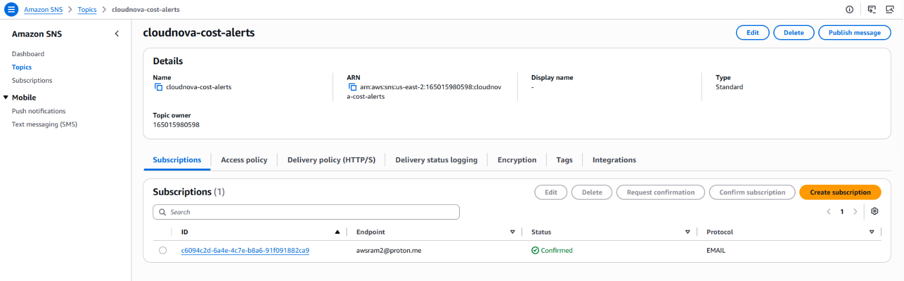
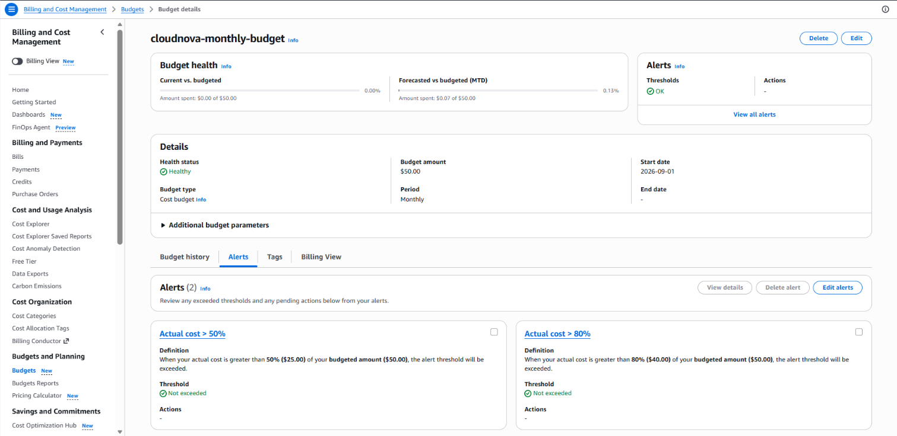

# Demo 22b — Cost Governance: Notify-Only Automation + Static Analysis

---

## Overview

22a gave the persistent build a durable state backend. Before any
actual cost-accruing resource exists — before the EKS cluster, before
the NAT Gateway — this demo puts the safety net in place. Everything
here is about catching a cost problem *after* it happens (detection),
not preventing it from happening at all (prevention). That distinction
matters and gets stated explicitly, not left implied.

**Real-world scenario — CloudNova:**
Once 22d stands up the EKS cluster, the environment starts accruing a
flat, continuous fee whether or not you remember to tear it down at
the end of a session. Leadership's only real ask before compute goes
live: "if I forget, or if something runs longer than expected, I want
to know — I don't want to find out from the bill." That's a detection
requirement, not an auto-remediation one — nobody asked for infrastructure
that can delete itself, and you shouldn't build that even if they had.

**What this demo builds:**

```
┌─────────────────────────────────────────────────────────────────────────┐
│  PART A — EventBridge + SNS: session-length notify                     │
│  Scheduled rule checks tagged resources → SNS notification only        │
├─────────────────────────────────────────────────────────────────────────┤
│  PART B — AWS Budgets: two-threshold spend alarm                       │
│  50% early warning, 80% escalated notification                         │
├─────────────────────────────────────────────────────────────────────────┤
│  PART C — Static analysis: tflint + checkov, local and interim         │
│  Runs before every real apply from this demo onward                    │
└─────────────────────────────────────────────────────────────────────────┘
```

**What this demo covers:**
- Detection versus prevention as a real, distinct design choice — not
  just a caveat, an explicit trade-off with a stated reason
- `aws_cloudwatch_event_rule` on a schedule expression, paired with an
  SNS target — publish/subscribe mechanics applied to infrastructure
  monitoring instead of application events
- `aws_sns_topic_policy` as a standalone resource-based policy, which
  is a different shape from the inline `policy` argument Demo 06 used
- `aws_budgets_budget` with multiple notification thresholds
- Why this project deliberately does **not** pair either mechanism
  with an auto-remediation Lambda
- `tflint` and `checkov` as CLI tools that run *outside* Terraform
  entirely — not Terraform resources, not provisioners

---

## How This Demo's Pieces Fit Together

**The AWS solution being built:** a scheduled EventBridge rule that
checks tagged Phase 3+ resources against a session-length threshold and
publishes to an SNS topic if exceeded; a two-threshold AWS Budgets
alarm watching total account spend; and a local `tflint`/`checkov`
workflow that isn't AWS infrastructure at all, but governs every real
apply from here forward.

**Why three unrelated-looking mechanisms sit in one demo:** all three
answer the same underlying question — "how do I know if something's
gone wrong with cost or configuration before it becomes expensive or
dangerous?" — from three different angles (idle-time detection,
spend-threshold detection, and pre-apply configuration review). None
of the three requires compute to exist first, which is why this demo
runs before 22d's cluster, not after. None of them touches
`retail-store-sample-app` at all.

**Where the state lives:** this demo is the first one to actually write
into 22a's persistent backend. It adds no backend of its own — it
points a `backend "s3"` block at the bucket 22a bootstrapped, under the
`phase-3-onward` state key that 22d will go on sharing.

**Why this demo has no Cleanup that tears anything down:** same
reasoning as 22a — these are free or near-free governance resources
meant to protect every session from here forward, not artifacts of a
single teaching rep. Destroying and recreating them every session would
defeat their purpose for no cost benefit.

---

## Prerequisites

### Knowledge
- 22a completed — the persistent S3 backend this demo's state is written into
- Demo 03 completed — SNS topic → subscription mechanics
- Demo 06 completed — `aws_sns_topic` and the `jsonencode()` policy
  pattern this demo's topic policy reuses

### Required Tools

| Tool | Minimum version | Verify |
|---|---|---|
| Terraform CLI | `~> 1.15.0` | `terraform version` |
| AWS CLI | `>= 2.x` | `aws --version` |
| `tflint` | Latest stable | `tflint --version` |
| `checkov` | Latest stable | `checkov --version` |

### Verify AWS Account and Permissions

**Step 1 — Confirm your profile works:**

```bash
aws sts get-caller-identity --profile default
```

**Step 2 — A cheap, harmless dry-run of this demo's actual service:**

```bash
aws budgets describe-budgets --account-id <YOUR_ACCOUNT_ID> --profile default
# Expected: JSON with Budgets array (may be empty)
```

**Step 3 — Verify IAM permissions in Console:**

```
Console → IAM → Users → <your user> → Permissions tab
  → Confirm access to EventBridge, Budgets, and SNS (or an equivalent
    broad policy) is attached ✅
```

> 📷 [Screenshot placeholder: AWS Console → IAM → Users → your user →
> Permissions tab, showing the attached EventBridge/Budgets/SNS policies]

**Required permissions beyond what prior demos established:**

```
events:PutRule, events:PutTargets, events:DescribeRule, events:DeleteRule
budgets:CreateBudget, budgets:DescribeBudget, budgets:ModifyBudget, budgets:DeleteBudget
sns:CreateTopic, sns:Subscribe, sns:Publish, sns:SetTopicAttributes
```

### Versions used in this demo

| Tool | Version |
|---|---|
| Terraform | `~> 1.15.0` |
| AWS Provider | `~> 6.47.0` |

> These two pins come from the solution documents, not from this demo
> — they are the project-wide versions every demo in the series uses.
> `tflint` and `checkov` are deliberately left unpinned in this table:
> see Part C for why a concrete version number for the
> `tflint-ruleset-aws` plugin specifically is avoided in this demo's
> example config.

---

## Demo Objectives

By the end of this demo you will be able to:

1. ✅ Explain the difference between detection and prevention as cost
   controls, and why this project deliberately chose detection-only
2. ✅ Write an `aws_cloudwatch_event_rule` on a schedule, targeting an
   SNS topic
3. ✅ Write a standalone `aws_sns_topic_policy` that grants an AWS
   service permission to publish, scoped to one specific source ARN
4. ✅ Write an `aws_budgets_budget` with two independent notification
   thresholds
5. ✅ Explain why `tflint` and `checkov` aren't Terraform resources or
   provisioners, and where they actually run in the workflow
6. ✅ Explain why an auto-remediation Lambda was considered and
   rejected for this specific project

---

## Cost & Free Tier

| Resource | Free tier | Cost | Notes |
|---|---|---|---|
| EventBridge scheduled rule | Same-account rule-to-SNS invocations on the default event bus have historically carried no separate publishing charge — ⚠️ [VERIFY: the commonly-cited "14M/month free" figure belongs to EventBridge **Scheduler**, a separate, newer product from the classic `aws_cloudwatch_event_rule` this demo actually uses; confirm the correct free-tier line for classic scheduled rules before citing a specific number as authoritative] | **$0.00** | One rule, checked hourly — far under any plausible threshold either way |
| SNS topic + email subscription | 1,000 email notifications/month free | **$0.00** | Notify-only traffic is tiny at lab scale |
| AWS Budgets | The first budgets on an account are free; this project creates exactly **one** — ⚠️ [VERIFY: an earlier draft of this table claimed the free allowance applies only to budgets with Budgets Actions attached; that claim was not verified against AWS's own Budgets pricing page. At one budget, this demo is free under either reading, so the conclusion below holds regardless] | **$0.00** | Notification-only — no `action` block anywhere in this demo |
| `tflint` / `checkov` | Open-source, local CLI | **$0.00** | No AWS resource at all — runs on your machine |
| **Session total** | | **$0.00** | Created once, left standing — see Cleanup |

---

## Directory Structure

```
22b-cost-governance/
├── README.md
├── 22b-cost-governance-anki.csv
├── 22b-cost-governance-quiz.md
└── src/
    ├── phase-3-onward/                  # the same config 22a's backend serves
    │   ├── versions.tf                  # terraform block + provider version constraints
    │   ├── provider.tf                  # AWS provider: region, profile, default_tags
    │   ├── backend.tf                   # points at 22a's S3 backend — literals only
    │   ├── variables.tf                 # identity, notification email, budget limit
    │   ├── locals.tf                    # common_tags consumed by default_tags
    │   ├── cost_governance.tf           # EventBridge rule + SNS topic/target/policy
    │   ├── budgets.tf                   # aws_budgets_budget, two thresholds
    │   ├── outputs.tf                   # topic ARN and budget name
    │   ├── terraform.tfvars.example     # committed template — real tfvars stays local
    │   ├── .tflint.hcl                  # tflint ruleset config — not a .tf file
    │   └── .checkov.yaml                # checkov config — not a .tf file
    └── break-fix/
        └── broken.tf
```

> **Why `.tflint.hcl` and `.checkov.yaml` live in the same directory
> but aren't `.tf` files:** neither tool is a Terraform provider or
> resource — they're external CLI programs that read your `.tf` files
> directly from disk and report on them. Their config files configure
> the *tool*, not any AWS infrastructure.

> **Why `terraform.tfvars` itself isn't listed:** both variables this
> demo introduces (`notification_email`, `monthly_budget_limit`) are
> genuinely personal. The committed file is the `.example` template;
> your real `terraform.tfvars` stays local and gitignored, matching
> the repository convention the solution documents set.

---

## Recall Check — 22a (State Backend Bootstrap)

Answer from memory before reading anything new:

1. Why can't a Terraform backend's own storage be created by the
   configuration that uses it as a backend?
2. Can a `backend` block ever reference a variable, local, or output
   value, in any Terraform version?
3. Why isn't this backend torn down between sessions like most Phase
   3+ resources?

<details>
<summary>Answers</summary>

1. Chicken-and-egg problem — `terraform init` needs a working backend
   before Terraform can manage any resource, including one meant to
   create that same backend. Requires a separate bootstrap config.
2. No, never — a `backend` block is resolved before Terraform has an
   evaluation context for variables, locals, or outputs. Every
   argument must be a literal value.
3. Destroying and recreating it every session would destroy the state
   history it exists to preserve, defeating its purpose. Only
   cost-accruing compute/networking resources follow the
   every-session teardown default.

</details>

---

## Concepts

### What's New in This Demo

| Construct | Type | Purpose in this demo |
|---|---|---|
| `aws_cloudwatch_event_rule` | Resource | Scheduled rule — fires on a cron-like interval |
| `schedule_expression` | Resource argument | Rate or cron expression controlling how often the rule fires |
| `aws_cloudwatch_event_target` | Resource | Connects the rule to what it notifies — the SNS topic here |
| `aws_sns_topic_subscription` (email protocol) | Resource | Subscribes a real email address to receive the notification |
| `aws_sns_topic_policy` | Resource | Standalone resource-based policy — a different shape from Demo 06's inline `policy` argument |
| `aws_budgets_budget` | Resource | Account-level spend tracking with configurable notification thresholds |
| `notification` block (nested, repeatable) | Resource sub-block | One per threshold — this demo uses two, at 50% and 80% |
| `backend "s3"` block (consuming, not creating) | `terraform` block setting | Points this config at 22a's already-bootstrapped bucket |
| `tflint` | External CLI tool, not a Terraform construct | Lints `.tf` files for style/correctness issues before they're ever applied |
| `checkov` | External CLI tool, not a Terraform construct | Scans `.tf` files for security/compliance misconfigurations before apply |

**Related constructs worth knowing (not used in full here):**

| Construct | What it is | Where it's covered |
|---|---|---|
| `event_pattern` | Event-driven rule matching, the alternative to `schedule_expression` | Not used in this series yet |
| `aws_scheduler_schedule` | EventBridge **Scheduler** — a separate, newer service from the classic rule used here | Not used in this series |
| Budgets Actions (`action` block) | Auto-remediation attached to a budget | Deliberately not used — see the detection/prevention section below |
| Policy as Code (Sentinel/OPA) | Enforced, automated policy gates | Demo 33 |
| Pipeline-integrated scanning | `tflint`/`checkov` as a real CI stage, plus image scanning | Demo 32 (formalized), Demo 34 (extended) |

---

### Detailed Explanation of New Constructs

#### Detection vs. Prevention — A Real Design Choice, Not a Caveat

Every mechanism in this demo is a detection control. None of them stop
spend from happening — they tell you about it, at various speeds and
via various signals, after the fact:

```
┌────────────────────────────────────────────────────────────────────┐
│  DETECTION (what this demo builds)                                 │
│  - EventBridge notify: fast, proactive, checks a specific idle-time │
│    condition this project defined                                   │
│  - Budgets alarm: slower (spend-based, lags actual usage), but      │
│    checks the thing that actually matters — total dollars           │
│  Both: tell you something happened. Neither stops it from happening.│
├────────────────────────────────────────────────────────────────────┤
│  PREVENTION (deliberately NOT built here)                           │
│  - A Lambda paired with the EventBridge rule that force-destroys    │
│    tagged resources once the idle threshold is crossed              │
│  - Considered, explicitly rejected                                   │
└────────────────────────────────────────────────────────────────────┘
```

**Why prevention was rejected here, specifically:** this is a
single-learner lab, not shared production infrastructure. An
auto-remediation Lambda that misfires — a false-positive idle
detection destroying real work-in-progress mid-session — is a worse
failure mode than the cost risk it would solve. A notification gets
most of the practical benefit (you find out quickly, before the
Budgets alarm's slower spend-based signal would catch it) without that
downside. This isn't a universal rule for all AWS environments — a
shared team environment with strict cost SLAs might reasonably make
the opposite trade-off. It's the right call for *this* project's
actual shape (one learner, real work sessions, thin cost margin).

---

#### `aws_cloudwatch_event_rule` and `aws_cloudwatch_event_target`

| Argument | Required | Description |
|---|---|---|
| `schedule_expression` | Yes (or `event_pattern`, not used here) | `rate(1 hour)` or a `cron(...)` expression — this demo checks hourly |
| `state` | No (default: `"ENABLED"`) | `ENABLED`/`DISABLED` — whether the rule is actively firing |

`aws_cloudwatch_event_target` connects a rule to what happens when it
fires — in this demo, publishing to the SNS topic that then emails
you. The rule and target are two separate resources because a single
rule can fan out to multiple targets; this demo only needs one.

> **On `state` versus `is_enabled`:** older examples you'll find online
> set `is_enabled = true` on this resource. That argument is deprecated
> in favour of `state`, which takes a string rather than a boolean and
> can express more than two conditions. Use `state`; don't copy
> `is_enabled` forward from an older sample.

---

#### `aws_sns_topic_policy` — A Different Shape from Demo 06's Inline Policy

Demo 06 set an SNS access policy using the `policy` argument *inside*
the `aws_sns_topic` resource itself. This demo uses
`aws_sns_topic_policy`, a separate resource that attaches a policy to
a topic by ARN. Both produce a resource-based policy on the topic; the
standalone resource is the shape to reach for when the policy needs to
reference something (here, the EventBridge rule's ARN) that doesn't
exist yet at the point the topic is declared.

The `jsonencode()` + `Principal` + `Condition` composition inside it is
the same pattern Demo 06 taught — what's new is the resource wrapper
around it, and the `Service` principal form rather than an account ARN.

> **What the `Condition` block is actually doing:** `Principal =
> { Service = "events.amazonaws.com" }` on its own would trust *any*
> EventBridge rule in the account. The `ArnEquals` condition on
> `aws:SourceArn` narrows that to this one specific rule. Dropping the
> condition wouldn't produce an error — it would silently widen the
> policy, which is exactly the kind of thing Part C's static analysis
> exists to flag.

---

#### `aws_budgets_budget` — Two Independent Thresholds

| Argument | Required | Description |
|---|---|---|
| `budget_type` | Yes | `"COST"` — tracks spend, not usage quantity |
| `limit_amount` / `limit_unit` | Yes | Your available AWS credit/budget figure, in `USD`. `limit_amount` is a **string** in the provider schema, not a number |
| `time_unit` | Yes | `"MONTHLY"` — resets each month |
| `notification` (block, repeatable) | Yes, one per threshold | Each defines its own `threshold` percentage and `subscriber_email_addresses` |

This demo's `notification` blocks: one at `threshold = 50` (early
warning), one at `threshold = 80` (escalated notification) — matching
the two-threshold design decided at the project level. Both notify the
same email; a real team setup might route the 80% threshold to a
different, more urgent channel.

---

## Lab Step-by-Step Guide

---

## Part A — EventBridge + SNS Notify

Part A builds the EventBridge rule and the SNS topic that notifies you
if a Phase 3+ session runs long, along with the foundation files the
rest of this demo's configuration sits on.

### Step 1 — Navigate to the project config

```bash
cd terraform-aws-mastery/phase-3-real-aws-infrastructure/22b-cost-governance/src/phase-3-onward
```

### Step 2 — Create the foundation files

These six files establish the version pins, provider configuration,
backend wiring and baseline inputs this demo's resources depend on.
None of them create AWS infrastructure on their own.

---

#### `versions.tf` — Terraform and provider version pins

**versions.tf:**

```hcl
terraform {
  required_version = "~> 1.15.0"

  required_providers {
    aws = {
      source  = "hashicorp/aws"
      version = "~> 6.47.0"
    }
  }
}
```

---

#### `provider.tf` — AWS provider configuration

**provider.tf:**

```hcl
provider "aws" {
  region  = var.aws_region
  profile = var.aws_profile

  default_tags {
    tags = local.common_tags
  }
}
```

---

#### `backend.tf` — Pointing at 22a's state backend

This file is what makes 22b the first demo to actually write into the
persistent backend 22a created. Every argument here is a literal —
backend blocks are resolved before Terraform has variables or locals
available, which is the point Recall Check question 2 covers.

**backend.tf:**

```hcl
terraform {
  backend "s3" {
    bucket       = "<YOUR_22A_STATE_BUCKET_NAME>"
    key          = "phase-3-onward/terraform.tfstate"
    region       = "us-east-2"
    use_lockfile = true
  }
}
```

> ⚠️ **Warning**
>
> Replace `<YOUR_22A_STATE_BUCKET_NAME>` with the bucket 22a actually
> created — don't guess at it. `terraform init` fails immediately and
> harmlessly if the name is wrong, which is the cheapest possible way
> to find out.

---

#### `variables.tf` — Identity and notification inputs

This file declares the project identity values that feed tagging, plus
the one input every notification in this demo depends on: the real
email address that receives both the session-length and budget alerts.
`notification_email` deliberately has no default, since a real email
address shouldn't be hardcoded into a file that might get committed.

**variables.tf:**

```hcl
# ── Provider configuration ─────────────────────────────────────────────────

variable "aws_region" {
  type        = string
  description = "AWS region for all resources"
  default     = "us-east-2"
}

variable "aws_profile" {
  type        = string
  description = "AWS CLI named profile for authentication"
  default     = "default"
}

# ── Project identity ───────────────────────────────────────────────────────

variable "project" {
  type        = string
  description = "Project name — used in resource names and tags"
  default     = "cloudnova"
}

variable "environment" {
  type        = string
  description = "Deployment environment"
  default     = "dev"
  nullable    = false
}

variable "demo" {
  type        = string
  description = "Demo identifier — used in tags for traceability"
  default     = "22b-cost-governance"
}

# ── Notification ───────────────────────────────────────────────────────────

variable "notification_email" {
  type        = string
  description = "Email address to receive cost and budget notifications"
  # No default — set this in terraform.tfvars, don't hardcode a real
  # email into a file that might get committed
}
```

---

#### `locals.tf` — The tag set every resource inherits

These tags are what the session-length check is eventually meant to
filter on, so they aren't decoration — they're the mechanism by which
a Phase 3+ resource becomes visible to this demo's detection logic.

**locals.tf:**

```hcl
locals {
  common_tags = {
    Project     = var.project
    Environment = var.environment
    Demo        = var.demo
    ManagedBy   = "Terraform"
  }
}
```

---

#### `terraform.tfvars.example` — The committed template

This is the file that gets committed. Copy it to `terraform.tfvars`,
fill in your real values there, and leave that copy gitignored.

**terraform.tfvars.example:**

```hcl
notification_email   = "you@example.com"
monthly_budget_limit = "50"
```

---

### Step 3 — Create cost_governance.tf

This step creates the SNS topic, its email subscription, the scheduled
EventBridge rule, its target, and the resource policy that lets
EventBridge actually publish to the topic — the topic, the schedule,
the connection between them, and the permission that makes the
connection work.


**cost_governance.tf:**
```hcl
resource "aws_sns_topic" "cost_alerts" {
  name = "cloudnova-cost-alerts"
}

resource "aws_sns_topic_subscription" "cost_alerts_email" {
  topic_arn = aws_sns_topic.cost_alerts.arn
  protocol  = "email"
  endpoint  = var.notification_email
}

resource "aws_cloudwatch_event_rule" "session_length_check" {
  name                = "cloudnova-session-length-check"
  description         = "Checks tagged Phase 3+ resources against a session-length threshold"
  schedule_expression = "rate(1 hour)" # hourly — deliberately low-frequency, see Interview Prep Q2
  state               = "ENABLED"      # not is_enabled — that argument is deprecated
}

resource "aws_cloudwatch_event_target" "notify_sns" {
  rule      = aws_cloudwatch_event_rule.session_length_check.name
  target_id = "cost-alerts-sns"
  arn       = aws_sns_topic.cost_alerts.arn
}

# EventBridge needs explicit permission to publish to this SNS topic —
# this is a resource-based policy on the SNS topic, not an IAM role
resource "aws_sns_topic_policy" "allow_eventbridge" {
  arn = aws_sns_topic.cost_alerts.arn

  policy = jsonencode({
    Version = "2012-10-17"
    Statement = [{
      Sid       = "AllowEventBridgePublish"
      Effect    = "Allow"
      Principal = { Service = "events.amazonaws.com" }
      Action    = "SNS:Publish"
      Resource  = aws_sns_topic.cost_alerts.arn
      Condition = {
        ArnEquals = {
          "aws:SourceArn" = aws_cloudwatch_event_rule.session_length_check.arn
        }
      }
    }]
  })
}
```

> ⚠️ [VERIFY — open item, not a defect in this file] The actual
> idle-resource-check *logic* this rule's target would evaluate (which
> tags, what threshold counts as "too long") depends on real, tagged
> Phase 3+ resources that don't exist until 22d onward. This demo
> builds the notification *plumbing* and the tag set those resources
> will carry; the specific check condition should be revisited once
> 22d's actual resource tags are applied.

### Step 4 — Apply and confirm the email subscription

This step applies the notification plumbing for the first time and
confirms the email subscription is genuinely active, not merely
created.

```bash
terraform init
terraform validate
terraform plan
terraform apply
```

```
⚠️ Simulated expected output

Apply complete! Resources: 5 added, 0 changed, 0 destroyed.
```

> **Expect exactly 5 resources here** — the topic, its subscription,
> the EventBridge rule, its target, and the topic policy.

SNS email subscriptions require manual confirmation. Check your inbox
for an "AWS Notification - Subscription Confirmation" email and click
the confirmation link. Until you do, the subscription shows
`PendingConfirmation` in Console and won't receive anything — and
because the pending state lives in AWS rather than in your
configuration, `terraform plan` will keep reporting no changes while
the subscription sits unusable.

**Verify:**

```
Console → SNS → Topics → cloudnova-cost-alerts → Subscriptions
  → Status: Confirmed (after clicking the email link) ✅
```




---

## Part B — AWS Budgets Alarm

Part B adds a second, independent detection layer — an AWS Budgets
alarm watching total account spend rather than any single resource's
runtime.

### Step 5 — Create budgets.tf

This step adds the one budget resource this demo builds, with two
`notification` blocks and no `action` block, since this is deliberately
a notify-only design.

Create a file **budgets.tf** and add the below content:

```hcl
resource "aws_budgets_budget" "monthly_cost" {
  name         = "cloudnova-monthly-budget"
  budget_type  = "COST"
  limit_amount = var.monthly_budget_limit
  limit_unit   = "USD"
  time_unit    = "MONTHLY"

  notification {
    comparison_operator        = "GREATER_THAN"
    threshold                  = 50
    threshold_type             = "PERCENTAGE"
    notification_type          = "ACTUAL"
    subscriber_email_addresses = [var.notification_email]
  }

  notification {
    comparison_operator        = "GREATER_THAN"
    threshold                  = 80
    threshold_type             = "PERCENTAGE"
    notification_type          = "ACTUAL"
    subscriber_email_addresses = [var.notification_email]
  }
}
```

### Step 6 — Add the budget limit variable

This step adds the one remaining input this demo needs — your own real
budget figure, again with no default since it's genuinely personal to
your account. It's typed `string` because the provider's
`limit_amount` argument is a string, not a number.

Add to `variables.tf`:

```hcl
variable "monthly_budget_limit" {
  type        = string
  description = "Your available AWS credit/budget for this project, in USD"
  # No default — this is genuinely personal to your account; set it
  # in terraform.tfvars
}
```

### Step 7 — Create outputs.tf

This step exposes the two values worth having on hand after an apply:
the topic ARN, which later demos and any manual publish test need, and
the budget's name for Console lookups.

Create a file **outputs.tf** and add the below content:

```hcl
output "cost_alerts_topic_arn" {
  description = "ARN of the cost-alerts SNS topic"
  value       = aws_sns_topic.cost_alerts.arn
}

output "monthly_budget_name" {
  description = "Name of the monthly cost budget"
  value       = aws_budgets_budget.monthly_cost.name
}
```

### Step 8 — Apply

This step applies the budget and outputs on top of Part A's already-
applied resources, and is a good moment to practise checking the
reported resource count against what actually changed.

```bash
terraform plan
terraform apply
```

```
⚠️ Simulated expected output

Apply complete! Resources: 1 added, 0 changed, 0 destroyed.
```

This apply adds exactly **one** new resource
(`aws_budgets_budget.monthly_cost`) — outputs aren't counted, and the
five resources Part A already applied are untouched, so the correct
count here is 1, not a restatement of the project's running total. If
an apply against already-existing state ever reports a much larger
"added" count than the number of genuinely new resource blocks you
just wrote, stop and read the plan before confirming — that mismatch
is exactly the kind of signal worth catching before typing `yes`.

**Verify:**

```
Console → Billing and Cost Management → Budgets → cloudnova-monthly-budget
  → Alert thresholds: 50%, 80% ✅
  → Alert subscribers: your email ✅
```



`notification_type = "ACTUAL"` alerts on money already spent. AWS
Budgets also supports `"FORECASTED"`, which alerts on a projected
trend before you actually cross the threshold — worth knowing it
exists, even though this demo uses `ACTUAL` for a simpler, more
literal first pass.

---

## Part C — Static Analysis: `tflint` and `checkov`

Part C installs and configures two static-analysis tools that run
outside Terraform entirely, checking configuration quality before any
real apply from here forward.

### Step 9 — Install both tools

This step installs both tools for the first time in this series.
Neither is a Terraform construct, so neither requires `terraform init`
or any provider.

```bash
# tflint — see https://github.com/terraform-linters/tflint for your platform's install method
tflint --version

# checkov
pip install checkov --break-system-packages
checkov --version
```

### Step 10 — Add each tool's config file

This step adds each tool's own configuration file. Both configure the
*tool*, not any AWS infrastructure.

Create a file **.tflint.hcl** and add the below content — it enables
the AWS-specific ruleset, deliberately without pinning an exact plugin
version:

```hcl
plugin "aws" {
  enabled = true
  source  = "github.com/terraform-linters/tflint-ruleset-aws"
  # No `version` pinned here deliberately — this plugin releases
  # frequently, so any specific number written into this demo would go
  # stale quickly. Run `tflint --init`, check the plugin's own GitHub
  # releases page for whatever is actually current when you set this
  # up, and pin that real number in your own project.
}
```

Create a file **.checkov.yaml** and add the below content — it scopes
checkov to Terraform and explicitly skips one check this lab-scale
project has consciously decided not to satisfy:

```yaml
framework:
  - terraform
skip-check:
  - CKV_AWS_18   # S3 access logging — deliberately out of scope for this lab-scale project
```

### Step 11 — Run both against this demo's own config

This step runs both tools against the configuration you just wrote,
confirming neither touches AWS or Terraform state at all.

```bash
tflint --init
tflint
checkov -d .
```

```
⚠️ Simulated expected output

tflint: 0 issues found.

checkov: Passed checks: 14, Failed checks: 0, Skipped checks: 1
```

<details>
<summary>Additional flags (reference, not required)</summary>

| Flag | What it does |
|---|---|
| `tflint --format=json` | Machine-readable output — useful once this moves into a pipeline at Demo 32 |
| `tflint --recursive` | Walks subdirectories instead of only the current one |
| `checkov -d . --compact` | Suppresses the per-check code snippets, printing results only |
| `checkov -d . --quiet` | Prints failed checks only, hiding passes |
| `checkov --skip-check CKV_AWS_18` | Skips a check inline instead of via `.checkov.yaml` |

</details>

Neither command touched AWS or Terraform state — both read your `.tf`
files directly off disk and report findings. That's why they aren't
Terraform resources or provisioners: they run *around* the Terraform
workflow, not inside it. From this demo forward, the convention is to
run both before every real `terraform apply`, in addition to — not
instead of — `terraform validate` and `terraform plan`.

---

## Cleanup

**This demo's Cleanup step is verification, not destruction** — same
reasoning as 22a. These are free governance resources meant to protect
every future session, not artifacts of a single teaching rep.

### Step 12 — Confirm everything is in its intended, permanent state

```bash
terraform state list
# aws_sns_topic.cost_alerts
# aws_sns_topic_subscription.cost_alerts_email
# aws_cloudwatch_event_rule.session_length_check
# aws_cloudwatch_event_target.notify_sns
# aws_sns_topic_policy.allow_eventbridge
# aws_budgets_budget.monthly_cost
```

```
Console → SNS → cloudnova-cost-alerts → Subscription status: Confirmed ✅
Console → Budgets → cloudnova-monthly-budget → both thresholds present ✅
```

> ⚠️ **Do not run `terraform destroy` at the end of this session.**
> These resources protect every subsequent Phase 3+ session, and this
> config's state is shared with 22d — a `destroy` here would take the
> governance layer down with it.

---

## What You Learned

1. ✅ Detection and prevention are different design choices with
   different failure modes — this project deliberately chose detection
   for a stated reason, not by default.
2. ✅ `aws_cloudwatch_event_rule` + `aws_cloudwatch_event_target` fan
   an EventBridge schedule out to one or more targets — here, an SNS
   topic built on Demo 03/06's own patterns.
3. ✅ `aws_sns_topic_policy` is a standalone resource-based policy, a
   different shape from the inline `policy` argument used earlier, and
   the right choice when the policy must reference a resource declared
   after the topic.
4. ✅ `aws_budgets_budget` supports multiple independent `notification`
   blocks, each with its own threshold and comparison operator.
5. ✅ `tflint` and `checkov` are external CLI tools that read `.tf`
   files directly — they are not Terraform resources or provisioners,
   and run outside the `plan`/`apply` cycle entirely.
6. ✅ An auto-remediation Lambda was a real, considered alternative —
   rejected for this project's specific shape (single learner, no
   shared-production stakes), not rejected universally.
7. ✅ Checking an incremental apply's reported resource count against
   what you actually expect to change is a real, useful habit — not
   just a formality.

---

## Cert Tips

### Exam Objective Mapping

| Demo concept / command | Exam objective | Notes |
|---|---|---|
| `backend "s3"` arguments must be literals | TA-004 Obj 3 — Terraform state and backends | No variables, locals or outputs are available at backend-resolution time |
| `aws_cloudwatch_event_rule` / `_target` | TA-004 Obj 4a — Resource configuration | Not a core Terraform-language object — an ordinary AWS provider resource pair |
| `aws_budgets_budget` multiple `notification` blocks | TA-004 Obj 4a | Repeatable nested blocks, one per notification threshold |
| `validate` versus provider-side value validation | TA-004 Obj 3 — Terraform workflow | `validate` checks shape and schema, not every provider-enforced value constraint |
| `tflint`/`checkov` as pre-apply tooling | TA-004 Obj 9 — Testing and validation ecosystem | Ecosystem tools, not part of Terraform core or the CLI |

### Common Exam Traps

| Scenario | What the task actually requires | Common wrong approach |
|---|---|---|
| "Is `tflint` a Terraform subcommand?" | No — it's a completely separate, third-party CLI tool | Assuming `terraform tflint` or similar built-in integration exists |
| "Can `aws_budgets_budget` have only one notification threshold?" | No requirement either way — `notification` is a repeatable block; use as many as needed | Assuming a budget resource is limited to a single alert threshold |
| "Parameterise the backend's bucket name with a variable" | Recognising that backend arguments must be literals, and that partial configuration via `-backend-config` is the actual mechanism | Writing `bucket = var.state_bucket` and expecting it to resolve |
| "An incremental `apply` reports adding more resources than you just wrote" | Recognising that's a signal to stop and inspect the plan before confirming | Assuming the reported count is always self-evidently correct |

### Exam Task — Write a complete configuration

**Task:** Write a Terraform configuration for an `aws_budgets_budget`
with exactly two notification thresholds (50% and 80%) on actual spend.

**Block types required:** `terraform`, `provider`, `resource`, repeatable `notification` sub-block

**Official documentation:**
- [`aws_budgets_budget` resource](https://registry.terraform.io/providers/hashicorp/aws/latest/docs/resources/budgets_budget)

**What to practise:**
1. Open the page above — check the `notification` block's argument reference
2. Write the configuration from scratch without looking at this demo's `src/` files
3. Validate: `terraform init && terraform validate`

<details>
<summary>Reference solution (open only after attempting)</summary>

```hcl
resource "aws_budgets_budget" "exam_task" {
  name         = "exam-task-budget"
  budget_type  = "COST"
  limit_amount = "50"
  limit_unit   = "USD"
  time_unit    = "MONTHLY"

  notification {
    comparison_operator        = "GREATER_THAN"
    threshold                  = 50
    threshold_type             = "PERCENTAGE"
    notification_type          = "ACTUAL"
    subscriber_email_addresses = ["you@example.com"]
  }

  notification {
    comparison_operator        = "GREATER_THAN"
    threshold                  = 80
    threshold_type             = "PERCENTAGE"
    notification_type          = "ACTUAL"
    subscriber_email_addresses = ["you@example.com"]
  }
}
```

**Arguments you must know without looking up:**
- `notification` is repeatable — one block per threshold, not a list argument
- `limit_amount` is a string, not a number
- `notification_type` distinguishes `ACTUAL` (money already spent) from `FORECASTED` (projected trend)

</details>

---

## Troubleshooting

| Error | Cause | Fix |
|---|---|---|
| `terraform init` fails with a bucket-not-found or access-denied error | `backend.tf`'s `bucket` doesn't match the bucket 22a actually created | Confirm the real bucket name from 22a's output or Console, and correct the literal in `backend.tf` |
| Email subscription stuck at `PendingConfirmation`, while `plan` reports no changes | The confirmation link wasn't clicked; confirmation state lives in AWS, not in your configuration, so Terraform sees nothing wrong | Check the inbox and spam folder for the AWS SNS confirmation email and click the link |
| EventBridge target never publishes | Missing `aws_sns_topic_policy` allowing `events.amazonaws.com` to publish | Confirm the topic policy's `Principal` and `Condition` match this rule's ARN exactly |
| `Error: Invalid value for "limit_amount"` or an unexpected type conversion | `monthly_budget_limit` declared as `number` when the provider expects a string | Declare the variable as `type = string` and quote the value in `terraform.tfvars` |
| `checkov` reports a finding you've deliberately accepted | A real, known limitation, not a bug | Add the specific check ID to `.checkov.yaml`'s `skip-check` list, with a comment explaining why |
| `tflint` fails to download the `aws` plugin | No `version` pinned and no network access, or a genuinely broken release | Pin the plugin's current real version explicitly once you've checked its release page |

---

## Break-Fix Scenario

One deliberate error. Diagnose it before revealing the answer — and
note that this one deliberately survives `terraform validate`, so you
have to get as far as `apply` to see it fail.

```bash
cd ../break-fix/
terraform init
terraform validate
terraform plan
terraform apply
```

#### `broken.tf` — One deliberate, validate-surviving error

This file is a self-contained, single-resource configuration with one
incorrect enum value that `terraform validate` cannot catch.

**broken.tf:**

```hcl
terraform {
  required_version = "~> 1.15.0"
  required_providers {
    aws = {
      source  = "hashicorp/aws"
      version = "~> 6.47.0"
    }
  }
}

provider "aws" {
  region  = "us-east-2"
  profile = "default"
}

resource "aws_budgets_budget" "monthly_cost" {
  name         = "break-fix-budget"
  budget_type  = "COST"
  limit_amount = "100"
  limit_unit   = "USD"
  time_unit    = "MONTHLY"

  notification {
    comparison_operator        = "GREATER_THAN"
    threshold                  = 50
    threshold_type             = "PERCENTAGE"
    notification_type          = "Actual" # Error
    subscriber_email_addresses = ["team@example.com"]
  }
}
```

<details>
<summary>Reveal answer — attempt diagnosis first</summary>

**Error — `notification_type = "Actual"`**
Valid values are `ACTUAL` and `FORECASTED`, both fully uppercase.
`terraform validate` and `terraform plan` both pass, because neither
evaluates provider-side value constraints — the failure only appears
when `apply` sends the request to the real AWS API. This is a useful
distinction to internalise: `validate` catches shape problems, not
every provider-specific value constraint. Fix:
`notification_type = "ACTUAL"`.

</details>

**Cleanup:**

```bash
rm -rf .terraform .terraform.lock.hcl terraform.tfstate terraform.tfstate.backup
cd ../phase-3-onward
```

No `terraform destroy` is needed here — the apply fails before the
budget is created, so there's nothing in AWS to remove. This break-fix
uses its own local state and never touches the persistent backend.

---

## Interview Prep

**Q1. A teammate asks why this project didn't just pair the EventBridge idle-check with a Lambda that force-destroys resources automatically — wouldn't that actually save money?**
It would save money in the case where it works correctly, but the failure mode is worse than the problem it solves. This is a single-learner lab, not shared production — the real risk isn't "cost creeps up slightly," it's "an idle-detection false positive destroys real work-in-progress mid-session." A notification gets most of the practical benefit — you find out fast, faster than the spend-based Budgets alarm would catch it — without that downside. It's a genuinely different trade-off in a shared, production, multi-team environment, where the cost of unmonitored spend might outweigh the risk of an occasional misfire; the right answer here isn't universal, it's shaped by this project actually being one learner's personal lab.

**Q2. Someone notices this demo's EventBridge rule fires every hour, not in real time. Isn't that a gap?**
It's a deliberate trade-off, not an oversight. An hourly check is more than fast enough to catch a session that ran long by an hour or more — the actual failure mode this control exists for — without generating unnecessary invocations or complexity for a faster cadence that wouldn't meaningfully change the outcome. If the threshold this rule checks against were 15 minutes instead of hours, an hourly check would clearly be too coarse — but a session-length control is inherently a coarse-grained concept, so the check frequency should match that grain, not run needlessly fine.

**Q3. A reviewer asks why `tflint` and `checkov` aren't wired in as Terraform provisioners, so they run automatically as part of `terraform apply`.**
Because they're not things Terraform is meant to orchestrate — they're static analysis tools that read your configuration *before* you'd even want to run `plan`, let alone `apply`. A provisioner runs as part of a resource's own lifecycle, tied to actual infrastructure being created or destroyed; `tflint` and `checkov` have nothing to do with any specific resource's lifecycle — they evaluate the whole configuration, independent of any apply happening at all. Baking them into a provisioner would also mean they only ever run at apply time, which defeats the point: you want these findings *before* you commit to applying, not as a side effect of it.

**Q4. Part B's `terraform apply` reports "1 added." A teammate expects it to say "6 added," since the budget resource brings the total count to 6. Who's right?**
Part B is right to report 1. `terraform apply`'s resource count reflects what *this specific apply* is changing, not the configuration's running total — the five resources from Part A already exist in state from the prior apply, so re-applying doesn't recreate them. If an apply against already-existing state ever reports a count matching your *total* resource count rather than what genuinely changed, that's worth stopping to investigate before confirming — it can mean something unexpected is being replaced, not just added.

**Q5. Why does this demo point at 22a's existing backend rather than creating its own, and why does that matter beyond tidiness?**
Because the persistent build is meant to be one environment, not a collection of per-demo silos — 22d re-applies the VPC and cluster into this same state, and Demo 24's IAM work lands on top of it. If 22b kept its own separate state, the governance resources and the resources they're meant to govern would be tracked independently, and nothing would stop the two from drifting. It also matters for the reverse case: because the state is shared, running `terraform destroy` in this directory would take down the governance layer along with whatever 22d had applied, which is exactly why this demo's Cleanup is a verification step rather than a teardown.

---

## Key Takeaways

1. **Detection and prevention are different design choices, each with
   its own failure mode.** State which one you're choosing and why —
   don't let "we have a Budgets alarm" imply more protection than a
   notification actually provides.

2. **`notification` blocks on `aws_budgets_budget` are repeatable, not
   a list argument.** One block per independent threshold — write as
   many as your alerting design needs.

3. **A standalone `aws_sns_topic_policy` and an inline `policy`
   argument produce the same thing by different routes.** Reach for the
   standalone resource when the policy has to reference something
   declared after the topic.

4. **Static analysis tools like `tflint`/`checkov` are not Terraform
   constructs.** They read `.tf` files directly, run entirely outside
   the `plan`/`apply` cycle, and should run *before* you'd even
   consider applying — not as a provisioner tied to a resource's lifecycle.

5. **`terraform validate` doesn't catch every provider-specific value
   constraint.** It checks structure and schema — an invalid enum
   value like a wrongly-cased string passes `validate` and `plan`, and
   only fails at `apply` against the real AWS API.

6. **A rejected alternative (auto-remediation) is worth documenting as
   explicitly as the chosen one.** Knowing *why* prevention was
   rejected here — and that the same reasoning wouldn't necessarily
   hold in a different environment — is more useful than just knowing
   what was built.

7. **An incremental apply's reported resource count is a real signal,
   worth checking, not a number to skim past.** A mismatch between what
   you expect and what Terraform reports is worth investigating before
   typing `yes`.

> **Demo scope:** Primary concept: detection-only cost and
> configuration governance — EventBridge+SNS session-length notify,
> the two-threshold Budgets alarm, and pre-apply static analysis.
> Supporting concepts: consuming 22a's backend from a second config,
> the standalone `aws_sns_topic_policy` shape, why prevention
> (auto-remediation) was considered and rejected, and reading an
> incremental apply's resource count as a real signal.
> Estimated completion time: 35–40 minutes (reading + hands-on + verification).
> Checkpoints: 3 natural stopping points (end of Part A, end of
> Part B, end of Part C).

---

## Quick Commands Reference

| Command | Description |
|---|---|
| `aws sts get-caller-identity --profile <PROFILE>` | Confirms which AWS account and identity the named profile authenticates as |
| `aws budgets describe-budgets --account-id <ID> --profile <PROFILE>` | Lists existing AWS Budgets for the account |
| `terraform init` / `validate` / `plan` / `apply` | Standard workflow — `init` here also wires this config to 22a's backend for the first time |
| `terraform state list` | Lists what this config's state actually tracks — used in Cleanup instead of `destroy` |
| `tflint --init` / `tflint` | Downloads configured plugins, then lints `.tf` files — run before every real apply from this demo forward |
| `checkov -d .` | Scans `.tf` files for security/compliance misconfigurations — same cadence as `tflint` |

---

## Next Demo

**Demo 22c — ECR/ACM Re-Creation:** re-creating Demo 19's ECR repo and
re-pushing images, and re-requesting/re-validating a new ACM cert —
the third of four sub-demos completing the original Demo 22 Part A
bootstrap work.

---

## Appendix — Anki Cards

**22b-cost-governance-anki.csv:**

```
#deck:Terraform AWS Mastery::Phase 3 - Real AWS Infrastructure::22b-cost-governance
#separator:Comma
#columns:Front,Back,Tags
"What's the difference between a detection control and a prevention control for cost governance?","Detection tells you something happened after the fact (a notification); prevention stops it from happening (e.g. auto-destroy). This project deliberately chose detection-only, since auto-remediation's failure mode (destroying real work-in-progress on a false positive) is worse than the cost risk it solves for a single-learner lab.","demo22b,cost-governance"
"Why does aws_cloudwatch_event_target exist as a separate resource from aws_cloudwatch_event_rule?","A single EventBridge rule can fan out to multiple targets. Splitting rule and target into separate resources lets one schedule notify several different destinations without duplicating the rule.","demo22b,eventbridge,ta004-obj4a"
"Which argument enables or disables an aws_cloudwatch_event_rule, and which older argument does it replace?","state (a string, ENABLED or DISABLED) is the current argument. It replaces is_enabled, a boolean that is deprecated — don't copy is_enabled forward from older examples.","demo22b,eventbridge,deprecation"
"What are the two accepted forms of schedule_expression on an EventBridge rule?","A rate expression, e.g. rate(1 hour), or a cron expression, e.g. cron(0 12 * * ? *). A rule uses either schedule_expression or event_pattern — this demo uses the schedule form.","demo22b,eventbridge"
"Is notification on aws_budgets_budget a list argument or a repeatable block?","A repeatable block — write one notification block per independent threshold (e.g. 50% and 80%), each with its own comparison_operator, threshold, and subscriber list.","demo22b,budgets,ta004-obj4a"
"What's the difference between notification_type = ACTUAL and FORECASTED on an AWS Budget?","ACTUAL alerts based on money already spent. FORECASTED alerts based on a projected spending trend, before the actual threshold is crossed — a more proactive but less literal signal.","demo22b,budgets"
"What type is limit_amount on aws_budgets_budget?","A string, not a number — e.g. limit_amount = \"50\". A variable feeding it should be declared type = string to match the provider schema.","demo22b,budgets,types"
"When would you use a standalone aws_sns_topic_policy instead of the inline policy argument on aws_sns_topic?","When the policy needs to reference a resource that doesn't exist yet at the point the topic is declared — such as an EventBridge rule's ARN used in an aws:SourceArn condition. Both produce a resource-based policy on the topic.","demo22b,sns,policy"
"An SNS topic policy grants Principal = { Service = \"events.amazonaws.com\" } with no Condition block. What's the practical effect?","Any EventBridge rule in the account could publish to that topic, not just the intended one. Adding an ArnEquals condition on aws:SourceArn narrows it to one specific rule. Omitting it isn't an error — it silently widens the policy.","demo22b,sns,policy,security"
"Why does an SNS email subscription created by Terraform still show PendingConfirmation, and why doesn't terraform plan flag it?","Email subscriptions require the recipient to click a confirmation link. That confirmation state lives in AWS, not in the Terraform configuration, so plan reports no changes while the subscription sits unusable.","demo22b,sns,gotcha"
"Are tflint and checkov Terraform provisioners?","No. Both are external CLI tools that read .tf files directly off disk and report findings, entirely outside the plan/apply cycle. They should run before a real apply, not be wired into a resource's lifecycle.","demo22b,static-analysis,ta004-obj9"
"Does terraform validate catch every provider-specific value constraint, like an incorrectly-cased enum string?","No. validate checks structure and schema (correct block shape, required arguments present) but not every value-level constraint the provider enforces — some invalid values pass validate and plan, and only fail at apply against the real AWS API.","demo22b,validate,ta004-obj3"
"How many new resources should an incremental terraform apply report when only one new resource block was added to an already-applied config?","Exactly one — the count reflects what that specific apply changes, not the configuration's running total. Outputs aren't counted. A larger reported count against already-existing state is a signal to inspect the plan before confirming.","demo22b,apply,gotcha"
"Does demo 22b create its own state backend?","No — it points a backend \"s3\" block at the bucket 22a already bootstrapped, under the shared phase-3-onward state key. 22b is simply the first config to write into that backend.","demo22b,backend,state"
"Why is 22b's Cleanup a verification step rather than terraform destroy?","Its resources are free or near-free governance controls meant to protect every subsequent session, and the state is shared with 22d — a destroy here would take down both the governance layer and whatever 22d had applied.","demo22b,teardown,cost-governance"
```

---

## Appendix — Quiz

> **Note on Quiz vs. Anki:** the Anki deck drills the individual facts
> (argument names and types, repeatable blocks, tooling boundaries,
> teardown bucket). This Quiz works through diagnosis and applied
> judgment instead — sequencing decisions, policy-scope reasoning,
> and reading real command output — so the two together cover recall
> and application without asking the same question twice.

**22b-cost-governance-quiz.md:**

````markdown
# Quiz — Demo 22b: Cost Governance

> Question types: True/False, Multiple Choice (1 answer), Multiple
> Answer (N answers, stated in the question) — matching the real
> TA-004 exam format.
> Target: 80% or above before moving to Demo 22c.

---

**Q1. (Multiple Choice)** Why is this governance demo placed *before*
22d, which stands up the EKS cluster, rather than after it?

- A) Terraform requires all notification resources to exist before any compute resource
- B) None of this demo's controls depend on compute existing, and the controls are worth having in place before the first cost-accruing resource is ever applied
- C) EventBridge rules can only be created in an account with no running clusters
- D) It's an arbitrary ordering with no real reason

<details>
<summary>Answer</summary>

**B.** All three mechanisms are independent of compute, and the flat,
continuous control-plane fee 22d introduces is exactly what the safety
net exists to catch — so it belongs in place first.

</details>

---

**Q2. (Multiple Choice)** This demo's `aws_sns_topic_policy` includes a
`Condition` block matching `aws:SourceArn` to this specific
EventBridge rule's ARN. What would happen if that `Condition` block
were removed entirely, leaving just
`Principal = { Service = "events.amazonaws.com" }`?

- A) Nothing changes — the Condition block is optional boilerplate with no real effect
- B) Any EventBridge rule in the account, not just this one, would be allowed to publish to this SNS topic
- C) The policy would fail validation, since Condition blocks are required on all SNS topic policies
- D) EventBridge itself would stop being able to publish at all

<details>
<summary>Answer</summary>

**B.** Without the `Condition` block, the policy trusts *any*
EventBridge rule's publish attempt rather than this specific one. It
produces no error — it silently widens the policy, which is precisely
the class of finding Part C's static analysis exists to surface.

</details>

---

**Q3. (Multiple Choice)** Break-Fix's `notification_type = "Actual"`
(wrong casing) passes both `terraform validate` and `terraform plan`.
Why?

- A) `"Actual"` is actually a valid alternate spelling AWS accepts
- B) Neither command evaluates provider-side value constraints — they check structure and schema, and the failure only surfaces when `apply` calls the real AWS API
- C) `validate` was run with the wrong flag
- D) This should have failed `validate`, and its passing indicates a bug in the demo

<details>
<summary>Answer</summary>

**B.** An incorrectly cased enum string is exactly the kind of thing
that only surfaces at `apply`. Internalising which failures are caught
where is more useful than memorising this one value.

</details>

---

**Q4. (Multiple Choice)** This demo states its detection-only (no
auto-remediation) choice explicitly isn't a universal rule for all AWS
environments. Under what circumstance does the demo suggest the
opposite trade-off might actually make sense?

- A) Never — detection-only is always the correct choice regardless of environment
- B) A shared, production, multi-team environment with strict cost SLAs, where unmonitored spend risk might outweigh the risk of an occasional auto-remediation misfire
- C) Any environment where the AWS bill exceeds $100/month
- D) Only when Lambda functions are unavailable in the target region

<details>
<summary>Answer</summary>

**B.** The demo is explicit that this reasoning is shaped by this
project's own shape (single learner, no shared-production stakes) —
a genuinely different environment could reasonably reach the opposite
conclusion.

</details>

---

**Q5. (Multiple Choice)** This demo's `.checkov.yaml` skips
`CKV_AWS_18` (S3 access logging). What does this demo say about why?

- A) Checkov doesn't actually support this check reliably
- B) It's deliberately out of scope for this lab-scale project — not a mistake, and not a universal recommendation to skip it elsewhere
- C) S3 access logging is enabled by default now, making the check redundant
- D) This check only applies to buckets created before 2024

<details>
<summary>Answer</summary>

**B.** The skip is a scoped, stated decision for this specific
lab-scale project — not a general claim that the check is wrong or
unnecessary in every context. A skip without a stated reason is the
thing actually worth objecting to.

</details>

---

**Q6. (Multiple Answer — Pick the 2 correct responses)** Which TWO
statements about this demo's `.tflint.hcl` example are correct?

- A) It pins an exact plugin version so every reader gets identical linting behaviour
- B) It deliberately omits a `version` argument, since the plugin releases too frequently for a hardcoded number to stay current
- C) A reader is expected to check the plugin's own release page and pin a real, current version in their own project
- D) `tflint` requires no configuration file at all to function

<details>
<summary>Answer</summary>

**B and C.** The example leaves `version` unset rather than baking in a
number that will go stale — and the reader is explicitly expected to
pin whatever is actually current when they set this up.

</details>

---

**Q7. (Multiple Choice)** Your `terraform apply` succeeded and the SNS
topic exists, but no notification email ever arrives. `terraform plan`
reports no changes. What is the most likely cause?

- A) The EventBridge rule is disabled
- B) The email subscription is still `PendingConfirmation` — confirmation happens in AWS, outside Terraform's view, so `plan` sees nothing wrong
- C) Terraform failed to create the subscription resource
- D) The SNS topic policy is missing

<details>
<summary>Answer</summary>

**B.** The subscription resource exists as far as Terraform is
concerned; what's missing is the recipient clicking the confirmation
link. This is a good illustration of "in state and correct" not being
the same as "working."

</details>

---

**Q8. (True/False)** Because this demo's config shares 22a's backend
and the `phase-3-onward` state key, running `terraform destroy` in
this directory at the end of the session would remove only 22b's own
six resources.

- A) True
- B) False

<details>
<summary>Answer</summary>

**B) False.** A `destroy` operates on everything tracked in that state
— which, from 22d onward, includes the VPC and cluster too. That
shared state is precisely why this demo's Cleanup is a verification
step rather than a teardown.

</details>

---

**Q9. (Multiple Choice)** You want to parameterise `backend.tf`'s
`bucket` name so the same config can point at different buckets per
environment. Which statement is correct?

- A) Use `bucket = var.state_bucket` — backend blocks support variables like any other block
- B) Backend arguments must be literals; partial configuration supplied via `-backend-config` at `init` time is the actual mechanism
- C) Use a local instead of a variable — locals are resolved early enough
- D) Move the backend block into `variables.tf`

<details>
<summary>Answer</summary>

**B.** A backend block is resolved before Terraform has an evaluation
context for variables, locals or outputs. Partial configuration at
`init` time is how the value gets supplied from outside.

</details>

---

**Q10. (Multiple Answer — Pick the 2 correct responses)** Which TWO of
the following does this demo's Part C establish as a standing
convention from this point in the series forward?

- A) `tflint` and `checkov` run before every real `terraform apply`
- B) `tflint` and `checkov` replace `terraform validate` and `terraform plan`
- C) Both tools run locally and manually for now, and are formalised into a real pipeline stage later in the series
- D) Both tools must be declared as Terraform providers in `versions.tf`

<details>
<summary>Answer</summary>

**A and C.** They run *in addition to* `validate` and `plan`, not
instead of them, and this local/manual cadence is explicitly an interim
arrangement until pipeline integration later in the series.

</details>

---

Score guide:

| Score | Action |
|---|---|
| 9-10/10 | Import Anki cards, move to Demo 22c |
| 8/10 | Review the wrong answers, then proceed |
| 6-7/10 | Re-read the relevant sections, retry those questions |
| Below 6/10 | Re-read the full demo and redo the walkthrough before proceeding |
````