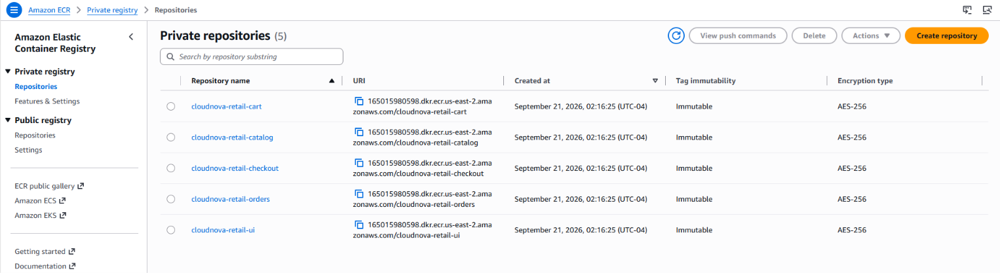
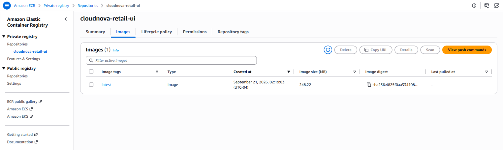
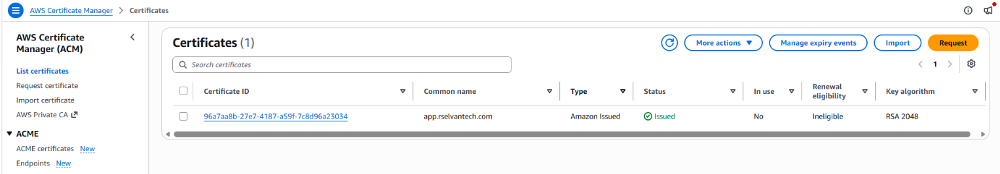
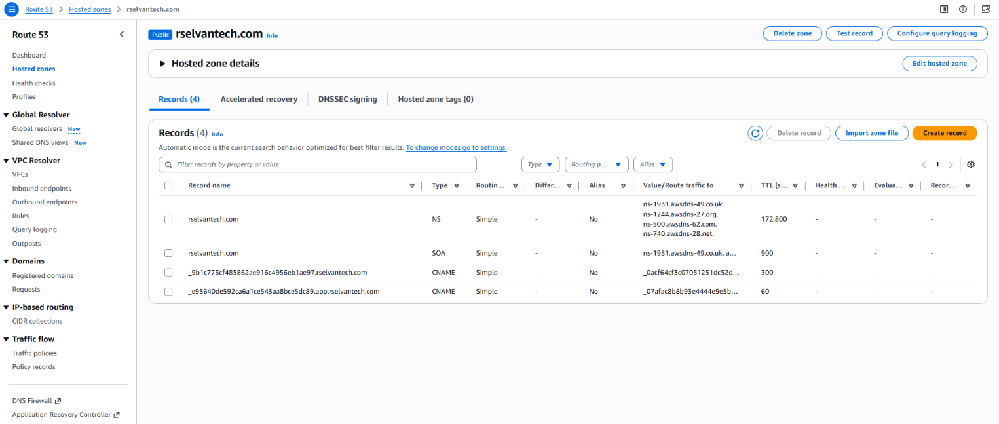

# Demo 22c — ECR/ACM Re-Creation: New Objects for a Persistent Environment

---

## Overview

22a gave the persistent build its state backend; 22b gave it its cost
and configuration guardrails. Before 22d's EKS cluster can deploy
anything, it needs two things to already exist: a container registry
holding `retail-store-sample-app`'s images, and a validated TLS
certificate ready to bind to the ALB that's about to be created. Both
were already taught — Demo 19 built the ECR repo, Demo 20 built the
ACM cert — but both of those were teaching reps, torn down at their
own Cleanup. This demo builds new ones, meant to stay.

**Real-world scenario — CloudNova:**
The images and certificate your Demo 19/20 exercises created are
already gone — that was always the plan for a teaching rep. Now that
you're standing up a real, ongoing environment, you need a registry
and a certificate that won't disappear the moment the demo ends. The
technique is identical to what you already know; what's different is
the object's intended lifetime.

**What this demo builds:**
```
┌─────────────────────────────────────────────────────────────────────────┐
│  PART A — Recreate the Accumulated Baseline (22a + 22b)                │
│  This demo's own config must exist in a fresh directory before ecr.tf  │
│  or acm.tf can be added — recreating 22b's files verbatim is what      │
│  makes that directory point at the real, shared, already-populated     │
│  state, not an empty one                                                │
├─────────────────────────────────────────────────────────────────────────┤
│  PART B — ECR: repo re-creation + image re-push                        │
│  New repos, all 5 services, images pulled from the public gallery      │
│  and re-pushed — same technique as Demo 19, a new, persistent object   │
├─────────────────────────────────────────────────────────────────────────┤
│  PART C — ACM: cert re-request + re-validation                         │
│  New certificate on rselvantech.com, validated against the STANDING    │
│  Route53 hosted zone (never torn down) via a data lookup, not a        │
│  resource                                                                │
└─────────────────────────────────────────────────────────────────────────┘
```

**What this demo covers:**
- Why every Phase 3+ demo's own directory has to recreate the entire
  accumulated configuration before adding anything new — this is one
  continuously-growing shared state, not a series of independent
  per-demo environments, and a partially-recreated config is a real,
  not just theoretical, risk to resources prior demos already applied
- Why re-creating an already-taught resource for a new, persistent
  purpose isn't duplicated effort — teaching rep versus persistent
  object are different lifecycles for the same technique
- `data "aws_route53_zone"` — a read-only lookup against
  infrastructure this project's Terraform never creates or destroys
- Why this new ACM cert validates against the same standing hosted
  zone Demo 20's (now-gone) cert did, without recreating the zone itself
- Why this demo's module version pins match Demo 19/20's exactly,
  rather than drifting to older constraints for no stated reason

---

## How This Demo's Pieces Fit Together

**The AWS solution being built:** five new ECR repositories (one per
`retail-store-sample-app` service) with their images re-pushed, and one
new ACM certificate validated against `rselvantech.com`. Neither
touches compute — 22d is where the ECR images actually get pulled into
a running Deployment, and where the ALB gets created for the cert to
bind to.

**Why this demo's own directory has to start by recreating 22a/22b's
entire configuration, not just adding two new files.** This project's
Phase 3+ demos share one continuously-growing state, not independent
per-demo state files — 22a's own text says this directly ("the main
project config... which 22d onward will keep building into"). That
only works if whichever directory you're actually running `terraform`
commands from contains the *complete*, accumulated set of `.tf` files
every prior demo added — not just the new ones this demo introduces.
Terraform reconciles the real, already-applied state against whatever
`.tf` files are physically present in the current directory: anything
tracked in state but **missing** from the local files gets proposed
for **destruction** on the next `plan`, not silently ignored. A fresh
directory containing only `ecr.tf`/`acm.tf`, with none of 22b's files
recreated, can't even reach that state to begin with (no `backend.tf`
means no way to load it) — but a directory that recreates *some* of
22b's files and not others is the genuinely dangerous middle ground,
since it's the one that *can* load real, existing state while
declaring an incomplete picture of what should still exist in it.

**Why this demo reads the Route53 zone instead of creating it:** the
hosted zone itself was created once, before Demo 20's first build, and
is explicitly excluded from every teardown cycle in this project —
recreating it would mean re-pointing the domain registrar's nameservers
every single time, which never happens in practice. This demo's ACM
cert needs the zone's ID to write its DNS validation record, so it
reads that ID with `data "aws_route53_zone"` rather than managing the
zone as a `resource`.

**Why this demo has no Cleanup that tears anything down:** same
reasoning as 22a/22b — these are near-free, foundational resources
meant to persist for the life of the project, re-created once here and
then left standing for every subsequent Phase 3+ demo to use.

---

## Prerequisites

### Knowledge
- Demo 19 completed — `terraform-aws-modules/ecr/aws`, public gallery
  image pull/push mechanics
- Demo 20 completed — `terraform-aws-modules/acm/aws`, DNS validation,
  why the hosted zone itself is a standing exception to teardown
- 22a/22b completed — this demo's state lives in 22a's backend, and
  Part A below recreates 22b's own finished configuration verbatim as
  its starting point, the same pattern Demo 06 used to recreate Demo
  05's role

### Required Tools

| Tool | Minimum version | Verify |
|---|---|---|
| Terraform CLI | `>= 1.15.0` | `terraform version` |
| AWS CLI | `>= 2.x` | `aws --version` |
| Docker | Any recent | `docker --version` |

### Verify AWS Account and Permissions

**Step 1 — Confirm your profile works:**

```bash
aws sts get-caller-identity --profile default
```

**Step 2 — A cheap, harmless dry-run of this demo's actual services:**

```bash
aws ecr describe-repositories --profile default
# Expected: JSON with repositories array (may be empty)
aws route53 list-hosted-zones --profile default
# Expected: JSON with HostedZones array, including rselvantech.com
```

**Step 3 — Verify IAM permissions in Console:**

```
Console → IAM → Users → test → Permissions tab
  → Confirm ECR, ACM, and Route53 access (or an equivalent broad
    policy) is still attached ✅
```

No new IAM permissions beyond Demo 19/20's own ECR/ACM/Route53 sets.

### Versions used in this demo

| Tool / Module | Version |
|---|---|
| Terraform | `~> 1.15.0` |
| AWS Provider | `~> 6.47.0` |
| `terraform-aws-modules/ecr/aws` | `~> 3.0` |
| `terraform-aws-modules/acm/aws` | `~> 6.0` |

> **Versions pinned as of September 2026, and deliberately matched to
> Demo 19/20 exactly.** This demo calls the identical two modules
> those demos already taught — there's no reason for the version
> constraints to differ here, and an earlier draft of this demo did
> drift to older constraints (`~> 2.0`/`~> 5.0`) with no stated reason.
> If you ever find a demo reusing a module at a different version than
> where that module was first introduced, treat the mismatch itself as
> worth questioning — either there's a real reason (documented) or it's
> a maintenance slip like this one was.

---

## Demo Objectives

By the end of this demo you will be able to:

1. ✅ Explain why every Phase 3+ demo's own directory recreates the
   entire accumulated configuration before adding anything new, and
   what actually goes wrong if that recreation is partial rather than
   complete or entirely absent
2. ✅ Explain why re-creating an already-taught resource for a new,
   persistent purpose isn't redundant with the demo that first taught it
3. ✅ Write a `data "aws_route53_zone"` lookup and use its output in an
   ACM validation record, without ever creating or destroying the zone
4. ✅ Re-push `retail-store-sample-app`'s public images into a new,
   private ECR repo set
5. ✅ Confirm a new ACM certificate reaches `Issued` status against a
   zone this project's Terraform doesn't manage
6. ✅ Recognize when a module version pin has drifted from an earlier
   demo's own established constraint with no stated reason, and treat
   that as worth questioning rather than assuming it's intentional

---

## Cost & Free Tier

| Resource | Free tier | Cost | Notes |
|---|---|---|---|
| ECR repos (5, private) | 500 MB-month **total across the account's private repositories**, first 12 months — not 500 MB per individual repo | **$0.00–~small** | `retail-store-sample-app` images are small collectively; likely within the shared free-tier pool, but the pool is one 500 MB allowance shared by all 5 repos, not 500 MB each |
| ACM certificate | Always free for certs used with ALB/CloudFront | **$0.00** | AWS never charges for the certificate itself in this configuration |
| **Session total** | | **~$0.00** | Created once, left standing |

---

## Directory Structure

```
22c-ecr-acm-recreation/
├── README.md
├── 22c-ecr-acm-recreation-anki.csv
├── 22c-ecr-acm-recreation-quiz.md
└── src/
    ├── phase-3-onward/                     # same config 22a's backend serves
    │   ├── versions.tf                     # ← recreated from 22b, Part A
    │   ├── provider.tf                     # ← recreated from 22b, Part A
    │   ├── backend.tf                      # ← recreated from 22b, Part A
    │   ├── variables.tf                    # ← recreated from 22b, Part A
    │   ├── locals.tf                       # ← recreated from 22b, Part A
    │   ├── cost_governance.tf              # ← recreated from 22b, Part A
    │   ├── budgets.tf                      # ← recreated from 22b, Part A
    │   ├── outputs.tf                      # ← recreated from 22b, Part A (this
    │   │                                   #   demo adds nothing further to it)
    │   ├── terraform.tfvars                # ← your own real values, gitignored,
    │   │                                   #   not shown in this README (see Part A)
    │   ├── ecr.tf                          # NEW this demo — 5 ECR repos
    │   └── acm.tf                          # NEW this demo — ACM cert + data lookup
    └── break-fix/
        └── broken.tf                       # one deliberate local-name mismatch
```

> **No new `variables.tf`/`outputs.tf` content in this demo.** Every
> value `ecr.tf`/`acm.tf` need (`repository_name`, `domain_name`,
> `zone_id`) is either a literal string or read directly via
> `data`/`each.key` — there's nothing genuinely variable to
> parameterize for these two new files, so Part B/C don't add anything
> to `variables.tf`/`outputs.tf` beyond what Part A already recreated
> from 22b. If a real deployment needed the domain or service list
> configurable per environment, that would be the point to add one.

---

## Recall Check — 22b (Cost Governance)

> **Correction:** this section previously (incorrectly) pointed at
> Demo 21. Demo 21 isn't the immediately preceding demo for 22c — 22b
> is. Fixed to trace to 22b's actual Key Takeaways instead.

Answer from memory before reading anything new:

1. Why did this project choose notify-only cost controls instead of
   pairing them with auto-remediation?
2. Is `notification` on `aws_budgets_budget` a list argument or a
   repeatable block?
3. Are `tflint` and `checkov` Terraform provisioners?

<details>
<summary>Answers</summary>

1. Detection and prevention are different design choices with
   different failure modes. A misfiring auto-remediation Lambda
   destroying real work-in-progress mid-session is worse than the
   cost risk it would solve, for this single-learner lab.
2. A repeatable block — one `notification` block per independent
   threshold, not a single list argument.
3. No — both are external CLI tools that read `.tf` files directly
   off disk, running entirely outside the `plan`/`apply` cycle. They
   are not Terraform resources or provisioners.

</details>

---

## Concepts

### What's New in This Demo

| Construct | Type | Purpose in this demo |
|---|---|---|
| Recreating an accumulated multi-demo configuration verbatim | Applied workflow discipline, not a new construct | The same recreate-the-baseline pattern Demo 06 established for a single prior demo, now applied across two (22a's backend, 22b's full config) |
| `data "aws_route53_zone"` | Data source | Reads the existing, standing hosted zone's ID — this project's Terraform never creates or destroys the zone itself |
| ECR repo re-creation (module reuse) | Applied pattern, not a new construct | Same `terraform-aws-modules/ecr/aws` module Demo 19 taught, applied to a new, persistent set of repos |
| ACM cert re-request (module reuse) | Applied pattern, not a new construct | Same `terraform-aws-modules/acm/aws` module Demo 20 taught, applied to a new, persistent certificate |

---

### Detailed Explanation of New Constructs

#### Why Recreating the Baseline Is Mandatory Here, Not Optional Tidiness

Demo 06 recreated Demo 05's finished IAM role as an isolated teaching
rep's own starting point — useful for continuity, but if a reader had
skipped that step, nothing outside that one demo's own state would
have been affected. **This demo's situation is different in a way
worth being precise about:** 22a/22b/22c/22d all share one state file,
at one S3 key, for the entire persistent build. Skip Part A entirely
and start writing `ecr.tf` in an empty directory, and `terraform init`
simply fails — there's no `backend.tf` to even locate the shared
state, so nothing gets touched. That failure is safe, if unhelpful.
**The real risk is a partial recreation** — say, `backend.tf` and
`provider.tf` brought over, but `cost_governance.tf`/`budgets.tf`
left out. That directory *can* reach the real, already-applied state
(the backend config is complete enough for `init` to succeed), but its
local `.tf` files no longer declare 22b's SNS topic, EventBridge rule,
or Budget — so the next `plan` proposes destroying all of them, not
because anything about those resources changed, but because Terraform
has no way to know they're still wanted if nothing local says so.

---

#### `data "aws_route53_zone"` — Reading Infrastructure You Don't Manage

| Argument | Required | Description |
|---|---|---|
| `name` | Optional* | The domain name to look up — `rselvantech.com` here |
| `private_zone` | Optional (default: `false`) | `false` for a standard public hosted zone, which this is |

> **\*`name` and `zone_id` are each individually optional, but
> mutually exclusive** — per the official argument reference, you
> identify the zone with one or the other, never both together, and
> whichever filter you supply must match exactly one hosted zone.
> This demo uses `name`; `zone_id` isn't used here.

```hcl
data "aws_route53_zone" "main" {
  name         = "rselvantech.com."
  private_zone = false
}
```

This is a `data` block, not a `resource` block — the same distinction
Demo 08 taught for `data.aws_caller_identity` and Demo 10 taught for
`data.aws_vpc`. Terraform reads the zone's current attributes (its ID,
name servers) without ever proposing to create, modify, or destroy it.
The zone's own lifecycle — created once, before this project's
Terraform existed, never touched since — is completely outside this
project's `terraform plan`/`apply` graph.

> **Why this matters for teardown specifically:** if this were a
> `resource "aws_route53_zone"` block instead, `terraform destroy`
> would attempt to delete the hosted zone — exactly the operationally
> absurd outcome (re-pointing registrar nameservers every session) the
> project's design avoids by never managing the zone as a resource at all.

---

#### Re-Creating an Already-Taught Resource — Why It's Not Redundant

Demo 19 and Demo 20 already taught you the ECR module and the ACM
module. This demo uses both again, on purpose, producing objects that
happen to look identical to what you already built. The distinction is
lifecycle, not technique:

| | Demo 19/20's objects | This demo's objects |
|---|---|---|
| Purpose | Teach the module, once | Serve the persistent build, indefinitely |
| Torn down at own Cleanup? | Yes, always | No — left standing for the rest of the project |
| Reused by 22d onward? | No — already gone | Yes — this is what 22d's EKS deployment actually pulls images from and binds its ALB to |
| Module version pin | `ecr ~> 3.0` / `acm ~> 6.0` | Same — `ecr ~> 3.0` / `acm ~> 6.0` |

Building this demo's objects *instead of* exempting Demo 19/20's
objects from teardown was itself a real decision (not the only option
considered) — keeping every Phase 1–2 demo's "tears down, no
exceptions" guarantee intact was judged worth the minor cost of a
re-push/re-request here, rather than making Demo 19/20 quietly special
cases. The version pin row above is deliberately included in this
table: reusing the same module a second time is exactly the situation
where a version constraint might accidentally be typed differently
from memory instead of copied — worth double-checking against the
original demo every time.

---

## Lab Step-by-Step Guide

---

## Part A — Recreate the Accumulated Baseline (22a + 22b)

Part A brings this fresh directory up to the same state every prior
Phase 3+ demo left it in, before this demo adds anything new — see
"Why Recreating the Baseline Is Mandatory Here" above for why this
isn't optional tidying.

### Step 1 — Navigate to the project config

```bash
cd terraform-aws-mastery/phase-3-real-aws-infrastructure/22c-ecr-acm-recreation/src/phase-3-onward
```

### Step 2 — Recreate 22b's finished configuration, verbatim

This step recreates every file 22b's own Lab produced, exactly as
that demo built it — no changes, the same discipline Demo 06 used to
recreate Demo 05's role before adding anything new.

**versions.tf:**

```hcl
terraform {
  required_version = "~> 1.15.0"

  required_providers {
    aws = {
      source  = "hashicorp/aws"
      version = "~> 6.47.0"
    }
  }
}
```

**provider.tf:**

```hcl
provider "aws" {
  region  = var.aws_region
  profile = var.aws_profile

  default_tags {
    tags = local.common_tags
  }
}
```

**backend.tf:**

```hcl
terraform {
  backend "s3" {
    bucket       = "<YOUR_22A_STATE_BUCKET_NAME>"
    key          = "phase-3-onward/terraform.tfstate"
    region       = "us-east-2"
    use_lockfile = true
  }
}
```

> Same placeholder, same warning as 22b: replace
> `<YOUR_22A_STATE_BUCKET_NAME>` with the real bucket 22a created —
> `terraform init` fails immediately and harmlessly if it's wrong.

**variables.tf:**

```hcl
# ── Provider configuration ─────────────────────────────────────────────────

variable "aws_region" {
  type        = string
  description = "AWS region for all resources"
  default     = "us-east-2"
}

variable "aws_profile" {
  type        = string
  description = "AWS CLI named profile for authentication"
  default     = "default"
}

# ── Project identity ───────────────────────────────────────────────────────

variable "project" {
  type        = string
  description = "Project name — used in resource names and tags"
  default     = "cloudnova"
}

variable "environment" {
  type        = string
  description = "Deployment environment"
  default     = "dev"
  nullable    = false
}

variable "demo" {
  type        = string
  description = "Demo identifier — used in tags for traceability"
  default     = "22b-cost-governance"
}

# ── Notification ───────────────────────────────────────────────────────────

variable "notification_email" {
  type        = string
  description = "Email address to receive cost and budget notifications"
  # No default — set this in terraform.tfvars, don't hardcode a real
  # email into a file that might get committed
}

variable "monthly_budget_limit" {
  type        = string
  description = "Your available AWS credit/budget for this project, in USD"
  # No default — this is genuinely personal to your account; set it
  # in terraform.tfvars
}
```

**locals.tf:**

```hcl
locals {
  common_tags = {
    Project     = var.project
    Environment = var.environment
    Demo        = var.demo
    ManagedBy   = "Terraform"
  }
}
```

**cost_governance.tf:**

```hcl
resource "aws_sns_topic" "cost_alerts" {
  name              = "cloudnova-cost-alerts"
  kms_master_key_id = "alias/aws/sns" # AWS managed key — no monthly fee
}

resource "aws_sns_topic_subscription" "cost_alerts_email" {
  topic_arn = aws_sns_topic.cost_alerts.arn
  protocol  = "email"
  endpoint  = var.notification_email
}

resource "aws_cloudwatch_event_rule" "session_length_check" {
  name                = "cloudnova-session-length-check"
  description         = "Checks tagged Phase 3+ resources against a session-length threshold"
  schedule_expression = "rate(1 hour)"
  state               = "ENABLED"
}

resource "aws_cloudwatch_event_target" "notify_sns" {
  rule      = aws_cloudwatch_event_rule.session_length_check.name
  target_id = "cost-alerts-sns"
  arn       = aws_sns_topic.cost_alerts.arn
}

resource "aws_sns_topic_policy" "allow_eventbridge" {
  arn = aws_sns_topic.cost_alerts.arn

  policy = jsonencode({
    Version = "2012-10-17"
    Statement = [{
      Sid       = "AllowEventBridgePublish"
      Effect    = "Allow"
      Principal = { Service = "events.amazonaws.com" }
      Action    = "SNS:Publish"
      Resource  = aws_sns_topic.cost_alerts.arn
      Condition = {
        ArnEquals = {
          "aws:SourceArn" = aws_cloudwatch_event_rule.session_length_check.arn
        }
      }
    }]
  })
}
```

**budgets.tf:**

```hcl
resource "aws_budgets_budget" "monthly_cost" {
  name         = "cloudnova-monthly-budget"
  budget_type  = "COST"
  limit_amount = var.monthly_budget_limit
  limit_unit   = "USD"
  time_unit    = "MONTHLY"

  notification {
    comparison_operator        = "GREATER_THAN"
    threshold                  = 50
    threshold_type             = "PERCENTAGE"
    notification_type          = "ACTUAL"
    subscriber_email_addresses = [var.notification_email]
  }

  notification {
    comparison_operator        = "GREATER_THAN"
    threshold                  = 80
    threshold_type             = "PERCENTAGE"
    notification_type          = "ACTUAL"
    subscriber_email_addresses = [var.notification_email]
  }
}
```

**outputs.tf:**

```hcl
output "cost_alerts_topic_arn" {
  description = "ARN of the cost-alerts SNS topic"
  value       = aws_sns_topic.cost_alerts.arn
}

output "monthly_budget_name" {
  description = "Name of the monthly cost budget"
  value       = aws_budgets_budget.monthly_cost.name
}
```

Finally, create a `terraform.tfvars` with your own real values — **not
shown here, and not committed** — matching 22b's own two variables:

```
notification_email   = "you@example.com"
monthly_budget_limit = "50"
```

> **This file is required, not optional, despite not being part of
> this demo's own new content.** `notification_email` and
> `monthly_budget_limit` have no defaults — without a real
> `terraform.tfvars` in this directory, `init`/`plan`/`apply` will
> either fail or prompt for these values interactively every time.

### Step 3 — Confirm the recreated baseline matches reality before adding anything new

This step is the actual proof Part A worked: a `plan` here should
report **zero** changes, confirming this directory's files now
completely and accurately describe the six resources 22b already
applied — before Part B adds anything on top.

```bash
terraform init
terraform validate
terraform plan
```

Expected — if Part A was recreated correctly, `plan` reports **no
changes**, the same way 22a's own first-time-`init`-against-the-new-
backend check did:

```
No changes. Your infrastructure matches the configuration.
```

> **If `plan` instead proposes destroying any of 22b's six resources**
> (the SNS topic, its subscription, the EventBridge rule, its target,
> the topic policy, or the budget), **stop here** — this means one of
> the files above wasn't recreated correctly, or was left out
> entirely. Fix that before proceeding to Part B; don't `apply` a plan
> that proposes destroying resources you didn't intend to touch.

---

## Part B — ECR: Repo Re-Creation + Image Re-Push

Part B re-creates all five ECR repositories using the exact module and
version Demo 19 taught, then re-pushes each service's real image into
the new, persistent repos.

### Step 4 — Add ecr.tf

This step calls the ECR module once, `for_each`'d over all five
services, using the exact same version pin Demo 19 established.

Create a file **ecr.tf** and add the below content:

This file contains the single `for_each`'d ECR module call that
produces all five persistent repositories this demo builds.

```hcl
locals {
  services = ["ui", "catalog", "cart", "orders", "checkout"]
}

module "ecr" {
  source   = "terraform-aws-modules/ecr/aws"
  version  = "~> 3.0"
  for_each = toset(local.services)

  repository_name = "cloudnova-retail-${each.key}"

  # Real, non-empty policy required — see the note below. Same policy
  # Demo 19 already established for this exact module.
  repository_lifecycle_policy = jsonencode({
    rules = [
      {
        rulePriority = 1
        description  = "Keep last 10 images"
        selection = {
          tagStatus   = "any"
          countType   = "imageCountMoreThan"
          countNumber = 10
        }
        action = {
          type = "expire"
        }
      }
    ]
  })

  tags = {
    Project = "cloudnova-retail-store-e2e"
    Purpose = "persistent-ecr"
  }
}
```

> **Real, reproduced bug, fixed here — and fixed the way Demo 19's own
> content actually does it, not by disabling the feature.** This
> module defaults `create_lifecycle_policy = true`, paired with
> `repository_lifecycle_policy` defaulting to `""` (empty string). Left
> at those defaults — which an earlier draft of this file did — apply
> fails against the real AWS API with `InvalidParameterException:
> 'lifecyclePolicyText' failed to satisfy constraint: 'Member must
> have length greater than or equal to 100'`: AWS rejects an empty
> lifecycle policy outright. **Demo 19's own real `main.tf`, for this
> identical module, never hits this bug — because it always supplies
> a real policy, never leaves the argument at its default.** Supplying
> the same policy here, rather than disabling lifecycle policies
> altogether, is both the fix and the thing that actually keeps this
> demo's "same technique as Demo 19" claim true — a persistent,
> ongoing registry benefits from automatic image cleanup at least as
> much as Demo 19's teaching rep did.

> **Same-as-Demo-19 note, restated:** the module call itself, and its
> version pin, are unchanged from Demo 19. What's new is the `for_each`
> over all five services in one pass, rather than Demo 19's single-repo
> teaching example — a practical scale-up, not a new construct.

### Step 5 — Apply and re-push images

This step applies the five repositories, then re-authenticates Docker
and re-pushes each service's real published image into the new,
persistent registry.

```bash
terraform init
terraform validate
terraform plan
terraform apply
```

```bash
# Authenticate to your new private ECR
aws ecr get-login-password --region us-east-2 --profile default | \
  docker login --username AWS --password-stdin \
  <YOUR_ACCOUNT_ID>.dkr.ecr.us-east-2.amazonaws.com

# Re-push each service's image — same technique as Demo 19
for svc in ui catalog cart orders checkout; do
  docker pull public.ecr.aws/aws-containers/retail-store-sample-${svc}:latest
  docker tag public.ecr.aws/aws-containers/retail-store-sample-${svc}:latest \
    <YOUR_ACCOUNT_ID>.dkr.ecr.us-east-2.amazonaws.com/cloudnova-retail-${svc}:latest
  docker push <YOUR_ACCOUNT_ID>.dkr.ecr.us-east-2.amazonaws.com/cloudnova-retail-${svc}:latest
done
```

### Step 6 — Verify in Console

This step confirms in the Console that all five repositories genuinely
hold real images, not just that Terraform reported success.

```
Console → ECR → Repositories → cloudnova-retail-ui (and the other 4)
  → Images tab → latest tag present, real image size shown ✅
```





---

## Part C — ACM: Cert Re-Request + Re-Validation

Part C re-requests and re-validates a new ACM certificate against the
same standing hosted zone, reading its ID via a data lookup — the same
technique Demo 20 already used, applied to a different, persistent
domain.

### Step 7 — Add acm.tf

This step reads the standing hosted zone and requests a new
certificate against it, using the exact same module version and
zone-lookup technique Demo 20 established.

Create a file **acm.tf** and add the below content:

This file contains the zone lookup and the ACM module call together —
the zone's ID flows directly from the `data` block into the module's
`zone_id` input.

```hcl
data "aws_route53_zone" "main" {
  name         = "rselvantech.com."
  private_zone = false
}

module "acm" {
  source  = "terraform-aws-modules/acm/aws"
  version = "~> 6.0"

  domain_name = "app.rselvantech.com"
  zone_id     = data.aws_route53_zone.main.zone_id

  validation_method   = "DNS"
  wait_for_validation = true
}
```

> **Confirmed against Demo 20's real content, not assumed.** Demo 20
> already used this exact `data "aws_route53_zone"` → `zone_id`
> pattern — nothing about *how* the zone is looked up is new here, and
> an earlier draft of this callout incorrectly implied it was. The
> module version (`~> 6.0`) also matches Demo 20's exactly, as
> intended. **What genuinely is different is the domain itself.** Demo
> 20 requested a certificate for `tf-mastery.rselvantech.com` — a
> deliberately disposable practice subdomain, chosen so a mistake
> there wouldn't affect anything real. This demo requests
> `app.rselvantech.com` instead — the actual subdomain the persistent
> ALB will serve traffic on once 22d creates it, not a placeholder.
> That domain change is deliberate, not an oversight; the zone-lookup
> technique Demo 20 proved out carries over completely unchanged, only
> the target domain is now the real one. The trailing dot on
> `"rselvantech.com."` also matches Demo 20's own established
> convention for matching Route53's internally-stored, fully-qualified
> zone name — worth keeping consistent for the same reason the module
> version pins are kept consistent.

### Step 8 — Apply and wait for validation

This step applies the certificate request and genuinely waits for AWS
to confirm issuance before `apply` completes.

```bash
terraform plan
terraform apply
```

```
⚠️ Simulated expected output

module.acm.aws_acm_certificate.this[0]: Still creating... [30s elapsed]
module.acm.aws_route53_record.validation["app.rselvantech.com"]: Creating...
module.acm.aws_route53_record.validation["app.rselvantech.com"]: Creation complete
module.acm.aws_acm_certificate_validation.this[0]: Still creating... [1m0s elapsed]
module.acm.aws_acm_certificate_validation.this[0]: Creation complete

Apply complete! Resources: X added, 0 changed, 0 destroyed.
```

> ⚠️ [VERIFY — timing claim, docs only] DNS validation typically
> completes within a few minutes once the record propagates, but exact
> timing depends on real DNS propagation and isn't something this
> demo's text can guarantee — `wait_for_validation = true` makes
> Terraform block until AWS reports the cert as validated, whatever
> that actually takes in your session. The `X` above is left as a
> placeholder deliberately, rather than a guessed number — count the
> resources your own `terraform state list` actually shows once this
> completes, and use that as the real figure going forward.

### Step 9 — Verify in Console

This step confirms in the Console that the new certificate reached
Issued status and that the standing zone itself remains otherwise
unchanged.

```
Console → Certificate Manager → Certificates → app.rselvantech.com
  → Status: Issued ✅ (not Pending validation)
```


```
Console → Route53 → Hosted zones → rselvantech.com
  → A new CNAME validation record present ✅
  → The zone itself: still the same standing zone, unchanged otherwise
```



---

## Cleanup

**This demo's Cleanup step is verification, not destruction** — same
reasoning as 22a/22b. These objects are meant to persist for the rest
of the project.

### Step 10 — Confirm everything is in its intended, permanent state

```bash
terraform state list
# aws_budgets_budget.monthly_cost
# aws_cloudwatch_event_rule.session_length_check
# aws_cloudwatch_event_target.notify_sns
# aws_sns_topic.cost_alerts
# aws_sns_topic_policy.allow_eventbridge
# aws_sns_topic_subscription.cost_alerts_email
# module.ecr["ui"].aws_ecr_repository.this[0] (and 4 more)
# data.aws_route53_zone.main
# module.acm.aws_acm_certificate.this[0]
# module.acm.aws_route53_record.validation["app.rselvantech.com"]
# module.acm.aws_acm_certificate_validation.this[0]
```

> **The first six entries above are 22b's, not new — their presence
> here is exactly what confirms Part A's recreation worked**, not a
> sign this demo somehow rebuilt them.

```
Console → ECR → confirm all 5 repos with images present ✅
Console → Certificate Manager → confirm Issued status ✅
Console → SNS/Budgets → confirm 22b's resources are still intact and unchanged ✅
```

> ⚠️ **Do not run `terraform destroy` at the end of this session.**
> 22d's EKS deployment depends on these images and this certificate
> already existing, and 22b's governance resources are shared into the
> same state.

---

## What You Learned

1. ✅ Every Phase 3+ demo's own directory recreates the entire
   accumulated configuration verbatim before adding anything new — not
   because it's good hygiene, but because this project's state is
   shared across demos, and an incomplete local configuration risks
   proposing real destruction of resources prior demos already applied.
2. ✅ Re-creating an already-taught resource for a new, persistent
   purpose is a lifecycle decision, not duplicated teaching.
3. ✅ `data "aws_route53_zone"` reads an existing zone's attributes
   without ever proposing to create, modify, or destroy it — the same
   `data`-vs-`resource` distinction Demo 08/10 first taught, and the
   same zone-lookup technique Demo 20 already used.
4. ✅ This project's hosted zone is permanently outside its Terraform's
   management scope — every ACM cert this project ever creates reads
   the zone, never manages it.
5. ✅ `for_each` over a service list scales a single module call to
   multiple repos in one pass — a practical application of a Demo 06/10
   construct, not new syntax.
6. ✅ Reusing a module a second time is exactly the moment a version
   pin can quietly drift — worth explicitly double-checking against
   the demo that first introduced it, not just trusting memory. The
   same double-check applies to prose claims about what changed versus
   an earlier demo, not just version numbers.

---

## Cert Tips

### Exam Objective Mapping

| Demo concept / command | Exam objective | Notes |
|---|---|---|
| Recreating a multi-file configuration verbatim before extending it | TA-004 Obj 3 — Terraform workflow, state | Illustrates why `plan` against shared state is the real safety check, not `validate` alone |
| `data "aws_route53_zone"` | TA-004 Obj 5a — Data sources | Read-only lookup against infrastructure Terraform doesn't manage |
| ACM DNS validation via a data-sourced zone ID | TA-004 Obj 4a/5a | Same validation mechanics as Demo 20, sourced identically |

### Common Exam Traps

| Scenario | What the task actually requires | Common wrong approach |
|---|---|---|
| "Can a `data` block appear in the same config that also manages other real resources?" | Yes — `data` and `resource` blocks freely coexist; a `data` lookup just never appears in `plan`'s create/change/destroy summary the way a managed resource does | Assuming a config is either "all data" or "all resources" |
| "Does re-creating a resource you already built once mean the exam expects you to reference the old one somehow?" | No — a new `resource`/module call with a new state address is a completely independent object, regardless of how similar its configuration looks | Assuming any form of implicit continuity between separately-applied resources |
| "If a config's local files don't declare a resource that's tracked in the state it's pointed at, what does `plan` propose?" | Destroying it — Terraform reconciles state against local configuration, and an absent declaration reads as "this should no longer exist" | Assuming Terraform leaves untracked-by-local-config resources alone by default |

### Exam Task — Write a complete configuration

**Task:** Write a `data "aws_route53_zone"` lookup and use its `zone_id`
output in an `aws_route53_record` resource.

**Block types required:** `data`, `resource`

**Official documentation:**
- [`aws_route53_zone` data source](https://registry.terraform.io/providers/hashicorp/aws/latest/docs/data-sources/route53_zone)

**What to practise:**
1. Open the page above — check the Attribute Reference for `zone_id`
2. Write the configuration from scratch without looking at this demo's `src/` files
3. Validate: `terraform init && terraform validate`

<details>
<summary>Reference solution (open only after attempting)</summary>

```hcl
data "aws_route53_zone" "main" {
  name         = "example.com"
  private_zone = false
}

resource "aws_route53_record" "example" {
  zone_id = data.aws_route53_zone.main.zone_id
  name    = "app.example.com"
  type    = "CNAME"
  ttl     = 300
  records = ["target.example.com"]
}
```

**Arguments you must know without looking up:**
- `data "aws_route53_zone"` requires either `name` or `zone_id` to
  identify which zone to look up — not both required, but at least one
- `private_zone` defaults to `false`; must be set explicitly to `true`
  to disambiguate if a public and private zone share the same name

</details>

---

## Troubleshooting

| Error | Cause | Fix |
|---|---|---|
| `terraform init` fails with no backend configured, or a local-state warning | Part A's `backend.tf` was never recreated in this directory | Recreate `backend.tf` (and every other file Part A lists) before proceeding — see Step 2 |
| `terraform plan` proposes destroying `aws_sns_topic.cost_alerts`, the Budget, or any of 22b's other resources | Part A's recreation was incomplete — one or more of 22b's files is missing from this directory, even though `backend.tf` is present and state loads correctly | Diff this directory's files against 22b's own Lab content file-by-file; re-run Step 3's `plan` until it reports no changes before touching Part B |
| `Error: No value for required variable` on `notification_email`/`monthly_budget_limit` | `terraform.tfvars` wasn't created in this directory | Create it with your real values — see the end of Step 2 |
| `no matching Route53Zone found` | `name`/`private_zone` combination doesn't match any real zone in this account | Confirm the exact domain name and whether it's actually a public zone |
| ACM cert stuck at `Pending validation` past a few minutes | DNS validation record hasn't propagated yet, or was written to the wrong zone | Confirm the CNAME record exists in the correct hosted zone via Console, allow more time |
| `RepositoryAlreadyExistsException` | A repo with this name already exists (e.g., from a prior partial apply) | Import the existing repo or choose a different name — same class of naming conflict Demo 01 taught for S3 |
| `terraform apply` fails on `aws_ecr_lifecycle_policy.this[0]` with `'lifecyclePolicyText' failed to satisfy constraint: 'Member must have length greater than or equal to 100'` | The ECR module defaults `create_lifecycle_policy = true` with `repository_lifecycle_policy` defaulting to `""` — AWS rejects an empty lifecycle policy outright | `ecr.tf` already supplies a real `repository_lifecycle_policy` (the same one Demo 19 uses), matching that demo's own real, working code — never leave this argument at its default |
| Module version differs from Demo 19/20 with no obvious reason | A copy-paste or memory slip when reusing a module a second time | Diff this demo's `version` constraint against the original demo's — they should match unless there's a documented reason not to |

---

## Break-Fix Scenario

One deliberate error. Diagnose using `terraform validate` and
`terraform plan` — do not look at the answer first.

```bash
cd src/break-fix/
terraform init
terraform validate
terraform plan
```

This file is a single-resource configuration with one local-name
mismatch between a data source and a reference to it — diagnose it
before revealing the answer.

**broken.tf:**

```hcl
data "aws_route53_zone" "main" {
  name         = "rselvantech.com"
  private_zone = false
}

resource "aws_route53_record" "validation" {
  zone_id = data.aws_route53_zone.primary.zone_id   # Error
  name    = "_acme-challenge.app.rselvantech.com"
  type    = "CNAME"
  ttl     = 300
  records = ["dummy-validation-target.acm-validations.aws."]
}
```

<details>
<summary>Reveal answer — attempt diagnosis first</summary>

**Error — `data.aws_route53_zone.primary.zone_id`**
The data source is named `main`, not `primary`. Terraform will show:
`Reference to undeclared resource`. Same class of local-name mismatch
error as 22a's own break-fix — the pattern recurs because it's an easy
typo to make, not because it's a hard concept. Fix:
`data.aws_route53_zone.main.zone_id`.

</details>

**Cleanup:**

```bash
cd src/break-fix/
terraform destroy -auto-approve
rm -rf .terraform .terraform.lock.hcl terraform.tfstate terraform.tfstate.backup
```

---

## Interview Prep

**Q1. A teammate says "we already built ECR and ACM in Demo 19/20 — why are we building them again here?" How do you explain this isn't wasted work?**
Because Demo 19 and Demo 20's objects were teaching reps — built specifically to be torn down at the end of their own demo, the same guarantee every Phase 1–2 demo makes. This demo builds new objects using the identical technique, but with a different lifecycle: these are meant to persist for the rest of the project, starting with 22d's EKS deployment pulling images from them and binding its ALB to this certificate. The alternative — exempting Demo 19/20's objects from teardown so this demo could just reuse them — would have quietly broken the "every Phase 1–2 demo tears down, no exceptions" guarantee the whole teaching model depends on, for a fairly small convenience.

**Q2. Someone asks why this demo uses a `data` lookup for the Route53 zone instead of a `resource` block, when Demo 20 might have handled it differently.**
It didn't handle it differently — Demo 20 already used `data "aws_route53_zone"` to read this same zone's ID before feeding it into its own ACM module call, the exact same pattern this demo uses. The reason it's a `data` lookup at all, in both demos, is that this project's Terraform never creates or destroys the hosted zone itself — it was created once, before Demo 20's first build, and deliberately excluded from every teardown cycle in this project. If it were managed as a `resource`, `terraform destroy` would attempt to delete it, which would mean re-pointing the domain registrar's nameservers every time a demo tears down — operationally absurd for infrastructure that's supposed to be a stable, continuous fact about the domain. A `data` lookup gets the zone's ID for writing the validation record without ever putting the zone itself into this project's management scope — Demo 20 proved this technique out; this demo just reuses it on a different domain.

**Q3. A reviewer notices this demo's `ecr.tf`/`acm.tf` pin the exact same module versions as Demo 19/20, and asks whether that's just a coincidence.**
No — it's deliberate, and worth calling out precisely because it's the kind of thing that's easy to get wrong. Reusing a module a second time, from memory or a slightly different starting file, is exactly the situation where a version constraint can quietly drift — typing `~> 2.0` instead of `~> 3.0` doesn't look obviously wrong on its own, it only looks wrong when compared against the demo that originally established the constraint. This demo's own version table exists specifically to make that comparison explicit rather than leaving it to chance.

**Q4. A reviewer asks why this demo's Part A recreates six resources' worth of `.tf` files that have nothing to do with ECR or ACM at all. Isn't that out of scope for a demo titled "ECR/ACM Re-Creation"?**
It looks out of scope until you consider what this project's state sharing actually implies. This demo's directory has to point at the same, real, already-populated state 22b left behind — not a fresh one — because 22a/22b/22c/22d are one continuously-growing environment, not independent per-demo sandboxes. The only way for `terraform plan` in this directory to correctly recognize "22b's resources already exist and should stay untouched" is for this directory's own files to actually declare them. Skipping that isn't a scope violation avoided — it's a real risk of Terraform proposing to destroy 22b's SNS topic, EventBridge rule, and Budget the moment this demo's `plan` runs, since nothing here would tell it those resources are still wanted.

---

## Key Takeaways

1. **This project's Phase 3+ demos share one continuously-growing
   state — every demo's directory has to recreate the full
   accumulated configuration, not just add its own new files.** An
   incomplete recreation isn't a documentation nicety being skipped —
   it's a real risk of Terraform proposing to destroy resources a
   prior demo already applied, since state and local configuration are
   reconciled against each other on every `plan`.

2. **Re-creating a resource is a lifecycle decision, not duplicated
   effort.** The same module or resource type can serve two entirely
   different purposes — teaching once versus supporting an ongoing
   system — without contradiction.

3. **`data` blocks read; `resource` blocks manage.** A hosted zone this
   project never wants to destroy stays a `data` lookup forever, no
   matter how many things depend on its ID.

4. **Standing infrastructure and torn-down teaching reps can coexist
   in the same domain's history.** This project's Route53 zone
   predates and outlives every ACM cert ever validated against it,
   built or torn down, across every demo that touches it.

5. **A familiar construct at a larger scale isn't automatically a new
   concept.** `for_each` across five services here is the same
   mechanic taught in Demo 06/10 — recognize reuse rather than
   re-learning it from scratch every time it appears bigger.

6. **Reusing a module is exactly when a version pin can quietly
   drift — and the same discipline applies to claims about what
   changed, not just to version numbers.** Diff a reused module's
   version constraint against the demo that first introduced it, and
   check any "this is new" claim against what that earlier demo
   actually did, rather than assuming either is correct by default.

> **Demo scope:** Primary concept: recreating an accumulated,
> multi-demo shared configuration correctly before extending it, and
> re-creating already-taught ECR and ACM objects as persistent, rather
> than torn-down-teaching-rep, infrastructure. Supporting concepts:
> `data "aws_route53_zone"` as a read-only lookup against unmanaged
> infrastructure, `for_each` reuse at module scale, catching
> version-pin drift when reusing a module a second time.
> Estimated completion time: 40–45 minutes (includes real ACM
> validation wait time and the baseline-recreation step).
> Checkpoints: 3 natural stopping points (end of Part A, end of
> Part B, end of Part C).

---

## Quick Commands Reference

| Command | Description |
|---|---|
| `aws ecr get-login-password` | Authenticates Docker to a private ECR registry |
| `docker pull` / `tag` / `push` | Standard image re-push flow — pulls from the public gallery, retags, pushes to the new private repo |
| `aws ecr describe-repositories --profile <PROFILE>` | Lists ECR repos to verify creation and permissions |
| `terraform init` / `validate` / `plan` / `apply` | Standard workflow, unchanged from prior demos — `plan` immediately after Part A's recreation is this demo's real safety check |
| `terraform state list` | Confirms both the recreated baseline and this demo's new objects are all correctly tracked |

---

## Next Demo

**Demo 22d — EKS: Single Service (UI only):** the EKS cluster and OIDC
identity provider, and the actual teaching content this whole
sub-demo group has been building toward — pulling 22c's images into a
running Kubernetes Deployment behind an ALB using 22c's certificate.
The fourth and last of the four sub-demos that together make up what
was originally planned as a single Demo 22. **22d's own Part A follows
this same baseline-recreation pattern, extended to also recreate this
demo's `ecr.tf`/`acm.tf`.**

> ~~Hold point, per project decision~~ — **resolved via ADR-021:** EKS
> Pod Identity, not IRSA. 22d creates no OIDC identity provider at
> all — this was an open blocker at the time this demo was originally
> written; it's settled now, and 22d's own content reflects that
> resolution throughout.

---

## Appendix — Anki Cards

**22c-ecr-acm-recreation-anki.csv:**

```
#deck:Terraform AWS Mastery::Phase 3 - Real AWS Infrastructure::22c-ecr-acm-recreation
#separator:Comma
#columns:Front,Back,Tags
"Why does every Phase 3+ demo's own directory need to recreate the FULL accumulated configuration, not just its own new files?","Phase 3+ demos share one continuously-growing state, not independent per-demo state. Terraform reconciles real applied state against whatever local .tf files are present - anything tracked in state but missing locally gets proposed for destruction on the next plan, not ignored.","demo22c,state,gotcha"
"What's the actual risk of a PARTIAL baseline recreation (e.g. backend.tf but not cost_governance.tf), versus skipping it entirely?","Skipping entirely fails safely - no backend.tf means terraform init can't even reach the existing state. A PARTIAL recreation is the dangerous middle ground - init succeeds and loads real state, but local files no longer declare some already-applied resources, so plan proposes destroying them.","demo22c,state,gotcha"
"Why does this demo build new ECR/ACM objects instead of reusing Demo 19/20's?","Demo 19/20's objects were teaching reps, torn down at their own Cleanup like every Phase 1-2 demo. This demo's objects are meant to persist for the rest of the project. Same technique, different lifecycle - not duplicated work.","demo22c,ecr,acm,lifecycle"
"What does data \"aws_route53_zone\" do, and why is it a data block instead of a resource?","Reads an existing hosted zone's attributes (like zone_id) without ever proposing to create, modify, or destroy it. This project's zone is permanently outside Terraform's management scope, so every ACM cert reads it via data, never manages it as a resource.","demo22c,route53,data-sources,ta004-obj5a"
"What would happen if the Route53 hosted zone were managed as a resource instead of read via data?","terraform destroy would attempt to delete the hosted zone, which would mean re-pointing the domain registrar's nameservers every teardown cycle - operationally absurd for infrastructure meant to be a stable, continuous fact about the domain.","demo22c,route53,teardown"
"Is a data block and a resource block ever both present in the same Terraform config?","Yes, freely. A data lookup just never appears in plan's create/change/destroy summary the way a managed resource does - the two coexist normally.","demo22c,data-sources,ta004-obj5a"
"Does re-using a module call with for_each across a list of services introduce new Terraform syntax beyond what for_each itself already taught?","No - it's the same for_each-over-a-set mechanic from Demo 06/10, applied to a module block instead of a plain resource. Recognizing this as reuse-at-scale, not a new concept, is itself a useful skill.","demo22c,for_each,modules"
"Why do this demo's ecr.tf and acm.tf pin the exact same module versions as Demo 19 and Demo 20?","Deliberately, not by coincidence - reusing a module a second time is exactly when a version constraint can quietly drift from memory. This demo's version table exists specifically to make the comparison against the original demo explicit.","demo22c,versioning,gotcha"
"What actually changed between Demo 20's ACM certificate and this demo's, if the zone-lookup technique is identical in both?","The domain itself. Demo 20 validated a deliberately disposable subdomain, tf-mastery.rselvantech.com. This demo validates app.rselvantech.com - the real subdomain the persistent ALB will serve once 22d exists. The data-lookup mechanism was never the difference; the target domain is.","demo22c,acm,route53,gotcha"
"After recreating 22b's baseline in this demo's own directory, what should the very next terraform plan report, before Part B adds anything new?","No changes - 'Your infrastructure matches the configuration.' This is the actual proof the recreation was complete and correct, not just that init succeeded.","demo22c,state,workflow"
"Why does this demo's ecr.tf supply a real repository_lifecycle_policy, instead of leaving it unset like an earlier draft did?","A real, reproduced bug: the module defaults create_lifecycle_policy = true paired with repository_lifecycle_policy defaulting to an empty string, and AWS rejects an empty lifecycle policy outright. Demo 19's own real code for this identical module never hits this bug, because it always supplies a real policy - matching that policy here is both the fix and what keeps this demo's 'same technique as Demo 19' claim true.","demo22c,ecr,gotcha"
```

---

## Appendix — Quiz

> **Note on Quiz vs. Anki:** Anki drills the individual facts (why
> re-creation isn't redundant, `data` vs. `resource`, version-pin
> consistency, the shared-state recreation requirement). This Quiz
> instead works through Break-Fix-style diagnosis and a version-drift
> scenario in applied form, so the two together cover recall and
> applied judgment without restating the same question twice.

**22c-ecr-acm-recreation-quiz.md:**

````markdown
# Quiz — Demo 22c: ECR/ACM Re-Creation

> Question types: True/False, Multiple Choice, Multiple Answer —
> matching the real TA-004 exam format.
> Target: 80% or above before moving to Demo 22d.

---

**Q1. (Multiple Choice)** A learner starts this demo in a brand-new,
empty directory, adds only `ecr.tf` and `acm.tf`, and skips recreating
any of 22b's files. What happens on `terraform init`?

- A) It succeeds, since ECR/ACM don't depend on 22b's resources
- B) It fails — there's no `backend.tf`, so Terraform has nowhere to even look for the existing, shared state
- C) It succeeds and silently creates a second, separate state file
- D) It succeeds, and the next `plan` proposes destroying 22b's resources

<details>
<summary>Answer</summary>

**B.** Skipping the recreation entirely fails safely — without
`backend.tf`, `init` can't locate the real state at all, so nothing
gets touched. The genuinely dangerous case is a *partial* recreation
(see Q2), not a total skip.

</details>

---

**Q2. (Multiple Choice)** A learner recreates `backend.tf` and
`provider.tf` from 22b, but not `cost_governance.tf` or `budgets.tf`,
then runs `terraform plan` in that directory. What does `plan` most
likely report?

- A) No changes — those files aren't relevant to this demo's own scope
- B) A proposal to destroy the SNS topic, EventBridge rule, topic policy, subscription, and Budget — since state tracks them but this directory's local files no longer declare them
- C) An error, since Terraform detects the recreation is incomplete
- D) The missing resources are automatically re-added to the plan as "no-op"

<details>
<summary>Answer</summary>

**B.** This is the real risk this demo's Part A exists to prevent — a
directory that *can* reach real, existing state (via a working
backend) but whose local configuration no longer fully describes it
proposes destroying whatever's missing, not leaving it alone.

</details>

---

**Q3. (Multiple Choice)** A reviewer notices `ecr.tf` here pins
`terraform-aws-modules/ecr/aws` at a different major version than Demo
19 used for the identical module, with no explanation given anywhere
in the demo. What's the correct response?

- A) Assume the newer demo's version is automatically the more current, correct one
- B) Treat the mismatch as worth questioning — check whether there's a stated reason, and if not, match the original demo's constraint
- C) Ignore it — version constraints between demos calling the same module never need to match
- D) Assume the older demo's pin is now outdated and should be bumped to match this one instead

<details>
<summary>Answer</summary>

**B.** An unexplained version drift between two demos calling the same
module is a signal to check, not something to resolve by guessing
which direction is "right." This demo's own content makes exactly
this mistake worth catching, which is why its version table calls the
comparison out explicitly.

</details>

---

**Q4. (Multiple Choice)** Why does this demo's Part A end with a
`terraform plan` check, before Part B adds `ecr.tf`?

- A) It's a redundant formality — `init` succeeding is already sufficient proof the recreation worked
- B) It's the actual proof the recreation was both correct and complete — `plan` reporting "No changes" confirms this directory's files now fully match the real, already-applied state
- C) `plan` is required before every `terraform` command, regardless of context
- D) It pre-downloads the AWS provider for Part B's use

<details>
<summary>Answer</summary>

**B.** `init` succeeding only proves the backend is reachable — it
says nothing about whether the local `.tf` files fully and accurately
describe what's already applied. Only a clean `plan` (no changes)
proves that.

</details>

---

**Q5. (Multiple Choice)** Unlike most other demos in this series, this
demo's Part B/C add no new content to `variables.tf` or `outputs.tf`
beyond what Part A recreated from 22b. Why?

- A) This demo forgot to add them — an oversight
- B) Every value `ecr.tf`/`acm.tf` need is either a literal string or read directly via `data`/`each.key` — there's nothing genuinely variable to parameterize for these two new files
- C) Terraform no longer requires separate variable files as of a recent version
- D) The ECR and ACM modules manage their own variables internally, making root-level variables redundant

<details>
<summary>Answer</summary>

**B.** This demo's own Directory Structure section states this
directly — `ecr.tf`/`acm.tf` simply don't need anything beyond what
Part A already recreated.

</details>

---

**Q6. (Multiple Choice)** Break-Fix references
`data.aws_route53_zone.primary.zone_id`, but the data source in this
config is actually named `main`. What error results?

- A) `Missing required argument`
- B) `Reference to undeclared resource`
- C) The lookup silently returns an empty string
- D) `terraform init` fails before `validate` even runs

<details>
<summary>Answer</summary>

**B.** This is a plain local-name mismatch, the same error class as
22a's own Break-Fix — `primary` was never declared, only `main` was.

</details>

---

**Q7. (Multiple Choice)** `data "aws_route53_zone"` includes
`private_zone = false` even though this project only has one zone
named `rselvantech.com`. What is this argument actually for?

- A) It's required syntax with no functional purpose when only one zone exists
- B) It disambiguates between a public and a private zone that might share the same name — needed only when both could exist, but safe to set explicitly regardless
- C) It controls whether the zone itself is publicly resolvable on the internet
- D) It determines whether the zone was created via Terraform or manually

<details>
<summary>Answer</summary>

**B.** `private_zone` exists to distinguish a public zone from a
private one sharing the same name — this project only ever has one
zone by this name, but setting the argument explicitly remains good
practice regardless.

</details>

---

**Q8. (Multiple Choice)** This demo's Cleanup step runs
`terraform state list` instead of `terraform destroy`. What would
actually happen if you ran `terraform destroy` here anyway?

- A) Nothing destructive — these resources are protected by AWS from deletion
- B) It would tear down the 5 ECR repos, the new ACM certificate, AND 22b's governance resources, since they're all tracked in the same shared state this directory now points at
- C) It would only destroy the ECR repos; the ACM certificate is immune to `terraform destroy`
- D) Terraform would refuse to run `destroy` against resources created by a registry module

<details>
<summary>Answer</summary>

**B.** Because this directory's state is shared with 22b (and, going
forward, 22d), a `destroy` here doesn't stop at this demo's own
objects — it would take down everything tracked in that state,
including 22b's SNS topic, EventBridge rule, and Budget.

</details>

---

Score guide:

| Score | Action |
|---|---|
| 7-8/8 | Import Anki cards, move to Demo 22d |
| 6/8 | Review the wrong answers, then proceed |
| 4-5/8 | Re-read the relevant sections, retry those questions |
| Below 4/8 | Re-read the full demo before proceeding |
````