# Demo 22d — EKS: Single Service (UI Only)

---

## Overview

22a/22b/22c gave the persistent build its state, its guardrails, and
its images and certificate. This demo is where compute finally
enters — the first time this series creates anything a user could
actually visit in a browser. By the end of this demo, `retail-store-sample-app`'s
UI service is running on a real EKS cluster, reachable over HTTPS
through a real AWS-managed load balancer.

**Real-world scenario — CloudNova:**
Leadership wants to see something real, not another `terraform plan`
output. This demo delivers exactly one thing end-to-end — the UI
service, live — proving the whole chain works (image → cluster →
Deployment → Service → Ingress → ALB → TLS) before scaling up to all
five services in Demo 23. Single-service first, full mesh second — the
same incremental-rollout discipline this series already used for VPC
(Demo 16/17) and ECR/ACM (Demo 19/20 → 22c).

**What this demo builds:**
```
┌─────────────────────────────────────────────────────────────────────────┐
│  PART A — Recreate the Accumulated Baseline (22a + 22b + 22c)          │
│  This directory must contain every prior Phase 3+ demo's finished      │
│  files before anything new is added — the same requirement 22c's own  │
│  Part A established, now extended one demo further                    │
├─────────────────────────────────────────────────────────────────────────┤
│  PART B — VPC/SG re-apply                                              │
│  Demo 16/17's module code, re-applied as persistent infrastructure     │
├─────────────────────────────────────────────────────────────────────────┤
│  PART C — EKS cluster (Auto Mode)                                      │
│  EC2-backed managed compute, no OIDC identity provider (ADR-021)       │
├─────────────────────────────────────────────────────────────────────────┤
│  PART D — Kubernetes manifests: Deployment, Service, Ingress           │
│  Applied via kubectl, not a Terraform Kubernetes provider              │
├─────────────────────────────────────────────────────────────────────────┤
│  PART E — Verify: UI reachable over HTTPS through a real ALB           │
└─────────────────────────────────────────────────────────────────────────┘
```

**What this demo covers:**
- Why this directory must recreate 22b's full configuration and 22c's
  `ecr.tf`/`acm.tf` verbatim before adding a single line of VPC or EKS
  code — the same shared-state requirement 22c's own Part A
  established, now covering one more demo's worth of accumulated files
- EKS Auto Mode — what it manages for you versus a self-managed or
  managed-node-group cluster
- Why this cluster creates no OIDC identity provider at all (Pod
  Identity, not IRSA — a decision made once, at the project level, not
  re-derived here)
- Auto Mode's built-in ALB support — an `Ingress` with
  `IngressClass` controller `eks.amazonaws.com/alb`, no separate AWS
  Load Balancer Controller install
- Binding an existing ACM certificate to that Ingress via
  `IngressClassParams`
- Why Terraform builds the cluster but `kubectl` deploys the workload
  — a deliberate scope boundary for this series, not an oversight

---

## Verification Items — Read Before Building This Demo

This demo originally flagged two pieces of Terraform code that
couldn't be confirmed against a live `terraform plan`/`apply` at
authoring time. Both have now been substantially resolved against
real, external evidence rather than left as open guesses. **A third
verification item, on ALB prerequisites, was found and added
previously; two more (VERIFY 4 and VERIFY 5) were added or expanded
after a full, real `init → apply → kubectl → curl → destroy` run of
this demo, documented in Appendix A.**

### VERIFY 1 — `compute_config`, the cluster's own IAM policies, and its trust policy

**Confirmed, not just "very likely," via a real, documented AWS API
error:** `node_role_arn` and `node_pools` are not independently
optional once either is set — a real GitHub issue against
`terraform-aws-modules/terraform-aws-eks` reproduces AWS rejecting a
cluster with `node_role_arn` set but `node_pools` omitted, with the
exact error: `InvalidParameterException: When Compute Config
nodeRoleArn is not null or empty, nodePool value(s) must be provided.`
This demo's Lab already sets both together, which is confirmed
correct.

**A second, previously-unflagged gap, found and fixed this session:**
multiple independent, real, working Auto Mode configurations attach
several *additional* managed policies to the **cluster's own IAM
role** — not just the node role — beyond the single
`AmazonEKSClusterPolicy` this demo originally attached:
`AmazonEKSComputePolicy`, `AmazonEKSBlockStoragePolicy`,
`AmazonEKSLoadBalancingPolicy`, and `AmazonEKSNetworkingPolicy`. These
map directly onto Auto Mode's own capabilities (compute management,
block storage, load balancing, networking) that a bare cluster policy
alone doesn't cover, and are now confirmed against AWS's own official
EKS documentation directly (not just working examples). The Lab below
includes these.

**A third, previously-unflagged gap, found this session, confirmed
against AWS's own official documentation:** the cluster role's trust
policy must include `sts:TagSession` alongside `sts:AssumeRole`, or
tag propagation from Kubernetes to AWS Load Balancer resources doesn't
work — AWS's own EKS Auto Mode documentation states this as a
requirement in two separate places, once generally for the cluster
role and once specifically tied to the ALB-creation step this demo
performs in Part D. This demo's `eks.tf` originally granted only
`sts:AssumeRole`. **Fixed in the Lab below.** (The node role's trust
policy is unaffected — AWS's docs confirm it needs only
`sts:AssumeRole`, since it's assumed by EC2, not by the EKS service
itself.)

**A fourth gap, found by the first real `apply`: Auto Mode requires
`bootstrap_self_managed_addons = false`.** With the argument omitted,
the provider sent its default (`true`, visible in that plan as
`bootstrap_self_managed_addons = true`), and AWS rejected the request:

```
InvalidParameterException: When EKS Auto Mode is enabled, bootstrapSelfManagedAddons must be set to false.
```

The failure happened at `aws_eks_cluster.main`, after both IAM roles
and all seven policy attachments had already been created. Step 7's
`eks.tf` sets the argument.

**A fifth gap: the access policy association can race the access
entry.** In the same run, `aws_eks_access_entry.admin` and
`aws_eks_access_policy_association.admin` were created in parallel,
because they shared only string arguments and no resource reference.
The association failed with `ResourceNotFoundException: The requested
resource does not exist` (HTTP 404). A second `apply` created it
without changes. Step 7 now makes the association read the entry's
`principal_arn`, so Terraform orders them.

The node role's `AmazonEC2ContainerRegistryPullOnly` policy was
sufficient: the node pulled the UI image from 22c's private repository
(248 MB) in about four and a half seconds.

### VERIFY 2 — Security-group module version and shape — resolved and upgraded

**Confirmed this session against the module's live, current official
documentation, and now upgraded to match.** `terraform-aws-modules/
security-group/aws`'s `~> 6.0` line (Demo 17's pin) uses the newer,
object-map `ingress_rules`/`egress_rules` shape; the `~> 5.0` line
(this demo's original pin) used the older `ingress_cidr_blocks` +
named-string `ingress_rules` shape. **Both were individually correct
for the major version each one pinned** — this was never actually a
contradiction requiring a "which one is wrong" resolution, just two
demos using two different, both-real, both-valid major versions of the
same module with no cross-reference calling that out.

**Upgraded this session, not just flagged.** The original version of
this VERIFY item left the bump as "a separate maintenance decision,"
reasoning that changing it would mean modifying real, applied
infrastructure rather than just a documentation claim. **That
reasoning doesn't actually hold for this specific demo:** this
demo's VPC/security-group layer is torn down at the end of every
session (see Cleanup) — there's no existing, currently-applied state
for a version bump to migrate or drift against. The next time this
demo's Lab is run, it applies fresh, under whichever version is
pinned. On that basis, `module.eks_sg` in `vpc.tf` (Part B) has been
upgraded to `~> 6.0`, with its shape rewritten to the object-map
pattern Demo 17 already confirmed correct — for project-wide
consistency between the two demos, not just an intention noted for
later.

**The output-rename dependency this upgrade carries, per Demo 17's
own verification this same session:** the module's `v6.0.0` release
renamed every output (`security_group_id`→`id`, and similarly for
`arn`/`vpc_id`/`owner_id`/`name`). This demo's own shown Lab content
never references `module.eks_sg`'s output directly (no
`security_group_ids` argument appears in `aws_eks_cluster.main`'s
`vpc_config` block, and none of this demo's other resources consume
it) — so as shown, the rename has nothing to break.

**Confirmed by a real `apply`.** `terraform init` resolved
`terraform-aws-modules/security-group/aws` to `6.0.0` and
`terraform-aws-modules/vpc/aws` to `6.7.3`, and Part B applied cleanly
(27 resources, no errors). `module.eks_sg` creates four resources
under `~> 6.0`: the security group, one ingress rule, one egress rule,
and an `aws_vpc_security_group_rules_exclusive` resource. This is the
same mechanism Demo 17 documents.

**The security group is created but nothing references it.** The
cluster's `vpc_config` sets no `security_group_ids`, so in this demo
`module.eks_sg` governs no traffic. Treat it as the security group a
later demo attaches, not as the node security group.

### VERIFY 3 — ALB prerequisites: subnet tags and `IngressClassParams.scheme`

**Two real, previously-unflagged gaps, both confirmed against AWS's
own official "Tag subnets for EKS Auto Mode" and "Create an
IngressClass" documentation, both directly threatening whether Part
E's stated goal (a real, internet-facing ALB) actually works:**

1. **Subnet tags.** AWS's own documentation states plainly: subnets
   used for Auto Mode's load balancing must be tagged
   `kubernetes.io/role/elb` (public subnets, for internet-facing load
   balancers) or `kubernetes.io/role/internal-elb` (private subnets,
   for internal load balancers) — without these, Auto Mode has no way
   to know which subnets an ALB belongs in. This demo's original
   `vpc.tf` set no subnet-level tags at all beyond a top-level
   `Project` tag. **Fixed in the Lab below**, using the
   `terraform-aws-modules/vpc/aws` module's own `public_subnet_tags`/
   `private_subnet_tags` arguments.
2. **`IngressClassParams.spec.scheme`.** AWS's own official walkthrough
   for creating an Auto Mode ALB sets the internet-facing/internal
   choice via a `scheme` field directly on `IngressClassParams` —
   this demo instead relied solely on the `alb.ingress.kubernetes.io/
   scheme` annotation on the `Ingress` object. That annotation's
   behavior under Auto Mode isn't confirmed anywhere in AWS's own
   documentation (it isn't listed among the annotations Auto Mode
   explicitly does *not* support, but it also isn't part of any
   official example) — rather than rely on unconfirmed behavior for
   something this demo's entire Part E depends on, `scheme:
   internet-facing` has been added directly to `IngressClassParams`
   in the Lab below, matching AWS's own documented pattern exactly.
   The Ingress annotation is left in place as a harmless,
   belt-and-suspenders duplicate, not removed.

**Confirmed by a real run.** The plan and applied state show
`kubernetes.io/role/elb = "1"` on both public subnets and
`kubernetes.io/role/internal-elb = "1"` on both private subnets. The
ALB Auto Mode created is `Internet-facing` and sits in the two public
subnets, `10.0.101.0/24` (`use2-az1`) and `10.0.102.0/24`
(`use2-az2`). See the Network mapping screenshot in Step 14.

### VERIFY 4 — ECR lifecycle policy default — confirmed via a real run

**A real, reproduced bug, surfaced by a live `apply` against 22c's
`ecr.tf` (recreated verbatim in this demo's own Part A).**
`terraform-aws-modules/ecr/aws`'s current `variables.tf` defaults
`create_lifecycle_policy = true`, paired with
`repository_lifecycle_policy` defaulting to `""` (an empty string).
Left at those defaults, every one of the five ECR repos this demo's
Part A recreates fails at `apply` with a real AWS API rejection:
`InvalidParameterException: Invalid parameter at
'lifecyclePolicyText' failed to satisfy constraint: 'Member must have
length greater than or equal to 100'` — AWS refuses an empty lifecycle
policy outright.

**The fix was corrected once Demo 19's own real, verified content
became available for comparison.** An earlier version of this fix
disabled lifecycle policies outright (`create_lifecycle_policy =
false`) — a working fix, but a real deviation from 22c's own stated
design goal of matching Demo 19's technique exactly. **Demo 19's real
`main.tf`, for this identical module, never hits this bug at all —
because it always supplies a real, non-empty
`repository_lifecycle_policy` ("Keep last 10 images"), never leaving
the argument at its default.** The corrected fix in Part A, Step 3
below supplies that same real policy, matching Demo 19's own working
code — which both resolves the bug and keeps the "same technique"
claim actually true, and gives these persistent, real repos the same
automatic image cleanup Demo 19's teaching rep had.

### VERIFY 5 — Health-check annotations and what a UI-only deployment can pass

**The annotation name matters.** The AWS Load Balancer Controller's
documented annotation for extra health-check success codes is
`alb.ingress.kubernetes.io/success-codes` (default `200`). It is not
`healthcheck-success-codes`. In an early attempt at this demo's Part D
the Ingress carried `alb.ingress.kubernetes.io/healthcheck-success-codes:
"200,303"`, the target group's matcher stayed `200`, and the target
stayed `unhealthy` with `Health checks failed with these codes:
[303]`. The health-check *path* annotation (`healthcheck-path`) did
take effect in the same run.

**Whether Auto Mode honours `success-codes` is not yet confirmed.**
AWS's Auto Mode ALB page lists the annotations it does not support,
and `success-codes` is not among them, but no run has applied it yet.
Step 14 therefore includes a check of the target group's matcher —
treat this as an open item until that check has actually been run.

**A UI-only deployment cannot pass a health check on `/home`.** The
UI's `/home` calls the catalog service. With no backend configured,
the UI logs `Connection refused: localhost/127.0.0.1:8081` and returns
HTTP 500. The UI's root path `/` returns `303` with `location: /home`,
which is what Appendix B.12 recorded for the UI image on its own. Demo
22d therefore checks `/` and accepts `303`. Making `/home` healthy
belongs to Demo 23, which deploys the backends.

---

## How This Demo's Pieces Fit Together

**The AWS solution being built:** one EKS cluster (Auto Mode, EC2-backed
nodes), re-applying Demo 16/17's VPC and security group modules as
persistent infrastructure underneath it, plus a Kubernetes Deployment,
Service, and Ingress for the UI service alone. The Ingress triggers
Auto Mode's built-in ALB provisioning, terminating TLS with 22c's
certificate.

**Why this demo's own directory has to start by recreating three
prior demos' worth of configuration, not just adding new files.** This
project's Phase 3+ demos share one continuously-growing state, not
independent per-demo state files — 22c's own Part A established this
requirement and the reasoning behind it in detail (see that demo's
Concepts section). This demo extends the same requirement one step
further: by the time this demo's directory is ready for Part B's
`vpc.tf`, it needs to contain the *complete* accumulated set — 22b's
eight files (state guardrails) and 22c's two files (`ecr.tf`/`acm.tf`)
— or the same risk 22c flagged applies here too: an incomplete local
configuration pointed at real, already-populated shared state can
propose destroying resources this project has no intention of losing,
including 22c's own ECR repos and ACM certificate that this very demo
depends on.

**Why Terraform stops at the cluster boundary:** this series teaches
Terraform, not Kubernetes-via-Terraform. Once the EKS cluster exists,
everything inside it — Deployments, Services, Ingresses — is applied
with `kubectl` directly, the same way most real teams split
infrastructure provisioning (Terraform's job) from application
deployment (a different tool's job, whether that's `kubectl`, Helm, or
a CD pipeline). Conflating the two would teach a Terraform Kubernetes
provider this series never otherwise covers, for a boundary most real
setups don't cross either.

**Why this cluster has no OIDC identity provider:** this project
settled on EKS Pod Identity over IRSA for per-service IAM identity
(Demo 24, not this demo) — a decision made once at the project level.
Pod Identity associates a Kubernetes service account with an IAM role
directly through the EKS Pod Identity API, with no OIDC trust
relationship involved at all. This demo's cluster doesn't need to
anticipate Demo 24's identity work; it just needs Auto Mode's Pod
Identity Agent add-on, which ships pre-installed.

**Why this is the first demo torn down every session, unlike 22a/22b/22c:**
the EKS control plane's flat, continuous fee (§5) means an idle
cluster costs money whether or not anything is deployed to it — unlike
22a/22b/22c's near-free bootstrap resources, there's no argument for
leaving it standing between sessions. **This applies only to Part B
onward** — Part A's recreated files (22b/22c's own resources) are not
touched by this demo's own Cleanup, the same way 22c's Cleanup left
22b's resources untouched.

---

## Prerequisites

### Knowledge
- 22a/22b/22c completed — this demo's Part A recreates 22b's full
  configuration and 22c's `ecr.tf`/`acm.tf` verbatim as its own
  starting point, the same pattern 22c used to recreate 22b's; the
  cluster this demo builds pulls from 22c's ECR repo and binds 22c's
  ACM cert
- Demo 16/17 completed — the VPC and security group modules this
  demo re-applies
- Comfortable with basic Kubernetes vocabulary (Pod, Deployment,
  Service) — this demo introduces Ingress but assumes the others are
  at least conceptually familiar; it does not re-teach Kubernetes
  fundamentals from scratch

### Required Tools

| Tool | Minimum version | Verify |
|---|---|---|
| Terraform CLI | `>= 1.15.0` | `terraform version` |
| AWS CLI | `>= 2.x` | `aws --version` |
| `kubectl` | Compatible with your EKS version | `kubectl version --client` |
| Docker | Any recent (only if 22c's images need re-verifying) | `docker --version` |
| `jq` | Any recent | `jq --version` |
| `gettext-base` (`envsubst`) | Any recent | `envsubst --version` |

### Verify AWS Account and Permissions

**Step 1 — Confirm your profile works:**

```bash
aws sts get-caller-identity --profile default
```

**Step 2 — A cheap, harmless dry-run of this demo's actual service:**

```bash
aws eks list-clusters --profile default --region us-east-2
# Expected: JSON with a clusters array (may be empty — that is fine)
# If you see AccessDenied: fix IAM permissions before proceeding,
# not after you're 10+ minutes into an EKS cluster creation
```

**Step 3 — Verify IAM permissions in Console:**

```
Console → IAM → Users → test → Permissions tab
  → Confirm EKS, broad EC2, ELB, and IAM role-management access (or
    an equivalent broad policy) is attached ✅ — this demo's
    permission surface is genuinely wider than any prior demo's, see
    below
```

**Required permissions beyond prior demos:**
```
eks:CreateCluster, eks:DescribeCluster, eks:DeleteCluster, eks:UpdateClusterConfig
eks:CreateAccessEntry, eks:AssociateAccessPolicy
ec2:* (Auto Mode manages EC2 instances on your behalf — broad EC2 access needed)
elasticloadbalancing:* (Auto Mode's built-in ALB provisioning)
```

**Also required, previously missing from this list — this demo's own
`eks.tf` creates two IAM roles and seven policy attachments:**
```
iam:CreateRole, iam:DeleteRole, iam:GetRole, iam:TagRole
iam:AttachRolePolicy, iam:DetachRolePolicy, iam:ListAttachedRolePolicies
iam:PassRole
```

> ⚠️ [VERIFY — timing claim, docs only] EKS Auto Mode's exact IAM
> permission surface is broader than a self-managed cluster's, since
> AWS manages compute and load balancing on your behalf. Confirm the
> current minimum policy against AWS's own EKS Auto Mode IAM
> documentation before scoping a production identity — the list above
> is illustrative, not exhaustive.

### Versions used in this demo

| Tool / Module | Version |
|---|---|
| Terraform | `~> 1.15.0` |
| AWS Provider | `~> 6.47.0` |
| `terraform-aws-modules/vpc/aws` | `~> 6.0` (resolved to `6.7.3` in the verification run) |
| `terraform-aws-modules/security-group/aws` | `~> 6.0` (resolved to `6.0.0`) — upgraded this session (see VERIFY 2 above) for consistency with Demo 17; uses the same object-map `ingress_rules`/`egress_rules` shape |
| `terraform-aws-modules/ecr/aws` (Part A, recreated from 22c) | `~> 3.0` — requires a real `repository_lifecycle_policy`, see VERIFY 4 |
| `terraform-aws-modules/acm/aws` (Part A, recreated from 22c) | `~> 6.0` |

> **Versions pinned as of September 2026.**

---

## Demo Objectives

By the end of this demo you will be able to:

1. ✅ Explain why this demo's own directory must recreate 22b's and
   22c's finished configurations verbatim before adding any VPC or
   EKS content, and what actually goes wrong if that recreation is
   partial rather than complete
2. ✅ Explain what EKS Auto Mode manages for you, versus a self-managed
   or managed-node-group EKS cluster
3. ✅ Write an `aws_eks_cluster` resource configured for Auto Mode with
   API-based access (not the legacy `aws-auth` ConfigMap), including
   the `compute_config` arguments, cluster-role policies, and trust
   policy Auto Mode's real schema and IAM requirements require
4. ✅ Explain why this cluster creates no OIDC identity provider
5. ✅ Write a Kubernetes Ingress using Auto Mode's built-in
   `eks.amazonaws.com/alb` controller, binding an existing ACM
   certificate and load-balancer scheme via `IngressClassParams`
6. ✅ Tag VPC subnets correctly for Auto Mode's load-balancer subnet
   discovery, and explain why this is required
7. ✅ Verify a real HTTPS request reaches a real pod through a real,
   AWS-managed ALB
8. ✅ Recognize when a module version or input shape used earlier in
   this series appears to conflict with how it's used later, and
   resolve it against real documentation rather than guessing
9. ✅ Diagnose a stuck `Pending` pod, an Ingress with no `ADDRESS`, and
   an `unhealthy` target group using `kubectl describe` and the AWS
   CLI, and explain why each one happened

---

## Cost & Free Tier

| Resource | Free tier | Cost | Notes |
|---|---|---|---|
| EKS control plane (Auto Mode) | None | ~$0.10/hr flat | Accrues regardless of load — the reason this demo's teardown discipline matters more than any prior demo's |
| Auto Mode EC2 nodes (1 pod, UI only) | Standard EC2 free tier may apply briefly | Re-derive from the current EC2 price list | The verification run launched one `c6a.large` (2 vCPU) Bottlerocket node. Confirm the on-demand `c6a.large` hourly rate for `us-east-2`, and note Auto Mode adds a per-instance management charge on top of the plain EC2 rate — both need pricing-page confirmation before this row is trusted |
| ALB (via Ingress) | None | ~$0.025/hr + ~$0.008/LCU-hr | Provisioned automatically by Auto Mode when the Ingress is applied |
| NAT Gateway (re-applied) | None | ~$0.045/hr each + data processing | **Two** NAT gateways and two Elastic IPs were created in the verification run, one per AZ, because `vpc.tf` sets `enable_nat_gateway = true` without `single_nat_gateway`. Demo 16's cost lesson used a single NAT; this line is doubled relative to that baseline |
| Part A's recreated 22b/22c resources | N/A | $0.00 additional | These already exist in AWS — Part A only recreates the *local Terraform files* describing them; a correct Part A produces a "no changes" plan, not new spend |
| **Session total (active, Part B onward)** | | **Re-derive from the rows above** | The earlier ~$0.18–0.20/hr estimate assumed one NAT gateway and a cheaper node figure than what was actually launched — recompute before sizing any Budgets threshold against it. **Tear down Part B onward at the end of every session — see Cleanup** |

---

## Directory Structure

```
22d-eks-single-service/
├── README.md
├── 22d-eks-single-service-anki.csv
├── 22d-eks-single-service-quiz.md
├── src/
│   ├── phase-3-onward/                     # same config 22a's backend serves
│   │   ├── versions.tf                     # ← recreated from 22b, Part A
│   │   ├── provider.tf                     # ← recreated from 22b, Part A
│   │   ├── backend.tf                      # ← recreated from 22b, Part A
│   │   ├── variables.tf                    # ← recreated from 22b, Part A
│   │   ├── locals.tf                       # ← recreated from 22b, Part A
│   │   ├── cost_governance.tf              # ← recreated from 22b, Part A
│   │   ├── budgets.tf                      # ← recreated from 22b, Part A
│   │   ├── outputs.tf                      # ← recreated from 22b, Part A, then
│   │   │                                   #   extended several times across
│   │   │                                   #   Part A, Part B, and Part C
│   │   ├── terraform.tfvars                # ← your own real values, gitignored,
│   │   │                                   #   not shown in this README
│   │   ├── ecr.tf                          # ← recreated from 22c, Part A
│   │   │                                   #   (with the real lifecycle
│   │   │                                   #   policy fix from VERIFY 4)
│   │   ├── acm.tf                          # ← recreated from 22c, Part A
│   │   ├── vpc.tf                          # NEW this demo — Demo 16/17's module, re-applied
│   │   └── eks.tf                          # NEW this demo — aws_eks_cluster, Auto Mode
│   └── k8s/                                 # applied via kubectl, not Terraform
│       ├── ui-deployment.yaml
│       ├── ui-service.yaml
│       └── ui-ingress.yaml
└── break-fix/
    └── broken-ingress.yaml
```

---

## Recall Check — 22c (ECR/ACM Re-Creation)

Answer from memory before reading anything new:

1. Why does this demo pull images from a private ECR repo instead of
   the public gallery directly?
2. What kind of Terraform block reads the standing Route53 hosted zone
   — a `resource` or a `data` block, and why?
3. Is the ACM certificate this demo binds to the Ingress the same
   object Demo 20 created?
4. What does a `terraform plan` reporting "no changes" immediately
   after recreating a prior demo's baseline actually prove?

<details>
<summary>Answers</summary>

1. Because 22c re-created a persistent, private ECR repo and re-pushed
   the images there specifically so this project's own infrastructure
   controls and serves them, rather than depending on the public
   gallery's continued availability for every deploy.
2. A `data` block — `data "aws_route53_zone"`. This project's Terraform
   never creates or destroys the hosted zone itself; it only reads the
   zone's ID to write validation records against it.
3. No — Demo 20's cert was a teaching rep, torn down at its own
   Cleanup. 22c requested and validated a new certificate, meant to
   persist for the rest of the project.
4. That the recreation was both correct and complete — that this
   directory's local files now fully and accurately describe every
   resource the real, shared state already tracks, with nothing
   missing that would otherwise be proposed for destruction.

</details>

---

## Concepts

### What's New in This Demo

| Construct | Type | Purpose in this demo |
|---|---|---|
| Recreating a three-demo accumulated configuration verbatim | Applied workflow discipline, not a new construct | The same pattern 22c established for 22b's files, now extended to also cover 22c's own `ecr.tf`/`acm.tf` |
| `aws_eks_cluster` | Resource | The EKS control plane itself |
| `compute_config` | Resource nested block | Enables Auto Mode — AWS manages node provisioning, scaling, and patching (see VERIFY 1 above — now confirmed against a real API error) |
| `kubernetes_network_config.elastic_load_balancing` | Resource nested block | Enables Auto Mode's built-in ALB support |
| `access_config` (API mode) | Resource nested block | Modern EKS authentication — replaces the legacy `aws-auth` ConfigMap |
| `aws_eks_access_entry` | Resource | Grants your own IAM identity permission to interact with the cluster |
| `public_subnet_tags` / `private_subnet_tags` | VPC module inputs | Tags Auto Mode requires to discover which subnets an ALB belongs in (see VERIFY 3 above) |
| Kubernetes `Deployment`/`Service`/`Ingress` | Kubernetes API objects, not Terraform constructs | Applied via `kubectl`, not this series' Terraform tooling |
| `IngressClassParams` | Kubernetes API object (Auto Mode-specific) | Binds an ACM certificate ARN and load-balancer scheme to an Ingress without a separate controller install |
| `terraform destroy -target` | Terraform CLI flag | Destroys only part of a shared state — needed here because Part A's resources and Part B/C's resources have different teardown lifecycles (see Cleanup) |

---

### Detailed Explanation of New Constructs

#### Why This Demo's Baseline Now Spans Three Prior Demos

22c's own Concepts section laid out the core reasoning: this project's
Phase 3+ demos share one continuously-growing state, and Terraform
reconciles that real, applied state against whatever `.tf` files are
physically present in whichever directory you're running commands
from. Anything tracked in state but missing locally gets proposed for
**destruction**, not left alone. This demo doesn't introduce a new
version of that risk — it's the same risk, just with one more demo's
files (22c's `ecr.tf`/`acm.tf`) added to what needs recreating
alongside 22b's full set. The same distinction 22c drew still holds
here: skipping the recreation entirely fails safely (no `backend.tf`
means `init` can't reach the state at all), while a *partial*
recreation is the genuinely dangerous case, since it's the one that
can reach real state while describing it incompletely.

---

#### EKS Auto Mode — What It Actually Manages For You

```
┌────────────────────────────────────────────────────────────────────────┐
│  SELF-MANAGED NODES          MANAGED NODE GROUPS         AUTO MODE     │
│  You provision, patch,       AWS provisions/patches,     AWS manages   │
│  and scale EC2 instances     you still choose instance   compute,      │
│  yourself                    types/scaling policy        storage, and  │
│                                                            load         │
│                                                            balancing    │
│                                                            end-to-end   │
├────────────────────────────────────────────────────────────────────────┤
│  This demo uses Auto Mode — the least infrastructure-management        │
│  overhead of the three, and the option that ships Pod Identity and     │
│  built-in ALB support as pre-installed, managed add-ons rather than    │
│  things you install and maintain yourself.                             │
└────────────────────────────────────────────────────────────────────────┘
```

> ⚠️ [VERIFY — timing claim, docs only] Confirm Auto Mode's current
> exact feature set and default add-on list against AWS's own EKS
> documentation before relying on any specific claim here as
> permanently accurate — managed-service defaults are the kind of
> detail that shifts over time.

---

#### `aws_eks_cluster` for Auto Mode

| Argument | Required | Description |
|---|---|---|
| `name` | Yes | Cluster name — this demo uses `cloudnova-eks` |
| `role_arn` | Yes | IAM role the EKS service itself assumes to manage cluster resources |
| `vpc_config` | Yes | Subnet IDs from the re-applied VPC module |
| `compute_config.enabled` | Yes, for Auto Mode | `true` — turns on Auto Mode's managed compute |
| `compute_config.node_pools` | Confirmed required once `node_role_arn` is set (per VERIFY 1) | e.g. `["general-purpose", "system"]` |
| `compute_config.node_role_arn` | Confirmed required once `node_pools` is set (per VERIFY 1) | A distinct IAM role for the Auto Mode–managed nodes — not the same role as the cluster's own `role_arn` |
| `kubernetes_network_config.elastic_load_balancing.enabled` | Yes, for built-in ALB support | `true` — required for the Ingress pattern this demo uses |
| `access_config.authentication_mode` | Yes | `"API"` — modern access-entry-based auth, not the legacy `aws-auth` ConfigMap |
| `storage_config.block_storage.enabled` | No | `true` — Auto Mode-managed EBS storage class, not needed for this stateless UI deployment but commonly enabled |
| `bootstrap_self_managed_addons` | Yes, for Auto Mode | `false` — confirmed by a real API rejection (VERIFY 1); the provider default (`true`) is rejected outright when Auto Mode is enabled |

> **No `identity` block or OIDC provider resource anywhere in this
> config.** That's deliberate, not an omission — this project uses Pod
> Identity (Demo 24), which doesn't require one. If you're used to
> IRSA tutorials that always pair an EKS cluster with an
> `aws_iam_openid_connect_provider` resource, that pairing is IRSA-specific,
> not a universal EKS requirement.

> **The cluster role's trust policy needs `sts:TagSession`, not just
> `sts:AssumeRole` — see VERIFY 1 above.** This is easy to miss because
> the node role's trust policy genuinely doesn't need it — the two
> roles have different trust requirements, not a copy-paste pair.

---

#### Tagging Subnets for Auto Mode's Load Balancer Discovery

Auto Mode needs to know which subnets are public (for internet-facing
load balancers) and which are private (for internal ones) — it can't
infer this from route tables alone. AWS's own documentation is direct
about this being required, not optional, for any Ingress that's meant
to provision a real ALB:

```hcl
module "vpc" {
  # ...
  public_subnet_tags = {
    "kubernetes.io/role/elb" = "1"
  }
  private_subnet_tags = {
    "kubernetes.io/role/internal-elb" = "1"
  }
}
```

> **This is a real, previously-unflagged gap this demo's original
> Lab had — see VERIFY 3 above.** Without these tags, there's no
> Auto-Mode-visible signal for which subnets an internet-facing ALB
> belongs in, which directly threatens the one thing Part E exists to
> prove.

---

#### Auto Mode's Built-In ALB Support — No Separate Controller Install

Historically, routing external traffic into an EKS cluster required
installing the **AWS Load Balancer Controller** as a separate,
self-managed component — its own Helm chart, its own IAM role, its own
upgrade lifecycle. Auto Mode changes this:

```hcl
kubernetes_network_config {
  elastic_load_balancing {
    enabled = true    # this single flag is what replaces the
                       # self-managed controller install
  }
}
```

With this enabled, any `Ingress` object using `IngressClass` controller
`eks.amazonaws.com/alb` gets a real ALB provisioned automatically —
Auto Mode manages the controller for you, as a first-class, AWS-managed
component rather than something you install and maintain. Because
there is no self-managed controller pod running anywhere in the
cluster, `kubectl logs` against a controller pod is never an available
diagnostic here — `kubectl describe ingress` is, and Part E leans on
it accordingly.

**Binding an existing ACM certificate and scheme — `IngressClassParams`:**

```yaml
apiVersion: eks.amazonaws.com/v1
kind: IngressClassParams
metadata:
  name: alb-cloudnova
spec:
  scheme: internet-facing
  # ↑ confirmed this session (VERIFY 3): AWS's own official example
  # sets scheme here, on IngressClassParams — not via an Ingress
  # annotation, whose behavior under Auto Mode isn't confirmed
  certificateARNs:
    - "arn:aws:acm:us-east-2:<ACCOUNT_ID>:certificate/<CERT_ID>"
    # ↑ the cert 22c created and validated — Step 12a below fills this
    # in from a real Terraform output, never by hand
```

> ⚠️ [VERIFY — timing claim, docs only] The exact
> `IngressClassParams` schema and field names are specific to EKS Auto
> Mode's own API group (`eks.amazonaws.com/v1`) and are newer, less
> battle-documented territory than most of this series' content —
> confirm the current field names against AWS's own
> `auto-configure-alb.html` documentation before treating this as
> permanently fixed syntax. The `certificateARNs` field name and the
> `scheme` field are both confirmed current as of this session's
> verification.

---

#### Re-Creating an Already-Taught Resource — Why It's Not Redundant

Demo 16 and Demo 17 already taught you the VPC and security-group
modules. This demo uses both again, on purpose, producing objects that
look identical to what you already built. As with 22c's own ECR/ACM
re-creation, the distinction is lifecycle, not technique: Demo 16/17's
objects were teaching reps, torn down at their own Cleanup; this
demo's VPC and security group are meant to persist for the rest of
the session (though, unlike 22b/22c's objects, torn down again at the
*end* of every session — see "Why this is the first demo torn down
every session" above).

---

## Lab Step-by-Step Guide

---

## Part A — Recreate the Accumulated Baseline (22a + 22b + 22c)

Part A brings this fresh directory up to the same state every prior
Phase 3+ demo left it in, before this demo adds a single line of VPC
or EKS code — see "Why This Demo's Baseline Now Spans Three Prior
Demos" above for why this isn't optional tidying.

### Step 1 — Navigate to the project config

```bash
cd terraform-aws-mastery/phase-3-real-aws-infrastructure/22d-eks-single-service/src/phase-3-onward
```

### Step 2 — Recreate 22b's finished configuration, verbatim

This step recreates every file 22b's own Lab produced, exactly as
that demo built it — the same discipline 22c's own Part A used.

**versions.tf:**

```hcl
terraform {
  required_version = "~> 1.15.0"

  required_providers {
    aws = {
      source  = "hashicorp/aws"
      version = "~> 6.47.0"
    }
  }
}
```

**provider.tf:**

```hcl
provider "aws" {
  region  = var.aws_region
  profile = var.aws_profile

  default_tags {
    tags = local.common_tags
  }
}
```

**backend.tf:**

```hcl
terraform {
  backend "s3" {
    bucket       = "<YOUR_22A_STATE_BUCKET_NAME>"
    key          = "phase-3-onward/terraform.tfstate"
    region       = "us-east-2"
    use_lockfile = true
  }
}
```
> ⚠️ **Warning**
>
> Same placeholder, same warning as 22b/22c: replace
> `<YOUR_22A_STATE_BUCKET_NAME>` with the real bucket 22a created —
> `terraform init` fails immediately and harmlessly if it's wrong.

**variables.tf:**

```hcl
# ── Provider configuration ─────────────────────────────────────────────────

variable "aws_region" {
  type        = string
  description = "AWS region for all resources"
  default     = "us-east-2"
}

variable "aws_profile" {
  type        = string
  description = "AWS CLI named profile for authentication"
  default     = "default"
}

# ── Project identity ───────────────────────────────────────────────────────

variable "project" {
  type        = string
  description = "Project name — used in resource names and tags"
  default     = "cloudnova"
}

variable "environment" {
  type        = string
  description = "Deployment environment"
  default     = "dev"
  nullable    = false
}

variable "demo" {
  type        = string
  description = "Demo identifier — used in tags for traceability"
  default     = "22b-cost-governance"
}

# ── Notification ───────────────────────────────────────────────────────────

variable "notification_email" {
  type        = string
  description = "Email address to receive cost and budget notifications"
  # No default — set this in terraform.tfvars, don't hardcode a real
  # email into a file that might get committed
}

variable "monthly_budget_limit" {
  type        = string
  description = "Your available AWS credit/budget for this project, in USD"
  # No default — this is genuinely personal to your account; set it
  # in terraform.tfvars
}
```

**locals.tf:**

```hcl
locals {
  common_tags = {
    Project     = var.project
    Environment = var.environment
    Demo        = var.demo
    ManagedBy   = "Terraform"
  }
}
```

**cost_governance.tf:**

```hcl
resource "aws_sns_topic" "cost_alerts" {
  name              = "cloudnova-cost-alerts"
  kms_master_key_id = "alias/aws/sns" # AWS managed key — no monthly fee
}

resource "aws_sns_topic_subscription" "cost_alerts_email" {
  topic_arn = aws_sns_topic.cost_alerts.arn
  protocol  = "email"
  endpoint  = var.notification_email
}

resource "aws_cloudwatch_event_rule" "session_length_check" {
  name                = "cloudnova-session-length-check"
  description         = "Checks tagged Phase 3+ resources against a session-length threshold"
  schedule_expression = "rate(1 hour)"
  state               = "ENABLED"
}

resource "aws_cloudwatch_event_target" "notify_sns" {
  rule      = aws_cloudwatch_event_rule.session_length_check.name
  target_id = "cost-alerts-sns"
  arn       = aws_sns_topic.cost_alerts.arn
}

resource "aws_sns_topic_policy" "allow_eventbridge" {
  arn = aws_sns_topic.cost_alerts.arn

  policy = jsonencode({
    Version = "2012-10-17"
    Statement = [{
      Sid       = "AllowEventBridgePublish"
      Effect    = "Allow"
      Principal = { Service = "events.amazonaws.com" }
      Action    = "SNS:Publish"
      Resource  = aws_sns_topic.cost_alerts.arn
      Condition = {
        ArnEquals = {
          "aws:SourceArn" = aws_cloudwatch_event_rule.session_length_check.arn
        }
      }
    }]
  })
}
```

**budgets.tf:**

```hcl
resource "aws_budgets_budget" "monthly_cost" {
  name         = "cloudnova-monthly-budget"
  budget_type  = "COST"
  limit_amount = var.monthly_budget_limit
  limit_unit   = "USD"
  time_unit    = "MONTHLY"

  notification {
    comparison_operator        = "GREATER_THAN"
    threshold                  = 50
    threshold_type             = "PERCENTAGE"
    notification_type          = "ACTUAL"
    subscriber_email_addresses = [var.notification_email]
  }

  notification {
    comparison_operator        = "GREATER_THAN"
    threshold                  = 80
    threshold_type             = "PERCENTAGE"
    notification_type          = "ACTUAL"
    subscriber_email_addresses = [var.notification_email]
  }
}
```

This file starts with 22b's two outputs. Step 3 adds two more, and
Parts B and C extend it again.

**outputs.tf:**

```hcl
output "cost_alerts_topic_arn" {
  description = "ARN of the cost-alerts SNS topic"
  value       = aws_sns_topic.cost_alerts.arn
}

output "monthly_budget_name" {
  description = "Name of the monthly cost budget"
  value       = aws_budgets_budget.monthly_cost.name
}
```

Finally, create a `terraform.tfvars` with your own real values — **not
shown here, and not committed:**

```
notification_email   = "you@example.com"
monthly_budget_limit = "50"
```

### Step 3 — Recreate 22c's finished configuration, verbatim

This step adds the two files 22c introduced on top of 22b's baseline —
the persistent ECR repos and ACM certificate this demo's own cluster
depends on.

**ecr.tf:**

```hcl
locals {
  services = ["ui", "catalog", "cart", "orders", "checkout"]
}

module "ecr" {
  source   = "terraform-aws-modules/ecr/aws"
  version  = "~> 3.0"
  for_each = toset(local.services)

  repository_name = "cloudnova-retail-${each.key}"

  # Real, non-empty policy required — see VERIFY 4. Same policy
  # Demo 19 already established for this exact module; this is the
  # actual fix, not create_lifecycle_policy = false.
  repository_lifecycle_policy = jsonencode({
    rules = [
      {
        rulePriority = 1
        description  = "Keep last 10 images"
        selection = {
          tagStatus   = "any"
          countType   = "imageCountMoreThan"
          countNumber = 10
        }
        action = {
          type = "expire"
        }
      }
    ]
  })

  tags = {
    Project = "cloudnova-retail-store-e2e"
    Purpose = "persistent-ecr"
  }
}
```

**acm.tf:**

```hcl
data "aws_route53_zone" "main" {
  name         = "rselvantech.com."
  private_zone = false
}

module "acm" {
  source  = "terraform-aws-modules/acm/aws"
  version = "~> 6.0"

  domain_name = "app.rselvantech.com"
  zone_id     = data.aws_route53_zone.main.zone_id

  validation_method   = "DNS"
  wait_for_validation = true
}
```

This step also extends `outputs.tf` (recreated from 22b in Step 2) a
second and third time, matching 22c's own real Lab exactly — 22c's own
verification run confirmed both of these outputs are necessary, not
optional (the first, `repository_urls`, is what actually fixed a real
account-ID-placeholder bug 22c's own docker push step hit).

Add to **outputs.tf**:

```hcl
output "repository_urls" {
  description = "Map of service name to its ECR repository URL"
  value       = { for svc, repo in module.ecr : svc => repo.repository_url }
}

output "certificate_arn" {
  description = "ARN of the validated ACM certificate"
  value       = module.acm.acm_certificate_arn
}
```

> **Getting 22c's real certificate ARN for Part D, ahead of time.**
> You'll need this later, in Part D's `ui-ingress.yaml` — worth
> confirming you can retrieve it now, before you're mid-Ingress-write.
> Once this step's `acm.tf` and the `outputs.tf` extension above are
> applied (Step 4 below), run `terraform output -raw certificate_arn`
> — **confirmed via a real run of 22c this session**, not a maybe.
> (The module's own real attribute is `module.acm.acm_certificate_arn`
> — **not** `certificate_arn`, which looks plausible but doesn't exist
> on this module and fails with `Unsupported attribute`; the root
> output above is correctly named `certificate_arn` regardless, since
> that's just this configuration's own label for it.) If you'd rather
> not rely on the output, `aws acm list-certificates --region
> us-east-2 --profile default` and matching the domain
> (`app.rselvantech.com`) works too.

### Step 4 — Confirm the recreated baseline matches reality before adding anything new

This step is the actual proof Part A worked: a `plan` here should
report **zero** changes, confirming this directory's files now
completely and accurately describe every resource 22b and 22c already
applied — before Part B adds `vpc.tf`.

```bash
terraform init
terraform validate
terraform plan
terraform apply
```

On the verification run, `plan` reported **no infrastructure
changes**, only two additions to the outputs (`certificate_arn` and
`repository_urls`) plus a refresh note that the ACM certificate's
status had moved from `PENDING_VALIDATION` to `ISSUED` since the state
was last written:

```
Note: Objects have changed outside of Terraform
  # module.acm.aws_acm_certificate.this[0] has changed
  ~ status = "PENDING_VALIDATION" -> "ISSUED"

Changes to Outputs:
  + certificate_arn = "arn:aws:acm:us-east-2:<ACCOUNT_ID>:certificate/96a7aa8b-…"
  + repository_urls = { … five repositories … }
```

`apply` then wrote those outputs to state:

```
Apply complete! Resources: 0 added, 0 changed, 0 destroyed.
```

`0 added` is the proof that matters: it means this directory's files
describe every resource 22b and 22c already applied. If any 22b or 22c
resource appears with `destroy` or `create` instead, stop here and fix
that before proceeding to Part B — don't `apply` a plan that proposes
touching resources you didn't intend to change.

> **Note the `apply` here, unlike 22c's own equivalent step.** Unless
> your account already has 22c's ECR repos and certificate applied
> from a real prior run, this `apply` is what actually creates them —
> in which case `plan` won't show "no changes" the first time through,
> it will show 22c's own resources being created for the first time.
> Watch for the real `InvalidParameterException` from VERIFY 4 on this
> `apply` specifically if `ecr.tf`'s `repository_lifecycle_policy` was
> left out or left empty above.

---

## Part B — Re-Apply VPC and Security Groups

Part B re-applies Demo 16/17's VPC and security-group module code as
this environment's first piece of persistent infrastructure, on top
of the baseline Part A just confirmed.

### Step 5 — Add vpc.tf

This step re-applies Demo 16's VPC module alongside Demo 17's
security-group module, both now standing up persistent infrastructure
for the first time rather than a teaching rep.

Create a file **vpc.tf** and add the below content:

This file contains both module calls — the VPC itself, now with the
subnet tags Auto Mode's load balancer needs to discover them (VERIFY
3), and the security group this demo creates alongside the VPC. The
cluster in Part C does not reference it yet.

```hcl
module "vpc" {
  source  = "terraform-aws-modules/vpc/aws"
  version = "~> 6.0"

  name = "cloudnova-vpc"
  cidr = "10.0.0.0/16"

  azs             = ["us-east-2a", "us-east-2b"]
  private_subnets = ["10.0.1.0/24", "10.0.2.0/24"]
  public_subnets  = ["10.0.101.0/24", "10.0.102.0/24"]

  enable_nat_gateway = true   # same cost lesson Demo 16 taught — real, but needed for this environment

  # ── Required for Auto Mode's ALB to discover these subnets (VERIFY 3) ──
  public_subnet_tags = {
    "kubernetes.io/role/elb" = "1"
  }
  private_subnet_tags = {
    "kubernetes.io/role/internal-elb" = "1"
  }

  tags = {
    Project = "cloudnova-retail-store-e2e"
  }
}

module "eks_sg" {
  source  = "terraform-aws-modules/security-group/aws"
  version = "~> 6.0"

  name   = "cloudnova-eks-nodes"
  vpc_id = module.vpc.vpc_id

  ingress_rules = {
    all_from_vpc = {
      ip_protocol = "-1"
      cidr_ipv4   = module.vpc.vpc_cidr_block
      description = "Allow all traffic from within the VPC"
    }
  }

  egress_rules = {
    all = {
      ip_protocol = "-1"
      cidr_ipv4   = "0.0.0.0/0"
      description = "Allow all outbound"
    }
  }
}
```

> **Upgraded this session — see VERIFY 2 above.** This module call now
> pins `~> 6.0`, the same major version and object-map
> `ingress_rules`/`egress_rules` shape Demo 17 already confirmed
> correct — the `~> 5.0`/list-based version this demo originally
> pinned was individually correct too, just one version behind. Since
> this demo's VPC/security-group layer is torn down every session
> (Cleanup), there's no existing applied state this upgrade needs to
> migrate.

> **Cross-checked from Demo 16's own governance review this session:
> the VPC module adopts and empties the VPC's default security
> group.** `terraform-aws-modules/vpc/aws` defaults
> `manage_default_security_group = true` (standing behavior since the
> module's v4.0.0, not v6-specific) — this module call doesn't
> override that, so it adopts the VPC's AWS-provisioned default
> security group via `aws_default_security_group.this`. Per that
> resource's own documented behavior, adoption **strips every rule the
> default SG originally had**, and since this module call specifies no
> rules for it, it ends up completely empty. This demo's own EKS node
> traffic goes through `module.eks_sg` above, not the default SG — but
> unlike Demo 16's own teaching-rep VPC (torn down every session), this
> demo's VPC is real, session-persistent infrastructure, so it's worth
> knowing this default SG has zero rules for the duration of the
> session, in case anything else in a real environment assumes
> otherwise.

> **Same-as-Demo-16/17 note, updated:** the VPC module call is
> otherwise unchanged from what Demo 16 taught. The security-group
> module call is the one piece that's genuinely different from this
> demo's own original content — it's now pinned and shaped to match
> Demo 17 exactly (see VERIFY 2), rather than the older version this
> demo originally used. What's genuinely new this session, altogether:
> the two subnet-tag arguments (VERIFY 3), and the security-group
> module's version/shape upgrade — the module call technique itself is
> familiar from Demo 17, the subnet tags and the persistent lifecycle
> aren't.

### Step 6 — Apply

This step applies the VPC and security group as persistent
infrastructure, on top of the backend Part A already confirmed points
at the correct, shared state.

```bash
terraform init
terraform validate
terraform plan
terraform apply
```

The verification run created 27 resources in about two and a half
minutes, almost all of it the NAT gateways:

```
module.vpc.aws_nat_gateway.this[0]: Creation complete after 1m42s
module.vpc.aws_nat_gateway.this[1]: Creation complete after 2m1s

Apply complete! Resources: 27 added, 0 changed, 0 destroyed.
```

The plan listed **two** NAT gateways and two Elastic IPs (`nat[0]` in
`us-east-2a`, `nat[1]` in `us-east-2b`). With `enable_nat_gateway =
true` and no `single_nat_gateway`, the VPC module creates one NAT
gateway per AZ, so this line item is doubled in the cost table above.

Module versions resolved during `init`:

```
terraform-aws-modules/security-group/aws 6.0.0
terraform-aws-modules/vpc/aws            6.7.3
```

### Step 6a — Add the VPC outputs and verify

This step adds the identifiers Part C and the verification commands
read back, so no ID has to be copied by hand.

Add to **outputs.tf**:

```hcl
output "vpc_id" {
  description = "ID of the persistent VPC"
  value       = module.vpc.vpc_id
}

output "public_subnet_ids" {
  description = "Public subnet IDs — where Auto Mode places an internet-facing ALB"
  value       = module.vpc.public_subnets
}

output "private_subnet_ids" {
  description = "Private subnet IDs"
  value       = module.vpc.private_subnets
}

output "nat_gateway_ids" {
  description = "NAT gateway IDs — one per AZ under this configuration"
  value       = module.vpc.natgw_ids
}

output "eks_sg_id" {
  description = "ID of the eks_sg security group (module v6 output name is id)"
  value       = module.eks_sg.id
}
```

Run `terraform validate` before `apply`. `module.vpc.natgw_ids` is the
module's long-standing output name, but it hasn't been exercised
against this pinned version in a real run — a validation error here
means the name changed in the resolved version.

```bash
terraform apply
terraform output
```

Example values from the verification run (yours will differ):

```
eks_sg_id           = "sg-0f9999ac681ade01b"
nat_gateway_ids     = ["nat-03220dde4d1568b70", "nat-00762fe1967e18490"]
private_subnet_ids  = ["subnet-073133b4c5ab2f4a4", "subnet-005cdfb0a7a777460"]
public_subnet_ids   = ["subnet-09007e8bf8c08d935", "subnet-07c093cab8c83d66f"]
vpc_id              = "vpc-033daa489781e3943"
```

The one check worth memorising is the subnet tags, because a missing
tag is the usual reason an ALB never appears:

```bash
aws ec2 describe-subnets --region us-east-2 \
  --filters "Name=vpc-id,Values=$(terraform output -raw vpc_id)" \
  --query 'Subnets[].{Subnet:SubnetId,Cidr:CidrBlock,Tags:Tags[?starts_with(Key,`kubernetes.io/role`)]}' \
  --output json
```

Expected: the two `10.0.101.0/24` and `10.0.102.0/24` subnets carry
`kubernetes.io/role/elb = 1`, and the two `10.0.1.0/24` and
`10.0.2.0/24` subnets carry `kubernetes.io/role/internal-elb = 1`.

<details>
<summary>Additional flags (reference, not required)</summary>

```bash
aws ec2 describe-nat-gateways --region us-east-2 \
  --filter "Name=vpc-id,Values=$(terraform output -raw vpc_id)" \
  --query 'NatGateways[].{Id:NatGatewayId,State:State,Subnet:SubnetId}'
```

Expected: two NAT gateways, both `available`.

</details>

Console verification:

```
Console → VPC → Your VPCs → cloudnova-vpc → Resource map
  → 4 subnets across us-east-2a and us-east-2b, 2 NAT gateways ✅
```
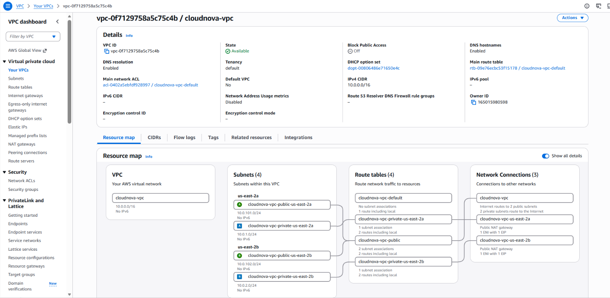

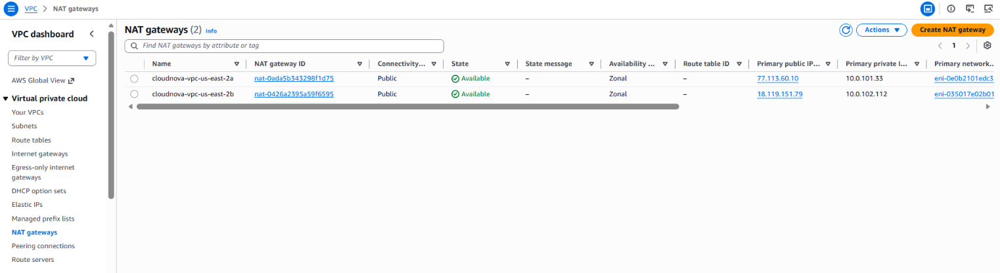

```
Console → VPC → Subnets → select a public subnet → Tags tab
  → kubernetes.io/role/elb = 1 ✅
```
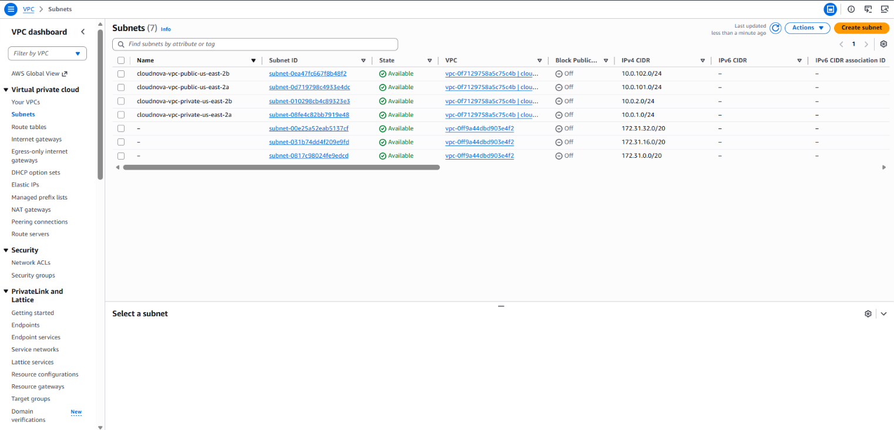

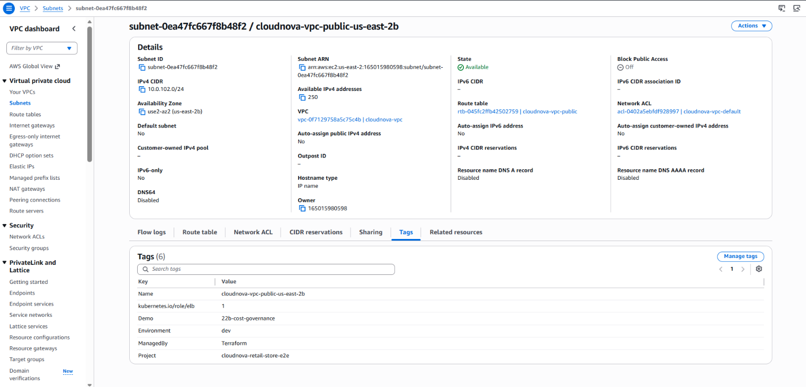


---

## Part C — EKS Cluster (Auto Mode)

Part C creates the EKS cluster itself, configured for Auto Mode with
no legacy authentication and no OIDC identity provider.

### Step 7 — Add eks.tf

This step writes the cluster resource and both IAM roles it depends
on — the cluster's own role, now with the additional Auto-Mode-specific
policies and trust-policy action found this session, and a separate
role for the nodes Auto Mode manages on your behalf.

Create a file **eks.tf** and add the below content:

This file contains everything needed to bring up the EKS control
plane itself: two IAM roles, the cluster resource configured for Auto
Mode, and the access entry granting your own identity admin rights on it.

```hcl
resource "aws_iam_role" "eks_cluster" {
  name = "cloudnova-eks-cluster-role"

  assume_role_policy = jsonencode({
    Version = "2012-10-17"
    Statement = [{
      Effect    = "Allow"
      Principal = { Service = "eks.amazonaws.com" }
      Action    = ["sts:AssumeRole", "sts:TagSession"]
      # ↑ sts:TagSession added this session (VERIFY 1) — confirmed
      # required by AWS's own docs for Auto Mode cluster roles, and
      # specifically for tag propagation to AWS Load Balancer
      # resources created via this demo's own Ingress in Part D.
    }]
  })
}

resource "aws_iam_role_policy_attachment" "eks_cluster_policy" {
  role       = aws_iam_role.eks_cluster.name
  policy_arn = "arn:aws:iam::aws:policy/AmazonEKSClusterPolicy"
}

# ── Auto Mode-specific policies on the CLUSTER's own role ────────────────
# Added this session: confirmed against AWS's own official documentation
# that these are attached alongside AmazonEKSClusterPolicy — they map
# onto Auto Mode's compute/storage/load-balancing/networking
# capabilities, which the base cluster policy alone doesn't cover.
resource "aws_iam_role_policy_attachment" "eks_cluster_auto_mode_policies" {
  for_each = toset([
    "arn:aws:iam::aws:policy/AmazonEKSComputePolicy",
    "arn:aws:iam::aws:policy/AmazonEKSBlockStoragePolicy",
    "arn:aws:iam::aws:policy/AmazonEKSLoadBalancingPolicy",
    "arn:aws:iam::aws:policy/AmazonEKSNetworkingPolicy",
  ])
  role       = aws_iam_role.eks_cluster.name
  policy_arn = each.value
}

# ── Auto Mode's own node role — distinct from the cluster's role above ──
# Confirmed required per VERIFY 1: AWS's own API rejects a cluster with
# node_role_arn set but node_pools omitted (or vice versa) — the two
# arguments are conditionally coupled, not independently optional.
resource "aws_iam_role" "eks_auto_node" {
  name = "cloudnova-eks-auto-node-role"

  assume_role_policy = jsonencode({
    Version = "2012-10-17"
    Statement = [{
      Effect    = "Allow"
      Principal = { Service = "ec2.amazonaws.com" }
      Action    = "sts:AssumeRole"
      # ↑ this role does NOT need sts:TagSession — confirmed against
      # AWS's own docs; that requirement is specific to the cluster
      # role above, not the node role.
    }]
  })
}

resource "aws_iam_role_policy_attachment" "eks_auto_node_policy" {
  for_each = toset([
    "arn:aws:iam::aws:policy/AmazonEKSWorkerNodeMinimalPolicy",
    "arn:aws:iam::aws:policy/AmazonEC2ContainerRegistryPullOnly",
  ])
  role       = aws_iam_role.eks_auto_node.name
  policy_arn = each.value
}

resource "aws_eks_cluster" "main" {
  name     = "cloudnova-eks"
  role_arn = aws_iam_role.eks_cluster.arn
  version  = "1.36" # [UNVERIFIED] the version AWS selected by default in the verification run — confirm against the current EKS version calendar before pinning

  # Required whenever Auto Mode is enabled — see VERIFY 1. Left at the
  # provider default (true), AWS rejects the create request outright.
  bootstrap_self_managed_addons = false

  vpc_config {
    subnet_ids = concat(module.vpc.private_subnets, module.vpc.public_subnets)
  }

  compute_config {
    enabled       = true                                 # Auto Mode
    node_pools    = ["general-purpose", "system"]         # confirmed required alongside node_role_arn — VERIFY 1
    node_role_arn = aws_iam_role.eks_auto_node.arn         # confirmed required alongside node_pools — VERIFY 1
  }

  kubernetes_network_config {
    elastic_load_balancing {
      enabled = true   # required for built-in ALB support
    }
  }

  storage_config {
    block_storage {
      enabled = true
    }
  }

  access_config {
    authentication_mode = "API"   # modern access-entry auth, not aws-auth ConfigMap
  }

  depends_on = [
    aws_iam_role_policy_attachment.eks_cluster_policy,
    aws_iam_role_policy_attachment.eks_cluster_auto_mode_policies,
  ]
}

resource "aws_eks_access_entry" "admin" {
  cluster_name  = aws_eks_cluster.main.name
  principal_arn = data.aws_caller_identity.current.arn   # your own IAM identity
}

resource "aws_eks_access_policy_association" "admin" {
  cluster_name  = aws_eks_cluster.main.name
  principal_arn = aws_eks_access_entry.admin.principal_arn
  # ↑ referencing the access entry's own attribute — rather than
  # repeating data.aws_caller_identity.current.arn as a second literal
  # — creates a dependency edge so Terraform creates the entry first.
  # Confirmed necessary this session (VERIFY 1): without this
  # reference, the two resources have no dependency edge between them
  # and Terraform may create them in parallel, and the association can
  # fail with ResourceNotFoundException if it runs before the entry
  # finishes.
  policy_arn = "arn:aws:eks::aws:cluster-access-policy/AmazonEKSClusterAdminPolicy"

  access_scope {
    type = "cluster"
  }
}

data "aws_caller_identity" "current" {}
```

This step also extends `outputs.tf` (originally recreated from 22b in
Part A), so Step 9's `kubectl` configuration below can read the
cluster name back from Terraform instead of relying on a hardcoded
string.

Add to **outputs.tf**:

```hcl
output "cluster_name" {
  description = "Name of the EKS cluster"
  value       = aws_eks_cluster.main.name
}

output "cluster_arn" {
  description = "ARN of the EKS cluster"
  value       = aws_eks_cluster.main.arn
}

output "cluster_endpoint" {
  description = "API server endpoint for the EKS cluster"
  value       = aws_eks_cluster.main.endpoint
}

output "cluster_version" {
  description = "Kubernetes version the control plane runs"
  value       = aws_eks_cluster.main.version
}

output "cluster_role_arn" {
  description = "IAM role the EKS service assumes for this cluster"
  value       = aws_iam_role.eks_cluster.arn
}

output "node_role_arn" {
  description = "IAM role attached to Auto Mode nodes"
  value       = aws_iam_role.eks_auto_node.arn
}

output "account_id" {
  description = "AWS account ID — used to build the ECR image URI"
  value       = data.aws_caller_identity.current.account_id
}

output "kubeconfig_command" {
  description = "Command that points kubectl at this cluster"
  value       = "aws eks update-kubeconfig --name ${aws_eks_cluster.main.name} --region ${var.aws_region} --profile ${var.aws_profile}"
}
```

> **VERIFY 1, restated at the point of use:** the `compute_config`
> block's `node_pools`/`node_role_arn` pairing and
> `bootstrap_self_managed_addons` are both confirmed via real,
> reproduced AWS API errors. The cluster-role policy attachments and
> the `sts:TagSession` trust-policy action are confirmed directly
> against AWS's own official documentation — not just inferred from
> external examples.

> **Same-as-Demo-08 note, restated:** `data.aws_caller_identity` here
> is the identical construct Demo 08 taught — reused to grant your own
> IAM identity cluster access, not a new data source.

### Step 8 — Apply

This step applies the cluster itself — expect this to genuinely take
10–15 minutes, not a hung terminal.

```bash
terraform plan
terraform apply
```

`apply` creates 12 resources: two IAM roles, seven policy attachments,
the cluster, the access entry, and the access policy association. In
the verification run they were created across three `apply` runs
because of the two gaps VERIFY 1 originally flagged:

| Run | Outcome |
|---|---|
| 1 | 9 created (both roles, seven attachments). Cluster failed: `bootstrapSelfManagedAddons must be set to false` |
| 2 | Cluster created in **9m22s**, access entry created. Association failed: `ResourceNotFoundException` (404) |
| 3 | Association created. `Resources: 1 added` |

With both fixes already in the `eks.tf` above, one `apply` is expected
to create all 12 in a single run. That has not been re-run yet — treat
it as the next thing to confirm. **[UNVERIFIED]**

```
aws_eks_cluster.main: Creation complete after 9m22s [id=cloudnova-eks]
```

Cluster creation genuinely takes about ten minutes. A `terraform
destroy` of the same cluster took 9m51s in the verification run.

Two settings appear in state that this demo did not choose, and both
are worth a decision before production use:
`upgrade_policy { support_type = "EXTENDED" }` (an extended-support
setting whose cost differs from standard support; confirm current
pricing before relying on either) and `vpc_config` with
`endpoint_public_access = true` and `public_access_cidrs =
["0.0.0.0/0"]` (the API server endpoint is reachable from anywhere on
the internet by default — tightening this is out of scope for this
demo, but worth knowing before treating the cluster as production-ready).

> **Bolded takeaway:** EKS cluster creation genuinely takes 10–15
> minutes — this isn't a hung terminal. This is a real, worth-planning-around
> characteristic of EKS specifically, unlike most resources this
> series has built so far.

### Step 9 — Configure kubectl

This step points `kubectl` at the new cluster and confirms Auto Mode
has already provisioned at least one node, without you creating it
directly.

```bash
$(terraform output -raw kubeconfig_command)
kubectl get nodes
```

```
Added new context arn:aws:eks:us-east-2:<ACCOUNT_ID>:cluster/cloudnova-eks to /home/<USER>/.kube/config
No resources found
```

`No resources found` is the correct result here, not a fault. Auto
Mode launches nodes only when a pod needs one, so a freshly created
cluster has none. `aws eks list-nodegroups --cluster-name
cloudnova-eks --region us-east-2` also returns an empty list, because
Auto Mode does not use node groups at all.

To watch Auto Mode provision a node, schedule a throwaway workload:

```bash
kubectl create deployment pause-test --image=registry.k8s.io/pause:3.9 --replicas=1
kubectl get pods -w
```

```
pause-test-556cf9c57-rxt98   0/1     Pending             0   9s
pause-test-556cf9c57-rxt98   0/1     ContainerCreating   0   19s
pause-test-556cf9c57-rxt98   1/1     Running             0   23s
```

```bash
kubectl get nodes -o wide
```

```
NAME                  STATUS   ROLES    AGE    VERSION               INTERNAL-IP   EXTERNAL-IP   OS-IMAGE                                                              CONTAINER-RUNTIME
i-03565916779bff19c   Ready    <none>   113s   v1.36.2-eks-bca9cf6   10.0.2.104    <none>         Bottlerocket (EKS Auto, Standard) 2026.9.14 (aws-k8s-1.36-standard)  containerd://2.2.7+bottlerocket
```

The node is an EC2 instance Auto Mode chose (`c6a.large` in
`us-east-2b` in this run), named by its instance ID. You did not
create it.

```bash
kubectl delete deployment pause-test
```

> **Bolded takeaway:** Auto Mode did this, automatically, in response
> to the throwaway deployment's compute needs. This is the practical
> meaning of "Auto Mode manages compute for you."

### Step 9a — Verify the cluster's configuration

This step confirms in AWS itself, not just in Terraform, that Auto
Mode, API authentication and the load-balancing flag are on.

```bash
aws eks describe-cluster --name "$(terraform output -raw cluster_name)" --region us-east-2 \
  --query 'cluster.{Status:status,Version:version,Platform:platformVersion,Compute:computeConfig,Auth:accessConfig.authenticationMode,LB:kubernetesNetworkConfig.elasticLoadBalancing}'
```
Output:
```
{
    "Status": "ACTIVE",
    "Version": "1.36",
    "Platform": "eks.14",
    "Compute": {
        "enabled": true,
        "nodePools": [
            "general-purpose",
            "system"
        ],
        "nodeRoleArn": "arn:aws:iam::165015980598:role/cloudnova-eks-auto-node-role"
    },
    "Auth": "API",
    "LB": {
        "enabled": true
    }
}

```

Expected: `Status` is `ACTIVE`, `Compute.enabled` is `true` with the
`general-purpose` and `system` node pools, `Auth` is `API`, and
`LB.enabled` is `true`.


<details>
<summary>Additional flags (reference, not required)</summary>

```bash
aws eks list-access-entries --cluster-name "$(terraform output -raw cluster_name)" --region us-east-2
```
Output:
```
{
    "accessEntries": [
        "arn:aws:iam::165015980598:role/aws-service-role/eks.amazonaws.com/AWSServiceRoleForAmazonEKS",
        "arn:aws:iam::165015980598:role/cloudnova-eks-auto-node-role",
        "arn:aws:iam::165015980598:user/test"
    ]
}
```
```bash
aws eks list-associated-access-policies --cluster-name "$(terraform output -raw cluster_name)" \
  --principal-arn "$(aws sts get-caller-identity --query Arn --output text)" --region us-east-2
```
Output:
```
{
    "associatedAccessPolicies": [
        {
            "policyArn": "arn:aws:eks::aws:cluster-access-policy/AmazonEKSClusterAdminPolicy",
            "accessScope": {
                "type": "cluster",
                "namespaces": []
            },
            "associatedAt": "2026-09-24T23:31:29.921000-04:00",
            "modifiedAt": "2026-09-24T23:31:29.921000-04:00"
        }
    ],
    "clusterName": "cloudnova-eks",
    "principalArn": "arn:aws:iam::165015980598:user/test"
}
```


The two lists should show your identity with `AmazonEKSClusterAdminPolicy` at cluster scope.

</details>

```
Console → EKS → Clusters → cloudnova-eks → Overview
  → Status Active, Kubernetes version 1.36, Auto Mode enabled ✅
```
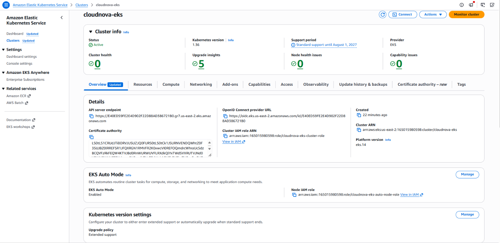
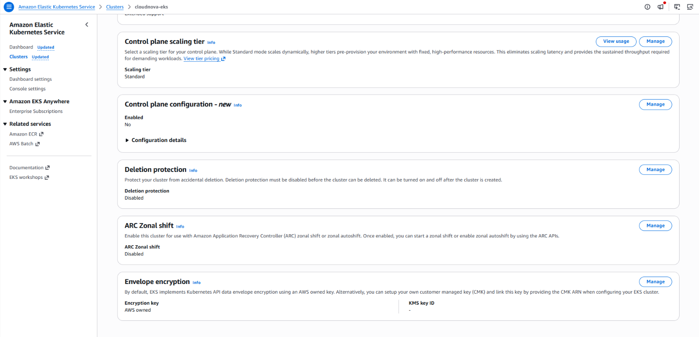

```
Console → EKS → Clusters → cloudnova-eks → Access tab
  → your IAM identity listed with AmazonEKSClusterAdminPolicy ✅
```
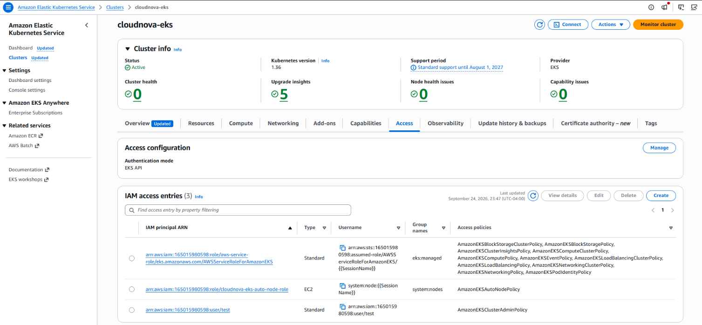
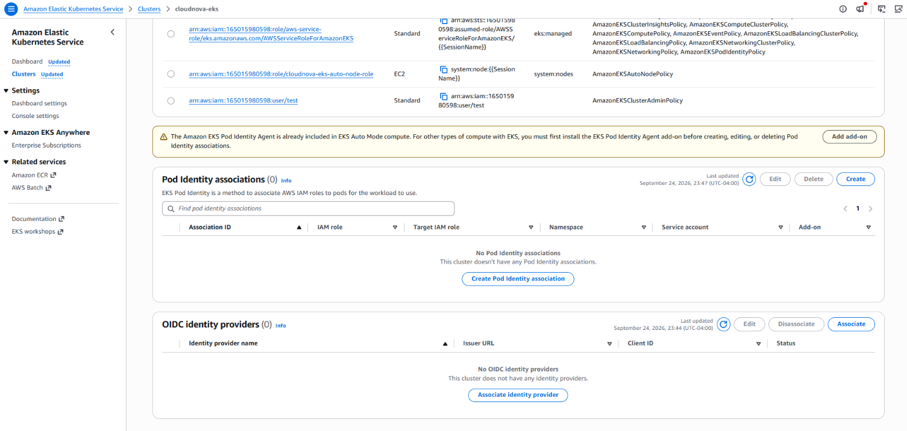


---

## Part D — Kubernetes Manifests: Deployment, Service, Ingress

Part D deploys the UI service itself, entirely via `kubectl` — nothing
in this Part touches Terraform.

### Step 10 — Add ui-deployment.yaml

This step writes the Deployment that will actually run the UI
container, pulling its image from 22c's persistent ECR repo.


This file describes a single-replica Deployment running the UI
service's real image, the same image 22c pushed. The image reference
is a shell variable, filled in Step 12a, not a value typed by hand —
a literal, unreplaced placeholder here is a real, previously-hit
failure mode (see Troubleshooting).

**`k8s/ui-deployment.yaml`:**

```yaml
apiVersion: apps/v1
kind: Deployment
metadata:
  name: ui
spec:
  replicas: 1
  selector:
    matchLabels:
      app: ui
  template:
    metadata:
      labels:
        app: ui
    spec:
      containers:
        - name: ui
          image: ${UI_IMAGE}
          # ↑ filled from Terraform's repository_urls output in Step
          # 12a — 22c's persistent ECR repo, not the public gallery
          ports:
            - containerPort: 8080
```

### Step 11 — Add ui-service.yaml

This step writes the internal Service that gives the Deployment's pods
a stable address for the Ingress to route to.

This file exposes the UI Deployment internally, on port 80, routing to
the container's actual port 8080.

**`k8s/ui-service.yaml`:**

```yaml
apiVersion: v1
kind: Service
metadata:
  name: ui
spec:
  selector:
    app: ui
  ports:
    - port: 80
      targetPort: 8080
  type: ClusterIP
```

### Step 12 — Add the Ingress and its IngressClassParams

This step writes the three objects that together trigger Auto Mode's
built-in ALB provisioning and bind 22c's certificate to it.


This file contains the `IngressClassParams` binding the certificate
and scheme, the `IngressClass` referencing Auto Mode's own ALB
controller, and the `Ingress` itself routing all traffic to the UI
Service. Like the Deployment above, the certificate ARN is filled from
a real Terraform output in Step 12a, never typed by hand.

**`k8s/ui-ingress.yaml`:**
```yaml
apiVersion: eks.amazonaws.com/v1
kind: IngressClassParams
metadata:
  name: alb-cloudnova
spec:
  scheme: internet-facing
  # ↑ added this session (VERIFY 3) — AWS's own official example sets
  # scheme here, on IngressClassParams, not solely via an Ingress
  # annotation
  certificateARNs:
    - "${CERT_ARN}"
    # ↑ filled from Terraform's certificate_arn output in Step 12a

---
apiVersion: networking.k8s.io/v1
kind: IngressClass
metadata:
  name: alb-cloudnova
spec:
  controller: eks.amazonaws.com/alb
  parameters:
    apiGroup: eks.amazonaws.com
    kind: IngressClassParams
    name: alb-cloudnova

---
apiVersion: networking.k8s.io/v1
kind: Ingress
metadata:
  name: ui
  annotations:
    alb.ingress.kubernetes.io/scheme: internet-facing
    # ↑ left in place as a harmless, belt-and-suspenders duplicate of
    # IngressClassParams's own scheme field above — the annotation's
    # own behavior under Auto Mode isn't confirmed either way, so the
    # IngressClassParams field above is what this demo actually relies
    # on (VERIFY 3)
    alb.ingress.kubernetes.io/healthcheck-path: /
    alb.ingress.kubernetes.io/success-codes: "200,303"
    # ↑ the UI's root path answers 303 → /home, so the target group
    # must accept 303 (VERIFY 5). The annotation name is
    # success-codes, not healthcheck-success-codes — the latter is not
    # a documented AWS Load Balancer Controller annotation and is
    # silently ignored. [UNVERIFIED under Auto Mode] Step 14 confirms
    # the matcher actually changed.
spec:
  ingressClassName: alb-cloudnova
  rules:
    - http:
        paths:
          - path: /
            pathType: Prefix
            backend:
              service:
                name: ui
                port:
                  number: 80
```

### Step 12a — Fill in the two variables and apply from the right directory

This step turns the two variable placeholders into real values and
applies the manifests. The `k8s/` folder sits at `src/k8s/`, one level
above the Terraform directory, so the first command changes directory.

```bash
cd ..            # from src/phase-3-onward to src/
export UI_IMAGE="$(terraform -chdir=phase-3-onward output -json repository_urls | jq -r '.ui'):latest"
export CERT_ARN="$(terraform -chdir=phase-3-onward output -raw certificate_arn)"
echo "$UI_IMAGE"; echo "$CERT_ARN"     # both must print full values, no < > characters
```

```bash
for f in k8s/ui-deployment.yaml k8s/ui-service.yaml k8s/ui-ingress.yaml; do
  envsubst '${UI_IMAGE} ${CERT_ARN}' < "$f" | kubectl apply -f -
done
```

`envsubst` ships in the `gettext-base` package on Ubuntu. Applying the
files with a plain `kubectl apply -f k8s/` instead sends the literal
text `${UI_IMAGE}` to the cluster, and the pod ends in
`InvalidImageName` — a real failure this demo's verification run hit,
see Troubleshooting.

### Step 13 — Watch the ALB provision

This step watches the Ingress until Auto Mode finishes provisioning a
real ALB for it.

```bash
kubectl get ingress ui --watch
```

The first result shows an empty `ADDRESS`, and it stays empty until
every prerequisite is right. On the verification run, the ALB name
and DNS name appeared only after the certificate ARN was corrected,
roughly twenty minutes after the first apply:

```
NAME   CLASS           HOSTS   ADDRESS                                                                 PORTS   AGE
ui     alb-cloudnova   *       k8s-default-ui-347001aa2d-1978452335.us-east-2.elb.amazonaws.com        80      24m
```

If `ADDRESS` stays empty, read the Ingress events before anything
else:

```bash
kubectl describe ingress ui
```

A wrong certificate ARN produces this repeating event
(`FailedDeployModel`):

```
Failed deploy model due to operation error Elastic Load Balancing v2: CreateListener,
api error ValidationError: Certificate ARN 'arn:aws:acm:us-east-2:<ACCOUNT_ID>:certificate/<CERT_ID>' is not valid
```

The pod may sit in `Pending` first. `kubectl describe pod` shows
`FailedScheduling … no nodes available` together with `Pod should
schedule on: nodeclaim/general-purpose-…`, which means Auto Mode is
launching a node. In the verification run this took about fifteen
minutes, against about two minutes for the earlier `pause-test` node
— the cause of the difference was not isolated. **[UNVERIFIED]** A
single transient `FailedCreatePodSandBox … failed to setup network
policy` event followed and cleared by itself without intervention.

`PORTS` shows `80`, but the ALB has only an `HTTPS:443` listener —
Step 14 confirms this directly.

---

## Part E — Verify

Part E confirms the entire chain actually works, ending with a real
browser-equivalent request over the public internet.

### Step 14 — Confirm the load balancer in the CLI and the Console

This step checks each link in the chain separately, so a failure
points at one link.

```bash
kubectl get ingress ui
kubectl get pods -l app=ui
```

The command worth memorising is the target-health check, because it
proves the ALB can reach the pod, which nothing else in this demo does:

```bash
TG_ARN=$(aws elbv2 describe-target-groups --region us-east-2 --query 'TargetGroups[0].TargetGroupArn' --output text)
aws elbv2 describe-target-health --region us-east-2 --target-group-arn "$TG_ARN"
```

`TargetGroups[0]` assumes this is the only target group in the region.
In the verification run the result before the health-check fix was:

```json
"Target": { "Id": "10.0.2.98", "Port": 8080, "AvailabilityZone": "us-east-2b" },
"TargetHealth": {
  "State": "unhealthy",
  "Reason": "Target.ResponseCodeMismatch",
  "Description": "Health checks failed with these codes: [303]"
}
```

`Target.ResponseCodeMismatch` with a code that looks fine means the
health-check *matcher* is wrong, not the app. Confirm what the target
group actually uses:

```bash
aws elbv2 describe-target-groups --region us-east-2 --target-group-arns "$TG_ARN" \
  --query 'TargetGroups[0].{Path:HealthCheckPath,Matcher:Matcher}'
```

Expected with `success-codes: "200,303"` honoured: `Matcher.HttpCode`
is `200,303` and the target becomes `healthy`. If `HttpCode` still
reads `200`, Auto Mode is not honouring the annotation — record which
result you actually see, since this is not yet confirmed either way
(VERIFY 5).

<details>
<summary>Additional flags (reference, not required)</summary>

```bash
ALB_HOST=$(kubectl get ingress ui -o jsonpath='{.status.loadBalancer.ingress[0].hostname}')
aws elbv2 describe-load-balancers --region us-east-2 \
  --query 'LoadBalancers[].{Name:LoadBalancerName,Scheme:Scheme,State:State.Code,Dns:DNSName}'
```

</details>

```
Console → EC2 → Load Balancers → k8s-default-ui-… ✅
  → State Active, Scheme Internet-facing, 2 Availability Zones
Console → EC2 → Load Balancers → k8s-default-ui-… → Listeners and rules ✅
  → HTTPS:443, default certificate app.rselvantech.com
Console → EC2 → Load Balancers → k8s-default-ui-… → Network mapping ✅
  → the two public subnets, 10.0.101.0/24 and 10.0.102.0/24
Console → EC2 → Target Groups → k8s-default-ui-… → Targets tab
  → the pod IP, health status
Console → Certificate Manager → app.rselvantech.com → Associated resources
  → the ALB listed
```

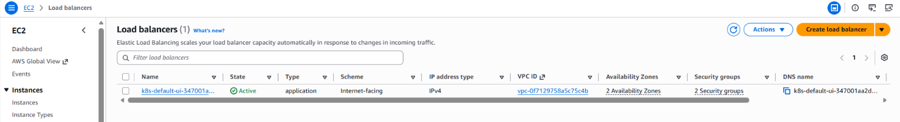

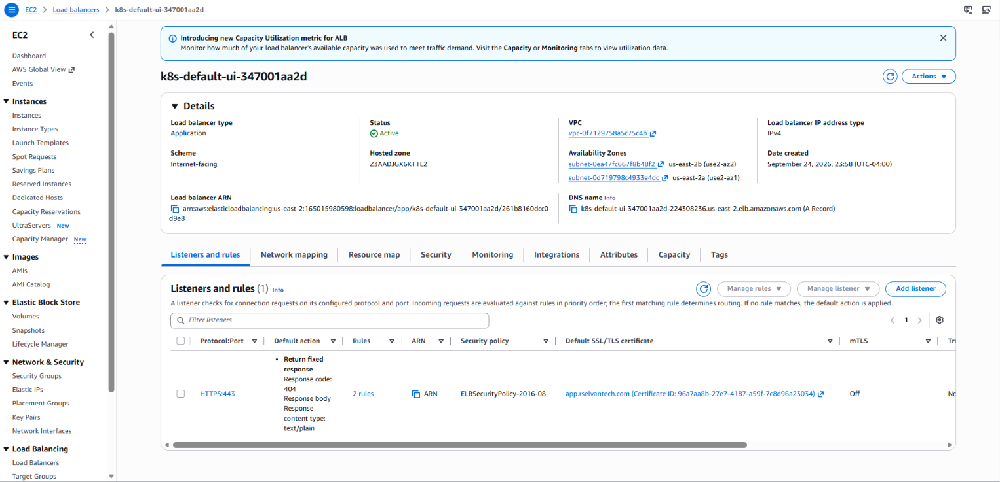

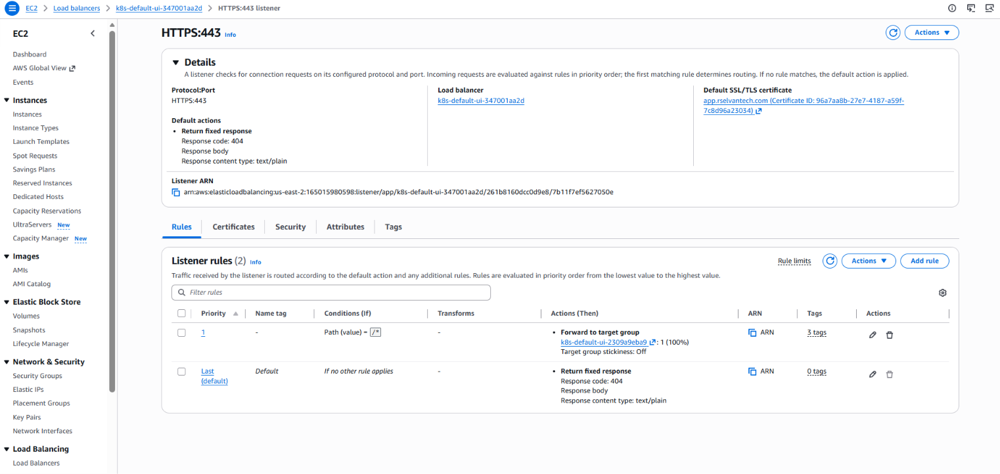

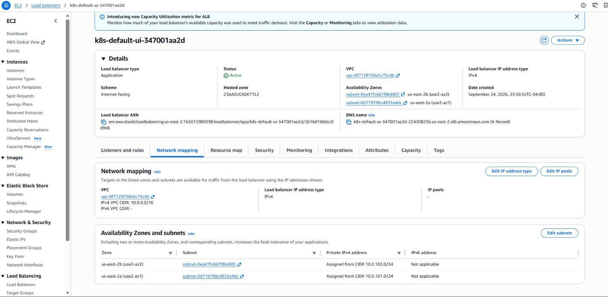

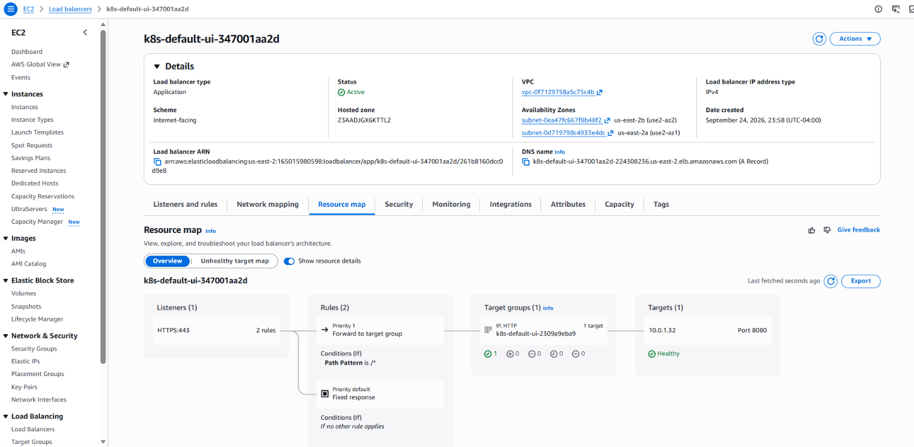


> **What the screenshots confirm.** The ALB is `Internet-facing`,
> active, and placed in the two public subnets. Its only listener is
> `HTTPS:443` with `app.rselvantech.com` as the default certificate,
> so 22c's certificate is bound. The default action for unmatched
> requests is a fixed `404` response, and one further rule routes to
> the UI target group. The security policy is `ELBSecurityPolicy-2016-08`,
> which matches the controller's documented default and is an older
> policy; whether to set a newer one via `IngressClassParams` is a
> hardening decision this demo does not make.

### Step 15 — Send a real HTTPS request

This step sends the request that proves the chain end to end. The demo
does not create a DNS record for `app.rselvantech.com`, so the request
goes to the ALB's own hostname.

```bash
ALB_HOST=$(kubectl get ingress ui -o jsonpath='{.status.loadBalancer.ingress[0].hostname}')
curl -vk "https://${ALB_HOST}/" 2>&1 | grep -E "subject:|issuer:|HTTP/2|location:"
```

```
*  subject: CN=app.rselvantech.com
*  issuer: C=US; O=Amazon; CN=Amazon RSA 2048 M04
< HTTP/2 303
< location: /home
```

A **`303` with an empty body is the correct result for a UI-only
deployment.** Two details from the verification run are worth knowing:

- `curl -sk` printed **nothing**, because the response is a redirect
  with `content-length: 0` and `-s` hides everything else. Read the
  status with `-v`, or with `curl -sk -o /dev/null -w "%{http_code}
  %{redirect_url}\n" "https://${ALB_HOST}/"`.
- The handshake presents `CN=app.rselvantech.com` on a connection made
  to a different hostname, so a verified request needs `--resolve`. In
  the run, `-k` was used and curl reported `unable to get local issuer
  certificate (20)`. Whether that came from the hostname mismatch or a
  gap in the local CA store was not isolated. **[UNVERIFIED]**

```bash
ALB_IP=$(dig +short "$ALB_HOST" | head -1)
curl -sS -o /dev/null -w "%{http_code}\n" --resolve app.rselvantech.com:443:"$ALB_IP" https://app.rselvantech.com/
```

> 📷 [Screenshot placeholder: the output of the verified `--resolve` request without `-k`]

Following the redirect to `/home` returns HTTP 500 until Demo 23
deploys the backend services, because the UI falls back to
`localhost:8081` for the catalog (see Appendix A, Incident 7).

> **Bolded takeaway:** this is the first genuinely externally-reachable
> thing this entire series has built. Every prior demo verified success
> via Console or CLI output; this one is verified by a real request
> actually reaching a running application over the public internet.

---

## Cleanup

**Unlike 22a/22b/22c, and unlike this demo's own Part A, this demo's
Cleanup step tears down Part B and Part C's resources.** The EKS
control plane's flat fee means an idle cluster costs money whether or
not anything is deployed to it — there's no cost argument for leaving
it standing between sessions. **Part A's recreated resources (22b's
governance layer, 22c's ECR repos and certificate) are untouched by
this Cleanup, the same way 22c's own Cleanup left 22b's resources
alone.**

### Step 16 — Destroy Part B and Part C's resources

This step removes the cost-accruing layer while leaving Part A's
baseline alone. Run each command from the directory shown, because a
`terraform destroy -target` run from the wrong directory reports
success while doing nothing — a real mistake made during this demo's
verification run.

```bash
# from src/  — where k8s/ lives
kubectl delete -f k8s/
```

Kubernetes-created AWS resources go first. Auto Mode deletes the ALB
and its security groups asynchronously, and a VPC cannot be deleted
while they exist. Confirm the ALB is gone before continuing:

```bash
aws elbv2 describe-load-balancers --region us-east-2 --query 'LoadBalancers[].LoadBalancerName'
```

Expected: an empty list.

```bash
cd phase-3-onward     # the directory with the .tf files and backend.tf
terraform destroy -target=aws_eks_cluster.main -target=module.vpc -target=module.eks_sg
```

The verification run planned exactly what was expected:

```
Plan: 0 to add, 0 to change, 30 to destroy.
…
Destroy complete! Resources: 30 destroyed.
```

The 30 are the access entry and association (both depend on the
cluster), the cluster itself, the four `eks_sg` resources, and the 22
VPC resources. Cluster destruction took 9m51s in the verification run,
and each NAT gateway took about a minute and a quarter.

**Nine resources survive this teardown by design of `-target`:** the
two IAM roles (`cloudnova-eks-cluster-role`, `cloudnova-eks-auto-node-role`)
and their seven policy attachments. `-target` follows *dependents* of
a target, not its dependencies, and the roles are dependencies of the
cluster, not the other way around. They cost nothing and are reused on
the next session's `apply`.

The warning Terraform prints is worth reading, and is accurate — this
demo uses `-target` deliberately, because it's the first demo where
one shared state spans two different teardown lifecycles at once:

```
The -target option is not for routine use, and is provided only for
exceptional situations such as recovering from errors or mistakes ...
```

**The mistake to avoid:** in the verification run the same command was
first run from `src/`, which contains no Terraform configuration. It
printed `No changes. No objects need to be destroyed` and `Destroy
complete! Resources: 0 destroyed`, and nothing had actually been
removed — the command succeeded and did nothing, which is easy to
mistake for a real teardown.

```bash
terraform state list     # 22b's six resources, 22c's ECR and ACM, and the nine IAM objects remain
```

```
Console → EKS → Clusters → confirm cloudnova-eks: GONE ✅
Console → EC2 → Load Balancers → confirm the ALB: GONE ✅
Console → VPC → Your VPCs → confirm cloudnova-vpc: GONE ✅
Console → VPC → NAT gateways → confirm both gateways Deleted ✅
Console → SNS, Budgets, ECR, Certificate Manager → 22b's and 22c's resources: STILL PRESENT ✅
Console → IAM → Roles → the two cloudnova-eks roles: STILL PRESENT ✅
```

> 📷 [Screenshot placeholder: `terraform state list` after teardown, showing 22b's, 22c's, and the surviving IAM resources]

> ⚠️ **Confirm 22a/22b/22c's resources are still standing before you
> end the session** — this demo's teardown should touch nothing from
> those three. `terraform state list` should still show 22b's six
> resources and 22c's ECR/ACM resources untouched.

---

## What You Learned

1. ✅ This demo's own directory must recreate three prior demos' worth
   of accumulated configuration before adding anything new — the same
   shared-state requirement 22c established, extended one demo
   further, and confirmed via a clean "no changes" `plan` before any
   new resource is written.
2. ✅ EKS Auto Mode manages compute, storage, and load balancing for
   you — a genuinely different operating model than self-managed nodes
   or managed node groups, not just "the same thing with less config."
3. ✅ This cluster creates no OIDC identity provider — Pod Identity
   (Demo 24) doesn't need one, unlike the IRSA pattern many EKS
   tutorials default to.
4. ✅ Auto Mode's built-in ALB support replaces what used to require a
   separately-installed AWS Load Balancer Controller — one
   `elastic_load_balancing { enabled = true }` flag, plus standard
   Kubernetes `Ingress`/`IngressClass`/`IngressClassParams` objects.
5. ✅ Auto Mode's ALB has real, easy-to-miss prerequisites beyond the
   cluster resource itself: `bootstrap_self_managed_addons = false`,
   the cluster role's trust policy needs `sts:TagSession`, and VPC
   subnets need `kubernetes.io/role/elb`/`internal-elb` tags — none of
   these is optional, all are confirmed against a real `apply` or
   AWS's own documentation.
6. ✅ This series draws a deliberate line: Terraform builds the
   cluster, `kubectl` deploys the workload — not a gap, a scope choice.
   Because there is no self-managed controller pod, `kubectl describe
   ingress` is the diagnostic, not `kubectl logs`.
7. ✅ EKS cluster creation genuinely takes 10–15 minutes — plan around
   this real characteristic rather than assuming something's stuck.
8. ✅ A module version or input shape reused across two demos should
   be resolved against real documentation when it appears to
   conflict — not assumed wrong on either side without checking.
9. ✅ Tearing down part of a shared-state directory's resources
   without touching the rest requires `-target`, not a plain
   `destroy` — and `-target` follows dependents, not dependencies, so
   some resources (here, the two IAM roles) deliberately survive.
10. ✅ A module's own defaults can silently produce an invalid
    real-world API request — the ECR module's default lifecycle
    policy is empty, and AWS rejects empty lifecycle policies outright.
    Reading a module's actual default values matters, not just its
    documented examples.
11. ✅ A literal placeholder left in a Kubernetes manifest fails inside
    the cluster (`InvalidImageName`, a rejected certificate ARN), not
    at `terraform validate` — filling placeholders from real outputs
    before `kubectl apply` avoids an entire class of mistakes.
12. ✅ "Unhealthy" needs two separate reads: the target's own
    `Reason`/`Description`, and the target group's actual
    `HealthCheckPath`/`Matcher` configuration — they can disagree with
    what an annotation was meant to set, especially if the annotation
    name itself was wrong.

---

## Cert Tips

### Exam Objective Mapping

| Demo concept / command | Exam objective | Notes |
|---|---|---|
| Recreating an accumulated multi-demo configuration before extending it | TA-004 Obj 3 — Terraform workflow, state | Same principle 22c established, now spanning three demos' worth of files |
| `terraform destroy -target` | TA-004 Obj 3 — Terraform workflow | Supported, but Terraform's own warning calls it "not for routine use." Here it is used because one state spans two teardown lifecycles. Know both the flag and the caveat — `-target` follows dependents, not dependencies |
| `aws_eks_cluster`, `compute_config` | TA-004 Obj 4a — Resource configuration | Provider-specific resource; Auto Mode-specific arguments are newer additions worth confirming against current provider docs |
| `access_config.authentication_mode = "API"` | TA-004 Obj 4a | Modern EKS access pattern — know this exists as an alternative to the legacy `aws-auth` ConfigMap approach |
| Terraform's scope boundary at the cluster (not into Kubernetes objects) | TA-004 Obj 1 — IaC concepts generally | Recognize this as a deliberate tooling boundary, not a Terraform limitation |
| Module defaults producing an invalid real-world request | TA-004 Obj 4a/9 | A config can `validate` and `plan` cleanly and still fail at `apply` against the real API, if a module's own default value is itself invalid |

### Common Exam Traps

| Scenario | What the task actually requires | Common wrong approach |
|---|---|---|
| "One directory's state tracks resources with two different teardown lifecycles — how do you destroy only some of them?" | `terraform destroy -target=<address>`, repeated or combined for each resource/module that should go | Assuming a plain `destroy` can somehow be scoped by convention alone, or that state must be split into separate files to allow partial teardown |
| "Does every EKS cluster require an OIDC identity provider?" | No — only clusters using IRSA for pod-level IAM identity need one. Pod Identity doesn't. | Assuming OIDC providers are a universal EKS requirement because most IRSA tutorials pair them by default |
| "Can Terraform directly manage Kubernetes Deployments inside an EKS cluster it created?" | Yes, technically, via a Kubernetes provider — but this series deliberately doesn't, drawing a scope line at the cluster boundary | Assuming Terraform *must* manage in-cluster objects because it created the cluster |
| "Is `compute_config { enabled = true }` a complete Auto Mode configuration?" | No — `node_pools` and `node_role_arn` are conditionally required together, `bootstrap_self_managed_addons` must be `false`, the cluster's own role needs Auto-Mode-specific policies beyond the base cluster policy, and its trust policy needs `sts:TagSession` | Assuming a single boolean flag fully configures a feature this substantial |
| "Will an Ingress with a correct certificate ARN reliably get an internet-facing ALB, given `elastic_load_balancing.enabled = true`?" | Not necessarily — subnets must also be tagged `kubernetes.io/role/elb`/`internal-elb`, or Auto Mode has no signal for where the ALB belongs | Assuming the cluster-level flag alone is sufficient without any VPC-side configuration |
| "A module call passes `terraform validate` and `plan` cleanly — does that mean `apply` will succeed?" | Not necessarily — a module's own default argument value can itself be invalid against the real provider API, and neither `validate` nor `plan` catches that; only a real `apply` does | Assuming a clean `plan` guarantees a clean `apply` |
| "Two resources reference the same literal string (e.g. the same IAM principal ARN) — does Terraform treat them as ordered?" | No — a shared literal creates no dependency edge. Only a reference to the other resource's own attribute does | Assuming Terraform infers ordering from matching values |

### Exam Task — Write a complete configuration

**Task:** Write an `aws_eks_cluster` resource configured for Auto Mode
with API-based access, no legacy `aws-auth` ConfigMap dependency.

**Block types required:** `resource` (×3 minimum: cluster + its IAM
role + the Auto Mode node role)

**Official documentation:**
- [`aws_eks_cluster` resource](https://registry.terraform.io/providers/hashicorp/aws/latest/docs/resources/eks_cluster)

**What to practise:**
1. Open the page above — check the `compute_config` and `access_config` arguments specifically, including whether `node_pools`/`node_role_arn` are genuinely required or merely commonly set, and whether `bootstrap_self_managed_addons` has a documented interaction with Auto Mode
2. Write the configuration from scratch without looking at this demo's `src/` files
3. Validate: `terraform init && terraform validate`

<details>
<summary>Reference solution (open only after attempting)</summary>

```hcl
resource "aws_iam_role" "eks_cluster" {
  name = "exam-task-eks-role"
  assume_role_policy = jsonencode({
    Version = "2012-10-17"
    Statement = [{
      Effect    = "Allow"
      Principal = { Service = "eks.amazonaws.com" }
      Action    = ["sts:AssumeRole", "sts:TagSession"]
    }]
  })
}

resource "aws_iam_role" "eks_auto_node" {
  name = "exam-task-node-role"
  assume_role_policy = jsonencode({
    Version = "2012-10-17"
    Statement = [{
      Effect    = "Allow"
      Principal = { Service = "ec2.amazonaws.com" }
      Action    = "sts:AssumeRole"
    }]
  })
}

resource "aws_eks_cluster" "exam_task" {
  name     = "exam-task-cluster"
  role_arn = aws_iam_role.eks_cluster.arn

  bootstrap_self_managed_addons = false

  vpc_config {
    subnet_ids = ["subnet-aaa", "subnet-bbb"]
  }

  compute_config {
    enabled       = true
    node_pools    = ["general-purpose", "system"]
    node_role_arn = aws_iam_role.eks_auto_node.arn
  }

  access_config {
    authentication_mode = "API"
  }
}
```

**Arguments you must know without looking up:**
- `compute_config.enabled = true` is what turns on Auto Mode
- `bootstrap_self_managed_addons = false` is required whenever Auto Mode is enabled — the provider default (`true`) is rejected by a real API error
- `access_config.authentication_mode = "API"` avoids the legacy
  `aws-auth` ConfigMap pattern entirely
- `compute_config.node_pools` and `compute_config.node_role_arn` are
  conditionally required together — setting one without the other
  produces a real AWS API rejection, confirmed against a documented
  error
- The cluster role's trust policy needs both `sts:AssumeRole` and
  `sts:TagSession` — the node role's needs only `sts:AssumeRole`

</details>

---

## Troubleshooting

| Error | Cause | Fix |
|---|---|---|
| `terraform init` fails with no backend configured, or a local-state warning | Part A's `backend.tf` was never recreated in this directory | Recreate every file Part A lists before proceeding — see Steps 2–3 |
| `terraform plan` (Step 4) proposes destroying 22b's or 22c's resources | Part A's recreation was incomplete — one or more files from 22b or 22c is missing from this directory | Diff this directory's files against 22b's and 22c's own Lab content file-by-file; re-run Step 4 until it reports no changes (or a clean first-time create, if this is a genuinely first run) before touching Part B |
| `terraform apply` (Step 4) fails on `aws_ecr_lifecycle_policy.this[0]` with `'lifecyclePolicyText' failed to satisfy constraint: 'Member must have length greater than or equal to 100'` | The ECR module defaults `create_lifecycle_policy = true` with `repository_lifecycle_policy` defaulting to `""` — AWS rejects an empty lifecycle policy outright (see VERIFY 4) | Confirm `ecr.tf` (Step 3) supplies a real `repository_lifecycle_policy` (the same one Demo 19 uses) — never leave this argument at its default |
| `InvalidParameterException: … bootstrapSelfManagedAddons must be set to false` | `aws_eks_cluster` omits `bootstrap_self_managed_addons = false`, and the provider default (`true`) is sent | Add `bootstrap_self_managed_addons = false` — see VERIFY 1 |
| `ResourceNotFoundException` on `AssociateAccessPolicy` right after the access entry is created | The association ran in parallel with the entry because nothing ordered them | Reference `aws_eks_access_entry.admin.principal_arn` in the association, then re-apply — see VERIFY 1 |
| `Error: No value for required variable` on `notification_email`/`monthly_budget_limit` | `terraform.tfvars` wasn't created in this directory | Create it with your real values — see the end of Step 2 |
| `kubectl` commands return `Unauthorized` | Your IAM identity has no access entry on the cluster | Confirm `aws_eks_access_entry` + `aws_eks_access_policy_association` were applied for your actual identity |
| `kubectl get nodes` returns `No resources found` on a new cluster | Auto Mode launches nodes only when a pod needs one | Expected. Schedule a pod (Step 9) and a node appears |
| Pod status `InvalidImageName` | `${UI_IMAGE}` or an `<ACCOUNT_ID>` placeholder reached the cluster unreplaced | Fill the variables and apply with `envsubst` (Step 12a); check with `kubectl describe pod` |
| Ingress never gets an `ADDRESS` | `elastic_load_balancing.enabled` wasn't set, subnets aren't tagged `kubernetes.io/role/elb`/`internal-elb`, the cluster role's trust policy is missing `sts:TagSession`, or `IngressClassParams`/`IngressClass` weren't applied before the `Ingress` itself | Check, in order: subnet tags (VERIFY 3), cluster role trust policy (VERIFY 1), then apply order (`kubectl apply -f k8s/` applies all files, but check individual object status if one lags) |
| `kubectl describe ingress` shows `Certificate ARN … is not valid` | The certificate ARN in `IngressClassParams.spec.certificateARNs` is a placeholder or wrong | Use `terraform output -raw certificate_arn`; re-apply `k8s/ui-ingress.yaml` |
| `curl -sk https://<ALB>/` prints nothing | The response is a `303` with an empty body and `-s` hides it | Use `-v`, or `-o /dev/null -w "%{http_code}\n"` |
| Target `unhealthy`, `Target.ResponseCodeMismatch … [303]` | The root path answers `303`, and the target group accepts only `200` | Set `alb.ingress.kubernetes.io/success-codes: "200,303"` (the annotation is `success-codes`, not `healthcheck-success-codes`) and check the matcher — VERIFY 5 |
| Target `unhealthy` with `[500]` after pointing the health check at `/home` | `/home` calls backend services that are not deployed yet | Health-check `/` in this demo; `/home` works after Demo 23 |
| `terraform apply` hangs for 10+ minutes on `aws_eks_cluster` | Normal — not stuck | EKS cluster creation genuinely takes this long; let it complete |
| `InvalidParameterException` mentioning `nodeRoleArn`/`nodePool` | `node_role_arn` and `node_pools` were set independently instead of together | Set both together — this is a confirmed, coupled requirement, not an optional pairing |
| `terraform destroy -target=…` says `0 destroyed` | Run from a directory with no Terraform configuration (`src/` instead of `src/phase-3-onward`) | `cd` into the directory with `backend.tf` and rerun |
| `terraform destroy` at Cleanup proposes destroying 22b's or 22c's resources too | A plain `destroy` was run instead of the `-target`-scoped command in Step 16 | Cancel (don't confirm with `yes`); re-run Step 16's exact `-target` command instead |
| `security_group_id` output reference fails with `Unsupported attribute` | Only relevant if `variables.tf`/`outputs.tf` reference `module.eks_sg`'s output by its pre-`v6.0.0` name — this module now pins `~> 6.0` (upgraded this session, VERIFY 2), whose output is named `id`, not `security_group_id` | Update any such reference to `.id`, matching the fix Demo 17 needed for the identical module upgrade |

---

## Break-Fix Scenario

One deliberate error. Diagnose using `kubectl` output — do not look at
the answer first.

```bash
kubectl apply -f break-fix/
kubectl get ingress broken-ui
kubectl describe ingress broken-ui
```

This file is a single Ingress with one typo'd `ingressClassName` that
`kubectl apply` accepts without error — diagnose why it never gets an
ALB before revealing the answer.

**break-fix/broken-ingress.yaml:**

```yaml
apiVersion: networking.k8s.io/v1
kind: Ingress
metadata:
  name: broken-ui
spec:
  ingressClassName: alb-cloudnov   # Error — typo
  rules:
    - http:
        paths:
          - path: /
            pathType: Prefix
            backend:
              service:
                name: ui
                port:
                  number: 80
```

<details>
<summary>Reveal answer — attempt diagnosis first</summary>

**Error — `ingressClassName: alb-cloudnov`**
Missing the trailing "a" — doesn't match the real `IngressClass` name
(`alb-cloudnova`). Unlike a Terraform reference error, this doesn't
fail loudly at apply time — `kubectl apply` succeeds, but the Ingress
never gets an ALB provisioned, because no matching `IngressClass`
exists. `kubectl describe ingress broken-ui` will show no `ADDRESS`
and often an event mentioning the class couldn't be found. Fix:
correct the typo to match the real `IngressClass` name exactly.

</details>

**Cleanup:**

```bash
kubectl delete -f break-fix/
```

---

## Interview Prep

**Q1. A reviewer asks why this demo's Part A recreates files that have nothing to do with EKS at all — the SNS topic, Budget, ECR repos.**
Because this project's Phase 3+ demos share one continuously-growing state, and Terraform reconciles that real, applied state against whatever `.tf` files are physically present in the directory a command is run from. This directory needs to point at the same shared state 22b and 22c already populated — not a fresh one — so its local files have to fully declare what's already there, or the next `plan` proposes destroying whatever's undeclared. This demo's Part A isn't scope creep; it's the same requirement 22c's own Part A established, extended one demo further to also cover 22c's own files.

**Q2. A teammate asks why this demo's Cleanup uses `terraform destroy -target` instead of a plain `destroy`, when every prior demo either used a plain `destroy` or no destroy at all.**
Because this is the first demo where one directory's state genuinely spans two different teardown lifecycles at once — Part A's recreated resources (22b's governance layer, 22c's ECR/ACM objects) are meant to persist for the rest of the project, while Part B/C's resources (the VPC, security group, and EKS cluster) are meant to be torn down every session. A plain `destroy` doesn't distinguish between them — it destroys everything the state tracks. `-target`, scoped to exactly the resources and modules this demo's own Part B/C introduced, is the actual mechanism for tearing down part of a shared state without touching the rest. Worth acknowledging in the answer: Terraform prints that `-target` is meant for exceptional situations, so this is a deliberate trade-off here, and a reviewer may reasonably ask whether separate state for the two lifecycles would be cleaner.

**Q3. A teammate asks why this cluster doesn't have an OIDC identity provider, since every IRSA tutorial they've seen always creates one.**
Because this project uses EKS Pod Identity for per-service IAM identity instead of IRSA — a decision made once at the project level (Demo 24 builds on it, this demo just doesn't need to anticipate it). IRSA specifically requires an OIDC identity provider because it works by federating a Kubernetes service account's token to an IAM role via OIDC trust. Pod Identity associates a service account with a role directly through the EKS Pod Identity API — no OIDC federation involved at all. The pairing of "every EKS cluster gets an OIDC provider" is an IRSA-tutorial convention, not a universal EKS requirement.

**Q4. Someone asks why Terraform built the cluster but `kubectl` deployed the actual application — wouldn't it be cleaner to do everything in Terraform?**
It's a deliberate scope boundary, not laziness or a gap. This series teaches Terraform, and while Terraform *can* manage Kubernetes objects via a dedicated provider, doing so here would mean introducing a second provider ecosystem this curriculum otherwise never covers, just to avoid a second CLI tool. Most real teams draw exactly this line too — infrastructure provisioning (Terraform, or similar) and application deployment (kubectl, Helm, a CD pipeline) are commonly separate concerns, often even owned by different teams. Recognizing where a tool's job legitimately ends is as much a skill as knowing how to use the tool.

**Q5. A reviewer asks how you'd explain why Auto Mode's built-in ALB support matters, versus just installing the AWS Load Balancer Controller yourself.**
The self-managed controller is a real, capable option — many production clusters use it — but it's a component you install, upgrade, and operate yourself: its own Helm chart, its own IAM role, its own version compatibility to track against your Kubernetes version. Auto Mode's built-in support turns that into a single `elastic_load_balancing { enabled = true }` flag on the cluster resource — AWS operates the controller for you, as a managed component. The trade-off is less flexibility than the self-managed controller offers, and — as this demo's own verification work found — real prerequisites of its own (subnet tags, a cluster-role trust-policy action, `bootstrap_self_managed_addons`) that aren't obvious from the single flag alone. So it's not strictly better in every case, and it isn't zero-configuration either — just simpler for the common case this demo needed, once those prerequisites are actually met.

**Q6. A reviewer notices this demo's security-group module call uses a different version and shape than Demo 17's, for the identical module. How should that be handled?**
By checking the module's real, current documentation rather than assuming either demo is simply wrong — and that's exactly what happened here. `terraform-aws-modules/security-group/aws`'s `~> 5.0` line (this demo's original pin) genuinely used the older list-based shape, and its `~> 6.0` line (Demo 17) genuinely uses the newer object-map shape — both were individually correct for the version each one pinned. What looked like a contradiction was actually two demos each doing the right thing for a different major version of the same module, with nothing cross-referencing that fact. Once that was confirmed, this demo was upgraded to `~> 6.0` to match Demo 17 — a separate decision from the verification itself, made straightforward here because this demo's VPC/security-group layer never persists between sessions, so there was no existing applied state the upgrade needed to migrate.

**Q7. A reviewer asks what actually made you confident the ALB would come up, beyond "the Terraform apply succeeded."**
Nothing about a successful `terraform apply` on the cluster resource actually proves the ALB will provision correctly — that's a Kubernetes-and-AWS-side outcome, downstream of the cluster existing. The real prerequisites are the subnet tags (`kubernetes.io/role/elb`/`internal-elb`) that tell Auto Mode where the ALB belongs, and the cluster role's `sts:TagSession` trust-policy action that lets Auto Mode propagate tags to the load balancer it creates — both confirmed directly against AWS's own documentation, neither visible from the `aws_eks_cluster` resource succeeding on its own. This is a good example of why "the apply succeeded" and "the thing actually works end-to-end" are different claims, worth checking separately — and in this demo's own verification run, the ALB's `ADDRESS` still took roughly twenty minutes to appear even with the infrastructure correct, because of a separate, application-layer certificate-ARN mistake in the Kubernetes manifest.

**Q8. A reviewer asks how the ECR lifecycle policy bug (VERIFY 4) actually got caught, and what it says about relying on a module's examples versus its defaults.**
It was caught by a real `terraform apply` failing, not by reading documentation — the module's README examples all show `repository_lifecycle_policy` set explicitly to something real, which never surfaces what happens if you *don't* set it. Checking the module's actual `variables.tf` afterward showed why: `create_lifecycle_policy` defaults to `true`, paired with `repository_lifecycle_policy` defaulting to an empty string, and AWS rejects an empty lifecycle policy outright. Neither `terraform validate` nor `terraform plan` caught this — both only check structure and schema, not whether a default value would actually be accepted by the real API. Worth adding: the first fix reached for was disabling the feature outright, which worked but quietly broke this demo's own "matches Demo 19's technique exactly" claim — Demo 19's real code never hits this bug because it always supplies a real policy. Once that comparison was actually possible, the corrected fix supplies that same policy instead, which is both the fix and the thing that keeps the "same technique" claim true.

**Q9. A reviewer asks how a literal `<ACCOUNT_ID>` placeholder in a Kubernetes manifest actually surfaces as a failure, compared to the same mistake in Terraform.**
Differently, and less obviously. In Terraform, an unset or malformed value is often caught at `validate` or `plan` time, before anything real happens. A Kubernetes manifest has no such check — `kubectl apply` accepts any syntactically valid YAML, placeholder text included, and the failure only shows up once the cluster tries to actually use that value: an image reference with `<` and `>` in it becomes a real, malformed image name and the pod sits in `InvalidImageName`; a placeholder certificate ARN gets sent to the AWS Load Balancer Controller, which rejects it when it tries to create the HTTPS listener. Both failures are diagnosed with `kubectl describe`, not with anything Terraform-side — which is part of why this demo fills both values from real Terraform outputs via `envsubst` rather than asking the reader to edit the YAML by hand.

---

## Key Takeaways

1. **This project's shared state now spans three demos' worth of
   accumulated files before this demo adds anything new — and that
   requirement compounds with every subsequent demo, not just this
   one.** Confirming a clean "no changes" `plan` after recreation is
   the real safety check, not `init` succeeding alone.

2. **EKS Auto Mode is a genuinely different operating model, not a
   config toggle on the same underlying cluster type.** It manages
   compute, storage, and load balancing for you — know what that
   actually changes about your own responsibilities.

3. **Not every EKS cluster needs an OIDC identity provider.** That
   pairing is specific to IRSA; Pod Identity, this project's actual
   choice, has no such dependency.

4. **A managed feature can still have real prerequisites worth knowing
   before you need them.** Auto Mode's built-in ALB support is
   genuinely simpler than the self-managed controller — but "one
   boolean flag" undersells what it actually needs: correctly tagged
   subnets, a trust policy that permits tag propagation, and
   `bootstrap_self_managed_addons = false`, none of which this demo's
   cluster resource surfaces on its own.

5. **A deliberate tooling scope boundary is a design choice, not a
   gap.** Terraform building the cluster and `kubectl` deploying the
   workload is a considered line, worth being able to explain, not
   just a fact to accept.

6. **Some AWS operations genuinely take a long time, and that's not a
   sign of failure.** EKS cluster creation's 10–15 minutes is real —
   build your own expectations (and any automation timeouts) around
   the actual number, not an assumption borrowed from faster resources.

7. **An apparent cross-demo conflict is worth resolving against real
   documentation, not resolving by assumption.** This demo's own
   security-group module pin looked like a contradiction with Demo
   17's until actually checked — the check, not a guess in either
   direction, is what settled it.

8. **When one directory's state spans resources with different
   teardown lifecycles, `-target` is the actual mechanism for a
   partial teardown — and it follows dependents, not dependencies.**
   This is the first demo in the series where a plain `destroy` would
   be actively wrong, not just unnecessary, and where some created
   resources (the IAM roles) are expected to survive a "teardown" step.

9. **A module's own default values can be invalid against the real
   API, and neither `validate` nor `plan` catches that.** The ECR
   module's default lifecycle policy is empty, and AWS rejects empty
   lifecycle policies outright — only a real `apply` surfaced this.

10. **A literal placeholder in a Kubernetes manifest fails inside the
    cluster, not at `terraform validate`.** Filling both the image
    reference and the certificate ARN from real Terraform outputs
    avoids an entire, easy-to-hit class of mistakes.

11. **"Unhealthy" is not one fact — it's two, and they can disagree.**
    The target's own `Reason`/`Description` says what happened; the
    target group's actual `HealthCheckPath`/`Matcher` says what AWS is
    checking. A misnamed annotation can leave the two looking
    unrelated to each other.

> **Demo scope:** Primary concept: standing up an EKS Auto Mode
> cluster and routing real traffic to a single service through its
> built-in ALB support. Supporting concepts: recreating a
> three-demo-deep shared configuration correctly before extending it,
> why Pod Identity removes the OIDC-provider requirement, the
> Terraform/`kubectl` scope boundary, the ALB's real subnet-tag and
> trust-policy prerequisites, resolving apparent cross-demo
> version/shape conflicts against real documentation, partial
> teardown via `-target`, a module default that fails only at real
> `apply` time, and diagnosing placeholder and health-check failures
> that only surface inside the running cluster.
> Estimated completion time: 90–120 minutes (includes the baseline
> recreation; EKS cluster creation and ALB provisioning both take
> real, multi-minute wall-clock time; and, per the verification run,
> real troubleshooting of the IAM ordering, placeholder, and
> health-check issues documented in Appendix A).
> Checkpoints: 5 natural stopping points (end of Part A, end of
> Part B, end of Part C, end of Part D, end of Part E).

---

## Quick Commands Reference

| Command | Description |
|---|---|
| `aws eks update-kubeconfig --name <CLUSTER> --region <REGION>` | Configures `kubectl` to talk to a specific EKS cluster |
| `kubectl get nodes` | Lists the cluster's nodes — Auto Mode-provisioned, not manually created |
| `kubectl apply -f <DIR>/` | Applies every manifest in a directory |
| `kubectl get ingress <NAME> --watch` | Watches an Ingress until it gets a real ALB address |
| `kubectl describe ingress <NAME>` | Shows events explaining why an Ingress hasn't provisioned, if it hasn't — the primary Auto Mode diagnostic, since there is no controller pod to check logs on |
| `aws elbv2 describe-target-health --target-group-arn <ARN>` | Shows whether the ALB considers the pod healthy, and why not |
| `curl -v https://<ADDRESS>/` | Real HTTPS request against the Ingress's ALB — the actual proof this demo worked; use `-v` or `-w "%{http_code}"`, since a redirect response can print nothing under `-s` |
| `terraform init` / `validate` / `plan` / `apply` | Standard workflow — `plan` immediately after Part A's recreation is this demo's own shared-state safety check |
| `terraform destroy -target=<address>` | Partial teardown — used in Cleanup to remove only Part B/C's resources, leaving Part A's recreated baseline intact; follows dependents of the target, not its dependencies |

---

## Next Demo

**Demo 23 — EKS: Full Service Mesh:** scales this same pattern to all
five `retail-store-sample-app` services. **Corrected this session —
this no longer requires an open routing decision.** An earlier draft
of this section described a three-option `IngressGroup` decision
(share one ALB across services with path-based rules, use five
separate ALBs, or fall back to the self-managed controller), reasoning
from Auto Mode's built-in ALB support not supporting `IngressGroup` in
the abstract. That framing has since been checked against the app's
actual reference architecture and corrected: only the UI service is
externally routed (via this demo's own Ingress) — Catalog, Cart,
Orders, and Checkout are reached internally, via `ClusterIP` Services
and UI's own service-to-service calls, matching
`retail-store-sample-app`'s real architecture. Since there's only ever
one `Ingress` in this project (UI's, built here), the `IngressGroup`
limitation never actually arises — Demo 23 adds no new Ingress/ALB
work at all. Demo 23 is also where the UI's `/home` route stops
returning 500, once the backend services it calls actually exist.

**Also worth anticipating for whoever builds Demo 23:** its own Part A
will need to extend this same baseline-recreation pattern one demo
further — recreating 22b's, 22c's, *and* this demo's `vpc.tf`/`eks.tf`
verbatim, plus this demo's `outputs.tf` additions, before adding
Catalog/Cart/Orders/Checkout's own manifests. The pattern compounds
with every demo; nothing about it changes going forward, only the
number of files being recreated.

---

## Appendix A — Troubleshooting Log and Lessons Learned

This appendix records the problems hit while building and verifying
this demo, in the order they occurred, with what was checked and what
fixed each one. Read it once now, and again the next time an EKS or
ALB problem does not have an obvious cause. Every entry below was
observed in a real run unless it is marked `[UNVERIFIED]`.

### Incident 1 — Cluster creation rejected: `bootstrapSelfManagedAddons`

**Symptom:** `terraform apply` failed at `aws_eks_cluster.main` after
the IAM roles were created.

**What was checked:** the error text, and the plan, which showed
`bootstrap_self_managed_addons = true`.

**Cause:** Auto Mode requires the argument to be `false`, and the
provider default is `true`.

**Fix:** set `bootstrap_self_managed_addons = false` and re-apply.

**Lesson:** IAM objects created before the failing resource remain, so
a re-apply resumes rather than restarts.

### Incident 2 — Access policy association returned 404

**Symptom:** the cluster and access entry were created, then
`AssociateAccessPolicy` failed with `ResourceNotFoundException`.

**Cause:** the entry and association were created in parallel; the
association reused a string instead of referencing the entry.

**Fix:** reference `aws_eks_access_entry.admin.principal_arn`. A plain
re-apply also worked.

**Lesson:** a resource that shares only literal strings with another
has no dependency edge. Reference the other resource's attribute when
order matters.

### Incident 3 — `kubectl get nodes` showed nothing

**Symptom:** `No resources found`, and `aws eks list-nodegroups`
returned `[]`.

**Cause:** not a fault. Auto Mode has no node groups and creates nodes
on demand.

**Check:** a throwaway `pause-test` deployment went `Pending` to
`Running` in 23 seconds, and a `c6a.large` Bottlerocket node appeared.

**Lesson:** an empty node list on an Auto Mode cluster is normal until
a pod needs capacity.

### Incident 4 — UI pod stuck in `Pending`, then `InvalidImageName`

**Symptom:** the pod was `Pending` for about fifteen minutes, then
`InvalidImageName`.

**What was checked:** `kubectl describe pod`.
- Events: `FailedScheduling … no nodes available` and `Pod should
  schedule on: nodeclaim/general-purpose-…`.
- The image field read `<ACCOUNT_ID>.dkr.ecr.us-east-2.amazonaws.com/…`.

**Causes, two separate ones:**
1. Auto Mode was launching a node. It took about fifteen minutes this
   time against about two minutes for the earlier node. **The cause
   of the delay was not isolated.** `[UNVERIFIED]`
2. The manifest still held the literal `<ACCOUNT_ID>` placeholder.

**Fix:** fill the image from `terraform output` and re-apply. The pod
then reached `Running`, pulling the 248 MB image in about four and a
half seconds.

**Lesson:** two different problems can hide behind one `Pending` pod.
Fix what is visible, then read the events again.

### Incident 5 — Ingress `ADDRESS` stayed empty

**Symptom:** the pod was `Running` and the Ingress had no address for
over twenty minutes.

**What was checked:** `kubectl describe ingress ui` showed repeated
`FailedDeployModel` events: `Certificate ARN '…/<CERT_ID>' is not
valid`. `aws acm list-certificates` confirmed the real certificate was
`ISSUED`. `kubectl get pods -n kube-system` showed **no** load
balancer controller pod, because Auto Mode runs it as a managed
component.

**Cause:** `IngressClassParams.spec.certificateARNs` held the
`<CERT_ID>` placeholder.

**Fix:** put the real ARN in the manifest and re-apply. `ADDRESS`
populated afterwards.

**Lesson:** `describe ingress` events are the diagnostic for a missing
ALB. There is no controller pod to read logs from.

### Incident 6 — `curl -sk` printed nothing

**Symptom:** an HTTPS request to the ALB returned no output at all.

**Check:** `curl -vsk` showed a completed TLS handshake
(`CN=app.rselvantech.com`) and `HTTP/2 303`, `content-length: 0`,
`location: /home`.

**Cause:** the response is a redirect with no body, and `-s`
suppresses the rest.

**Lesson:** use `-v`, or `-o /dev/null -w "%{http_code}"`, when the
body may be empty.

### Incident 7 — Target unhealthy: `303`, then `500`

**Symptom:** the target group reported the pod `unhealthy`.

**Stage one, `[303]`:** the root path answers `303`, and the default
matcher accepts only `200`. The Ingress was annotated
`alb.ingress.kubernetes.io/healthcheck-success-codes: "200,303"`.
After several minutes the target was still `unhealthy … [303]`.
- **Likely cause:** the controller's documented annotation is
  `alb.ingress.kubernetes.io/success-codes`. `healthcheck-success-codes`
  is not in its annotation list. `[DOCS]`
- The path annotation, by contrast, worked: after `healthcheck-path:
  /home` the target group's `HealthCheckPath` read `/home` while
  `Matcher.HttpCode` still read `200`.

**Stage two, `[500]`:** with the health check on `/home`, the target
returned 500. The UI log showed `Connection refused:
localhost/127.0.0.1:8081` and `:8082`, and `kubectl describe pod`
showed `Environment: <none>`.

**Cause:** the UI calls the catalog and other services, and with no
endpoints configured it defaults to `localhost`. Those services do not
exist until Demo 23.

**What was not shown in this run:** a healthy target. **The
environment-variable names an earlier draft of this appendix
described for wiring up the backend services (for example
`ENDPOINTS_CATALOGUE`, `ENDPOINTS_CARTS`, `ENDPOINTS_ORDERS`) have not
been checked against the application's own documentation and do not
appear in the verification transcript.** `[UNVERIFIED]`

**Fix under test:** health-check `/`, accept `303` via `success-codes`,
and confirm the matcher changed (Step 14). `[UNVERIFIED]`

**Lesson:** "unhealthy" needs two reads: the target's own reason
(`Description`) and the target group's actual configuration
(`describe-target-groups`). Check the annotation name against the
controller's documentation before assuming the annotation was ignored.

### Incident 8 — `terraform destroy -target` reported 0 destroyed

**Symptom:** `No changes. No objects need to be destroyed` and
`Destroy complete! Resources: 0 destroyed`.

**Cause:** the command was run from `src/`, which has no Terraform
configuration.

**Fix:** run from `src/phase-3-onward`. The plan then showed `30 to
destroy`, and `Destroy complete! Resources: 30 destroyed`.

**Also observed:** the two IAM roles and seven attachments were not in
the plan and survived.

**Lesson:** a successful-looking destroy is not evidence anything was
destroyed. Read the resource count.

### Summary of checks

| Stage | Command | What it showed | Result |
|---|---|---|---|
| Cluster create | `terraform apply` | `bootstrapSelfManagedAddons must be set to false` | Fixed |
| Access | `terraform apply` | `ResourceNotFoundException` (404) | Fixed by reference |
| Nodes | `kubectl get nodes` | `No resources found` | Expected |
| Pod | `kubectl describe pod` | `FailedScheduling`, then `InvalidImageName` | Fixed |
| Ingress | `kubectl describe ingress` | `Certificate ARN … is not valid` | Fixed |
| HTTPS | `curl -vk` | `HTTP/2 303`, `location: /home` | Correct for UI-only |
| Target health | `describe-target-health` | `[303]`, then `[500]` | Open until Step 14 re-test |
| Teardown | `terraform destroy -target` | 0 destroyed, then 30 destroyed | Wrong directory first |

### Lessons learned

1. **Read the resource count** after every `apply` and `destroy`, not
   just the word "complete".
2. **Placeholders in manifests fail in the cluster, not in
   Terraform.** Fill them from outputs before applying.
3. **A missing ALB is diagnosed from Ingress events**, because Auto
   Mode has no controller pod to inspect.
4. **Check annotation names against the controller's documentation.**
   A misspelled annotation is silently ignored.
5. **An empty node list on Auto Mode is normal.** Nodes appear when a
   pod needs one, and can take from seconds to many minutes.
6. **Delete Kubernetes-created AWS resources before `terraform
   destroy`**, and confirm the ALB is gone.
7. **Two problems can share one symptom.** Re-read the events after
   each fix.

---

## Appendix — Anki Cards

**22d-eks-single-service-anki.csv:**

```
#deck:Terraform AWS Mastery::Phase 3 - Real AWS Infrastructure::22d-eks-single-service
#separator:Comma
#columns:Front,Back,Tags
"Why does this demo's Part A recreate files from BOTH 22b and 22c, not just the immediately preceding demo?","Phase 3+ demos share one continuously-growing state. This directory must fully declare every resource already tracked in that shared state - which by this demo means everything 22b (state guardrails) and 22c (ECR/ACM) applied - or an incomplete plan risks proposing their destruction.","demo22d,state,gotcha"
"What does a clean 'No changes' terraform plan immediately after Part A's recreation actually prove?","That the recreation was both correct and complete - this directory's local files now fully and accurately describe every resource the real, shared state already tracks, with nothing missing that would otherwise be proposed for destruction.","demo22d,state,workflow"
"What does EKS Auto Mode manage for you that a managed-node-group cluster doesn't?","Compute provisioning/scaling/patching, storage, and load balancing, end-to-end. Managed node groups still require you to choose instance types and scaling policy - Auto Mode manages compute fully.","demo22d,eks,auto-mode,ta004-obj4a"
"Why does this project's EKS cluster create no OIDC identity provider?","This project uses EKS Pod Identity for per-service IAM identity (Demo 24), not IRSA. Pod Identity associates a service account with a role directly via the EKS Pod Identity API - no OIDC federation involved at all, so no provider is needed.","demo22d,eks,pod-identity,ta004-obj4a"
"What single Terraform argument enables Auto Mode's built-in ALB support?","kubernetes_network_config.elastic_load_balancing.enabled = true - replaces the need for a separately-installed AWS Load Balancer Controller.","demo22d,eks,alb,ta004-obj4a"
"What Kubernetes API object binds an existing ACM certificate to an Auto Mode Ingress?","IngressClassParams (apiGroup eks.amazonaws.com) - its certificateARNs field lists the cert ARN(s) to bind, referenced by a matching IngressClass.","demo22d,eks,alb,ingress"
"Does this series manage Kubernetes Deployments/Services/Ingresses via Terraform?","No - deliberately. Terraform builds the EKS cluster; kubectl applies the in-cluster Kubernetes manifests. A scope boundary, not a gap.","demo22d,scope,kubectl"
"Roughly how long does real EKS cluster creation take?","10-15 minutes - a genuine, real AWS characteristic, not a hung terminal or a bug.","demo22d,eks,timing"
"What does access_config.authentication_mode = \"API\" replace?","The legacy aws-auth ConfigMap approach to granting IAM identities access to an EKS cluster - the modern access-entry-based pattern.","demo22d,eks,access-entries"
"Are compute_config's node_pools and node_role_arn independently optional?","No, confirmed via a real AWS API error - setting node_role_arn without node_pools (or vice versa) is rejected with InvalidParameterException. The two are conditionally required together.","demo22d,eks,auto-mode,gotcha"
"What extra trust-policy action does the EKS cluster's own IAM role need for Auto Mode, beyond sts:AssumeRole?","sts:TagSession - confirmed required by AWS's own docs, needed for tag propagation from Kubernetes to AWS Load Balancer resources Auto Mode creates. The node role does NOT need this - only the cluster role.","demo22d,eks,iam,gotcha"
"What VPC subnet tags does EKS Auto Mode require to discover which subnets an ALB belongs in?","kubernetes.io/role/elb on public subnets (internet-facing load balancers), kubernetes.io/role/internal-elb on private subnets (internal load balancers). Without these, Auto Mode has no signal for correct subnet placement.","demo22d,eks,alb,vpc,gotcha"
"Where does AWS's own official example set an Auto Mode ALB's internet-facing/internal scheme?","On IngressClassParams.spec.scheme, not via the alb.ingress.kubernetes.io/scheme Ingress annotation. The annotation's behavior under Auto Mode isn't confirmed in AWS's own documentation either way.","demo22d,eks,alb,ingress,gotcha"
"Why does this demo's Cleanup use terraform destroy -target instead of a plain destroy?","This directory's state spans two different teardown lifecycles at once: Part A's recreated resources (22b/22c's) must persist, while Part B/C's resources (VPC, security group, cluster) must be torn down every session. -target scopes the destroy to only the latter.","demo22d,teardown,gotcha"
"Why does ecr.tf supply a real repository_lifecycle_policy instead of leaving the module default?","A real, reproduced bug: the module defaults create_lifecycle_policy = true paired with repository_lifecycle_policy defaulting to an empty string, and AWS rejects an empty lifecycle policy outright at apply time. Neither validate nor plan catches this - only a real apply does. Corrected fix: supply a real policy matching Demo 19's own, rather than disabling the feature - this is both the fix and what keeps this demo's 'same technique as Demo 19' claim true.","demo22d,ecr,gotcha"
"Which argument must be false on aws_eks_cluster whenever EKS Auto Mode is enabled, and what happens otherwise?","bootstrap_self_managed_addons = false. The provider default is true, and AWS rejects the create request with InvalidParameterException: When EKS Auto Mode is enabled, bootstrapSelfManagedAddons must be set to false.","demo22d,eks,auto-mode,gotcha"
"What is the AWS Load Balancer Controller annotation for extra health-check success codes, and what is its default?","alb.ingress.kubernetes.io/success-codes, default 200 (for example 200,303). healthcheck-success-codes is not in the controller's annotation list, and a misnamed annotation is silently ignored.","demo22d,eks,alb,gotcha"
"Why can curl -sk print nothing against a healthy ALB?","The UI's root path returns HTTP 303 with content-length 0. -s suppresses everything but the body, so a redirect looks like silence. Use -v, or -o /dev/null -w '%{http_code}'.","demo22d,curl,gotcha"
"After terraform destroy -target=aws_eks_cluster.main -target=module.vpc -target=module.eks_sg, which related resources are NOT destroyed?","The cluster's IAM roles and their policy attachments. -target follows dependents of a target (access entry, association) but not its dependencies, and the roles are dependencies of the cluster.","demo22d,teardown,terraform"
"How many NAT gateways does the VPC module create with enable_nat_gateway = true and no single_nat_gateway, and what does that do to the cost?","One per AZ, so two here, each with its own Elastic IP. The hourly NAT charge doubles compared with single_nat_gateway = true.","demo22d,vpc,cost"
"Two resources both reference the same literal principal ARN string. Does Terraform treat them as ordered?","No - a shared literal value creates no dependency edge. Only a reference to the other resource's own attribute (e.g. aws_eks_access_entry.admin.principal_arn) creates one, which is what fixed the ResourceNotFoundException race in this demo's access policy association.","demo22d,terraform,dependencies,gotcha"
```

---

## Appendix — Quiz

> **Note on Quiz vs. Anki:** Anki drills the individual facts (what
> Auto Mode manages, why no OIDC provider, the ALB single-flag,
> cluster-creation timing, the trust-policy and subnet-tag
> prerequisites, the shared-state recreation requirement). This Quiz
> instead works through Break-Fix diagnosis and the verification items
> in applied, scenario form, so the two together cover recall and
> applied judgment without restating the same question twice.

**22d-eks-single-service-quiz.md:**

````markdown
# Quiz — Demo 22d: EKS: Single Service (UI Only)

> Question types: True/False, Multiple Choice, Multiple Answer —
> matching the real TA-004 exam format.
> Target: 80% or above before moving to Demo 23.

---

**Q1. (Multiple Choice)** A learner starts this demo's directory fresh,
recreates 22b's files, but forgets `ecr.tf`/`acm.tf` from 22c. What
does Step 4's `terraform plan` most likely show?

- A) No changes — 22c's resources aren't relevant to this demo's own scope
- B) A proposal to destroy the 5 ECR repos and the ACM certificate, since state tracks them but this directory's local files no longer declare them
- C) An error, since Terraform detects the recreation is incomplete
- D) The missing resources are silently ignored and left alone

<details>
<summary>Answer</summary>

**B.** This is the same risk 22c's own Part A was built to prevent —
extended here to cover one more demo's files. A directory that can
reach real state but doesn't fully declare it proposes destroying
whatever's missing.

</details>

---

**Q2. (Multiple Choice)** A colleague sets `compute_config { enabled =
true, node_role_arn = aws_iam_role.node.arn }` — deliberately leaving
out `node_pools` since they only need a custom node role. What happens?

- A) This works fine — `node_pools` and `node_role_arn` are independent, optional arguments
- B) AWS rejects the cluster creation with `InvalidParameterException: When Compute Config nodeRoleArn is not null or empty, nodePool value(s) must be provided`
- C) `node_pools` silently defaults to `["general-purpose"]`
- D) Terraform catches this at `plan` time before any AWS API call happens

<details>
<summary>Answer</summary>

**B.** This is a real, documented AWS API rejection — the two
arguments are conditionally required together, not independently
optional. Terraform's own schema doesn't statically catch this; it
only surfaces once AWS's API actually evaluates the request.

</details>

---

**Q3. (Multiple Choice)** This demo's `eks_sg` module call originally
targeted a different version and input shape of
`terraform-aws-modules/security-group/aws` than Demo 17's `tier_sg`
call, for the identical module. What was the correct way to handle
that, on discovering it?

- A) Trust whichever demo you read most recently
- B) Check the module's real, current documentation — both versions may simply be correct for the major version each one pins
- C) Average the two version numbers
- D) Assume both are correct simultaneously, since Terraform would catch a real error

<details>
<summary>Answer</summary>

**B.** This is exactly what resolved this demo's own VERIFY 2 — the
`~> 5.0` and `~> 6.0` shapes were each genuinely correct for their own
version; checking the real documentation settled it, rather than
guessing or defaulting to recency. Having confirmed that, this demo
was then upgraded to `~> 6.0` for consistency with Demo 17 — the
verification and the upgrade were two separate steps, not the same one.

</details>

---

**Q4. (Multiple Choice)** `kubectl describe ingress broken-ui` shows no
`ADDRESS` and an event about a missing class. `ingressClassName:
alb-cloudnov` is set. What's wrong?

- A) The Ingress needs `apiVersion: eks.amazonaws.com/v1alpha1` instead
- B) The class name has a typo and doesn't match any real, applied `IngressClass`
- C) `kubectl apply` failed and needs to be re-run
- D) The certificate ARN is invalid

<details>
<summary>Answer</summary>

**B.** This is a plain typo (`alb-cloudnov` vs. the real
`alb-cloudnova`) — `kubectl apply` succeeds regardless, since nothing
about the string itself is invalid YAML; the Ingress just never
matches a real `IngressClass` and never gets an ALB.

</details>

---

**Q5. (Multiple Choice)** This demo's `aws_iam_role.eks_cluster`
originally only had `AmazonEKSClusterPolicy` attached. Based on real,
working Auto Mode examples, what was likely still missing?

- A) Nothing — `AmazonEKSClusterPolicy` alone is sufficient for any EKS cluster, Auto Mode or not
- B) Additional Auto-Mode-specific managed policies on the same cluster role — compute, block storage, load balancing, and networking policies that Auto Mode's own capabilities require
- C) The cluster role needs `AdministratorAccess` instead
- D) Auto Mode clusters don't use IAM roles for the cluster itself at all

<details>
<summary>Answer</summary>

**B.** Multiple real, working Auto Mode configurations attach
`AmazonEKSComputePolicy`, `AmazonEKSBlockStoragePolicy`,
`AmazonEKSLoadBalancingPolicy`, and `AmazonEKSNetworkingPolicy` to the
cluster's own role alongside the base cluster policy — this demo's
`eks.tf` has since been updated to include them.

</details>

---

**Q6. (Multiple Choice)** `terraform apply` on `aws_eks_cluster.main`
is still running after 8 minutes with no error. What should you do?

- A) Cancel it — 8 minutes indicates something is stuck
- B) Wait — EKS cluster creation genuinely takes 10–15 minutes
- C) Open a second terminal and run `terraform apply` again
- D) Run `terraform force-unlock`, assuming a stuck state lock

<details>
<summary>Answer</summary>

**B.** This is expected, real EKS behavior, not a sign of a stuck
operation — cancelling, re-applying concurrently, or force-unlocking
would all be responses to a problem that doesn't actually exist here.

</details>

---

**Q7. (Multiple Choice)** A cluster's `aws_eks_cluster` applies
successfully, `elastic_load_balancing.enabled = true` is set, and the
Ingress has a valid certificate ARN — but the ALB's `ADDRESS` never
populates. Which TWO real, confirmed prerequisites should you check
first, per this demo's own findings?

- A) Whether the VPC's public/private subnets are tagged `kubernetes.io/role/elb`/`internal-elb`
- B) Whether the Terraform state file has been manually edited
- C) Whether the cluster role's trust policy includes `sts:TagSession`
- D) Whether the AWS provider version is pinned to exactly `~> 6.47.0`

<details>
<summary>Answer</summary>

**A and C.** Both are real, AWS-documentation-confirmed prerequisites
for Auto Mode's ALB that aren't visible from the `aws_eks_cluster`
resource succeeding on its own — a missing subnet tag or a trust
policy missing `sts:TagSession` are the most likely real-world causes
of an ALB that never provisions correctly, not state corruption or an
unrelated provider version pin.

</details>

---

**Q8. (Multiple Choice)** At Cleanup, why does this demo's `terraform
destroy` command include `-target` flags instead of running plainly?

- A) `-target` is required syntax for any EKS-related resource
- B) A plain `destroy` would tear down everything this directory's state tracks, including 22b's and 22c's resources, which must survive
- C) `-target` runs faster than a plain destroy
- D) Terraform requires `-target` whenever more than one module is present

<details>
<summary>Answer</summary>

**B.** This directory's state spans resources with two different
teardown lifecycles — Part A's recreated resources must persist, Part
B/C's must not. `-target` is the actual mechanism for destroying only
the latter without touching the former.

</details>

---

**Q9. (Multiple Choice)** Part A's `apply` (Step 4) fails on all five
ECR repositories with `InvalidParameterException: ... 'Member must
have length greater than or equal to 100'`. What's the actual cause?

- A) The repository names are too short
- B) The ECR module's `create_lifecycle_policy` defaults to `true`, and its `repository_lifecycle_policy` defaults to an empty string, which AWS rejects
- C) `for_each` requires a minimum of 100 items to iterate over
- D) The IAM permissions for ECR are insufficient

<details>
<summary>Answer</summary>

**B.** This is a real, reproduced module-default bug — the module
tries to create a lifecycle policy by default, and its default policy
text is empty, which AWS's API rejects outright. The corrected fix is
supplying a real `repository_lifecycle_policy` — the same one Demo 19
already established for this identical module — not disabling the
feature via `create_lifecycle_policy = false`, which would work but
break this demo's own "same technique as Demo 19" claim.

</details>

---

**Q10. (Multiple Choice)** A new Auto Mode cluster has just finished
creating. `kubectl get nodes` prints `No resources found`, and `aws
eks list-nodegroups` returns an empty list. What is the most accurate
conclusion?

- A) The cluster is broken; recreate it
- B) Node group creation failed silently
- C) Nothing is wrong: Auto Mode has no node groups and launches nodes only when a pod needs capacity
- D) The IAM node role is missing a policy

<details>
<summary>Answer</summary>

**C.** Auto Mode provisions nodes on demand. A throwaway pod is the
way to watch one appear.

</details>

---

**Q11. (Multiple Choice)** `aws_eks_cluster` and `aws_eks_access_entry`
are created successfully, but `aws_eks_access_policy_association`
fails with `ResourceNotFoundException`. A second `apply` succeeds
without changes. What is the best fix?

- A) Add `-parallelism=1` to every `apply`
- B) Make the association reference an attribute of the access entry, so Terraform orders them
- C) Increase the provider timeout
- D) Delete the access entry and recreate it manually

<details>
<summary>Answer</summary>

**B.** The two resources shared only string arguments, so Terraform
had no dependency edge and ran them in parallel. A reference creates
the edge.

</details>

---

**Q12. (Multiple Choice)** `terraform destroy
-target=aws_eks_cluster.main -target=module.vpc -target=module.eks_sg`
prints `No changes. No objects need to be destroyed`, then `Destroy
complete! Resources: 0 destroyed`. The cluster still exists. What is
the most likely cause?

- A) The cluster is protected by AWS from deletion
- B) The command was run from a directory that contains no Terraform configuration
- C) `-target` cannot address a module
- D) The targets must be listed in dependency order

<details>
<summary>Answer</summary>

**B.** With no configuration or state in the working directory, there
is nothing to target. Run the command from the directory that holds
`backend.tf`.

</details>

---

**Q13. (Multiple Answer — Pick the 2 correct responses)** A target
group reports `unhealthy` with `Target.ResponseCodeMismatch` and
`Health checks failed with these codes: [303]`. Which TWO checks are
the most useful next?

- A) `aws elbv2 describe-target-groups` and read `Matcher.HttpCode`
- B) Recreate the VPC
- C) Confirm the annotation name against the controller's documentation (`success-codes`)
- D) Add more replicas
- E) Change the certificate ARN

<details>
<summary>Answer</summary>

**A and C.** The reason names a response code the app legitimately
returns, so the matcher, or the annotation meant to change it, is the
suspect. The matcher shows what the target group actually uses, and
the documentation shows whether the annotation was spelled correctly.

</details>

---

Score guide:

| Score | Action |
|---|---|
| 12-13/13 | Import Anki cards, move to Demo 23 |
| 10-11/13 | Review the wrong answers, then proceed |
| 7-9/13 | Re-read the relevant sections, retry those questions |
| Below 7/13 | Re-read the full demo before proceeding |
````