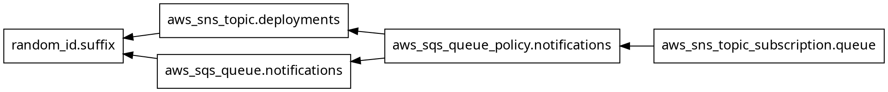
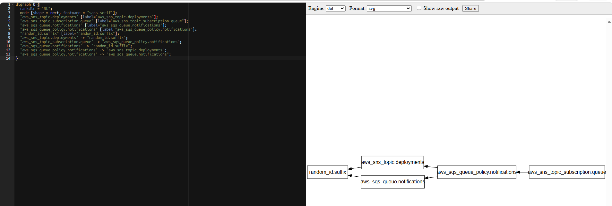

# Demo 03 — Core Workflow Deep-Dive: Plan Flags, Graph, and Debug Logging

---

## Overview

In Demos 01 and 02 you ran `terraform init / plan / apply / destroy` and
configured providers — but always with the default behaviour of each
command. As CloudNova's Terraform usage grows, the team is hitting real
friction: plans take longer as the codebase grows, engineers sometimes
need to make a small targeted change without re-planning everything, and
when something goes wrong with a provider call, the error message alone
isn't always enough to diagnose it.

**Real-world scenario — CloudNova:**
CloudNova's pipeline needs an event-notification mechanism: when a
deployment finishes or an alert fires, a message should be published to a
topic and land in a durable queue that other automation can poll. You'll
build this with SNS (the notification hub) and SQS (the durable inbox) —
a standard AWS fan-out pattern. While building it, you'll go deep on the
workflow commands: formatting and validating at scale, the full set of
`plan` flags, visualizing the dependency graph, and using `TF_LOG` to
debug a provider error that the plan output alone doesn't explain.

**What this demo builds:**

```
┌─────────────────────────────────────────────────────────────────────────┐
│  PART A — terraform fmt and terraform validate in depth                 │
│  SNS topic + SQS queue + subscription + queue policy                    │
│  fmt: -recursive, -check, -diff   |   validate: -json                   │
├─────────────────────────────────────────────────────────────────────────┤
│  PART B — terraform plan flags in depth                                 │
│  -out=FILE + apply tfplan   |   -target=ADDR (scoped apply)             │
│  -refresh-only / -refresh=false   |   -parallelism=N                    │
├─────────────────────────────────────────────────────────────────────────┤
│  PART C — terraform graph and TF_LOG debugging                          │
│  terraform graph → DOT → online Graphviz viewer                         │
│  TF_LOG levels + TF_LOG_PATH → diagnose a provider error                 │
└─────────────────────────────────────────────────────────────────────────┘
```

**What this demo covers:**
- `terraform fmt` flags: `-recursive`, `-check`, `-diff`, `-write=false`
- `terraform validate -json` and what validation does and does not check
- `terraform plan -out=FILE` and the saved-plan apply workflow
- `terraform plan -target=ADDR` for scoped plans/applies
- `terraform plan -refresh-only` and `-refresh=false`
- `terraform apply -parallelism=N`
- `terraform graph` and reading DOT output
- `TF_LOG` levels (`TRACE`/`DEBUG`/`INFO`/`WARN`/`ERROR`) and `TF_LOG_PATH`
- SNS topic, SQS queue, SQS queue policy, SNS topic subscription

---
## Prerequisites

### Knowledge
- Demo 01 and Demo 02 completed — provider configuration, S3 resources,
  `depends_on`, provider versions and aliases, lock file
- Comfortable running `terraform init / plan / apply / destroy`

### Required Tools

| Tool | Minimum version | Install | Verify |
|---|---|---|---|
| Terraform CLI | `>= 1.15.0` | [developer.hashicorp.com/terraform/install](https://developer.hashicorp.com/terraform/install) | `terraform version` |
| AWS CLI | `>= 2.x` | [docs.aws.amazon.com/cli/latest/userguide/install-cliv2.html](https://docs.aws.amazon.com/cli/latest/userguide/install-cliv2.html) | `aws --version` |
| Git | Any recent | Pre-installed on most systems | `git --version` |

### Verify AWS Account and Permissions

```bash
aws sts get-caller-identity --profile default
aws configure get region --profile default
```

**Required permissions for this demo:**

```
sns:CreateTopic, sns:DeleteTopic, sns:GetTopicAttributes, sns:SetTopicAttributes
sns:Subscribe, sns:Unsubscribe, sns:ListSubscriptionsByTopic
sqs:CreateQueue, sqs:DeleteQueue, sqs:GetQueueAttributes, sqs:SetQueueAttributes
sqs:GetQueueUrl, sqs:ListQueues
```

> For a learning account, `AmazonSNSFullAccess` and `AmazonSQSFullAccess`
> managed policies cover all of the above. In production, scope to the
> minimum required permissions.

---
## Demo Objectives

By the end of this demo you will be able to:

1. ✅ Use `terraform fmt` with `-recursive`, `-check`, and `-diff` to
   enforce formatting across a project without modifying files
2. ✅ Explain what `terraform validate` does and does not check, and use
   `-json` for machine-readable output
3. ✅ Save a plan with `-out=FILE` and apply exactly that plan with
   `terraform apply tfplan`
4. ✅ Use `-target=ADDR` to scope a plan/apply to specific resources, and
   explain why it should be used sparingly
5. ✅ Distinguish `-refresh-only` from `-refresh=false` and explain when
   to use each
6. ✅ Use `-parallelism=N` to control how many resource operations run
   concurrently
7. ✅ Generate and read `terraform graph` output to understand the
   dependency graph
8. ✅ Use `TF_LOG` levels and `TF_LOG_PATH` to diagnose a provider error
   that the plan/apply output alone doesn't explain
9. ✅ Build an SNS topic → SQS queue notification pattern with the
   required queue policy and subscription

---
## Cost & Free Tier

| Resource | Free tier | Cost | Notes |
|---|---|---|---|
| SNS topic | 1,000,000 publishes/month free | **$0.00** | No subscriptions beyond SQS in this demo |
| SQS queue | 1,000,000 requests/month free | **$0.00** | No messages published in this demo — infra only |
| SQS queue policy | No AWS cost — IAM-style resource policy | **$0.00** | |
| SNS topic subscription | No cost to create — delivery charges only apply per message | **$0.00** | |
| `random_id` | Free — no AWS resource | **$0.00** | |
| **Session total** | | **~$0.00** | |

> Always run cleanup at the end of the session.

---
## Directory Structure

```
03-core-workflow/
├── README.md
├── 03-core-workflow-anki.csv   # Anki flash cards
├── 03-core-workflow-quiz.md    # Quiz
└── src/
    ├── 01-versions.tf    # terraform block + provider version constraints
    ├── 02-provider.tf    # AWS provider: region, profile, default_tags
    ├── 03-variables.tf   # input variables
    ├── 04-locals.tf      # computed names + common tags
    ├── 05-main.tf        # SNS topic, SQS queue, queue policy, subscription, random_id
    ├── 06-outputs.tf     # topic ARN, queue ARN/URL, suffix
    └── break-fix/        # intentionally empty — this demo's Break-Fix
                           # is procedural (see Break-Fix Scenario section),
                           # not a static broken file
```

---

## Recall Check — Demo 02

Answer from memory before reading anything new:

1. What does a provider alias let you do that the default provider
   configuration cannot?
2. Why are the `zh:` hashes in `.terraform.lock.hcl` platform-specific,
   and what command adds hashes for additional platforms?
3. You change a version constraint from `~> 6.47.0` to `~> 6.48.0`. Does
   plain `terraform init` pick up the new version? Why or why not?

<details>
<summary>Answers</summary>

1. A provider alias lets you configure a second instance of the same
   provider — typically for a different AWS region or account — and
   reference it on specific resources with `provider = aws.alias_name`.
   The default (unaliased) provider configuration is used for any resource
   that doesn't specify `provider`.
2. The `zh:` hashes verify the provider binary's zip contents per
   OS/architecture (e.g. `darwin_arm64`, `linux_amd64`, `windows_amd64`) —
   a binary built for one platform has different file hashes than one
   built for another. `terraform providers lock -platform=...` (repeatable)
   adds hashes for additional platforms without changing the resolved
   version.
3. No. Once a lock file exists, plain `terraform init` installs the
   version recorded in the lock file, not the newest version the
   constraint allows. `terraform init -upgrade` is required to re-resolve
   the constraint and pick up `6.48.x`. Note: this is purely a local
   plugin upgrade — it does not touch any already-deployed AWS
   infrastructure. The provider is the translator between HCL and AWS API
   calls; upgrading it changes which version of that translator your
   machine uses, not the resources it previously created. A `plan` after
   upgrading would only show a diff if the new provider version changed
   how a specific resource is read or written.

</details>

---

## Concepts

### What's New in This Demo

| Construct | Type | Purpose in this demo |
|---|---|---|
| `aws_sns_topic` | Resource | The notification hub |
| `aws_sqs_queue` | Resource | Durable queue that receives messages |
| `aws_sqs_queue_policy` | Resource | IAM policy allowing SNS to deliver to the queue |
| `aws_sns_topic_subscription` | Resource | Subscribes the queue to the topic |
| `terraform fmt -recursive/-check/-diff` | CLI flags | Enforce formatting across a project |
| `terraform validate -json` | CLI flag | Machine-readable validation output |
| `terraform plan -out=FILE` | CLI flag | Save a plan to apply later exactly as reviewed |
| `terraform plan -target=ADDR` | CLI flag | Scope plan/apply to specific resource(s) |
| `terraform plan -refresh-only` | CLI flag | Detect drift without changing infrastructure or plan |
| `terraform plan -refresh=false` | CLI flag | Skip the refresh step entirely — use cached state |
| `terraform apply -parallelism=N` | CLI flag | Control concurrent resource operations (default 10) |
| `terraform graph` | CLI command | Output the dependency graph in DOT format |
| `TF_LOG` / `TF_LOG_PATH` | Environment variables | Enable and redirect Terraform's internal debug logging |

**Related SNS/SQS resources worth knowing (not used in this demo):**

| Resource | What it does |
|---|---|
| `aws_sns_topic_policy` | Controls who can publish to / subscribe to the topic itself |
| `aws_sqs_queue_redrive_policy` (via `redrive_policy` argument) | Routes failed messages to a dead-letter queue |
| `aws_sns_topic_subscription` with `filter_policy` | Delivers only messages matching a filter to a given subscriber |
| `aws_lambda_event_source_mapping` | Triggers a Lambda function from new SQS messages |

---

### Detailed Explanation of New Constructs

#### `terraform fmt` — Flags in Depth

`terraform fmt` rewrites `.tf` files to the canonical HCL style —
consistent indentation, alignment of `=` signs, spacing. You've used it
plain in Demos 00–02. The flags below make it useful in CI and across
larger projects.

| Flag | What it does |
|---|---|
| (none) | Formats `.tf` files in the current directory only, writes changes in place |
| `-recursive` | Formats `.tf` files in the current directory **and all subdirectories** |
| `-check` | Does not write changes. Exits `0` if already formatted, exits `3` if any file would be reformatted (`1` is reserved for CLI/usage errors, `2` for HCL parse errors — `3` specifically means "valid HCL, but not canonically formatted"). Use in CI to fail a build on unformatted code. |
| `-diff` | Prints a diff of what would change, without writing. Combine with `-check` to see *what* would change in CI logs. |
| `-write=false` | Equivalent to part of what `-check` implies — don't write to disk. Useful with `-diff` to preview only. |

```bash
# CI-style check: fail if anything is unformatted, show what would change
terraform fmt -check -diff -recursive
```

> **Practical note:** `-recursive` matters once a project has subdirectories
> (e.g. `modules/`, `break-fix/`). Without it, `fmt` only touches the
> current directory — files in `break-fix/` would be silently skipped.

---

#### `terraform validate` — What It Checks and What It Doesn't

`terraform validate` checks the configuration for **internal
consistency** — it does not call any provider APIs and does not need AWS
credentials.

**What `validate` catches:**
- HCL syntax errors (missing braces, invalid types)
- Unknown argument names for a resource type (e.g. `versioning {}` inside
  `aws_s3_bucket` in v6 — Demo 01's break-fix)
- References to undeclared resources, variables, or locals
- Type mismatches (e.g. passing a list where a string is expected)
- Missing required arguments

**What `validate` does NOT catch:**
- Whether a referenced AWS resource actually exists (e.g. a hardcoded VPC
  ID that doesn't exist in your account)
- Whether your AWS credentials have permission to create the resources
- Whether a globally-unique name (like an S3 bucket name) is actually
  available
- Logic that's syntactically valid but semantically wrong (e.g. an SQS
  queue policy with a correct-looking but incorrect ARN)

These issues only surface during `plan` (API calls start here — read-only)
or `apply`.

**`-json` flag:**

```bash
terraform validate -json
```

Outputs a JSON object instead of human-readable text — useful for piping
into CI tooling that needs to programmatically check `"valid": true/false`
and iterate over a `"diagnostics"` array, rather than parsing text output.

```json
{
  "format_version": "1.0",
  "valid": true,
  "error_count": 0,
  "warning_count": 0,
  "diagnostics": []
}
```

---

#### `terraform plan -out=FILE` — Saved Plans

You've used `terraform plan` to preview changes and `terraform apply` to
make them — but between those two commands, the configuration could
change, or someone else could apply first. `-out=FILE` closes that gap.

```bash
terraform plan -out=tfplan
terraform apply tfplan
```

| Behaviour | `terraform apply` (no saved plan) | `terraform apply tfplan` |
|---|---|---|
| Re-reads `.tf` files before applying | Yes | No — uses the saved plan exactly |
| Re-checks current state for drift | Yes (refresh) | No — plan was computed at save time |
| Risk if config changes between plan and apply | Apply reflects the NEW config silently | Apply executes exactly what was reviewed — fails if state has moved on |
| Typical use | Interactive, single-engineer use | CI/CD: a pipeline stage plans and a human/gate approves, then a later stage applies that exact plan |

`tfplan` is a binary file — opaque, not meant to be read directly. It's
typically a short-lived CI artifact passed between pipeline stages, not
committed to Git.

---

#### `terraform plan -target=ADDR` — Scoped Plans

`-target` limits Terraform's plan (and the resulting apply) to a specific
resource address and anything it depends on.

```bash
terraform plan -target=aws_sqs_queue_policy.notifications
```

This computes a plan covering `aws_sqs_queue_policy.notifications` and any
resources it depends on (the queue and topic, since the policy references
their ARNs) — but **not** other unrelated resources in the configuration,
even if they also have pending changes.

**Why "use sparingly":**

```
┌──────────────────────────────────────────────────────────────────────┐
│  THE -target TRAP                                                     │
│                                                                        │
│  You run: terraform apply -target=aws_sqs_queue_policy.notifications  │
│  → Only the policy is created/updated. Applied successfully.         │
│                                                                        │
│  Meanwhile, aws_sns_topic.deployments also had a pending change       │
│  (e.g. a tag update) — NOT applied, because it wasn't targeted.       │
│                                                                        │
│  Your state now reflects: policy = new, topic = old.                 │
│  Your .tf files describe: policy = new, topic = new.                 │
│  Next plain `terraform plan` will show the topic change still         │
│  pending — this is expected, NOT drift. But if someone forgets        │
│  to run that follow-up plan/apply, the topic silently stays           │
│  out of sync with the configuration indefinitely.                     │
└──────────────────────────────────────────────────────────────────────┘
```

**Legitimate uses:**
- Recovering from a partial apply where one resource failed and you want
  to retry just that resource
- A large `plan` is timing out and you need to apply one resource as a
  first step (e.g. a resource other resources depend on)
- Testing a single resource's configuration in isolation during
  development

**Not a substitute for:** splitting a large configuration into smaller,
independently-applied configurations (modules / separate state files) —
that's the actual solution for "plans are too big," `-target` is a
short-term escape hatch.

---

#### `-refresh-only` vs `-refresh=false`

You used `terraform plan -refresh-only` in Demo 01 to detect drift. Here's
how it relates to `-refresh=false`.

| Flag | What it does | When to use |
|---|---|---|
| `terraform plan -refresh-only` | Refreshes state from real infrastructure, shows **only** drift — labeled explicitly as "Objects have changed outside of Terraform" — and proposes no remediation. Configuration changes (pending `.tf` edits) are NOT shown by this mode. | Checking "has anything changed outside Terraform?" in isolation, before deciding whether to reconcile it |
| `terraform plan -refresh=false` | **Skips** the refresh step entirely — plans using the state file as-is, without checking real infrastructure first | Faster plans when you're confident nothing has drifted (e.g. immediately after your own apply), or when a provider's `Read()` is slow/rate-limited |
| `terraform plan` (default) | Refreshes state, then shows the combined difference between real infrastructure and your `.tf` configuration — **drift and pending configuration changes are merged into one undifferentiated diff**, not separated | Normal day-to-day use |

> **Correcting a common misconception:** plain `terraform plan` is
> sometimes described as showing only "configuration changes," as if
> drift were filtered out. That's not accurate. Plain `plan` refreshes
> state from AWS (same as `-refresh-only` does) and then computes the
> diff against your `.tf` files — if a resource has both drifted AND has
> a pending config change, **both show up together in the same plan
> output**, with no label distinguishing which is which. `-refresh-only`
> is the only mode that isolates drift specifically and tells you "this
> part is from outside Terraform."

**Worked example — drift only:**

Someone manually adds a tag via Console (not in `.tf`). Run both commands
to see the difference:

```bash
terraform plan
```

```
aws_sns_topic.deployments: Refreshing state...

  # aws_sns_topic.deployments will be updated in-place
  ~ resource "aws_sns_topic" "deployments" {
      ~ tags = {
          - "Console-Test" = "true" -> null
        }
    }

Plan: 0 to add, 1 to change, 0 to destroy.
```

```bash
terraform plan -refresh-only
```

```
aws_sns_topic.deployments: Refreshing state...

Note: Objects have changed outside of Terraform

  # aws_sns_topic.deployments has changed
  ~ resource "aws_sns_topic" "deployments" {
      ~ tags = {
          + "Console-Test" = "true"
        }
    }

This is a refresh-only plan, so Terraform will not take any actions to
undo these changes.
```

Notice: plain `plan` shows the tag being **removed** (`-> null`) because
it's proposing to reconcile AWS back to `.tf`. `-refresh-only` shows the
same tag being **added** (`+`) because it's describing what changed in
AWS relative to the last-known state — it frames the change from the
opposite direction and proposes nothing.

**Worked example — drift AND a pending config change together (the
case plain `plan` does NOT separate):**

Now also edit `05-main.tf` to change
`message_retention_seconds` from `86400` to `172800`, while the
Console-added tag from above is still present (undealt with):

```bash
terraform plan
```

```
  # aws_sns_topic.deployments will be updated in-place
  ~ resource "aws_sns_topic" "deployments" {
      ~ tags = {
          - "Console-Test" = "true" -> null
        }
    }

  # aws_sqs_queue.notifications will be updated in-place
  ~ resource "aws_sqs_queue" "notifications" {
      ~ message_retention_seconds = 86400 -> 172800
    }

Plan: 0 to add, 2 to change, 0 to destroy.
```

Both changes appear in the same plan, with the same `~` symbol, no
indication that one (`tags`) is drift-reconciliation and the other
(`message_retention_seconds`) is your own pending edit. Now run:

```bash
terraform plan -refresh-only
```

```
Note: Objects have changed outside of Terraform

  # aws_sns_topic.deployments has changed
  ~ resource "aws_sns_topic" "deployments" {
      ~ tags = {
          + "Console-Test" = "true"
        }
    }

This is a refresh-only plan, so Terraform will not take any actions to
undo these changes.
```

`-refresh-only` shows **only** the topic's tag drift — the queue's
pending `message_retention_seconds` change doesn't appear here at all,
because that's a configuration change, not drift. This is the actual
isolation `-refresh-only` provides: it's the only command that separates
"what changed outside Terraform" from everything else.

```bash
# Compare: skip the refresh entirely
terraform plan -refresh=false
```

```
  # aws_sqs_queue.notifications will be updated in-place
  ~ resource "aws_sqs_queue" "notifications" {
      ~ message_retention_seconds = 86400 -> 172800
    }

Plan: 0 to add, 1 to change, 0 to destroy.
```

`-refresh=false` shows only your pending `.tf` edit — it never asked AWS
about the topic's current tags at all, so the drift is invisible here,
not because it isolates it like `-refresh-only` does, but because it
never looked.

> **Exam-relevant summary:** Of the three commands, only `-refresh-only`
> isolates drift specifically. Plain `plan` sees drift but merges it
> with config changes in one diff. `-refresh=false` doesn't see drift at
> all because it skips the refresh.

---

#### `terraform apply -parallelism=N`

By default, Terraform performs up to **10** resource operations (create,
update, delete) concurrently — this is what let Demo 01's three S3
configuration resources apply "at the same time" after `depends_on` was
satisfied.

```bash
terraform apply -parallelism=5
```

**When to lower it:**
- An AWS API is being rate-limited (`ThrottlingException` /
  `RequestLimitExceeded`) because too many calls hit the same service at
  once
- Working against a provider/API known to have low concurrent-request
  limits

**When to raise it:** Rarely needed — 10 is already generous for most
configurations. Raising it doesn't make *independent* resources apply
faster beyond what the dependency graph already allows; it only matters
when there are more than 10 resources with no dependencies between them
ready to run at the same instant.

**What it does NOT do:** It does not change the order resources are
created in — the dependency graph still determines order. It only caps
how many *independent, ready-to-run* operations happen simultaneously.

---

#### `terraform graph` — Reading the Dependency Graph

`terraform graph` outputs the resource dependency graph in **DOT**
format — a plain-text graph description language. It makes zero API calls
and reflects the graph Terraform itself uses to determine apply order.

```bash
terraform graph
```

Output looks like (exact formatting varies slightly by Terraform
version):



**Reading it:** each `"A" -> "B"` line means **A depends on B** — B must
be created/updated before A.

**Why there's no direct `subscription -> topic` or `subscription ->
queue` edge:** the subscription resource's arguments (`topic_arn`,
`endpoint`) genuinely DO reference both the topic and the queue — those
are real implicit dependencies. But `terraform graph` applies a
**transitive reduction** before rendering: if a dependency is already
reachable through another path, the direct edge is omitted to keep the
graph readable. Here, `subscription -> policy -> topic` and
`subscription -> policy -> queue` already establish those dependencies
indirectly (since the subscription's explicit `depends_on` points at the
policy, and the policy itself depends on both topic and queue) — so the
direct edges are redundant and pruned from the output. The dependency
still exists and still affects apply order; it's just not drawn as a
separate line when a path already implies it.

**Viewing it visually:** paste the DOT output into an online Graphviz
renderer (e.g. search "Graphviz online viewer") to see it as boxes and
arrows. This is optional — the text form above already tells you
everything: which resources depend on which, and therefore what order
Terraform will create/destroy them in. No local tool installation is
required for this demo.

**Practical use:** when a plan's apply order is surprising, or when
`-target` on resource A unexpectedly also plans resource B, `terraform
graph` shows you *why* — there's a dependency path between them (direct
or transitive) you may not have noticed in the `.tf` files.

---

#### `TF_LOG` and `TF_LOG_PATH` — Debug Logging

Terraform's normal output (plan/apply summaries, error messages) is a
*summary*. When a provider error doesn't explain enough — e.g. "access
denied" without saying which API call or which credentials were used —
`TF_LOG` enables Terraform's internal logging, which shows every API
request and response.

| Level | Verbosity | Typical use |
|---|---|---|
| `TRACE` | Highest — every internal step, including full HTTP request/response bodies | Diagnosing provider-level bugs, seeing exact API calls/responses |
| `DEBUG` | High — internal operations, provider plugin communication | Most common level for diagnosing "why did this API call fail" |
| `INFO` | Moderate — high-level operational messages | General operational visibility |
| `WARN` | Low — only warnings | Rarely used standalone |
| `ERROR` | Lowest — only errors | Rarely used standalone |

```bash
# Enable debug logging for this command only
TF_LOG=DEBUG terraform plan

# Redirect the (very large) log output to a file instead of the terminal
TF_LOG=DEBUG TF_LOG_PATH=terraform-debug.log terraform plan
```

> **Scope:** setting `TF_LOG`/`TF_LOG_PATH` inline before a single command
> (as shown above) applies to that one invocation only — it is not
> persistent. If you want logging enabled across multiple commands in the
> same terminal session, `export TF_LOG=DEBUG` and `export
> TF_LOG_PATH=terraform-debug.log` separately, then run commands normally
> until you `unset` them.

**What to look for in `DEBUG`/`TRACE` output:** search for the failing
resource's type (e.g. `aws_sqs_queue_policy`) and look for the HTTP
request just before the error — it shows the exact API action
(`sqs:SetQueueAttributes`), the request body (often the policy JSON that
was sent), and AWS's response body, which usually contains a more specific
error message than what Terraform's summary line shows.

**Turning logging off:** unset `TF_LOG` (or don't set it) — there's no
"off" value; the variable's presence is what enables logging.

```bash
unset TF_LOG
unset TF_LOG_PATH
```

> **Practical note:** `TRACE`/`DEBUG` output is large and includes
> credential-adjacent details in request headers (though not the secret
> key itself in normal cases) — avoid pasting raw debug logs into public
> forums or tickets without reviewing them first.

---

#### SNS Topic, SQS Queue, Subscription, and Queue Policy

**The pattern:** an SNS topic is a publish/subscribe hub — things publish
messages to it, and it fans them out to every subscriber. An SQS queue is
a durable, pollable inbox — messages sit in it until something reads and
deletes them. Subscribing an SQS queue to an SNS topic means: every
message published to the topic is also delivered into the queue, where
it waits for a consumer to process it.

```
┌────────────────────────────────────────────────────────────────────┐
│  Publisher → [SNS Topic: deployments] → [SQS Queue: notifications]  │
│                                              ↑                       │
│                              Consumer polls this queue               │
│                              (not built in this demo)                │
└────────────────────────────────────────────────────────────────────┘
```

**`aws_sns_topic`:**

| Argument | Required | Description |
|---|---|---|
| `name` | No — but always set | Topic name. Must be unique within the account+region. |

**`aws_sqs_queue`:**

| Argument | Required | Description |
|---|---|---|
| `name` | No — but always set | Queue name. Must be unique within the account+region. |
| `message_retention_seconds` | No (default: 345600 = 4 days) | How long an unconsumed message stays in the queue before being deleted |

**`aws_sqs_queue_policy`:** an IAM-style resource policy attached to the
queue, granting the SNS topic permission to call `sqs:SendMessage` on it.
**Without this policy, the subscription will be created, but SNS cannot
actually deliver messages to the queue** — they'll silently fail to
arrive.

| Argument | Required | Description |
|---|---|---|
| `queue_url` | Yes | The queue's URL — `aws_sqs_queue.notifications.id` |
| `policy` | Yes | JSON IAM policy document. `Principal` = SNS service, `Action` = `sqs:SendMessage`, `Resource` = queue ARN, `Condition` restricting `aws:SourceArn` to this specific topic's ARN |

> **Why `queue_url`, not `queue_arn`, here:** this is simply how the
> underlying AWS API works — SQS's `SetQueueAttributes` call (which is
> what sets a queue's policy) addresses the queue by its **URL**, not its
> ARN. This is specific to SQS; it isn't a Terraform convention. Compare
> this to `aws_sns_topic_subscription` below, which addresses the queue
> by **ARN** instead — because SNS's `Subscribe` API identifies endpoints
> by ARN. Each AWS service's API decides which identifier it expects;
> Terraform's resource arguments simply follow whatever the underlying
> API requires.

**`aws_sns_topic_subscription`:**

| Argument | Required | Description |
|---|---|---|
| `topic_arn` | Yes | `aws_sns_topic.deployments.arn` |
| `protocol` | Yes | `"sqs"` for an SQS queue subscriber (other values: `"email"`, `"lambda"`, `"https"`, etc.) |
| `endpoint` | Yes | `aws_sqs_queue.notifications.arn` — for `protocol = "sqs"`, this must be the queue's **ARN**, not its URL |

**Why the queue policy must restrict `aws:SourceArn`:** without it, the
policy would allow *any* SNS topic in AWS (including topics in other
accounts) to send messages to this queue — restricting to this specific
topic's ARN is the principle of least privilege applied to inter-service
permissions.

---

## Lab Step-by-Step Guide

---

## Part A — Build the Notification Pattern, Format and Validate at Scale

**What you accomplish in Part A:** write the SNS topic, SQS queue, queue
policy, and subscription, then practise `terraform fmt` and `terraform
validate` with their full flag sets before applying.

### Step 1 — Navigate to the project

```bash
cd terraform-aws-mastery/phase-1-foundations/03-core-workflow/src
```

### Step 2 — Create the source files

---

#### `01-versions.tf` — Version constraints

**What this file does in this demo:** same structure as Demos 01–02 —
`aws` provider for all `aws_*` resources, `random` provider for the
unique naming suffix.

**01-versions.tf:**

```hcl
terraform {
  required_version = "~> 1.15.0"

  required_providers {
    aws = {
      source  = "hashicorp/aws"
      version = "~> 6.47.0"
    }
    random = {
      source  = "hashicorp/random"
      version = "~> 3.9.0"
    }
  }
}
```

---

#### `02-provider.tf` — AWS provider configuration

**What this file does in this demo:** same pattern as Demo 01 — named
profile, region, `default_tags`.

**02-provider.tf:**

```hcl
provider "aws" {
  region  = var.aws_region
  profile = var.aws_profile

  default_tags {
    tags = local.common_tags
  }
}

provider "random" {}
```

> **Why `default_tags { }` has no `=` but `tags = local.common_tags`
> does:** `default_tags { }` is a **nested configuration block** inside
> `provider "aws"` — blocks open a new structure with `{ }` and never use
> `=` before the brace. `tags = local.common_tags` is an **argument
> assignment** *inside* that block — arguments always use `=`. The same
> rule explains `04-locals.tf`'s `common_tags = { ... }`: this is also an
> assignment (`=`), where the value being assigned happens to be a map
> literal, which is itself written with `{ }`. The memorable rule: **`{ }`
> directly after a bare word with no `=` means "block" (a structural
> container). `{ }` appearing after a `=` means "this value is a map."**

---

#### `03-variables.tf` — Input variables

**03-variables.tf:**

```hcl
variable "aws_region" {
  type        = string
  description = "AWS region for all resources"
  default     = "us-east-2"
}

variable "aws_profile" {
  type        = string
  description = "AWS CLI named profile for authentication"
  default     = "default"
}

variable "project" {
  type        = string
  description = "Project name — used in resource names and tags"
  default     = "cloudnova"
}

variable "environment" {
  type        = string
  description = "Deployment environment"
  default     = "dev"

  validation {
    condition     = contains(["dev", "staging", "prod"], var.environment)
    error_message = "environment must be dev, staging, or prod."
  }
}

variable "demo" {
  type        = string
  description = "Demo identifier — used in tags for traceability"
  default     = "03-core-workflow"
}
```

---

#### `04-locals.tf` — Computed values

**04-locals.tf:**

```hcl
locals {
  # Unique names — e.g. "cloudnova-dev-deployments-a1b2c3d4"
  topic_name = "${var.project}-${var.environment}-deployments-${random_id.suffix.hex}"
  queue_name = "${var.project}-${var.environment}-notifications-${random_id.suffix.hex}"

  common_tags = {
    Project     = var.project
    Environment = var.environment
    Demo        = var.demo
    ManagedBy   = "Terraform"
    Owner       = "devops-team"
  }
}
```

---

#### `05-main.tf` — The infrastructure

**What this file does in this demo:** declares all five resources —
`random_id` for naming, the SNS topic, the SQS queue, the queue policy
granting SNS permission to deliver, and the subscription connecting them.

**05-main.tf:**

```hcl
resource "random_id" "suffix" {
  byte_length = 4   # 4 bytes = 8 hex characters
}

# ── SNS topic ──────────────────────────────────────────────────────────────
# The notification hub — CloudNova publishes deployment/alert events here
resource "aws_sns_topic" "deployments" {
  name = local.topic_name
}

# ── SQS queue ─────────────────────────────────────────────────────────────
# The durable inbox — messages wait here for a consumer to poll
resource "aws_sqs_queue" "notifications" {
  name                       = local.queue_name
  message_retention_seconds = 86400   # 1 day — default is 4 days
}

# ── Queue policy ────────────────────────────────────────────────────────────
# Grants the SNS topic permission to deliver messages to this queue.
# Without this, the subscription is created but messages silently fail
# to arrive — SNS would get an access-denied response from SQS.
resource "aws_sqs_queue_policy" "notifications" {
  queue_url = aws_sqs_queue.notifications.id

  policy = jsonencode({
    Version = "2012-10-17"
    Statement = [
      {
        Sid       = "AllowSNSDelivery"
        Effect    = "Allow"
        Principal = { Service = "sns.amazonaws.com" }
        Action    = "sqs:SendMessage"
        Resource  = aws_sqs_queue.notifications.arn
        Condition = {
          ArnEquals = {
            "aws:SourceArn" = aws_sns_topic.deployments.arn
          }
        }
      }
    ]
  })
}

# ── Subscription ────────────────────────────────────────────────────────────
# Connects the queue to the topic — every message published to the topic
# is delivered into the queue (once the queue policy above allows it)
resource "aws_sns_topic_subscription" "queue" {
  topic_arn = aws_sns_topic.deployments.arn
  protocol  = "sqs"
  endpoint  = aws_sqs_queue.notifications.arn   # ARN, not URL, for SQS protocol

  depends_on = [aws_sqs_queue_policy.notifications]   # see explanation below
}
```

> **Why `depends_on` on the subscription:** Terraform already infers
> `aws_sns_topic_subscription.queue` depends on both
> `aws_sns_topic.deployments` (via `topic_arn`) and
> `aws_sqs_queue.notifications` (via `endpoint`) — those are implicit
> dependencies. But it does **not** automatically know the subscription
> should wait for `aws_sqs_queue_policy.notifications`, because the
> subscription resource doesn't reference the policy's attributes at all
> — there's no attribute link between them. Without `depends_on`, the
> subscription could be created *before* the policy exists, meaning SNS
> would briefly be subscribed to a queue it doesn't yet have permission to
> deliver to. This is the same category of issue as Demo 01's S3 race
> condition — an ordering requirement that exists in AWS but isn't visible
> from attribute references alone.

---

#### `06-outputs.tf` — Expose values after apply

**06-outputs.tf:**

```hcl
output "topic_arn" {
  description = "ARN of the SNS topic"
  value       = aws_sns_topic.deployments.arn
}

output "queue_arn" {
  description = "ARN of the SQS queue"
  value       = aws_sqs_queue.notifications.arn
}

output "queue_url" {
  description = "URL of the SQS queue"
  value       = aws_sqs_queue.notifications.id
}

output "random_suffix" {
  description = "Random hex suffix used in resource names"
  value       = random_id.suffix.hex
}
```

> **Why both `queue_arn` and `queue_url` are output:** different AWS
> tools expect different identifiers. `queue_arn` is used inside
> Terraform/IAM contexts (like the queue policy's `Condition` block) and
> when referencing the queue from other AWS resources. `queue_url` is
> what you'd need if you (or a consumer application) used the AWS CLI or
> SDK directly against this queue — for example, `aws sqs send-message
> --queue-url <queue_url> --message-body "..."` requires the URL form, not
> the ARN. Outputting both means either form is available without having
> to convert one to the other later.

---

### Step 3 — Initialise

```bash
terraform init
```

Expected output:

```
Initializing the backend...
Initializing provider plugins...
- Finding hashicorp/aws versions matching "~> 6.47.0"...
- Finding hashicorp/random versions matching "~> 3.9.0"...
- Installing hashicorp/aws v6.47.0...
- Installed hashicorp/aws v6.47.0 (signed by HashiCorp)
- Installing hashicorp/random v3.9.0...
- Installed hashicorp/random v3.9.0 (signed by HashiCorp)

Terraform has created a lock file .terraform.lock.hcl

Terraform has been successfully initialized!
```

---

### Step 4 — `terraform fmt` in depth

First, intentionally misformat `05-main.tf` — add extra spaces around an `=`
on one line, or shift the indentation of one block. Then:

```bash
# Check only — does not write. Exits 3 if any file would be reformatted.
terraform fmt -check
echo $?
```

Expected output:

```
05-main.tf
3
```

(The filename is printed because it would be reformatted; exit code `3`
specifically signals "valid HCL, but not in canonical format" — `1` is
reserved for CLI/usage errors and `2` for HCL parse errors, so `3` is
the one to watch for in CI.)

```bash
# Same check, but also scanning subdirectories (e.g. break-fix/)
terraform fmt -check -recursive
echo $?
```

Expected output:

```
05-main.tf
3
```

```bash
# Show what would change, without writing
terraform fmt -check -diff -recursive
```

Expected output (diff-style):

```
05-main.tf
--- old/05-main.tf
+++ new/05-main.tf
@@ -X,Y +X,Y @@
-  name                       = local.queue_name
+  name = local.queue_name
```

```bash
# Now actually write the fix
terraform fmt -recursive
echo $?
```

Expected output:

```
05-main.tf
0
```

> **`-recursive` matters in general:** if this project had `.tf` files
> in subdirectories (e.g. a `modules/` folder), `terraform fmt` without
> `-recursive` would only check the current directory and silently skip
> them. This demo's `break-fix/` folder has no `.tf` file in it (this
> demo's Break-Fix scenario is procedural — see the Break-Fix Scenario
> section), so there's nothing in it for `-recursive` to pick up here,
> but the habit of using `-recursive` still applies to any project with
> nested `.tf` files.

---

### Step 5 — `terraform validate` in depth

```bash
terraform validate
```

Expected output:

```
Success! The configuration is valid.
```

```bash
terraform validate -json
```

Expected output:

```json
{
  "format_version": "1.0",
  "valid": true,
  "error_count": 0,
  "warning_count": 0,
  "diagnostics": []
}
```

> **Reminder of validate's limits:** this confirms the HCL is internally
> consistent — correct argument names, valid references, correct types.
> It does **not** confirm the queue policy JSON's ARNs are correct, or
> that SNS can actually deliver to this queue. Those are only confirmed
> at `apply` time (and in this demo's case, only truly confirmed if you
> publish a test message — which is outside this demo's scope).

---

### Step 6 — Apply

```bash
terraform apply
```

Type `yes`. Expected output:

```
random_id.suffix: Creating...
random_id.suffix: Creation complete after 0s [id=...]

aws_sns_topic.deployments: Creating...
aws_sqs_queue.notifications: Creating...
aws_sns_topic.deployments: Creation complete after 1s
aws_sqs_queue.notifications: Creation complete after 1s

aws_sqs_queue_policy.notifications: Creating...
aws_sqs_queue_policy.notifications: Creation complete after 1s

aws_sns_topic_subscription.queue: Creating...
aws_sns_topic_subscription.queue: Creation complete after 1s

Apply complete! Resources: 5 added, 0 changed, 0 destroyed.

Outputs:
queue_arn     = "arn:aws:sqs:us-east-2:163125980376:cloudnova-dev-notifications-a1b2c3d4"
queue_url     = "https://sqs.us-east-2.amazonaws.com/163125980376/cloudnova-dev-notifications-a1b2c3d4"
random_suffix = "a1b2c3d4"
topic_arn     = "arn:aws:sns:us-east-2:163125980376:cloudnova-dev-deployments-a1b2c3d4"
```

---

### Step 7 — Verify in AWS Console

```
Console → Simple Notification Service → Topics → cloudnova-dev-deployments-xxxxxxxx
  → Subscriptions tab → one subscription, protocol = SQS, status = Confirmed ✅

Console → Simple Queue Service → Queues → cloudnova-dev-notifications-xxxxxxxx
  → Access policy tab → policy JSON shows AllowSNSDelivery statement ✅
  → Principal: sns.amazonaws.com, Condition: aws:SourceArn = this topic's ARN ✅
```

> **Console-first principle:** confirm the subscription shows status
> `Confirmed` (not `PendingConfirmation`) — for SQS protocol subscriptions,
> AWS auto-confirms once the queue policy allows it. If you see
> `PendingConfirmation`, the queue policy is missing or incorrect.

---

## Part B — `terraform plan` Flags in Depth

**What you accomplish in Part B:** practise `-out`, `-target`,
`-refresh-only`/`-refresh=false`, and `-parallelism` against the
infrastructure built in Part A — no new resources.

### Step 1 — `-out=FILE` and the saved-plan workflow

```bash
terraform plan -out=tfplan
```

Expected output (no changes, since Part A already applied):

```
No changes. Your infrastructure matches the configuration.

Saved the plan to: tfplan

To perform exactly these actions, run the following command to apply:
    terraform apply "tfplan"
```

```bash
terraform apply tfplan
```

Expected output:

```
No changes. Your infrastructure matches the configuration.

Apply complete! Resources: 0 added, 0 changed, 0 destroyed.
```

Now make a small change — e.g. edit `aws_sqs_queue.notifications` to add
a description tag, or change `message_retention_seconds` from `86400` to
`172800` (2 days):

```bash
terraform plan -out=tfplan
```

Expected output (abbreviated):

```
  # aws_sqs_queue.notifications will be updated in-place
  ~ resource "aws_sqs_queue" "notifications" {
      ~ message_retention_seconds = 86400 -> 172800
        ...
    }

Plan: 0 to add, 1 to change, 0 to destroy.

Saved the plan to: tfplan
```

```bash
terraform apply tfplan
```

Expected output:

```
aws_sqs_queue.notifications: Modifying...
aws_sqs_queue.notifications: Modifications complete after 1s

Apply complete! Resources: 0 added, 1 changed, 0 destroyed.
```

> **What `apply tfplan` guarantees:** between the `plan -out` and `apply
> tfplan` commands, if someone else had changed this queue's
> configuration (in `.tf` files or directly in AWS), `apply tfplan` would
> **fail** rather than silently apply a now-stale plan — Terraform detects
> that the saved plan no longer matches current state and refuses to
> proceed. This is the safety guarantee that makes saved plans suitable
> for CI/CD approval gates.

---

### Step 2 — `-target=ADDR` — Scoped Plans

First, make changes to **two** resources at once.

Add a tag to `aws_sns_topic.deployments` in `05-main.tf`:

```hcl
resource "aws_sns_topic" "deployments" {
  name = local.topic_name

  tags = {
    ReviewedBy = "platform-team"   # ← add this line
  }
}
```

And change `aws_sqs_queue.notifications`'s `message_retention_seconds`
back to `86400` (if you changed it to `172800` in Step 1 of this Part):

```bash
terraform plan
```

Expected output shows **both** resources with pending changes:

```
  # aws_sns_topic.deployments will be updated in-place
  ~ resource "aws_sns_topic" "deployments" {
      ~ tags = {
          + "ReviewedBy" = "platform-team"
        }
        ...
    }

  # aws_sqs_queue.notifications will be updated in-place
  ~ resource "aws_sqs_queue" "notifications" {
      ~ message_retention_seconds = 172800 -> 86400
        ...
    }

Plan: 0 to add, 2 to change, 0 to destroy.
```

Now scope the plan to just the queue:

```bash
terraform plan -target=aws_sqs_queue.notifications
```

Expected output — only the targeted resource is planned; the topic's
pending tag change does **not** appear at all in this output (it's
outside the targeted scope, not "shown for context"):

```
random_id.suffix: Refreshing state...
aws_sqs_queue.notifications: Refreshing state...

Terraform used the selected providers to generate the following execution
plan. Resource actions are indicated with the following symbols:
  ~ update in-place

Terraform will perform the following actions:

  # aws_sqs_queue.notifications will be updated in-place
  ~ resource "aws_sqs_queue" "notifications" {
        id                         = "..."
      ~ message_retention_seconds = 172800 -> 86400
        name                       = "cloudnova-dev-notifications-xxxxxxxx"
        tags                       = {}
        # (19 unchanged attributes hidden)
    }

Plan: 0 to add, 1 to change, 0 to destroy.
╷
│ Warning: Resource targeting is in effect
│
│ You are creating a plan with the -target option, which means that the
│ result of this plan may not represent all of the changes requested by
│ the current configuration.
│
│ The -target option is not for routine use, and is provided only for
│ exceptional situations such as recovering from errors or mistakes, or
│ when Terraform specifically suggests to use it as part of an error
│ message.
╵
```

```bash
terraform apply -target=aws_sqs_queue.notifications
```

After typing `yes`, only the queue is modified. Run `terraform plan` again
(no target) — it now shows **only** the topic's tag change still pending,
exactly as predicted:

```
Plan: 0 to add, 1 to change, 0 to destroy.
```

```bash
# Apply the remaining change normally
terraform apply
```

> **The trap, demonstrated:** if you'd stopped after the targeted apply
> and not run the follow-up plan/apply, the topic's tag change would sit
> unapplied indefinitely — your `.tf` files would describe a tag that
> doesn't exist in AWS yet. `-target` did exactly what it promised; the
> risk is entirely about forgetting the follow-up.

---

### Step 3 — `-refresh-only` vs `-refresh=false`

**Simulate drift** — in the AWS Console, manually add a tag to the SNS
topic (e.g. `Console-Test = true`) directly via Console → SNS → Topics →
your topic → Tags → Add tag.

```bash
terraform plan
```

Expected output — plain `plan` refreshes and **does** show this drift,
proposed as a removal (since it's reconciling AWS back toward `.tf`,
which doesn't have this tag):

```
aws_sns_topic.deployments: Refreshing state...

  # aws_sns_topic.deployments will be updated in-place
  ~ resource "aws_sns_topic" "deployments" {
      ~ tags = {
          - "Console-Test" = "true" -> null
        }
        ...
    }

Plan: 0 to add, 1 to change, 0 to destroy.
```

```bash
terraform plan -refresh-only
```

Expected output — `-refresh-only` shows the same change, but framed as
drift specifically (the tag being **added** relative to last-known
state, not removed) and proposes no action:

```
aws_sns_topic.deployments: Refreshing state...

Note: Objects have changed outside of Terraform

  # aws_sns_topic.deployments has changed
  ~ resource "aws_sns_topic" "deployments" {
      ~ tags = {
          + "Console-Test" = "true"
            # (other tags unchanged)
        }
        ...
    }

This is a refresh-only plan, so Terraform will not take any actions to
undo these changes.
```

> **Both commands detect the drift** — the difference is framing and
> intent, not detection. Plain `plan` proposes removing the untracked
> tag (reconciling toward `.tf`). `-refresh-only` reports the same fact
> without proposing anything, and explicitly labels it as having
> originated outside Terraform.

**Now combine drift with a separate pending config change** — while the
Console-added tag is still present (don't remove it yet), also edit
`05-main.tf` to change `message_retention_seconds` back to `172800`:

```bash
terraform plan
```

Expected output — **both** changes appear together, undifferentiated:

```
  # aws_sns_topic.deployments will be updated in-place
  ~ resource "aws_sns_topic" "deployments" {
      ~ tags = {
          - "Console-Test" = "true" -> null
        }
    }

  # aws_sqs_queue.notifications will be updated in-place
  ~ resource "aws_sqs_queue" "notifications" {
      ~ message_retention_seconds = 86400 -> 172800
    }

Plan: 0 to add, 2 to change, 0 to destroy.
```

```bash
terraform plan -refresh-only
```

Expected output — **only** the drift (the topic's tag) appears; the
queue's pending config change is invisible here, because it isn't drift:

```
Note: Objects have changed outside of Terraform

  # aws_sns_topic.deployments has changed
  ~ resource "aws_sns_topic" "deployments" {
      ~ tags = {
          + "Console-Test" = "true"
        }
    }

This is a refresh-only plan, so Terraform will not take any actions to
undo these changes.
```

```bash
# Compare: skip the refresh entirely
terraform plan -refresh=false
```

Expected output — only your pending config edit appears; the drift is
invisible because this mode never checked AWS at all:

```
  # aws_sqs_queue.notifications will be updated in-place
  ~ resource "aws_sqs_queue" "notifications" {
      ~ message_retention_seconds = 86400 -> 172800
    }

Plan: 0 to add, 1 to change, 0 to destroy.
```

> **This is the real distinction, demonstrated end to end:** plain
> `plan` merges drift and config changes into one diff. `-refresh-only`
> isolates drift only. `-refresh=false` sees neither drift nor anything
> outside the state file's last-known snapshot — it only shows pending
> config changes, computed against potentially-stale data.

**Resolve the drift and the config change** — remove the manually-added
tag via Console, revert `message_retention_seconds` to `86400` (or
apply the change deliberately if you want to keep it), then confirm:

```bash
terraform plan -refresh-only
```

Expected output:

```
No changes. Your infrastructure matches the configuration.
```

---

### Step 4 — `-parallelism=N`

```bash
# Default is 10 — lower it and observe (timing difference is subtle with
# only 5 resources, but the flag is the point)
terraform plan -parallelism=2
```

Expected output: identical plan content to a normal `terraform plan` —
`-parallelism` does not change *what* is planned or applied, only how many
operations can run concurrently during `apply`.

```bash
terraform apply -parallelism=2
```

> **When this matters in practice:** with 5 resources and no rate
> limiting, `-parallelism=2` vs the default `10` is barely noticeable.
> The flag becomes important in configurations with 50+ independent
> resources hitting a service with strict per-second API limits — lowering
> parallelism trades apply speed for avoiding `ThrottlingException` errors.
> It is a tuning flag, not a correctness flag — an apply with
> `-parallelism=1` and one with the default `10` produce the same end
> state, just at different speeds.

---

## Part C — `terraform graph` and `TF_LOG` Debugging

**What you accomplish in Part C:** generate and read the dependency graph
for this demo's resources, then deliberately break the queue policy and
use `TF_LOG=DEBUG` to diagnose the resulting error.

### Step 1 — Generate the dependency graph

```bash
terraform graph
```

Expected output (exact formatting varies by Terraform version):


### Step 2 — Read the graph

Walk through what each edge means:

| Edge (`A -> B` = "A depends on B") | Why |
|---|---|
| `aws_sns_topic.deployments -> random_id.suffix` | Topic name includes `random_id.suffix.hex` |
| `aws_sqs_queue.notifications -> random_id.suffix` | Queue name includes `random_id.suffix.hex` |
| `aws_sqs_queue_policy.notifications -> aws_sqs_queue.notifications` | Policy's `queue_url` references the queue |
| `aws_sqs_queue_policy.notifications -> aws_sns_topic.deployments` | Policy's JSON references the topic's ARN (`aws:SourceArn` condition) |
| `aws_sns_topic_subscription.queue -> aws_sqs_queue_policy.notifications` | **Explicit** — added via `depends_on`, no attribute reference exists |

> **Notice there's no direct edge from the subscription to the topic or
> the queue**, even though `topic_arn` and `endpoint` genuinely reference
> both. This is expected: `terraform graph` applies a **transitive
> reduction** before printing — since `subscription -> policy -> topic`
> and `subscription -> policy -> queue` already establish those
> dependencies indirectly, the direct edges are redundant and pruned
> from the output to keep the graph readable. The dependency still
> exists and still governs apply order; the rendered graph just avoids
> drawing a line when a path already implies it.

This confirms the apply order from Part A's output: `random_id.suffix`
first, then the topic and queue (in parallel — neither depends on the
other), then the policy, then the subscription last.

### Step 3 — Visualize online (optional)

```bash
terraform graph > graph.dot
cat graph.dot
```

Copy the output and paste it into an online Graphviz/DOT viewer (search
"Graphviz online viewer") to see it rendered as boxes and arrows. This is
purely a visualization aid — the text form above already contains the
complete dependency information (including transitively-implied
dependencies), and no local tool installation is needed.



> **Practical use case:** if `-target=aws_sns_topic_subscription.queue`
> unexpectedly also planned changes to `aws_sqs_queue_policy.notifications`,
> the graph shows exactly why — there's a direct edge between them (the
> `depends_on`), so targeting the subscription pulls in everything it
> depends on, directly or transitively.

---

### Step 4 — Break the queue policy and diagnose with `TF_LOG`

In `05-main.tf`, deliberately change the queue policy's `Condition` block to
reference the **wrong** ARN — e.g. hardcode a topic ARN from a different
(non-existent) account ID instead of
`aws_sns_topic.deployments.arn`:

```hcl
    Condition = {
      ArnEquals = {
        "aws:SourceArn" = "arn:aws:sns:us-east-2:999999999999:wrong-topic"
      }
    }
```

```bash
terraform apply
```

Expected output — the apply itself likely **succeeds** (the policy JSON
is syntactically valid IAM policy, just semantically wrong):

```
aws_sqs_queue_policy.notifications: Modifying...
aws_sqs_queue_policy.notifications: Modifications complete after 1s

Apply complete! Resources: 0 added, 1 changed, 0 destroyed.
```

**This is the trap:** Terraform reports success, but SNS can no longer
deliver to this queue — the policy now only allows a topic ARN that
doesn't match this topic. There's no error message at all to debug from.

### Step 5 — Use `TF_LOG=DEBUG` to inspect the actual API call

```bash
TF_LOG=DEBUG TF_LOG_PATH=terraform-debug.log terraform plan -refresh-only
```

Then search the log file for the queue policy's API interaction:

```bash
grep -A 20 "SetQueueAttributes\|GetQueueAttributes" terraform-debug.log | head -60
```

Expected: log entries showing the `sqs:GetQueueAttributes` request and
response, including the **actual policy JSON currently attached** to the
queue — which will show the wrong `aws:SourceArn` value you just set.
Comparing this against `aws_sns_topic.deployments.arn` (from
`terraform output topic_arn`) makes the mismatch visible:

```bash
terraform output topic_arn
```

```
topic_arn = "arn:aws:sns:us-east-2:163125980376:cloudnova-dev-deployments-a1b2c3d4"
```

```
# From the debug log — the policy's actual SourceArn condition:
"aws:SourceArn":"arn:aws:sns:us-east-2:999999999999:wrong-topic"
```

The two ARNs don't match — that's the bug. `terraform apply` had no way to
flag this because both values are valid strings; only comparing the
*intended* topic ARN (from `outputs`) against the *deployed* policy's
condition (visible in the debug log) reveals the mismatch.

### Step 6 — Fix and reapply

Revert the `Condition` block to reference
`aws_sns_topic.deployments.arn`:

```hcl
    Condition = {
      ArnEquals = {
        "aws:SourceArn" = aws_sns_topic.deployments.arn
      }
    }
```

```bash
terraform apply
unset TF_LOG
unset TF_LOG_PATH
rm -f terraform-debug.log graph.dot
```

> **A subtlety you may notice:** after fixing and reapplying the policy,
> running `terraform plan -refresh-only` again can still show a drift
> entry — but on `aws_sqs_queue.notifications` (the queue), not on
> `aws_sqs_queue_policy.notifications` (the policy resource you just
> fixed). This is because `aws_sqs_queue` exposes its own read-only
> `policy` attribute, populated independently by querying the queue's
> actual attached policy via AWS's API — separate from the
> `aws_sqs_queue_policy` resource that manages it. Since this demo's
> `aws_sqs_queue.notifications` block never declares a `policy` argument
> itself, the queue resource's own state can momentarily lag behind what
> `aws_sqs_queue_policy` already corrected, causing a refresh to show a
> brief "drift" that's really just the queue's own state catching up to
> the policy resource's already-applied fix. A follow-up
> `terraform plan -refresh-only` (or `apply -refresh-only` to update
> state) resolves it.

> **The broader lesson:** `TF_LOG=DEBUG` is most valuable exactly when
> Terraform reports success but the *result* is wrong — situations where
> validation, plan, and apply all pass because everything is syntactically
> and structurally correct, but a value is semantically incorrect. The
> debug log shows what was actually sent to and returned by AWS, which is
> the ground truth `terraform apply`'s summary output doesn't fully
> surface.

---

## Cleanup

```bash
terraform destroy
```

Type `yes`. Expected output:

```
aws_sns_topic_subscription.queue: Destroying...
aws_sns_topic_subscription.queue: Destruction complete after 1s

aws_sqs_queue_policy.notifications: Destroying...
aws_sqs_queue_policy.notifications: Destruction complete after 1s

aws_sns_topic.deployments: Destroying...
aws_sqs_queue.notifications: Destroying...
aws_sns_topic.deployments: Destruction complete after 1s
aws_sqs_queue.notifications: Destruction complete after 1s

random_id.suffix: Destroying...
random_id.suffix: Destruction complete after 0s

Destroy complete! Resources: 5 destroyed.
```

Verify in Console: SNS → Topics (no `cloudnova-dev-deployments-*` topic),
SQS → Queues (no `cloudnova-dev-notifications-*` queue).

```bash
rm -f tfplan terraform-debug.log graph.dot
```

---

## What You Learned

- `terraform fmt -recursive -check -diff` enforces formatting across an
  entire project (including subdirectories) without writing changes —
  the standard CI pattern
- `terraform validate` confirms internal configuration consistency only —
  no AWS API calls, no confirmation that referenced values are
  semantically correct
- `terraform plan -out=FILE` + `terraform apply tfplan` guarantees the
  applied changes exactly match what was reviewed — the foundation of
  CI/CD approval gates
- `-target=ADDR` scopes a plan/apply to specific resources and their
  dependencies, but leaves other pending changes unapplied — useful for
  recovery, risky as a routine practice
- `-refresh-only` isolates drift (changes made outside Terraform) from
  configuration changes; `-refresh=false` skips the reality-check
  entirely for speed
- `-parallelism=N` controls concurrent operations during apply — a tuning
  flag for rate limits, not a correctness flag
- `terraform graph` outputs the dependency graph in DOT format, showing
  exactly which resources depend on which and why — including
  `depends_on` edges that have no attribute-reference equivalent
- `TF_LOG=DEBUG`/`TRACE` with `TF_LOG_PATH` reveals the actual API
  requests/responses Terraform sends — essential when `apply` succeeds
  but the deployed result is semantically wrong
- An SNS topic → SQS queue notification pattern requires a queue policy
  granting SNS permission to deliver — without it, a subscription can
  exist while messages still silently fail to arrive

---

## Cert Tips — TA-004 Objectives Covered

This demo covers parts of **TA-004 Objective 3: Understand Terraform's
purpose (vs. other IaC)** and **Objective 8: Execute basic Terraform
workflow** in depth:

- Know the exact effect of `-target`: it scopes the plan/apply to the
  named resource **and its dependencies** — not the named resource alone,
  and not unrelated resources with pending changes
- `-refresh-only` and `-refresh=false` are commonly confused on the exam —
  `-refresh-only` actively checks and reports drift;
  `-refresh=false` skips checking entirely
- `terraform fmt` exit codes: `0` = already formatted (or successfully
  written), `1` with `-check` = would reformat. Know that `-check` alone
  does not write
- `terraform validate` makes **no API calls** — a frequently-tested
  distinction vs. `plan`, which makes read-only API calls during refresh
- `TF_LOG` accepted values: `TRACE`, `DEBUG`, `INFO`, `WARN`, `ERROR` (and
  `JSON` variants in newer Terraform versions) — `TF_LOG_PATH` redirects
  output to a file
- Default `-parallelism` value is **10**

---

## Troubleshooting

| Error | Cause | Fix |
|---|---|---|
| `terraform fmt -check` exits `3` but no output shown | Older Terraform versions print less detail than `-diff` | Add `-diff` to see exactly what would change |
| `terraform fmt -check -recursive` doesn't flag a `.tf` file in a subdirectory (e.g. a `modules/` folder) | `-recursive` was omitted | Add `-recursive` — without it, only the current directory is checked |
| `terraform validate` passes but `apply` produces a queue that can't receive messages | `validate` cannot check semantic correctness (e.g. a wrong-but-valid ARN) | Use `TF_LOG=DEBUG` after `apply` to inspect the actual deployed policy vs. `terraform output topic_arn` |
| `terraform apply tfplan` fails with a message that the plan is stale | Configuration or state changed since `terraform plan -out=tfplan` was run | Re-run `terraform plan -out=tfplan` to generate a fresh saved plan, then `apply` it |
| `-target=ADDR` plans more resources than expected | The targeted resource has dependencies (implicit or `depends_on`) that are pulled into scope | Run `terraform graph` to see the dependency edges for the targeted resource |
| A later plain `terraform plan` shows a change you thought was already applied | A previous `-target` apply didn't include that resource | Always run a plain `terraform plan` after any targeted apply |
| `aws_sns_topic_subscription` shows `PendingConfirmation` instead of `Confirmed` | `aws_sqs_queue_policy` is missing, incorrect, or not yet applied | Verify the queue's Access Policy tab shows the `AllowSNSDelivery` statement with the correct topic ARN |
| `TF_LOG_PATH` file is empty or missing | `TF_LOG` was not set, or was unset before the command ran | Set both `TF_LOG` and `TF_LOG_PATH` in the same command invocation (or `export` both in the same shell session) |
| `terraform graph` output is too large to read in the terminal | Normal for configurations with many resources | Redirect to a file (`terraform graph > graph.dot`) and search/paste into an online viewer |

---

## Break-Fix Scenario

### Scenario

A teammate ran `terraform apply -target=aws_sqs_queue.notifications` to
quickly bump `message_retention_seconds` before a demo, and moved on.
Three days later, you run a plain `terraform plan` and see this:

```
Terraform used the selected providers to generate the following execution
plan. Resource actions are indicated with the following symbols:
  ~ update in place

Terraform will perform the following actions:

  # aws_sns_topic.deployments will be updated in-place
  ~ resource "aws_sns_topic" "deployments" {
        id   = "arn:aws:sns:us-east-2:163125980376:cloudnova-dev-deployments-a1b2c3d4"
      ~ tags = {
          - "ReviewedBy" = "platform-team" -> null
        }
        # (1 unchanged attribute hidden)
    }

Plan: 0 to add, 1 to change, 0 to destroy.
```

Nobody has touched `05-main.tf` in those three days — `git log` shows no
commits. Why is `terraform plan` showing a change, and what should you
do?

<details>
<summary>Diagnosis and Fix</summary>

**Diagnosis:**

This is the `-target` trap from Part B, Step 2 — playing out for real.
Before the teammate's targeted apply, `05-main.tf` already had **two**
pending changes: the `message_retention_seconds` update AND a tag
addition (`ReviewedBy = "platform-team"`) on `aws_sns_topic.deployments`
— perhaps added by someone else in the same commit, for an unrelated
reason.

`terraform apply -target=aws_sqs_queue.notifications` applied **only**
the queue change. The topic's tag change was never applied — it has sat
pending in `.tf` files (and in Git, already committed) for three days
without anyone noticing, because nobody ran a plain `terraform plan`
since then.

The confusing part: the diff shows the tag being **removed** (`->
null`), which looks backwards — shouldn't a 3-day-old pending *addition*
show as being *added*? Walking through it: `05-main.tf` (current, on disk)
does **not** have `ReviewedBy = "platform-team"` — that tag exists only in
the **deployed** SNS topic, added directly via Console at some point after
the original targeted apply (a second, unrelated drift event). Terraform
is proposing to *remove* a tag that exists in AWS but not in the
configuration — this is normal "configuration vs. reality" reconciliation,
unrelated to the original `-target` issue.

**Two separate things happened here:**
1. The `-target` apply left `aws_sns_topic.deployments` permanently absent
   any *originally intended* tag change (lost to history — we can't tell
   what it was without more `git log` digging)
2. Separately, someone added `ReviewedBy = "platform-team"` to the topic
   via Console at some point — this is drift, and the current plan is
   proposing to remove it because it's not in `.tf`

**Fix:**

```bash
# Step 1 — confirm what's actually different (drift specifically)
terraform plan -refresh-only
```

This isolates the `ReviewedBy` tag as drift — confirming it was added
outside Terraform.

```bash
# Step 2 — decide: keep the tag (add it to .tf) or remove it (apply as-is)
```

If `ReviewedBy = "platform-team"` should be tracked going forward, add it
to `aws_sns_topic.deployments`'s tags (or to `local.common_tags` if it
applies broadly) in `05-main.tf`/`04-locals.tf`, commit, then `terraform plan`
should show no changes. If it was a temporary Console annotation that
shouldn't persist, run `terraform apply` as shown — it removes the
untracked tag, bringing AWS back in line with `.tf`.

```bash
# Step 3 — going forward, after ANY -target apply, immediately run a
# plain plan to confirm nothing else is left pending
terraform plan
```

**Root cause (process, not code):** `-target` was used for legitimate
reasons (quick fix before a demo) but the required follow-up plan was
skipped. The fix for *this* incident is resolving the tag; the fix for
the *pattern* is: any `-target` apply must be followed by a plain
`terraform plan` in the same sitting, before moving on to anything else.

</details>

---

## Interview Prep

**Q1. A teammate says: "I always use `terraform plan -refresh=false` because it's faster — why would I ever want the slower default?"**
`-refresh=false` is faster because it skips asking AWS what the current state of each resource actually is — it plans purely from the state file as last recorded. That's a reasonable choice immediately after your own apply, when you're confident nothing has changed. But if any time has passed, or if other engineers/automation might have touched the same resources, skipping the refresh means the plan could be based on stale information — for example, missing that someone manually changed a tag, or that a resource was deleted outside Terraform entirely. The default behavior (refresh, then plan) costs some time in read-only API calls but ensures the plan reflects current reality. The right framing: `-refresh=false` is a "I just checked, nothing's changed" shortcut, not a default-safe choice.

**Q2. Your CI pipeline runs `terraform plan -out=tfplan` in one job, requires manual approval, then runs `terraform apply tfplan` in a separate job an hour later. A teammate asks why you don't just run `terraform apply` directly in the approval job instead — wouldn't that be simpler?**
Running `terraform apply` directly in the approval job would re-read the `.tf` files and re-refresh state at that point — which could differ from what was reviewed an hour earlier in the plan job. If someone merged a config change in that hour, or if infrastructure drifted, the "approved" plan and the "applied" plan could silently diverge — the human approving the plan wouldn't actually be approving what gets applied. `apply tfplan` uses the exact saved plan: if anything has changed since it was saved, Terraform detects the mismatch and refuses to apply rather than silently substituting a different plan. The extra job/file-passing complexity buys a real guarantee: what was reviewed is what runs, with no implicit re-evaluation in between.

**Q3. You're debugging a failing `apply` and a colleague suggests "just turn on TF_LOG=TRACE, more information is always better." Is that good advice?**
Not unconditionally. `TRACE` is the most verbose level — it includes full HTTP request and response bodies for every provider operation, which for a configuration with many resources can produce enormous log files that are slow to search and can include sensitive-adjacent data (request headers, full policy documents, resource configurations) that shouldn't be pasted into a shared ticket without review. `DEBUG` is usually sufficient — it shows provider plugin operations and API calls without the full raw bodies of every request. The better approach is to start with `DEBUG`, and only escalate to `TRACE` if `DEBUG` doesn't show enough — and always redirect to a file with `TF_LOG_PATH` rather than scrolling a terminal, so the output can be searched (`grep`) for the specific resource and operation that's failing.

**Q4. A new engineer asks: "If `terraform validate` says my configuration is valid, and `terraform plan` shows the changes I expect, why would `apply` ever fail or produce a wrong result?"**
`validate` and `plan` both operate on a mix of declared configuration and, for `plan`, a read-only refresh of current state — neither of them performs the actual create/update/delete API calls that `apply` does. Failures at `apply` time fall into a few categories: permission errors that only surface when the actual mutating API call is attempted (read access during refresh might be allowed while write access isn't); race conditions/eventual consistency, like Demo 01's S3 issue, where a dependent resource's create call happens before the dependency has fully propagated; and — as in this demo's break-fix — semantically incorrect but syntactically valid values, like a wrong ARN in a policy condition, which `validate` can't check because it has no way to know what the "correct" ARN should be. The summary: `validate` checks the configuration is internally consistent, `plan` previews intended changes against a snapshot of reality, but only `apply`'s actual API calls expose permission issues, timing issues, and semantic mismatches.

**Q5. Someone on your team wants to add `-parallelism=50` to your team's standard apply command "to make applies faster across the board." What would you ask them before agreeing?**
First: does this configuration actually have more than 10 independent resources that could run concurrently? If most resources have dependencies on each other (as in this demo, where the policy depends on the topic and queue, and the subscription depends on all three), raising parallelism beyond the default 10 has no effect — the dependency graph still serializes those operations regardless of the parallelism cap. Second: has the team checked whether the AWS APIs involved have rate limits that 50 concurrent requests could hit? Raising parallelism increases the *risk* of `ThrottlingException` errors for accounts/services with lower limits, without necessarily providing a speed benefit if the graph doesn't have that much true parallelism available. The default of 10 is a reasonable middle ground; raising it should be justified by a specific configuration shape (many independent resources) and tested against the relevant service's actual rate limits — not applied as a blanket "faster is better" change.

---

## Key Takeaways

1. **`terraform fmt -recursive -check -diff` is the CI pattern for
   enforcing formatting** — without `-recursive`, subdirectories
   (modules, break-fix folders) are silently skipped, giving false
   confidence that everything is formatted.

2. **`terraform validate` makes zero API calls and cannot catch
   semantic errors** — a syntactically correct but factually wrong value
   (like this demo's mismatched ARN) passes validation, plan, and apply
   without complaint.

3. **`-out=FILE` + `apply tfplan` is the only way to guarantee what gets
   applied matches what was reviewed** — without a saved plan, time
   passing between review and apply means the applied changes could
   silently differ from what was approved.

4. **`-target` scopes a plan/apply to a resource and its dependencies,
   but never to "everything else with pending changes"** — any other
   pending changes remain unapplied until a follow-up plain `plan`/`apply`
   is run. Skipping that follow-up is how `-target` causes incidents.

5. **`-refresh-only` and `-refresh=false` are opposites, not synonyms** —
   `-refresh-only` actively checks for and reports drift;
   `-refresh=false` skips the reality-check entirely for speed. Confusing
   them means either missing real drift or wasting time on unnecessary
   API calls.

6. **`-parallelism` only matters when the dependency graph has more than
   10 independent resources ready to run at once** — for graphs with deep
   dependency chains (like this demo's), changing it has no visible
   effect; for rate-limited APIs with many independent resources, lowering
   it prevents throttling.

7. **`terraform graph` shows `depends_on` edges that have no attribute-
   reference equivalent** — when a resource's apply order seems
   unexplainable from its arguments alone, the graph reveals an explicit
   dependency that was added deliberately (as with this demo's
   subscription → policy edge).

8. **`TF_LOG=DEBUG`/`TRACE` is most valuable when `apply` reports success
   but the deployed result is wrong** — the debug log shows the actual
   request/response bodies sent to and from AWS, which is the only way to
   see a semantically incorrect value (like a wrong ARN in a policy) that
   passed every other check.

9. **An SNS → SQS subscription without a queue policy looks complete but
   silently fails to deliver** — the subscription resource can show
   `Confirmed` and exist correctly, while the actual message delivery path
   is broken because SQS rejects SNS's delivery attempts at the IAM-policy
   level, a failure mode invisible from the Terraform side entirely.

---

## Next Demo

**Demo 04 — State Management and Backends**

You've used local state in Demos 00–03 and a remote S3 backend in Demo
01's Part B. Demo 04 goes deeper: state file structure and what it
actually contains, `terraform state` subcommands (`list`, `show`, `mv`,
`rm`), importing existing resources with `terraform import` /
`import` blocks, and handling state file conflicts and corruption.

---

## Appendix — Anki Cards

**03-core-workflow-anki.csv:**

```
#deck:Terraform AWS Mastery::Phase 1 - Foundations::03-core-workflow
#separator:Comma
#columns:Front,Back,Tags
"You run terraform fmt -check -recursive in a project where 05-main.tf is misformatted. What exit code does fmt -check return, and what does it mean?","Exit code 3. -check exit codes: 0 = already formatted, 1 = CLI/usage error, 2 = HCL parse error, 3 = valid HCL but not canonically formatted (this is the one CI should watch for). -check never writes to disk regardless of the result.","demo03,fmt,cli"
"What is the difference between terraform validate and terraform plan in terms of API calls made?","terraform validate makes ZERO API calls — it only checks internal configuration consistency (syntax, references, types, required arguments). terraform plan makes read-only API calls during its refresh step to check current resource state before computing the diff.","demo03,validate,plan,cli"
"A queue policy in your Terraform config has a syntactically valid but incorrect ARN in its Condition block. Will terraform validate catch this?","No. terraform validate cannot catch semantically incorrect values like a wrong-but-valid-format ARN — it only checks that the HCL is internally consistent (correct argument names, types, references). This kind of error passes validate, plan, and apply without any error.","demo03,validate,limitations"
"You run terraform plan -out=tfplan, then someone else applies a change to the same resources before you run terraform apply tfplan. What happens?","terraform apply tfplan FAILS rather than silently applying a stale plan. Terraform detects that the saved plan no longer matches current state and refuses to proceed — this is the safety guarantee that makes saved plans suitable for CI/CD approval gates.","demo03,plan,apply,cicd"
"What is the practical difference between terraform apply (no saved plan) and terraform apply tfplan?","terraform apply (no saved plan) re-reads .tf files and re-refreshes state before applying — it reflects the CURRENT config and state. terraform apply tfplan executes EXACTLY the plan that was saved, failing if anything has changed since.","demo03,plan,apply"
"You run terraform apply -target=aws_sqs_queue.notifications when TWO resources have pending changes (the queue and an unrelated SNS topic). What happens to the topic's pending change?","It remains UNAPPLIED. -target scopes the apply to the named resource and its dependencies only — it does not apply other unrelated pending changes, even if they exist in the same plan. A follow-up plain terraform plan/apply is needed to apply the topic's change.","demo03,target,plan"
"Why is -target described as a trap rather than just a convenience flag?","Because it's easy to forget the required follow-up: after a targeted apply, ANY other pending changes remain unapplied — silently — until someone runs a plain terraform plan and notices them. The flag works exactly as documented; the risk is entirely about the follow-up step being skipped.","demo03,target,best-practice"
"What is -target actually a substitute for, and what should be used instead for the underlying problem (large/slow plans)?","-target is a short-term escape hatch, NOT a substitute for splitting a large configuration into smaller, independently-applied configurations (separate modules/state files). If plans are routinely too large or slow, the structural fix is splitting the configuration, not routinely using -target.","demo03,target,best-practice"
"terraform plan -refresh-only shows a change to a resource's tags, but a normal terraform plan shows no changes for that resource. Explain why both can be true.","-refresh-only isolates DRIFT — differences between actual AWS state and the .tfstate file — without considering configuration changes. A normal plan compares CONFIG vs STATE (post-refresh). If the drifted tag matches what the CONFIG already specifies... actually the more common case: -refresh-only shows drift (state vs reality), while normal plan, after refreshing, may show 0 changes if the drifted value happens to also match config, OR may show the SAME change as a config-vs-reality diff. The key distinction: -refresh-only's output is framed as 'this changed outside Terraform', while normal plan's output is framed as 'this differs from your config'.","demo03,refresh-only,drift"
"What is the functional difference between terraform plan -refresh-only and terraform plan -refresh=false?","-refresh-only actively checks AWS for drift and reports ONLY drift (no config changes shown), making no changes itself. -refresh=false SKIPS checking AWS entirely and plans purely from the existing state file — faster, but could miss real drift. They are near-opposites: one specifically looks for drift, the other specifically avoids checking.","demo03,refresh-only,refresh-false"
"When would terraform plan -refresh=false be a reasonable choice?","Immediately after your own apply, when you're confident nothing else has changed — skipping the refresh saves time on read-only API calls. It becomes risky if time has passed or if other engineers/automation might have touched the same resources, since it could plan against stale information.","demo03,refresh-false,best-practice"
"What is the default value of terraform apply's -parallelism flag, and what does it control?","The default is 10. It controls the maximum number of resource operations (create/update/delete) that can run CONCURRENTLY during apply — it does NOT change the order resources are created in (the dependency graph still determines order), only how many independent, ready-to-run operations happen simultaneously.","demo03,parallelism,apply"
"A configuration has 5 resources where each depends on the previous one (a linear chain). Will -parallelism=2 vs -parallelism=10 make any difference to apply speed?","No meaningful difference. In a fully linear dependency chain, only one resource is ever 'ready to run' at a time — there's no independent work to parallelize regardless of the -parallelism value. Parallelism only matters when MULTIPLE resources are simultaneously ready (no dependencies between them).","demo03,parallelism,dependency-graph"
"When should you consider LOWERING -parallelism below the default of 10?","When an AWS API is returning ThrottlingException or RequestLimitExceeded errors because too many concurrent calls are hitting the same service. Lowering parallelism trades apply speed for staying under the service's rate limits.","demo03,parallelism,throttling"
"What format does terraform graph output, and does it require AWS credentials or make API calls?","It outputs DOT format (a plain-text graph description language). It makes ZERO API calls and requires no AWS credentials — it reflects only the dependency graph Terraform itself computes from the configuration.","demo03,graph,cli"
"In terraform graph output, what does an edge A -> B mean?","A depends on B — B must be created/updated before A. The arrow points FROM the dependent resource TO the resource it depends on.","demo03,graph,dependency-graph"
"An aws_sns_topic_subscription resource has a depends_on pointing to an aws_sqs_queue_policy resource, but the subscription's arguments (topic_arn, endpoint) don't reference the policy at all. Why is depends_on needed here?","Without depends_on, there's no ATTRIBUTE reference linking the subscription to the policy, so Terraform wouldn't know to wait for the policy before creating the subscription. But there IS a real-world ordering requirement: if the subscription is created before the policy exists, SNS would briefly be subscribed to a queue it doesn't have permission to deliver to. depends_on expresses this ordering requirement explicitly.","demo03,depends_on,sns,sqs"
"What does TF_LOG=DEBUG enable, and how is its output typically captured for review?","TF_LOG=DEBUG enables Terraform's internal debug logging, showing provider plugin operations and API request/response details. TF_LOG_PATH=filename redirects this (often large) output to a file instead of the terminal, so it can be searched with grep for the specific resource/operation of interest.","demo03,tf_log,debugging"
"List the TF_LOG levels from highest to lowest verbosity.","TRACE (highest, includes full request/response bodies) > DEBUG > INFO > WARN > ERROR (lowest, errors only).","demo03,tf_log,levels"
"terraform apply reports 'Apply complete! Resources: 0 added, 1 changed, 0 destroyed' after you update an SQS queue policy's Condition block with a wrong topic ARN. Is this apply considered successful by Terraform, and why might that be misleading?","Yes, Terraform considers it fully successful — the API call to update the queue policy succeeded, and the policy JSON was syntactically valid. It's misleading because the DEPLOYED RESULT is now broken (SNS can no longer deliver to this queue due to the ARN mismatch), but nothing in Terraform's success-reporting reflects this — only inspecting the actual deployed policy (e.g. via TF_LOG=DEBUG) would reveal the mismatch.","demo03,tf_log,semantic-errors"
"In this demo's SNS->SQS pattern, what happens if the aws_sqs_queue_policy resource is missing entirely (subscription still exists)?","The subscription can still show status 'Confirmed' and appear to exist correctly, but message DELIVERY silently fails — SQS rejects SNS's delivery attempts because there's no policy granting sns.amazonaws.com permission to call sqs:SendMessage on this queue. The failure is invisible from the Terraform/subscription side.","demo03,sns,sqs,queue-policy"
"In an aws_sqs_queue_policy's policy JSON, what is the purpose of the Condition block with ArnEquals on aws:SourceArn?","It restricts which SNS topic is allowed to deliver messages to this queue — without it, the policy would allow ANY SNS topic in AWS (including topics in other accounts) to send messages here. Restricting aws:SourceArn to this specific topic's ARN applies least-privilege to this inter-service permission.","demo03,sqs,iam-policy,security"
"For aws_sns_topic_subscription with protocol = \"sqs\", should the endpoint argument be the queue's URL or its ARN?","Its ARN, not its URL. This is a common mistake — aws_sqs_queue_policy's queue_url argument DOES want the URL (aws_sqs_queue.x.id), but aws_sns_topic_subscription's endpoint for SQS protocol wants the ARN (aws_sqs_queue.x.arn).","demo03,sns,sqs,subscription"
"After an SQS subscription to an SNS topic is created via Terraform, how do you verify in the Console that delivery will actually work (not just that the subscription resource exists)?","Check the subscription's status is 'Confirmed' (not 'PendingConfirmation') — for SQS protocol, AWS auto-confirms once the queue's access policy allows it. Then separately check the queue's Access Policy tab shows the AllowSNSDelivery statement with the correct topic ARN in its Condition.","demo03,sns,sqs,verification"
"terraform fmt -check -diff -recursive is run in CI and prints a diff showing 'name = local.queue_name' changing alignment. What does this tell you, and has anything been written to disk?","It tells you 05-main.tf is not in canonical HCL format (the = signs aren't aligned per Terraform's style). -diff shows WHAT would change without writing it. -check means nothing was written — this is purely a CI failure signal (exit code 3) for a human/pipeline to act on by running plain terraform fmt -recursive.","demo03,fmt,cicd"
"What is the difference between terraform fmt -write=false and terraform fmt -check?","-write=false prevents writing changes to disk (often paired with -diff to preview only). -check ALSO prevents writing but additionally sets the exit code to 3 if any file would be reformatted, making it suitable for CI pass/fail gates. -write=false alone doesn't set a distinct failure exit code the way -check does.","demo03,fmt,cli"
```

---

## Appendix — Quiz

**03-core-workflow-quiz.md:**

````markdown
# Quiz — Demo 03: Core Workflow Deep-Dive: Plan Flags, Graph, and Debug Logging

Test your understanding of this demo's concepts. Each question is a
scenario — choose the best answer, then check yourself against the
explanation.

---

**Q1.** You run `terraform fmt -check -recursive` in a project with a
`break-fix/` subdirectory and it exits `0`. What does this confirm?

A. All `.tf` files in the project, including `break-fix/`, are already
   in canonical format
B. Only the current directory's `.tf` files are formatted — `break-fix/`
   wasn't checked
C. The configuration is valid and ready to apply
D. No provider credentials are configured

<details>
<summary>Answer</summary>

**A.** `-recursive` checks `.tf` files in the current directory AND all
subdirectories, including `break-fix/`. Exit code `0` with `-check` means
nothing would be reformatted anywhere in scope. (B describes the result
WITHOUT `-recursive`. C and D are unrelated — `fmt` doesn't validate
configuration or check credentials.)

</details>

---

**Q2.** A queue policy's `Condition` block references an SNS topic ARN
from a different AWS account than the one actually deploying this
configuration. What is the EARLIEST point this would be detected?

A. `terraform validate`
B. `terraform plan` (refresh step)
C. `terraform apply` — but only if you inspect the deployed policy
   afterward (e.g. via `TF_LOG=DEBUG`)
D. Never — Terraform has no way to detect this

<details>
<summary>Answer</summary>

**C.** `validate` (A) checks internal consistency only — a well-formed
ARN string for a different account is still a valid string. `plan`'s
refresh (B) checks current resource state but wouldn't flag a policy
value as "wrong" — it's syntactically valid IAM policy. `apply` (C)
will succeed (the API call to set the policy succeeds), but the RESULT
is wrong — only inspecting the deployed policy (e.g. comparing
`terraform output topic_arn` against the debug log's view of the actual
policy) reveals the mismatch. D is incorrect — it CAN be detected, just
not automatically by Terraform's own success/failure reporting.

</details>

---

**Q3.** You run:

```bash
terraform plan -out=tfplan
# (1 hour passes — a teammate merges an unrelated .tf change)
terraform apply tfplan
```

What happens?

A. `apply tfplan` silently applies the original plan, ignoring the new
   change
B. `apply tfplan` silently incorporates the teammate's new change
   automatically
C. `apply tfplan` fails — the saved plan no longer matches current
   config/state
D. `apply tfplan` prompts you to choose which version to apply

<details>
<summary>Answer</summary>

**C.** `apply tfplan` requires the saved plan to still match current
configuration and state. If either has changed since the plan was saved
(here, the teammate's merge changed the configuration), Terraform detects
the mismatch and refuses to apply — it does not silently apply a stale
plan (A) or merge in new changes (B), and there's no interactive prompt
(D) since saved-plan applies are designed for non-interactive/CI use.

</details>

---

**Q4.** A configuration has 2 resources with pending changes: Resource A
(SQS queue) and Resource B (SNS topic), with no dependency between them.
You run `terraform apply -target=aws_sqs_queue.notifications` (Resource
A) and it completes successfully. What is the state of Resource B's
pending change?

A. It was also applied, since both had pending changes
B. It remains unapplied — a follow-up plan/apply is needed
C. It was discarded — the change is lost permanently
D. `-target` automatically applies all resources in the same file

<details>
<summary>Answer</summary>

**B.** `-target` scopes the apply to the named resource AND its
dependencies — since Resource B has no dependency relationship with
Resource A, it's entirely outside the scope of this targeted apply. Its
pending change remains in `.tf` files, unapplied, until a plain
`terraform plan`/`apply` (or a target that includes it) runs. The change
isn't lost (C) — it's just pending, same as before the targeted apply.

</details>

---

**Q5.** Someone manually adds a tag to an SNS topic via the AWS Console.
You run `terraform plan -refresh-only`. What does the output show?

A. Nothing — `-refresh-only` doesn't check tags
B. The tag addition, framed as drift ("changed outside of Terraform"),
   with no proposed action
C. The tag addition, with a proposal to remove it immediately
D. An error, because the topic was modified outside Terraform

<details>
<summary>Answer</summary>

**B.** `-refresh-only` refreshes state from real infrastructure and
reports differences (drift) WITHOUT proposing any changes — the output
is explicitly framed as "Objects have changed outside of Terraform... this
is a refresh-only plan, so Terraform will not take any actions to undo
these changes." A normal `terraform apply` afterward would be what
proposes removing the untracked tag (if not added to `.tf`).

</details>

---

**Q6.** What is the default value of `-parallelism`, and in a
configuration where every resource depends on the previous one (a linear
chain), what effect does changing `-parallelism` from 10 to 2 have on
apply behavior?

A. Default is 10; changing to 2 roughly doubles apply time
B. Default is 5; changing to 2 has no effect
C. Default is 10; changing to 2 has no meaningful effect, since only one
   resource is ever ready to run at a time in a linear chain
D. Default is 10; changing to 2 causes the apply to fail

<details>
<summary>Answer</summary>

**C.** The default is 10. `-parallelism` caps how many INDEPENDENT,
ready-to-run operations can execute concurrently. In a fully linear
dependency chain, only one resource is ever ready at any given moment —
there's nothing to parallelize regardless of the cap, so 10 vs 2 makes no
meaningful difference. It would matter if there were many independent
resources ready simultaneously.

</details>

---

**Q7.** In `terraform graph` output, you see:
`"[root] aws_sns_topic_subscription.queue" -> "[root] aws_sqs_queue_policy.notifications"`
but `aws_sns_topic_subscription.queue`'s arguments (`topic_arn`,
`protocol`, `endpoint`) don't reference the policy resource at all. What
does this edge represent?

A. An error in the graph — this edge shouldn't exist
B. An implicit dependency inferred from a shared variable
C. An explicit dependency added via `depends_on`, expressing an ordering
   requirement with no attribute-reference equivalent
D. A circular dependency that Terraform will fail to resolve

<details>
<summary>Answer</summary>

**C.** Since the subscription's arguments don't reference the policy at
all, this edge can only come from an explicit `depends_on`. It expresses
a real-world ordering requirement (the policy must exist before the
subscription, so SNS has delivery permission from the start) that has no
natural attribute-reference equivalent — similar to Demo 01's S3
`depends_on` case.

</details>

---

**Q8.** You set `TF_LOG=DEBUG TF_LOG_PATH=debug.log` and run `terraform
plan -refresh-only`. The resulting `debug.log` is several thousand lines.
What is the most effective next step to find information about a specific
failing resource, e.g. `aws_sqs_queue_policy.notifications`?

A. Read the entire file from the top
B. Set `TF_LOG=TRACE` instead and try again
C. `grep` the log file for the resource type/relevant API action (e.g.
   `GetQueueAttributes`)
D. Delete the log and re-run without `TF_LOG` — it's too verbose to be
   useful

<details>
<summary>Answer</summary>

**C.** `TF_LOG_PATH` exists specifically so debug output can be searched
rather than scrolled through — `grep` for the resource type or the
specific API action (e.g. `SetQueueAttributes`/`GetQueueAttributes` for
an SQS queue policy) narrows thousands of lines down to the relevant
request/response. Reading from the top (A) is impractical at this scale.
`TRACE` (B) would make the file even larger without first trying `DEBUG`
+ targeted search. Giving up (D) defeats the purpose of debug logging —
the slowness is in the volume, not the usefulness of the content.

</details>

---

Score guide:

| Score | Action |
|---|---|
| 8/8 | Import Anki cards, move to Demo 04 |
| 7/8 | Review the wrong answer, then proceed |
| 6/8 | Re-read the relevant section, retry those questions |
| Below 6/8 | Re-read the full demo and redo the walkthrough before proceeding |
````